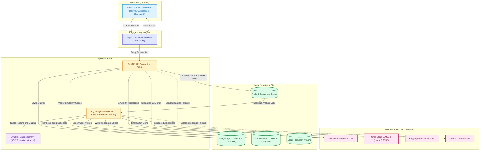

# CodeSensei

> Your AI-powered repository intelligence and code architecture platform. Point it at any public GitHub repository to extract file-level dependency graphs, circular dependency detection, complexity rankings, impact blast radius analysis, automated architecture diagrams, and citation-backed natural language Q&A — powered by cloud (Groq) or local (Ollama) LLMs.

[](.github/workflows/ci.yml)
[](.github/workflows/codeql.yml)
[](https://www.python.org/)
[](https://nodejs.org/)
[](docker/)
[](vault/00-MASTER-INDEX.md)

---

## Table of Contents

- [What It Does](#what-it-does)
- [Current System Architecture](#current-system-architecture)
  - [Architecture Diagram](#architecture-diagram)
  - [Synchronous vs. Asynchronous Work Separation](#synchronous-vs-asynchronous-work-separation)
- [Engineering Documentation Vault (`vault/`)](#engineering-documentation-vault)
- [Repository Layout](#repository-layout)
- [Quick Start](#quick-start)
  - [Prerequisites](#prerequisites)
  - [Run Locally with Docker (Recommended)](#run-locally-with-docker-recommended--step-by-step)
  - [Local Without Docker (Development)](#local-without-docker-development)
  - [Deploy Publicly for FREE (No Credit Card)](#deploy-publicly-for-free-no-credit-card)
- [Environment Variables](#environment-variables)
- [Running Tests](#running-tests)
- [Sample Queries You Can Ask](#sample-queries-you-can-ask)
- [Supporting Documentation](#supporting-documentation)
- [Tech Stack](#tech-stack)
- [Future Improvements & Scaling Roadmap](#future-improvements--scaling-roadmap)

---

## What It Does

| Capability | Implementation Mechanism | Codebase Ground Truth |
| --- | --- | --- |
| **Repository Ingestion** | `GitPython` shallow clone (`--depth 1`), branch-aware, sandboxed into `/var/lib/codesensei/workspaces` | Path traversal guarded with `safe_join`; URL validation prevents SSRF |
| **Polyglot Code Parsing** | Dual-engine parser: native Python `ast` for Python; `tree-sitter` for JS/TS, Go, Rust, Java, C/C++; fallback regex parser | Extracts classes, functions, docstrings, call-sites, and imports concurrently via `ThreadPoolExecutor` |
| **Dependency Graph & SCC** | Directed file-level import graph (`from_file_id -> to_file_id`) visualized in Cytoscape.js | Tarjan's Strongly Connected Components (SCC) algorithm detects and highlights circular dependency cycles |
| **Complexity Metrics** | Cyclomatic complexity (branching paths) + Cognitive complexity + LOC counters | Computes per-file, per-function, and per-class metrics stored in relational tables |
| **Dead Code Detection** | Import and symbol reference counting + reachability traversal | Unreferenced exports and zero-caller functions flagged with file-level `dead_code_score` |
| **Impact Blast Radius** | Reverse BFS traversal over incoming dependency edges (1–5 hops) | Distance decay $\exp(-0.5 \cdot (d-1))$ and sigmoid risk saturation $1.0 - \exp(-\sum \text{risk} / 8)$ |
| **Architecture Discovery** | Rule-based path and import heuristics classify modules into 4 tiers | Generates live Mermaid C4-style component diagrams (`presentation`, `application`, `domain`, `infrastructure`) |
| **Documentation Generator** | Structured markdown generator for README, architecture, API, and onboarding guides | Live `/api/v1/repositories/{id}/documentation` endpoint powered by LLM synthesis |
| **Codebase RAG Q&A** | Two-phase transaction model; ChromaDB vector similarity + top-k retrieval; SSE streaming | Streams tokens via Server-Sent Events with numbered, deduplicated file and line citations |
| **Stuck-Job Self-Healing** | Background `AnalysisReaper` loop runs every 30s in FastAPI lifespan | Automatically fails jobs with stale heartbeats (>300s) and clears partial unique index `uq_active_job_per_repository` |
| **Observability** | Prometheus metrics scraped on `:8000` (API) and `:9101` (Worker) | Structured JSON logging with `structlog`, binding `X-Request-ID` across middleware and service logs |

---

## Current System Architecture

CodeSensei is engineered as a decoupled distributed system separating fast, synchronous HTTP API operations from burst-mode, CPU-bound asynchronous repository analysis pipelines.

### Architecture Diagram



### Synchronous vs. Asynchronous Work Separation

To guarantee sub-50ms API responsiveness and prevent request timeouts, heavy computation is completely isolated:

```
┌─────────────────────────────────────────────────────────────────────────┐
│                      SYNCHRONOUS (FastAPI API Layer)                    │
│  - Request validation & SSRF URL checks (< 2ms)                         │
│  - Database lookups & cached reads (< 10ms)                             │
│  - Tarjan's SCC cycle detection on cached graphs (< 15ms)               │
│  - Impact analysis reverse BFS walk (< 25ms)                            │
│  - Enqueueing analysis jobs into Redis (< 5ms)                          │
│  - Token streaming over SSE (Long-lived connection, zero worker blocking)│
└────────────────────────────────────┬────────────────────────────────────┘
                                     │ Redis Queue (Job ID)
                                     ▼
┌─────────────────────────────────────────────────────────────────────────┐
│                      ASYNCHRONOUS (RQ Worker Layer)                     │
│  - Shallow Git cloning over network (2s - 60s)                          │
│  - Filesystem tree walking & binary decoding (100ms - 5s)               │
│  - Concurrently parsing source files via ThreadPoolExecutor (1s - 30s)  │
│  - Resolving imports into dependency edges (200ms - 2s)                 │
│  - Batch PostgreSQL deletion & re-insertion (500ms - 3s)                │
│  - Code chunking & embedding generation (2s - 45s)                      │
│  - ChromaDB vector upsertion (500ms - 5s)                               │
└─────────────────────────────────────────────────────────────────────────┘
```

---

## Engineering Documentation Vault

The platform includes a comprehensive, code-grounded technical vault located in [`vault/`](vault/) and indexed in [`vault/00-MASTER-INDEX.md`](vault/00-MASTER-INDEX.md). This documentation set was derived directly from code audit and serves as the single source of truth for technical architecture and senior/staff engineering interviews:

| Doc # | Document | Purpose & Core Content |
| --- | --- | --- |
| **00** | [Master Index](vault/00-MASTER-INDEX.md) | Central index with document mapping and reading guides by role |
| **01** | [Project Overview](vault/01-project-overview.md) | Business problem, core capabilities, and service architecture |
| **02** | [Functional Requirements](vault/02-functional-requirements.md) | Comprehensive functional matrix with codebase verification |
| **03** | [Non-Functional Requirements](vault/03-non-functional-requirements.md) | Performance, security, scalability, availability, and observability |
| **04** | [Domain Model & Entities](vault/04-domain-model-and-entities.md) | Complete ER diagrams (Current 10-table schema & Scaled multi-tenant schema) |
| **05** | [API Documentation](vault/05-api-documentation.md) | Complete OpenAPI endpoint catalog, request/response models, and error envelopes |
| **06** | [Authentication & Authorization](vault/06-authentication-and-authorization.md) | GitHub OAuth 2.0 handshake, stateless JWT cookies, CSRF protection, and mock auth |
| **07** | [User Flows](vault/07-user-flows.md) | 5 end-to-end journey maps with verified Mermaid sequence diagrams |
| **08** | [Current System Architecture](vault/08-current-system-architecture.md) | In-depth C4 container diagrams, component boundaries, and failure domains |
| **09** | [Execution & Data Flows](vault/09-execution-and-data-flows.md) | Step-by-step pipeline traces, two-phase RAG transactions, and reaper flow |
| **10** | [Technology Stack](vault/10-technology-stack.md) | Architecture Decision Records (ADRs) with explicit trade-offs and alternatives |
| **11** | [Engineering Problems & Solutions](vault/11-engineering-problems-and-solutions.md) | Algorithmic deep-dives: Tarjan's SCC, BFS impact analysis, stuck-job recovery |
| **12** | [Reliability & Failure Handling](vault/12-reliability-and-failure-handling.md) | PostgreSQL indexes, failure modes, timeouts, and stuck-job reaping |
| **13** | [Security Architecture](vault/13-security-architecture.md) | SSRF prevention, path traversal defense, secret scanning, and rate limiting |
| **14** | [Performance & Optimization](vault/14-performance.md) | Caching strategies, ThreadPoolExecutor parallel parsing, and batch inserts |
| **15** | [Scaling Architecture](vault/15-scaling-architecture.md) | Stage 0 (Free tier) to Stage 3 (Enterprise global 10M+ users) roadmap |
| **16** | [Scalability Bottlenecks](vault/16-scalability-bottlenecks.md) | Quantitative bottleneck matrix, saturation points, and mitigation plans |
| **17** | [Testing Architecture](vault/17-testing-architecture.md) | Testing pyramid: unit, integration (SQLite/fakeredis), contract, and E2E |
| **18** | [Deployment & Infrastructure](vault/18-deployment-and-infrastructure.md) | Multi-stage Dockerfiles, Docker Compose stacks, and free-tier cloud deployment |
| **19** | [Observability](vault/19-observability.md) | Prometheus metric inventory, Grafana dashboards, and structlog JSON logs |
| **20** | [Production Readiness Review](vault/20-production-readiness-review.md) | Reliability, disaster recovery, security, and operational readiness checklist |
| **21** | [Interview Preparation Guide](vault/21-interview-preparation-guide.md) | Senior/Staff SWE interview defense guide, trade-offs, and behavioral stories |
| **22** | [Resume & Portfolio Fact Sheet](vault/22-resume-and-portfolio-fact-sheet.md) | High-impact, verified STAR accomplishment bullets for engineering resumes |
| **23** | [Do Not Claim (Boundary Guide)](vault/23-do-not-claim.md) | Anti-hallucination boundaries: what is implemented vs. what is proposed |
| **24** | [Documentation Accuracy Audit](vault/24-documentation-accuracy-audit.md) | Systematic audit comparing documentation claims against actual code |
| **—** | [PROJECT_SOURCE_OF_TRUTH.md](vault/PROJECT_SOURCE_OF_TRUTH.md) | Single master technical reference document for AI and engineering audits |
| **—** | [INTERVIEW_PREP.md](INTERVIEW_PREP.md) | Standalone senior engineer interview preparation document |

---

## Repository Layout

```
github-repo-intelligence-platform/
├── vault/                     # Authoritative codebase-grounded engineering vault (26 documents)
│   ├── 00-MASTER-INDEX.md     # Master vault index and reading tracks
│   └── PROJECT_SOURCE_OF_TRUTH.md # Master technical reference for AI and technical audits
├── frontend/                  # React 18 + TypeScript + Vite SPA (Nginx :8080)
│   ├── src/components/        # Cytoscape dependency graph, architecture viewer, chat UI
│   └── src/services/          # API client with Axios and SSE streaming event source
├── backend/                   # FastAPI REST + SSE API Server (:8000)
│   ├── app/api/v1/            # Versioned routes (repositories, auth, chat, graph, docs)
│   ├── app/core/              # Security, settings, dependencies, stuck-job reaper
│   ├── app/models/            # SQLAlchemy 2.0 declarative ORM models (10 tables)
│   └── app/services/          # Business logic (repository, analysis, chat session, RAG)
├── worker/                    # RQ background analysis worker (:9101 metrics)
│   └── app/tasks/             # Repository cloning, orchestrator invocation, Chroma indexing
├── analysis-engine/           # Standalone code analysis and parsing core library
│   ├── ast_engine/            # Native Python AST parser + Tree-sitter polyglot parsers
│   ├── graph/                 # File dependency graph builder & Tarjan's SCC cycle detector
│   ├── metrics/               # Cyclomatic & cognitive complexity analyzers
│   └── rag/                   # Code chunker, embeddings provider, and ChromaDB client
├── shared/                    # Centralized config defaults & cross-service constants
├── docker/                    # Docker Compose stacks (free-tier, dev, prod, monitoring)
├── infrastructure/            # Prometheus scrape targets & Grafana dashboard definitions
├── scripts/                   # Deployment automation, migration, and health verification scripts
├── tests/                     # Cross-service integration, contract, and load testing
├── docs/                      # Supporting documentation categorized by domain
└── INTERVIEW_PREP.md          # Senior/Staff software engineer interview guide
```

---

## Quick Start

### Prerequisites

- **Docker Desktop ≥ 4.30** (≥ 4 GB RAM recommended for the free-tier stack)
- **Git**
- Free accounts for managed external services (all completely free, no credit card required):
  - [Groq Cloud](https://console.groq.com/keys) (Free LLM API: 30 requests/min)
  - [HuggingFace](https://huggingface.co/settings/tokens) (Free Serverless Inference API for embeddings)
  - [Neon PostgreSQL](https://neon.tech) (Free Serverless PostgreSQL 16)
  - [Upstash Redis](https://upstash.com) (Free Serverless Redis 7 with TLS)

> **Testing without external services?** You can run the entire backend test suite hermetically on in-memory SQLite and `fakeredis` with zero external credentials — see [Running tests](#running-tests).

---

### Run Locally with Docker (Recommended) — Step by Step

This stack deploys four local containers (`frontend`, `backend`, `worker`, `chroma`) communicating with free-tier managed PostgreSQL and Redis instances.

#### 1. Clone the Repository

```bash
git clone https://github.com/your-username/github-repo-intelligence-platform.git
cd github-repo-intelligence-platform
```

#### 2. Configure Environment Variables

```bash
cp .env.example .env
```

Open `.env` and configure the essential variables:

| Variable | Description & Source |
| --- | --- |
| `APP_SECRET_KEY` | Generate a 32-byte secret: `openssl rand -hex 32` |
| `GROQ_API_KEY` | Free API key from https://console.groq.com/keys |
| `HUGGINGFACE_API_KEY` | Free token from https://huggingface.co/settings/tokens |
| `POSTGRES_*` | Neon PostgreSQL host, database, user, and password (`POSTGRES_SSLMODE=require`) |
| `REDIS_*` | Upstash Redis host, port, and password (`REDIS_TLS=true`) |

> **Tip — Skip GitHub OAuth locally:** Set `MOCK_AUTH=true` and `APP_ENV=development` in `.env`. The backend will automatically authenticate you as a local mock user, allowing full access without registering a GitHub OAuth application. (Mock auth is **hard-disabled** when `APP_ENV=production`).

#### 3. Build the Container Images

```bash
docker compose -f docker/docker-compose.free-tier.yml --env-file .env build
```

#### 4. Apply Database Migrations

The platform uses Alembic to manage its 10-table schema. Run migrations once before launching:

```bash
docker compose -f docker/docker-compose.free-tier.yml --env-file .env up -d chroma backend
docker compose -f docker/docker-compose.free-tier.yml --env-file .env exec backend alembic upgrade head
```

#### 5. Launch the Stack

```bash
docker compose -f docker/docker-compose.free-tier.yml --env-file .env up -d
```

#### 6. Access the Application

| Service | Endpoint | Description |
| --- | --- | --- |
| **Frontend Web App** | http://localhost:8080 | React 18 SPA (configurable via `FRONTEND_PORT`) |
| **Backend Swagger Docs** | http://localhost:8000/docs | Interactive OpenAPI documentation |
| **Liveness Probe** | http://localhost:8000/healthz | Fast container health check (`{"status":"ok"}`) |
| **Readiness Probe** | http://localhost:8000/readyz | Verifies active database & Redis connectivity |
| **API Prometheus Metrics** | http://localhost:8000/metrics | API latency, status codes, and throughput |
| **Worker Prometheus Metrics**| http://localhost:9101/metrics | Worker job latency and execution metrics |

#### Everyday Commands

```bash
# View live logs across all containers
docker compose -f docker/docker-compose.free-tier.yml logs -f

# View worker analysis logs
docker compose -f docker/docker-compose.free-tier.yml logs -f worker

# Restart backend after configuration changes
docker compose -f docker/docker-compose.free-tier.yml --env-file .env up -d backend

# Stop the stack (preserves workspace clones)
docker compose -f docker/docker-compose.free-tier.yml down

# Stop the stack and wipe volumes
docker compose -f docker/docker-compose.free-tier.yml down -v
```

---

### Local Without Docker (Development)

For local development and debugging without Docker:
- **Backend (FastAPI):** See [backend/README.md](backend/README.md)
- **Worker (RQ):** See [worker/README.md](worker/README.md)
- **Frontend (Vite):** See [frontend/README.md](frontend/README.md)
- **Analysis Engine:** See [analysis-engine/README.md](analysis-engine/README.md)

---

### Deploy Publicly for FREE (No Credit Card)

| Guide | Target Platform | Characteristics |
| --- | --- | --- |
| [docs/deployment/oracle-cloud.md](docs/deployment/oracle-cloud.md) ⭐ | Oracle Cloud Always-Free ARM VM | 24/7 always-on free VM with HTTPS & custom domain |
| [docs/deployment/codespaces.md](docs/deployment/codespaces.md) | GitHub Codespaces | Instant cloud dev environment (sleeps when idle) |
| [docs/deployment/README.md](docs/deployment/README.md) | General Cloud & VPS | Complete production deployment & reverse proxy guide |

---

## Environment Variables

All settings follow 12-factor application methodology with centralized fallbacks in [`shared/config/defaults.py`](shared/config/defaults.py).

| Variable | Default / Format | Description |
| --- | --- | --- |
| `APP_ENV` | `development` | Environment mode (`development`, `staging`, `production`, `test`) |
| `APP_SECRET_KEY` | *(Required)* | 32-byte secret used for signing HS256 session JWTs |
| `GITHUB_OAUTH_CLIENT_ID` | `""` | GitHub OAuth application client ID |
| `GITHUB_OAUTH_CLIENT_SECRET` | `""` | GitHub OAuth application client secret |
| `GITHUB_OAUTH_CALLBACK_URL` | `http://localhost:8080/api/v1/auth/github/callback` | OAuth redirect URI registered with GitHub |
| `FRONTEND_BASE_URL` | `http://localhost:8080` | Client origin for post-login redirect |
| `MOCK_AUTH` | `false` | Enables instant local sign-in (hard-disabled in production) |
| `LLM_PROVIDER` | `groq` | Active LLM backend (`groq` or `ollama`) |
| `GROQ_MODEL` | `llama-3.3-70b-versatile` | Groq cloud chat model identifier |
| `EMBEDDING_PROVIDER` | `huggingface` | Vector embeddings engine (`huggingface`, `ollama`, or `local`) |
| `EMBEDDING_MODEL` | `sentence-transformers/all-MiniLM-L6-v2` | 384-dimensional dense embedding model |
| `POSTGRES_HOST` / `_DB` | `localhost` / `codesensei` | PostgreSQL 16 connection host and database name |
| `REDIS_HOST` / `_PORT` | `localhost` / `6379` | Redis 7 instance details |
| `CHROMA_HOST` / `_PORT` | `chroma` / `8000` | ChromaDB vector database HTTP service |

---

## Running Tests

The backend test suite is fully hermetic and runs on in-memory SQLite and `fakeredis`. **No external PostgreSQL, Redis, or cloud credentials are required.**

```bash
# Run backend test suite
cd backend
python -m pytest -q
```

Additional test suites across the repository:
- **Analysis Engine:** `cd analysis-engine && python -m pytest -q`
- **Frontend Unit & Component Tests:** `cd frontend && npm test`
- **Cross-Stack Integration & Contract Tests:** `pytest tests/`

Strategy and fixtures: [`vault/17-testing-architecture.md`](vault/17-testing-architecture.md) and [`docs/testing/README.md`](docs/testing/README.md).

---

## Sample Queries You Can Ask

Submit any public repository URL in the UI, wait for analysis to complete, and ask:

- *"Where is authentication implemented in this project?"*
- *"Which files depend on `UserService` and what calls it?"*
- *"Are there any circular import dependencies?"*
- *"What will break if I modify `UserRepository`? (Impact analysis)"*
- *"Explain the high-level architecture of this codebase."*
- *"Which files have the highest cyclomatic complexity?"*
- *"Which exported functions or symbols are unreferenced dead code?"*
- *"Generate onboarding documentation for new developers joining this project."*

Answers stream token-by-token over SSE with **numbered, deduplicated file and line citations** matching the indexed code chunks.

---

## Supporting Documentation

In addition to the primary [`vault/`](vault/) engineering knowledge base, supporting reference documentation is organized by domain in [`docs/`](docs/):

| Domain | Directory | Key Documents |
| --- | --- | --- |
| **Master Overview** | [docs/](docs/) | [MASTER_PROJECT_DOCUMENTATION.md](docs/MASTER_PROJECT_DOCUMENTATION.md), [INDEX.md](docs/INDEX.md) |
| **Architecture** | [docs/architecture/](docs/architecture/) | [high-level-design.md](docs/architecture/high-level-design.md), [analysis-pipeline.md](docs/architecture/analysis-pipeline.md) |
| **AI & RAG** | [docs/ai/](docs/ai/) | [rag-pipeline.md](docs/ai/rag-pipeline.md), [providers.md](docs/ai/providers.md), [vector-store.md](docs/ai/vector-store.md) |
| **Security** | [docs/security/](docs/security/) | [threat-model.md](docs/security/threat-model.md), [README.md](docs/security/README.md) |
| **Deployment** | [docs/deployment/](docs/deployment/) | [README.md](docs/deployment/README.md), [oracle-cloud.md](docs/deployment/oracle-cloud.md), [codespaces.md](docs/deployment/codespaces.md) |
| **Operations** | [docs/operations/](docs/operations/) | [production-readiness-review.md](docs/operations/production-readiness-review.md), [runbooks.md](docs/operations/runbooks.md), [performance.md](docs/operations/performance.md) |
| **Testing** | [docs/testing/](docs/testing/) | [README.md](docs/testing/README.md), [verification guides](docs/testing/verification/) |
| **Reviews & Interviews** | [docs/reviews/](docs/reviews/) | [staff-engineer-review.md](docs/reviews/staff-engineer-review.md), [architecture-review.md](docs/reviews/architecture-review.md) |

---

## Tech Stack

| Tier | Technologies & Libraries |
| --- | --- |
| **Frontend** | React 18.3 · TypeScript 5.6 · Vite 5.4 · Tailwind CSS 3.4 · TanStack Query 5 · Zustand 5 · Cytoscape.js 3.30 · Mermaid 11 · Lucide Icons |
| **Backend API** | Python 3.12 · FastAPI 0.115 · SQLAlchemy 2.0 (asyncpg) · Pydantic v2 · Alembic 1.13 · PyJWT 2.9 · sse-starlette |
| **Asynchronous Workers** | Python 3.12 · RQ 1.16 (Redis Queue) · psycopg2 · Tenacity retry logic |
| **Analysis Engine** | Native Python `ast` · `tree-sitter` 0.23 (polyglot grammars) · GitPython 3.1 · pathspec · chardet |
| **AI & Vector Search** | ChromaDB 0.5.5 · Groq Cloud (`llama-3.3-70b-versatile`) · HuggingFace Inference API (`all-MiniLM-L6-v2`) · Ollama fallback |
| **Data Storage** | PostgreSQL 16 (System of Record, 10 tables) · Redis 7 (RQ Queue + response cache) · Local File Volume |
| **Observability** | Prometheus (scraping `:8000` and `:9101`) · structlog (structured JSON) · Grafana |
| **Containerization** | Docker · Docker Compose v2 · Nginx 1.27 reverse proxy |
| **Testing** | Pytest · pytest-asyncio · fakeredis · SQLite (StaticPool) · Vitest · Playwright E2E · Locust |

---

## Future Improvements & Scaling Roadmap

The multi-stage scaling roadmap is documented in detail in [`vault/15-scaling-architecture.md`](vault/15-scaling-architecture.md) and [`docs/overview/future-roadmap.md`](docs/overview/future-roadmap.md):

1. **ChromaDB Persistent Volume / Qdrant Migration:** Persist vector embeddings across container rebuilds or migrate to managed distributed Qdrant.
2. **Incremental Git AST Differencing:** Webhook-driven delta parsing that re-analyzes only modified files on `git push` rather than full re-cloning.
3. **Multi-Tenant Organization Workspaces:** Introduce `organizations`, `organization_members`, and RBAC permission models.
4. **Distributed Object Storage (AWS S3):** Shared repository clone cache across auto-scaling worker pools.
5. **Multi-Provider LLM Gateway:** Dynamic failover routing between Groq, Anthropic Claude, and self-hosted vLLM.

---

> **Note on Documentation Sources:**
> The primary, code-grounded engineering documentation set is maintained in [`vault/`](vault/) with the single technical reference at [`vault/PROJECT_SOURCE_OF_TRUTH.md`](vault/PROJECT_SOURCE_OF_TRUTH.md). Supporting historical and topical notes live in [`docs/`](docs/).
