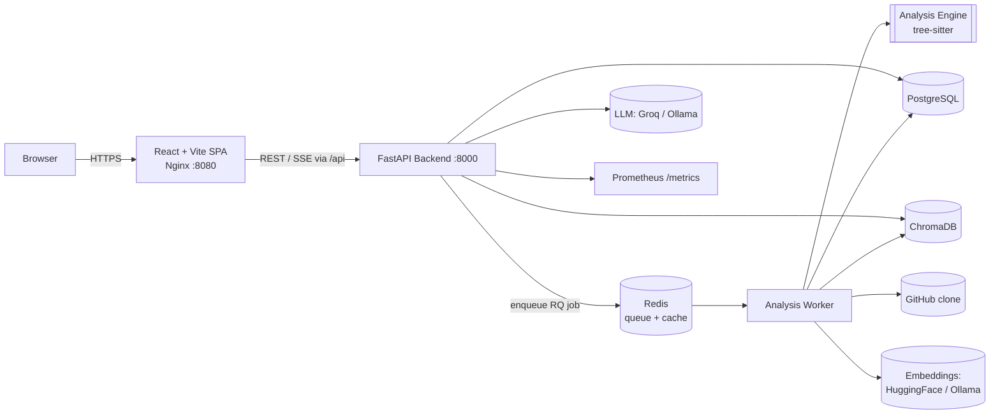

# CodeSensei

> Your AI-powered code mentor. Point it at any public GitHub repository and get
> dependency graphs, dead code detection, complexity rankings, impact analysis,
> architecture diagrams, and natural-language Q&A — powered by local or cloud LLMs.

[](.github/workflows/ci.yml)
[](.github/workflows/codeql.yml)
[](https://www.python.org/)
[](https://nodejs.org/)
[](docker/)
[](https://www.conventionalcommits.org/)

---

## Table of Contents

- [What it does](#what-it-does)
- [Architecture at a glance](#architecture-at-a-glance)
- [Repository layout](#repository-layout)
- [Quick start](#quick-start)
  - [Prerequisites](#prerequisites)
  - [Run locally with Docker (recommended)](#run-locally-with-docker-recommended--step-by-step)
  - [Local without Docker (advanced)](#local-without-docker-advanced)
  - [Deploy publicly for FREE](#deploy-publicly-for-free-no-credit-card)
- [Environment variables](#environment-variables)
- [Running tests](#running-tests)
- [Sample questions you can ask](#sample-questions-you-can-ask)
- [Documentation](#documentation)
- [Tech stack](#tech-stack)
- [Future improvements](#future-improvements)

---

## What it does

| Capability                          | How                                                                       |
| ----------------------------------- | ------------------------------------------------------------------------- |
| Repository cloning & metadata       | `GitPython` shallow clone (`depth=1`), branch-aware, sandboxed workspace  |
| Multi-language AST parsing          | `tree-sitter` (Python, JS/TS, Go, Rust, Java, C, …)                       |
| Dependency graph (file/symbol)      | Directed import/call/inheritance graph with Cytoscape visualization       |
| Complexity ranking                  | Cyclomatic + cognitive complexity, per-file/function/class metrics        |
| Dead code detection                 | Symbol reachability + usage counts, `dead_code_score` per file            |
| Impact analysis                     | "If I change X, what breaks?" — transitive reverse-dependency walk        |
| Architecture discovery              | Layer detection + component clustering → generated Mermaid diagram        |
| Documentation generator             | README / architecture / API / onboarding markdown                         |
| AI Q&A over codebase (RAG)          | ChromaDB vector search + streaming LLM (Groq cloud **or** local Ollama)   |
| Observability                       | Prometheus metrics, structured JSON logs, `/healthz` + `/readyz`          |

---

## Architecture at a glance



Deep dive: [docs/02-architecture/SYSTEM_ARCHITECTURE_HLD.md](docs/02-architecture/SYSTEM_ARCHITECTURE_HLD.md).

---

## Repository layout

```
github-repo-intelligence-platform/
├── frontend/              # React 18 + TypeScript + Vite SPA (Nginx :8080)
├── backend/               # FastAPI REST + SSE API (:8000)
├── worker/                # RQ background analysis worker
├── analysis-engine/       # tree-sitter parsing + graph + metrics library
├── shared/                # Centralized config defaults + provider metadata
├── infrastructure/        # Prometheus / Grafana / local service configs
├── docker/                # docker-compose stacks (default / free-tier / dev / prod)
├── scripts/               # Deploy + health-check scripts
├── tests/                 # Cross-service coordination
├── docs/                  # Enterprise documentation suite (topical subfolders)
└── .github/workflows/     # CI/CD pipelines
```

Every top-level folder has its own `README.md` explaining purpose and entry points.

---

## Quick start

### Prerequisites

- **Docker Desktop ≥ 4.30** (≥ 4 GB RAM for the free-tier stack; 8 GB for local Ollama)
- **Git**
- Free accounts for the managed services (all free, no credit card):
  [Groq](https://console.groq.com/keys) · [HuggingFace](https://huggingface.co/settings/tokens) ·
  [Neon (PostgreSQL)](https://neon.tech) · [Upstash (Redis)](https://upstash.com)

> Don't want to run the full stack? You can run just the **backend tests** with
> zero external services — see [Running tests](#running-tests).

---

### Run locally with Docker (recommended) — step by step

This is the easiest path: four containers (`backend`, `worker`, `frontend`,
`chroma`) wired together by Docker Compose. PostgreSQL and Redis are external
managed services (Neon + Upstash) so they aren't run as containers.

#### 1. Clone the repo

```bash
git clone https://github.com/your-username/github-repo-intelligence-platform.git
cd github-repo-intelligence-platform
```

#### 2. Create your `.env`

```bash
cp .env.example .env
```

Then open `.env` and fill in the five things that have no safe default:

| Variable | Where to get it |
| --- | --- |
| `APP_SECRET_KEY` | Generate one: `openssl rand -base64 32` |
| `GROQ_API_KEY` | https://console.groq.com/keys |
| `HUGGINGFACE_API_KEY` | https://huggingface.co/settings/tokens |
| `POSTGRES_*` | Your Neon connection string (host, db, user, password) |
| `REDIS_*` | Your Upstash connection details (host, port, password) |

> **Tip — skip the login screen.** For local testing set `MOCK_AUTH=true` and
> `APP_ENV=development` in `.env`. The app then auto-signs-you-in as a fake user,
> so you don't need to register a GitHub OAuth app. This is **hard-disabled when
> `APP_ENV=production`**. Details:
> [docs/03-security/AUTHENTICATION_AND_SECURITY.md](docs/03-security/AUTHENTICATION_AND_SECURITY.md).

#### 3. Build the images

```bash
docker compose -f docker/docker-compose.free-tier.yml --env-file .env build
```

#### 4. Initialize the database (first run only)

The containers do **not** auto-run migrations. Apply the schema to your Postgres
once before starting (or any time you pull new migrations):

```bash
# Start just ChromaDB + backend so we can run Alembic inside the backend image
docker compose -f docker/docker-compose.free-tier.yml --env-file .env up -d chroma backend
docker compose -f docker/docker-compose.free-tier.yml --env-file .env exec backend alembic upgrade head
```

#### 5. Start everything

```bash
docker compose -f docker/docker-compose.free-tier.yml --env-file .env up -d
```

#### 6. Open the app

| Service | URL | Notes |
| --- | --- | --- |
| **Frontend** | http://localhost:8080 | Set by `FRONTEND_PORT` in `.env` (e.g. `3000`) |
| Backend API docs | http://localhost:8000/docs | Swagger UI |
| Liveness | http://localhost:8000/healthz | Should return `{"status":"ok"}` |
| Readiness | http://localhost:8000/readyz | Checks DB + Redis reachability |
| Metrics | http://localhost:8000/metrics | Prometheus format |

> The frontend port follows `FRONTEND_PORT` in your `.env`. The default is `8080`;
> if you set `FRONTEND_PORT=3000`, open http://localhost:3000 instead.

#### 7. Use it

1. Open the frontend, sign in (mock auth = automatic; otherwise GitHub).
2. Paste any **public GitHub repo URL** and start an analysis.
3. Watch live progress, then explore graphs/metrics or ask the AI assistant.

#### Everyday commands

```bash
# Tail logs (all services, or one)
docker compose -f docker/docker-compose.free-tier.yml logs -f
docker compose -f docker/docker-compose.free-tier.yml logs -f backend

# Restart a single service after changing .env
docker compose -f docker/docker-compose.free-tier.yml --env-file .env up -d backend

# Stop everything (keeps the cloned-repo volume)
docker compose -f docker/docker-compose.free-tier.yml down

# Stop and wipe local volumes too
docker compose -f docker/docker-compose.free-tier.yml down -v

# Rebuild after code changes
docker compose -f docker/docker-compose.free-tier.yml --env-file .env up -d --build
```

#### Troubleshooting

| Symptom | Likely cause / fix |
| --- | --- |
| `up` exits with code 1 immediately | A required env var is unset. The compose file fails fast on `APP_SECRET_KEY`, `POSTGRES_*`, `GROQ_API_KEY`. Check `.env`. |
| `/readyz` returns 503 | DB or Redis unreachable. Verify `POSTGRES_*` / `REDIS_*` and that `POSTGRES_SSLMODE=require` (Neon) and `REDIS_TLS=true` (Upstash). |
| Login page won't let me in | Set `MOCK_AUTH=true` **and** `APP_ENV=development`, then `up -d backend`. |
| Analysis never finishes | Check the worker: `docker compose ... logs -f worker`. Free Groq is 30 req/min. |
| Tables missing / SQL errors | You skipped step 4 — run `alembic upgrade head` (see above). |

---

### Local without Docker (advanced)

Prefer running the services directly on your machine (e.g. for backend
debugging)? Each service has its own README with native run instructions:

- Backend (FastAPI + Uvicorn + Alembic): [backend/README.md](backend/README.md)
- Worker (RQ): [worker/README.md](worker/README.md)
- Frontend (Vite dev server): [frontend/README.md](frontend/README.md)

You'll still need reachable PostgreSQL, Redis, and ChromaDB instances; the
`docker/docker-compose.dev.yml` stack can provide those while you run the app
code locally.

### Deploy publicly for FREE (no credit card)

| Guide | Best for | Always-on? |
| ----- | -------- | ---------- |
| [docs/04-deployment/DEPLOY_ORACLE_CLOUD.md](docs/04-deployment/DEPLOY_ORACLE_CLOUD.md) ⭐ | A stable résumé link | ✅ 24/7 free VM + HTTPS |
| [docs/04-deployment/DEPLOY_CODESPACES.md](docs/04-deployment/DEPLOY_CODESPACES.md) | Quick dev demos | ❌ sleeps when idle |

Free managed services used: **Groq** (LLM), **HuggingFace** (embeddings),
**Neon** (PostgreSQL), **Upstash** (Redis), **GitHub OAuth** (sign-in).
Full guide: [docs/04-deployment/DEPLOYMENT_GUIDE.md](docs/04-deployment/DEPLOYMENT_GUIDE.md).

---

## Environment variables

All configuration is environment-driven (12-factor). Defaults live in
[shared/config/defaults.py](shared/config/defaults.py) and are overridden by env.
Copy `.env.example` → `.env`. The essentials:

| Variable | Purpose | Example |
| --- | --- | --- |
| `APP_ENV` | `development` \| `staging` \| `production` \| `test` | `development` |
| `APP_SECRET_KEY` | JWT signing key (**≥ 32 chars**) | `openssl rand -hex 32` |
| `GITHUB_OAUTH_CLIENT_ID` / `_SECRET` | GitHub OAuth app | from github.com/settings/developers |
| `GITHUB_OAUTH_CALLBACK_URL` | OAuth redirect | `https://<host>/api/v1/auth/github/callback` |
| `FRONTEND_BASE_URL` | Public UI origin | `https://<host>` |
| `MOCK_AUTH` | Skip OAuth locally (ignored in prod) | `false` |
| `LLM_PROVIDER` | `groq` \| `ollama` | `groq` |
| `EMBEDDING_PROVIDER` | `huggingface` \| `ollama` \| `local` | `huggingface` |
| `GROQ_API_KEY` / `HUGGINGFACE_API_KEY` | Cloud AI credentials | — |
| `POSTGRES_*` | Database connection | Neon connection string |
| `REDIS_*` | Queue + cache | Upstash connection |

Full reference: [docs/02-architecture/Configuration-Architecture.md](docs/02-architecture/Configuration-Architecture.md).

---

## Running tests

The backend test suite is **hermetic** — it runs on in-memory SQLite + `fakeredis`
with mock authentication, so **no PostgreSQL, Redis, or GitHub OAuth credentials are
required**.

```bash
# Inside the backend container or a venv with dev deps installed:
cd backend
python -m pytest -q            # 69 tests, all green
```

Strategy + fixtures: [docs/06-development/TESTING_STRATEGY.md](docs/06-development/TESTING_STRATEGY.md).

---

## Sample questions you can ask

Drop any public repo URL into the UI, wait for analysis, then ask the AI assistant:

- *"Where is authentication implemented?"*
- *"Which files depend on `UserService`?"*
- *"Which symbols are unused?"*
- *"What will break if I modify `UserRepository`?"*
- *"Explain the architecture of this repository."*
- *"What are the most complex files?"*
- *"Generate onboarding documentation for new developers."*

Answers stream token-by-token with **file + line citations** from the retrieved code.

---

## Documentation

The full enterprise documentation suite lives under [`docs/`](docs/), organized by
topic. Start at the index: **[docs/README.md](docs/README.md)**.

| Area | Folder | Highlights |
| --- | --- | --- |
| Overview | [docs/01-overview/](docs/01-overview/) | Executive summary, roadmap, FAQ |
| Architecture | [docs/02-architecture/](docs/02-architecture/) | HLD, LLD, ADRs, analysis engine, RAG |
| Security | [docs/03-security/](docs/03-security/) | Auth, mock auth, threat model |
| Deployment | [docs/04-deployment/](docs/04-deployment/) | Local, Docker, Codespaces, Oracle, VPS, migration |
| Operations | [docs/05-operations/](docs/05-operations/) | DevOps, runbooks, production readiness |
| Development | [docs/06-development/](docs/06-development/) | Code walkthrough, testing, KT |
| Reviews | [docs/07-reviews/](docs/07-reviews/) | Staff-engineer review, interview guide |

---

## Tech stack

**Frontend:** React 18.3 · TypeScript 5.6 · Vite 5.4 · Tailwind 3.4 · TanStack Query 5 · Zustand 5 · Cytoscape 3.30 · Mermaid 11 · Recharts 2.13
**Backend:** Python 3.12 · FastAPI 0.115 · SQLAlchemy 2.0 (async) · Pydantic v2 · Alembic 1.13 · PyJWT 2.9 · sse-starlette
**Workers:** RQ 1.16 (Redis Queue) · Tenacity (retry) · psycopg2 (sync)
**Analysis:** tree-sitter 0.23 · GitPython 3.1 · pathspec · chardet
**AI:** ChromaDB 0.5 · Groq (Llama 3.3 70B) **or** Ollama (DeepSeek-Coder) · HuggingFace / local embeddings (all-MiniLM-L6-v2)
**Data:** PostgreSQL · Redis · ChromaDB
**Observability:** Prometheus · structlog · OpenTelemetry (optional)
**Containers:** Docker · Docker Compose v2 · Nginx 1.27
**Testing:** Pytest · pytest-asyncio · fakeredis · aiosqlite · Vitest · Playwright

---

## Future improvements

- Persist ChromaDB (volume or managed vector DB) so embeddings survive restarts
- Pluggable auth providers (Google / GitLab) behind the existing auth seam
- Incremental re-analysis (diff-based) instead of full re-clone
- Horizontal worker scaling with a shared object store for clones
- Multi-tenant org accounts + RBAC

See the full roadmap: [docs/01-overview/FUTURE_ROADMAP.md](docs/01-overview/FUTURE_ROADMAP.md).

---

> **Documentation conventions:** the canonical, current-architecture documents are the
> `UPPER_SNAKE_CASE.md` files. The `Title-Case.md` files are earlier supporting
> references kept for history; where they disagree, the canonical documents win.


