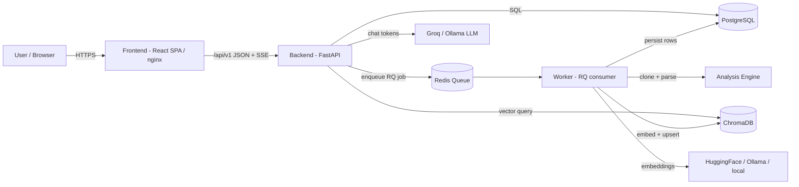

# CodeSensei — Engineering Documentation

> **CodeSensei** is a GitHub Repository Intelligence Platform. Point it at a public
> GitHub repository and it clones the code, parses it (Python AST + tree-sitter +
> regex fallback), builds dependency / complexity / dead-code / impact / architecture
> analyses, and answers natural-language questions about the codebase using a
> Retrieval-Augmented Generation (RAG) pipeline over local (Ollama) or cloud (Groq) LLMs.

This `docs/` directory is the **single source of truth** for design, operations,
security, deployment, and interview preparation. It is organized by topic so each
audience can jump straight to what it needs. Everything here is written to be accurate
against the real codebase — file paths are clickable and reflect the actual tree.

> **📘 Want everything in one place?** Read
> **[MASTER_PROJECT_DOCUMENTATION.md](MASTER_PROJECT_DOCUMENTATION.md)** — a single,
> comprehensive, enterprise-grade KT / handover document covering the entire project end to
> end (executive summary → architecture → code walkthrough → IAM → deployment → testing →
> operations → risks → KT notes & FAQ). The topic folders below are the same material broken
> out by subject for deeper reference.

---

## Topic map

| Folder | What's inside | Primary audience |
| --- | --- | --- |
| [overview/](overview/) | Executive summary, business problem, personas, feature list, design decisions, future roadmap, risks, changelog | Everyone, hiring managers |
| [architecture/](architecture/) | HLD, LLD, component architecture, all five processing pipelines, sequence diagrams | Architects, senior engineers |
| [backend/](backend/) | FastAPI app, services, repositories, DI, middleware, jobs, reaper | Backend engineers |
| [frontend/](frontend/) | React app structure, routing, state, data-fetching, graph + chat UIs | Frontend engineers |
| [database/](database/) | Every table, relationship, index, migration, query pattern, data lifecycle | Backend / data engineers |
| [ai/](ai/) | RAG pipeline, chunking, embeddings, ChromaDB, prompting, providers | AI/ML engineers |
| [features/](features/) | Per-feature deep dives (login → graph → chat → stars → profiles) | Everyone |
| [security/](security/) | Threat model, authn/authz, IDOR/SSRF/XSS/path-traversal, secrets, isolation | Security reviewers |
| [testing/](testing/) | Test strategy, hermetic fixtures, CI gates, per-phase verification guides | QA / engineers |
| [deployment/](deployment/) | Local, Codespaces, Oracle Cloud Free Tier, env vars, OAuth, providers | DevOps / SRE |
| [development/](development/) | Local-from-zero setup, provider switching, verification checklist, code walkthrough | New contributors |
| [operations/](operations/) | Runbooks: startup, shutdown, failures, recovery; production-readiness review; performance guide | On-call / SRE |
| [troubleshooting/](troubleshooting/) | Symptom → root cause → fix catalogue | Everyone debugging |
| [decisions/](decisions/) | Architecture Decision Records (ADRs) with trade-offs and alternatives | Architects |
| [interview/](interview/) | Senior-SDE prep: project deep dive, HLD/LLD/security/scale/behavioral Q&A, defense guide | The author (interviews) |
| [reviews/](reviews/) | Staff-engineer critique and architecture/provider-independence review | Architects, reviewers |
| [diagrams/](diagrams/) | All Mermaid diagrams in one place (architecture, flows, deployment) | Everyone |

---

## Read this if you are a…

| Role | Suggested path |
| --- | --- |
| Hiring manager / interviewer | [overview/executive-summary.md](overview/executive-summary.md) → [interview/project-deep-dive.md](interview/project-deep-dive.md) |
| New backend engineer | [overview/architecture-summary.md](overview/architecture-summary.md) → [backend/README.md](backend/README.md) → [database/schema.md](database/schema.md) |
| New frontend engineer | [frontend/README.md](frontend/README.md) → [frontend/state-and-data.md](frontend/state-and-data.md) |
| AI/ML engineer | [ai/rag-pipeline.md](ai/rag-pipeline.md) → [ai/providers.md](ai/providers.md) |
| DevOps / SRE | [deployment/local.md](deployment/local.md) → [deployment/oracle-cloud.md](deployment/oracle-cloud.md) → [operations/runbooks.md](operations/runbooks.md) |
| Security reviewer | [security/threat-model.md](security/threat-model.md) |
| Someone debugging | [troubleshooting/README.md](troubleshooting/README.md) |
| Interview prep (the author) | [interview/README.md](interview/README.md) |

---

## System at a glance

| Component | Tech | Responsibility |
| --- | --- | --- |
| Frontend | React 18 + Vite 5 + TS (strict) + Tailwind 3 + Zustand 5 + TanStack Query 5 | SPA UI, graph/chat visualizations |
| Backend | FastAPI + SQLAlchemy 2.0 async + Pydantic v2 + Alembic + structlog | REST API, auth, orchestration, SSE streaming |
| Worker | Python + RQ (Redis Queue) | Background repository analysis + indexing |
| Analysis Engine | Standalone Python lib (AST + tree-sitter + regex) | Clone → parse → graph → metrics → dead code → architecture |
| PostgreSQL | `postgres:16` | System of record (repos, files, symbols, deps, metrics, chats) |
| Redis | `redis:7` (or Upstash) | Job queue + cache |
| ChromaDB | `chromadb/chroma:0.5.5` | Vector store for RAG retrieval |
| LLM | Groq (cloud) or Ollama (local) | Chat answers |
| Embeddings | HuggingFace router / Ollama / local sentence-transformers | Vectorize code chunks |

---

## Documentation conventions

- **Mermaid** for all diagrams (renders natively on GitHub).
- **Tables** for comparisons, contracts, and config references.
- **Real file paths** as clickable links; if a path changes, update the doc.
- **Brutal honesty** — limitations, trade-offs, and tech debt are documented, not hidden.
- This tree is the **single canonical structure**, organized by topic. For a single
  end-to-end handover document, read
  [MASTER_PROJECT_DOCUMENTATION.md](MASTER_PROJECT_DOCUMENTATION.md).
