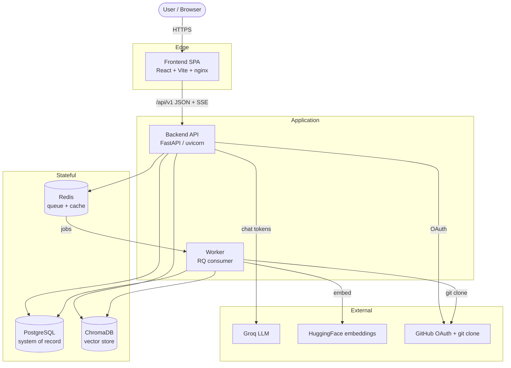
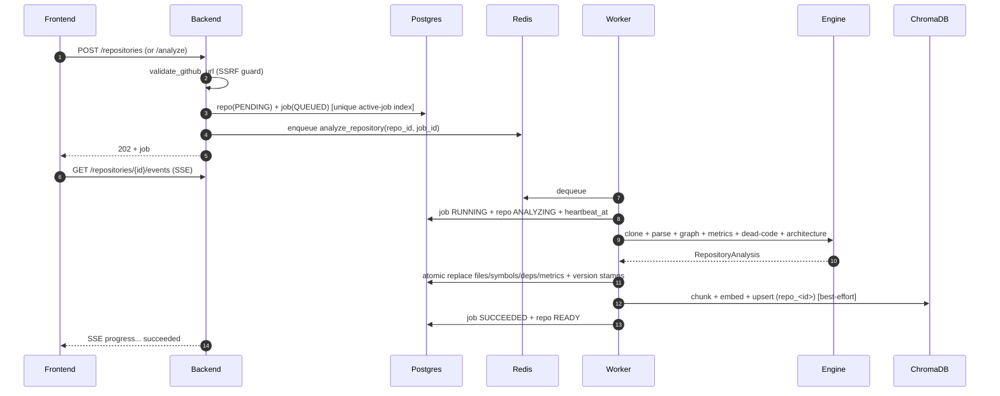
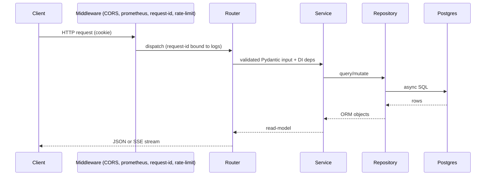

# CodeSensei — Master Project Documentation (Knowledge Transfer & Handover)

> **Audience:** software engineers, technical leads, architects, support teams, and project
> stakeholders who have **no prior knowledge** of this project.
>
> **Purpose:** a single, self-contained document containing *everything* about CodeSensei —
> business context, architecture, code, security, deployment, operations, testing, risks,
> and knowledge-transfer notes. It is intended for formal corporate KT, handover, and
> long-term maintenance.
>
> **Status of the build:** Production-shaped Proof-of-Concept (POC) / portfolio system,
> fully functional, running on free-tier infrastructure.
>
> **Companion docs:** this is the master narrative. The topic folders under
> [docs/](INDEX.md) hold the same material broken out by subject (architecture, backend,
> frontend, database, ai, security, deployment, operations, troubleshooting, decisions,
> interview, diagrams). Where deeper detail exists, this document links to it.
>
> **A note on the "C# migration" template item:** the corporate KT template this document
> follows references migrating a "Python POC to a C# implementation." **CodeSensei has no
> C# component and no planned C# rewrite** — it is a Python (backend/worker/engine) +
> TypeScript/React (frontend) system. To stay honest, Section 11 reframes that item as
> **language-portability / rewrite considerations** and explains what a hypothetical rewrite
> in any language would and would not need to preserve. Nothing in this document fabricates
> a C# codebase.

---

## Table of contents

1. [Executive Summary](#1-executive-summary)
2. [Solution Architecture](#2-solution-architecture)
3. [Technical Design](#3-technical-design)
4. [Identity & Access Management](#4-identity--access-management)
5. [Source Code Walkthrough](#5-source-code-walkthrough)
6. [End-to-End Process Flow](#6-end-to-end-process-flow)
7. [Environment Setup Guide](#7-environment-setup-guide)
8. [Deployment Considerations](#8-deployment-considerations)
9. [Testing Strategy](#9-testing-strategy)
10. [Operational Runbook](#10-operational-runbook)
11. [Risks & Limitations](#11-risks--limitations)
12. [Future Enhancements](#12-future-enhancements)
13. [Knowledge Transfer Section](#13-knowledge-transfer-section)
14. [Appendix: Quick Reference](#14-appendix-quick-reference)

---

# 1. Executive Summary

## 1.1 Project overview
**CodeSensei** is a **GitHub Repository Intelligence Platform**. A user submits a public
GitHub repository URL; the system clones it, performs multi-language **static analysis**, and
exposes the results through an interactive web UI plus a **conversational AI assistant** that
answers natural-language questions about the codebase, grounded in the real source code with
inline citations (Retrieval-Augmented Generation — RAG).

It is a complete distributed system: a **React** single-page app, a **FastAPI** async API, a
**background worker**, a standalone **analysis engine** library, **PostgreSQL** (system of
record), **Redis** (queue + cache), and **ChromaDB** (vector store), with the LLM and
embeddings served by **Groq** and **HuggingFace** (cloud free tiers) or **Ollama** (local).

## 1.2 Business objective
Make any codebase **explainable in minutes instead of days**. Engineers waste significant
time understanding unfamiliar code — when onboarding, reviewing architecture, or exploring
open source. CodeSensei treats a repository as data: parse it, structure it, index it, and
put a visual + conversational interface on top so a human can build a mental model quickly.

As a portfolio/POC artifact, the secondary objective is to **demonstrate senior-level
engineering breadth** — distributed systems, AI/RAG, security, full-stack, DevOps — on
**zero-cost** infrastructure, to a production standard.

## 1.3 Problem statement
Understanding an unfamiliar codebase is slow and manual. Existing tools answer only fragments:

- IDEs do go-to-definition but require the code open locally and offer no overview.
- Linters flag complexity but don't explain *intent* or *impact*.
- GitHub shows a file tree but not how files relate or what breaks if you change one.
- Nothing combines **structural analysis** with **natural-language Q&A grounded in the actual
  code** with verifiable references.

Concretely, users repeatedly ask: *Where does this live? What depends on this — what breaks
if I change it? How is this structured? Which files are riskiest? Is this symbol even used?*

## 1.4 Scope of the POC
**In scope (built and working):**
- GitHub OAuth login (+ a dev-only mock-auth mode).
- Submitting public repositories for analysis; refresh/re-analysis.
- Background analysis pipeline: clone → multi-language parse → dependency graph →
  complexity metrics → dead-code detection → architecture layering.
- Five read surfaces: dependency graph (interactive), complexity, dead code, architecture
  (Mermaid), impact analysis.
- RAG-based AI chat with persistent per-user sessions, streaming answers, numbered
  citations, and file tagging ("Ask AI about this node").
- Social/discovery: **repository-centric** discovery (one card per `(url, branch)`,
  expandable to all its public analyses), a per-repository analysis-history overview, stars,
  and public analyst profiles. Duplicate submits are detected and offer
  Open/Refresh/Cancel instead of creating duplicate rows.
- Production concerns: idempotent jobs, crash recovery (heartbeat + reaper), SSRF/IDOR
  defenses, rate limiting, SSE streaming, observability, CI.

**Out of scope (today):**
- Private repositories requiring user GitHub tokens.
- Symbol/call-level dependency edges ("function A calls function B") — the analyzer emits
  **file-level import edges** only.
- Multi-tenant billing / quotas.
- Writing changes back to GitHub.
- Incremental (changed-files-only) re-analysis; webhook-triggered analysis.

## 1.5 Expected production implementation
To take this from POC to a hardened production service, the key deltas are:

| Area | POC today | Production target |
| --- | --- | --- |
| Rate limiting | in-memory per process | Redis-backed (globally correct across replicas) |
| Dependency graph | file/import level | symbol/call level |
| Re-analysis | full re-parse | incremental + webhook-triggered |
| Vector store | single-node ChromaDB | pgvector or managed (Qdrant/Pinecone) |
| LLM/embeddings | free tier (rate-limited) | paid tier / self-hosted with autoscaling |
| AuthZ | per-resource checks | + centralized policy, audit logging |
| Secrets | env vars | secret manager (Vault / cloud KMS) |
| Multi-tenancy | per-user isolation | quotas, billing, tenant isolation guarantees |
| Observability | Prometheus + structlog | + tracing dashboards, alerting, SLOs |

Detail: [overview/executive-summary.md](overview/executive-summary.md),
[interview/tradeoffs.md](interview/tradeoffs.md).

---

# 2. Solution Architecture

## 2.1 High-level architecture
CodeSensei is a small distributed system of independently deployable, mostly **stateless**
services around three stateful stores.



## 2.2 Component breakdown

| Component | Tech | Responsibility | Stateless? |
| --- | --- | --- | --- |
| **Frontend** (`frontend/`) | React 18, Vite 5, TypeScript (strict), Tailwind 3, Zustand 5, TanStack Query 5, Cytoscape, Recharts, Mermaid | SPA: dashboards, dependency graph, charts, architecture diagram, AI chat. Talks only to `/api/v1`; consumes two SSE streams. | Yes |
| **Backend** (`backend/`) | FastAPI, SQLAlchemy 2.0 async, asyncpg, Pydantic v2, Alembic, structlog | REST API, auth, validation, authorization, CRUD, enqueues jobs, serves analyses, runs RAG chat, runs the stuck-job reaper. | Yes (aside from in-memory rate-limit counters) |
| **Worker** (`worker/`) | Python, RQ (Redis Queue) | Consumes analysis jobs: clone → analyze → persist → index. Writes progress + heartbeat. | Yes |
| **Analysis Engine** (`analysis-engine/`) | Standalone Python lib: Python AST + tree-sitter + regex | Clone, parse (9+ languages), build graph, metrics, dead code, architecture. Also hosts RAG building blocks (chunker, embeddings, vector store, prompts, LLM clients). No web/DB knowledge. | N/A (library) |
| **Shared** (`shared/`) | Python | `defaults.py` (all default config), `providers.py` (provider metadata), `analysis_version.py` (freshness stamps). Imported by backend + worker. | N/A |
| **PostgreSQL** | `postgres:16` / Neon | System of record: users, repos, jobs, files, symbols, dependencies, metrics, stars, chat sessions/messages. | — |
| **Redis** | `redis:7` / Upstash | RQ job queue + result cache. | — |
| **ChromaDB** | `chromadb/chroma:0.5.5` | One vector collection per repository (`repo_<id>`) for RAG retrieval. | — |
| **LLM** | Groq (cloud) / Ollama (local) | Chat answers. | — |
| **Embeddings** | HuggingFace router / Ollama / local sentence-transformers | Vectorize code chunks. | — |

Deeper static view: [architecture/component-architecture.md](architecture/component-architecture.md).

## 2.3 System interactions
Two flows dominate:

- **Write path (analysis):** Frontend → Backend (validate + enqueue) → Redis → Worker →
  Analysis Engine → PostgreSQL (+ ChromaDB). Progress streams back via SSE.
- **Read path (AI chat):** Frontend → Backend → ChromaDB (retrieve) → LLM (stream) →
  Frontend (tokens + citations); turns persisted to PostgreSQL.

The backend layering is strict: **Router → Service → Repository → ORM Model**, assembled per
request by a dependency-injection container (`app/core/dependencies.py`).

## 2.4 Data flow diagrams

### Analysis (write path)


### AI chat (read path, RAG)
```mermaid
sequenceDiagram
  autonumber
  participant FE as Frontend
  participant BE as Backend
  participant PG as Postgres
  participant CH as ChromaDB
  participant LLM as Groq/Ollama
  FE->>BE: POST /chat-sessions/{id}/chat {question, attached_paths} (SSE)
  BE->>PG: ownership check; load history; save user turn
  BE->>CH: embed question -> top-k chunks (+ tagged files guaranteed)
  BE->>LLM: prompt(system + retrieved context + history)
  LLM-->>BE: token stream
  BE-->>FE: SSE token...
  BE-->>FE: SSE citations (numbered, deduped)
  BE->>PG: save assistant turn + citations + attached_context
  BE-->>FE: SSE done
```

More diagrams: [diagrams/flows.md](diagrams/flows.md),
[diagrams/system-architecture.md](diagrams/system-architecture.md).

## 2.5 Authentication and authorization flow

```mermaid
sequenceDiagram
  autonumber
  participant U as User
  participant FE as Frontend
  participant BE as Backend
  participant GH as GitHub
  U->>FE: Click "Sign in"
  FE->>BE: GET /auth/github/login
  BE-->>U: 302 -> GitHub consent (anti-CSRF state cookie)
  U->>GH: Approve
  GH-->>BE: GET /auth/github/callback?code&state
  BE->>BE: verify state; exchange code -> token
  BE->>GH: GET user profile
  BE->>BE: upsert user; mint HS256 JWT
  BE-->>U: Set httpOnly cookie codesensei_session; 302 -> frontend
  FE->>BE: GET /auth/me -> user
```

- **Authentication:** GitHub OAuth 2.0 (Authorization-Code) → stateless **HS256 JWT** in an
  **httpOnly** cookie (`codesensei_session`). Claims `{sub, gh, iat, exp}`, signed with
  `APP_SECRET_KEY`. Dev-only **mock auth** and **dev login** are hard-disabled in production.
- **Authorization:** identity always comes from the verified cookie (never the request body).
  Owned resources require ownership; readable resources are **owner-or-public**; everything
  else returns **`404`** (not `403`) to avoid existence leaks. A `verify_repository_access`
  dependency centralizes the read check.

Full detail: [features/authentication.md](features/authentication.md), Section 4 below.

## 2.6 External dependencies and integrations

| Integration | Used for | Required | Failure behavior |
| --- | --- | --- | --- |
| **GitHub OAuth** | login / identity | for real login (else mock auth) | login unavailable; rest works in dev |
| **GitHub (git clone)** | fetch repo source | yes | analysis fails for that repo (job FAILED) |
| **Groq** (LLM) | chat answers | if `LLM_PROVIDER=groq` | chat errors; swappable to Ollama |
| **HuggingFace** (embeddings) | vectorize chunks | if `EMBEDDING_PROVIDER=huggingface` | indexing degrades; analysis still succeeds |
| **Neon** (Postgres) | system of record | yes (cloud) | app down (`/readyz` 503) |
| **Upstash** (Redis) | queue + cache | yes (cloud) | jobs don't run; `/readyz` 503 |
| **ChromaDB** | vector retrieval | yes (RAG) | chat degraded; structural analysis fine |

All integrations are **env-selected behind small interfaces** so any can be swapped by
configuration — see [deployment/providers.md](deployment/providers.md).

---

# 3. Technical Design

## 3.1 Detailed explanation of the Python implementation
The Python codebase is three cooperating parts:

1. **`backend/`** — a FastAPI service, layered Router → Service → Repository → ORM, fully
   async (SQLAlchemy 2.0 + asyncpg). Routers are thin; services hold business logic and never
   import FastAPI; repositories encapsulate all SQL behind a generic `BaseRepository`. A
   dependency-injection container (`app/core/dependencies.py`) wires
   `Settings → AsyncSession → Repositories → Services` per request using FastAPI
   `Annotated[T, Depends(...)]` aliases. Cross-cutting concerns live in `app/core/`
   (config, auth, security, middleware, logging) and `app/observability/`.

2. **`worker/`** — an RQ consumer. Its task `analyze_repository.run(repo_id, job_id)` drives
   the analysis engine, persists results, indexes chunks, and reports progress/heartbeat. It
   runs in **burst mode** (consume available jobs, sleep, repeat) with graceful
   SIGTERM/SIGINT shutdown.

3. **`analysis-engine/`** — a pure library with its own `pyproject.toml`, depending only on
   `shared/`. `AnalysisOrchestrator.run()` executes
   clone → walk → parse (parallel) → graph → metrics → dead-code → architecture, returning a
   `RepositoryAnalysis` dataclass. It also hosts the RAG components (`engine/ai/`).

The frontend is TypeScript/React and is documented in
[frontend/README.md](frontend/README.md); this section focuses on the Python services.

## 3.2 Design decisions and rationale (summary)
Each decision has a full ADR in [decisions/](decisions/). Highlights:

| Decision | Choice | Why |
| --- | --- | --- |
| API framework | FastAPI (async) | native async + Pydantic + OpenAPI; ideal for SSE |
| Primary DB | PostgreSQL | relational analysis data, JSONB citations, partial unique indexes |
| Queue/cache | Redis + RQ | simple, free-tier-friendly background jobs |
| Vector store | ChromaDB | free, self-hostable, per-repo collections |
| Auth | GitHub OAuth + JWT cookie | audience has GitHub; httpOnly avoids XSS token theft |
| AI | RAG (not fine-tuning) | grounded, cited answers per repo with zero training |
| Engine | standalone library | decoupled, testable, reusable |
| Graph | file-level import edges | robust across 9+ languages (honest limitation) |
| Providers | env-driven, low coupling | swap LLM/embeddings/DB/Redis/OAuth by config |
| Job safety | unique active-job index + heartbeat reaper | prevent duplicates; recover from crashes |

## 3.3 Key modules and classes

### Backend services (`backend/app/services/`)
- `RepositoryService` — submit, list, get (with access control), public discovery, delete,
  visibility, read-model mapping.
- `AnalysisService` — create/trigger jobs, status, SSE polling.
- `AIService` — stateless RAG chat (`stream_chat`), vector index cleanup
  (`delete_repository_index`).
- `ChatSessionService` — persistent conversations; streaming chat that auto-saves user +
  assistant turns with citations.
- `DependencyService` / `MetricService` / `DeadCodeService` / `ImpactService` /
  `ArchitectureService` / `DocumentationService` — one analysis read-model each.
- `StarService` — idempotent stars + denormalized count.
- `ProfileService` — public profiles.
- `AuthService` — GitHub OAuth (state → code → token → profile → upsert).
- `analysis_reaper` (module) — `reap_stale_jobs`, `run_reaper_loop` (crash recovery).

### Repositories (`backend/app/repositories/`)
`BaseRepository` (typed CRUD) + 10 specialized repos (repository, analysis_job, source_file,
symbol, dependency, metric, user, chat_session, chat_message, star).

### Models (`backend/app/models/`)
11 SQLAlchemy ORM classes on a shared `Base` with `UUIDPrimaryKeyMixin` + `TimestampMixin`.
Full schema in Section 5.6 and [database/schema.md](database/schema.md).

### Engine (`analysis-engine/engine/`)
`AnalysisOrchestrator` (orchestrator.py); parsers (`PythonAstParser`, `TreeSitterParser`,
`RegexParser` via `registry.py`); `graph/builder.py` + `graph/cycles.py`;
`dead_code/detector.py`; `architecture/classifier.py`; RAG in `ai/` (`RagChain`,
`CodeChunker`, `ChromaVectorStore`, `GroqClient`, embeddings, `prompts.py`).

## 3.4 Configuration management
- Single source of truth: `shared/config/defaults.py` (defaults) + Pydantic v2 `BaseSettings`
  in `backend/app/core/config.py` (env override). ~60 variables grouped: app, auth,
  mock-auth, features, API, Postgres, Redis, Chroma, AI providers, worker, reaper,
  observability.
- **Production hardening guards:** refuses to boot in `APP_ENV=production` with the default
  `APP_SECRET_KEY` or default `POSTGRES_PASSWORD`; forces `secure` cookies; disables mock
  auth and dev login.
- Derived helpers: `is_production`, `github_oauth_enabled`, `mock_auth_enabled`,
  `postgres_dsn_async`, `redis_url`, `chroma_url`, `embedding_signature`.
- Full reference: [deployment/environment-variables.md](deployment/environment-variables.md).

## 3.5 Error handling strategy
| Layer | Strategy |
| --- | --- |
| API input | Pydantic validation → `422` with field errors |
| Domain errors | typed exceptions in `app/core/exceptions.py` → mapped to HTTP codes |
| AuthZ failures | `404` (not `403`) to avoid existence leaks |
| Duplicate jobs | DB partial unique index → `409` |
| Rate limit | middleware → `429` + `Retry-After` |
| Worker job failure | caught in `run()`; job → FAILED with message; repo → FAILED |
| Indexing failure | `IndexingDegraded` caught; job still **SUCCEEDS** (graceful degradation) |
| Worker crash | heartbeat goes stale → reaper marks job/repo FAILED |
| Frontend | axios layer returns typed `ApiError` (no throw on 4xx); `ErrorState` + retry UI |
| SSE | `error` event then `done`; client ends iteration on abort |

## 3.6 Logging and monitoring approach
- **Logging:** `structlog` JSON logs with a per-request `X-Request-ID` bound to context
  (`RequestContextMiddleware`), including `duration_ms` on completion. No secrets logged.
- **Metrics:** Prometheus `/metrics` (OpenMetrics) with custom counters
  (`analysis_jobs_enqueued_total`, `ai_chat_requests_total`, `build_info`).
- **Tracing:** optional OpenTelemetry to `OTEL_EXPORTER_OTLP_ENDPOINT`.
- **Health:** `/healthz` (liveness), `/readyz` (Postgres + Redis readiness).
- **Dashboards:** optional Prometheus + Grafana via
  `docker/docker-compose.observability.yml`.

---

# 4. Identity & Access Management

## 4.1 Owner identity usage in the POC
- Every authenticated request carries the httpOnly `codesensei_session` JWT cookie. The
  backend decodes it (`get_current_user` / `get_optional_user`) to a `User` row keyed by the
  stable `github_id`.
- **Owner identity drives all data scoping:** `repositories.owner_id`,
  `chat_sessions.user_id`, and `stars.user_id` come from the verified cookie — never from
  request bodies or query params. "My repos", "my sessions", "my stars" all filter by this.
- Repository reads allow the **owner** (always) or **anyone** if `is_public`; otherwise the
  resource appears not to exist (`404`).

## 4.2 Assumptions and limitations (IAM)
- **Assumes** a single GitHub identity per user; no org/team roles, no RBAC tiers.
- **Assumes** a trusted reverse proxy in production for `X-Forwarded-For` (rate limiting,
  client IP).
- **Limitation:** JWTs can't be cheaply revoked before expiry (mitigated by a modest TTL).
- **Limitation:** mock auth exists for dev — a misconfiguration enabling it in production
  would be an auth bypass; guarded by `mock_auth_enabled` returning `false` when
  `APP_ENV=production`.

## 4.3 Security implications
- httpOnly + `secure` (prod) + `SameSite=Lax` cookie mitigates XSS token theft and CSRF.
- IDOR is prevented by always deriving identity server-side and checking ownership in
  services; `404`-on-forbidden avoids enumeration.
- The OAuth flow uses an anti-CSRF state cookie.
- Secrets (`APP_SECRET_KEY`, OAuth secret) only via env; defaults rejected in production.

## 4.4 Recommended production-grade authentication approach
1. Shorten the access-token TTL and add **refresh tokens** (rotating) for revocability.
2. Add **audit logging** of auth events (login, logout, token issuance).
3. Move secrets to a **secret manager** (Vault / cloud KMS) rather than env files.
4. Support **multiple OAuth providers** (Google/GitLab) via the existing `AuthService` seam.
5. For private repos, store **encrypted, least-privilege GitHub tokens** scoped to
   read-only repo contents, with explicit user consent and revocation.

## 4.5 Service account considerations
- The worker and backend currently use the **same env-provided credentials** for Postgres,
  Redis, and Chroma. In production, give each service its **own credentials** (separate DB
  roles) so blast radius is limited and access is auditable per service.
- The git clone path should run under a **dedicated low-privilege OS user** in a sandbox
  (it parses untrusted code as data; no execution, but defense-in-depth matters).
- AI provider keys (Groq/HuggingFace) should be **per-environment** and rotated.

## 4.6 Least-privilege recommendations
- **Database:** the API needs read/write to its tables but not DDL at runtime (run migrations
  as a separate privileged step). The worker needs write to analysis tables only.
- **Redis:** scope to the queue/cache namespace.
- **ChromaDB:** isolate per environment; per-repo collections already limit cross-repo
  exposure; drop collections on repo delete (already done).
- **OAuth scope:** request the minimum (`read:user`) for public-repo analysis; only escalate
  scopes when private-repo support is added.

---

# 5. Source Code Walkthrough

> This section is a guided, file-by-file tour. For exhaustive per-table and per-endpoint
> detail see [database/schema.md](database/schema.md) and
> [backend/api-reference.md](backend/api-reference.md).

## 5.1 Repository layout (monorepo)
```
github-repo-intelligence-platform/
├── frontend/            # React SPA (Vite, TS strict)
├── backend/             # FastAPI API service
├── worker/              # RQ worker service (imports analysis-engine)
├── analysis-engine/     # Standalone analysis + RAG library (own pyproject.toml)
├── shared/              # Cross-service config (defaults, providers, versioning)
├── docker/              # Compose files (dev, base, free-tier, prod, observability)
├── infrastructure/      # nginx, prometheus, grafana provisioning
├── .github/workflows/   # CI (ci.yml, release.yml, codeql.yml)
├── docs/                # Documentation suite (this file lives here)
└── scripts/, Makefile   # Dev ergonomics
```

## 5.2 Backend (`backend/app/`)
```
app/
├── api/v1/
│   ├── endpoints/   # 15 routers (one per resource)
│   └── router.py    # aggregates under /api/v1
├── schemas/         # Pydantic request/response models
├── services/        # business logic (13 services)
├── repositories/    # data access (BaseRepository + 10)
├── models/          # SQLAlchemy ORM (11 tables)
├── core/            # config, dependencies, auth, security, middleware, logging, exceptions
├── db/              # base.py (Base + mixins), session.py (engine + factory)
├── cache/           # redis_cache.py (async façade)
├── workers/         # job_dispatcher.py (RQ enqueue)
├── observability/   # metrics.py (Prometheus + OTel + structlog)
└── main.py          # app factory + lifespan (reaper task, engine dispose)
```

**Key files explained:**
- `main.py` — builds the FastAPI app, registers middleware + routers, and defines the
  **lifespan**: starts `run_reaper_loop` as an asyncio task on startup, disposes the DB
  engine on shutdown.
- `core/config.py` — Pydantic `Settings`; reads env; production guards.
- `core/dependencies.py` — the DI container; all `*Dep` aliases; `CurrentUserDep`,
  `OptionalUserDep`, `verify_repository_access`.
- `core/auth.py` — `create_session_token` / `decode_session_token` (HS256 JWT).
- `core/security.py` — `validate_github_url` (SSRF), `validate_branch_name`, `safe_join`
  (path traversal), `repo_slug`, `hash_text`, size guards.
- `core/middleware.py` — `RequestContextMiddleware` (request-id) + `RateLimitMiddleware`.
- `db/session.py` — cached async engine + session factory (pool size, `pool_pre_ping`,
  `pool_recycle`).
- `workers/job_dispatcher.py` — `JobDispatcher.enqueue_analysis` (RQ), `queue_depth`,
  `healthcheck`.
- `services/analysis_reaper.py` — stuck-job recovery.

## 5.3 Worker (`worker/`)
- `worker/app/__main__.py` — burst-mode RQ loop + signal handling.
- `worker/app/tasks/analyze_repository.py` — the job: `run(repo_id, job_id)` → `_run_inner`
  (mark RUNNING → clone → analyze → persist → index → SUCCEEDED/FAILED).
- `worker/app/persistence.py` — atomic delete+insert of files/symbols/metrics/dependencies +
  repo stat/stamp updates.
- `worker/app/progress.py` — `DbProgressReporter` mapping engine events to `progress` (0–100)
  bands + writing `heartbeat_at`.
- `worker/app/ai_runtime.py` — `build_runtime()` (provider clients + Chroma) and
  `RagChain.index_repository`.
- `worker/app/exceptions.py` — `IndexingDegraded` (non-fatal indexing failure).
- `worker/app/settings.py` — worker config.

## 5.4 Analysis engine (`analysis-engine/engine/`)
- `orchestrator.py` — `AnalysisOrchestrator.run()` pipeline.
- `cloning/git_cloner.py` — depth-1 clone + commit hash.
- `walker/file_walker.py` — analyzable-file discovery (size/file limits).
- `parsers/registry.py`, `python_parser.py`, `tree_sitter_parser.py`, `regex_parser.py` —
  per-language parsing into a uniform `FileAnalysis`.
- `graph/builder.py`, `graph/cycles.py` — dependency edges + cycle detection.
- `dead_code/detector.py`, `architecture/classifier.py` — findings + layers.
- `results.py` — result dataclasses (`Symbol`, `FileAnalysis`, `FileMetrics`,
  `DependencyEdge`, `DeadCodeFinding`, `ArchitectureReport`, `RepositoryAnalysis`).
- `ai/rag_chain.py`, `ai/chunker.py`, `ai/vector_store.py`, `ai/groq_client.py`,
  `ai/ollama_client.py`, `ai/free_embeddings.py`, `ai/prompts.py` — the RAG stack.

## 5.5 Frontend (`frontend/src/`)
`pages/` (one per route), `components/` (feature-grouped), `hooks/` (TanStack Query +
`useMediaQuery`/`useDebouncedValue`), `store/` (Zustand: `uiStore`, `themeStore`,
`nodeContextStore`), `api/` (typed clients), `lib/` (`api.ts`, `sse.ts`, `graphModel.ts`,
`format.ts`, `queryClient.ts`), `routes/router.tsx`. Detail:
[frontend/pages-and-components.md](frontend/pages-and-components.md).

## 5.6 Database schema (11 tables)
`users`, `repositories`, `analysis_jobs`, `source_files`, `symbols`, `dependencies`,
`metrics`, `stars`, `chat_sessions`, `chat_messages`. UUID PKs; timestamp mixins; cascade
deletes; key invariants: `uq_repositories_owner_id_url_branch`, `uq_stars_user_repository`,
partial `uq_active_job_per_repository`, `metrics.file_id` unique (1:1). Full column/index
detail + ERD: [database/schema.md](database/schema.md).

## 5.7 Function-by-function (the critical paths)

### `RepositoryService.submit(payload, owner_id)`
- **Input:** `{url, branch?}`, owner UUID. **Output:** `(Repository, AnalysisJob)`.
- **Flow:** `validate_github_url` → `validate_branch_name` → insert repo(PENDING) +
  job(QUEUED) in one transaction → `JobDispatcher.enqueue_analysis` → return.
- **Errors:** invalid URL → `400`; active job exists → `409` (DB index).

### `analyze_repository.run(repo_id, job_id)` (worker)
- **Input:** two UUID strings. **Output:** none (side effects in DB + Chroma).
- **Flow:** mark RUNNING/heartbeat → clone → `AnalysisOrchestrator.run_on_path` → persist →
  index (best-effort) → SUCCEEDED. **Errors:** any exception → job FAILED + repo FAILED;
  `IndexingDegraded` → still SUCCEEDS.

### `AIService.stream_chat(request)` / `ChatSessionService.stream_chat(...)`
- **Input:** question, history/attached paths (+ session id for the stateful variant).
- **Output:** async iterator of SSE dicts (`token`, `citations`, `done`, `error`).
- **Flow:** embed question → ChromaDB top-k (+ guaranteed tagged files) → build prompt →
  stream LLM → emit tokens + numbered citations. The session variant also persists turns.

### `analysis_reaper.reap_stale_jobs(settings)`
- **Output:** count of reaped jobs. **Flow:** find RUNNING jobs with stale `heartbeat_at` and
  QUEUED jobs older than the queued timeout → mark FAILED → flip their repos to FAILED.

## 5.8 Important code-level conventions
- One async DB session per request (DI-scoped); services call `commit()` explicitly.
- Re-analysis persistence is a single transaction (delete + insert) → atomic.
- Vector upserts are idempotent by stable `chunk_id`.
- SSE framing: `event: <name>\ndata: <json>\n\n`.
- The frontend axios layer returns `ApiError` instead of throwing on 4xx.

---

# 6. End-to-End Process Flow

## 6.1 Step-by-step execution flow (submit → explore → ask)
1. User signs in (GitHub OAuth or mock auth) → session cookie set.
2. User submits a repo URL → backend validates (SSRF), creates repo + job, enqueues, returns
   `202`.
3. Frontend opens the SSE progress stream.
4. Worker dequeues, clones, parses (parallel), builds graph/metrics/dead-code/architecture,
   persists atomically, indexes chunks (best-effort), marks SUCCEEDED.
5. Frontend unlocks insight pages; user explores the dependency graph, architecture,
   complexity, dead code, impact.
6. User asks the AI about the repo (optionally tagging files) → RAG retrieves chunks → LLM
   streams an answer with citations → turn persisted.
7. User optionally makes the repo public, stars repos, views profiles.

## 6.2 Request lifecycle (a single API call)


## 6.3 Data processing lifecycle (analysis)
clone → walk → parse → graph → metrics → dead-code → architecture → **persist (atomic)** →
**index (best-effort)** → done. Progress bands and modules:
[architecture/analysis-pipeline.md](architecture/analysis-pipeline.md).

## 6.4 Exception scenarios
| Scenario | Detection | Result |
| --- | --- | --- |
| Malicious/SSRF URL | `validate_github_url` | `400` before any work |
| Duplicate analyze | partial unique index | `409` |
| Clone/parse error | worker try/except | job FAILED + repo FAILED |
| Indexing failure | `IndexingDegraded` | job SUCCEEDS; chat degraded |
| Worker crash mid-job | stale heartbeat | reaper marks FAILED |
| Job stuck QUEUED | queued timeout | reaper marks FAILED |
| DB/Redis down | `/readyz` checks | 503; jobs don't run |
| LLM model deprecated | provider 4xx | chat `error` event; update `GROQ_CHAT_MODEL` |

## 6.5 Recovery mechanisms
- **Idempotent re-analysis** (atomic delete+insert; idempotent vector upsert) → safe retry.
- **Heartbeat + reaper** → automatic recovery of stuck jobs/repos; startup sweep clears
  orphans from a crash.
- **Best-effort indexing** → structural analysis never blocked by a flaky embedding API.
- **Provider portability** → fail over LLM/embeddings by env if a provider is down.

---

# 7. Environment Setup Guide

## 7.1 Prerequisites & software requirements
| Tool | Purpose |
| --- | --- |
| Git | clone the repo |
| Docker + Docker Compose | run all services |
| (optional) Node.js 20 | frontend dev outside Docker |
| (optional) Python 3.12 | backend/engine dev outside Docker |
| Accounts (free) | GitHub OAuth app, Groq, HuggingFace (or use mock auth + Ollama) |

## 7.2 Package installation
Inside Docker, images install their own dependencies (`pip`, `npm ci`). For local dev:
`cd frontend && npm install`; backend/worker/engine each have a `pyproject.toml`.

## 7.3 Configuration setup & environment variables
```bash
cp .env.example .env     # or .env.free-tier for the cloud shape
```
Fastest local config:
```dotenv
APP_ENV=development
APP_SECRET_KEY=dev-secret-please-change-32-characters-min
MOCK_AUTH=true
LLM_PROVIDER=groq
EMBEDDING_PROVIDER=huggingface
GROQ_API_KEY=gsk_...
HUGGINGFACE_API_KEY=hf_...
```
Full variable reference (purpose / example / required? / impact if missing):
[deployment/environment-variables.md](deployment/environment-variables.md). Provider sign-up
walkthroughs (GitHub OAuth, Groq, HuggingFace, Ollama, Neon, Upstash):
[development/README.md](development/README.md).

## 7.4 Local execution instructions
```bash
# From repo root
docker compose -f docker/docker-compose.free-tier.yml --env-file .env up -d --build
docker exec codesensei-backend alembic upgrade head        # migrations (head = 0007)
docker ps --filter "name=codesensei" --format "{{.Names}} {{.Status}}"
```
Open http://localhost:3000, add a small public repo, watch progress, then explore + chat.
Frontend hot-reload: `cd frontend && npm run dev` (Vite at :5173, proxies `/api` to :8000).
Full from-zero guide: [deployment/local.md](deployment/local.md).

## 7.5 First-time verification checklist
- [ ] Frontend loads at :3000
- [ ] `/api/v1/auth/me` returns 200 (mock auth) or OAuth completes
- [ ] Submitting a repo creates a job; progress advances
- [ ] Dependency graph renders + auto-fits
- [ ] Complexity / dead-code / architecture pages load
- [ ] AI chat streams an answer **with citations**
- [ ] `alembic current` → `0007`

---

# 8. Deployment Considerations

## 8.1 Production readiness assessment
| Dimension | Status | Notes |
| --- | --- | --- |
| Functionality | ✅ complete | all POC features working |
| Reliability | ✅ good | idempotent jobs, reaper, graceful degradation |
| Security | 🟡 good, with gaps | strong authn/authz/SSRF; rate-limit is per-process; secrets in env |
| Scalability | 🟡 ready to scale | stateless services; single-node Chroma; in-memory rate limit |
| Observability | ✅ good | metrics, structured logs, health, optional tracing |
| Tests/CI | 🟡 present | engine/backend/worker/frontend tests + change-filtered CI |
| HA/DR | 🟠 partial | managed DB/Redis help; no automated backups documented for Chroma volume |

## 8.2 Migration / language-portability (the "Python POC → C#" template item)
**There is no C# implementation or planned C# rewrite.** CodeSensei is Python
(backend/worker/engine) + TypeScript/React (frontend). If a future team chose to rewrite a
service in another language (C#, Go, etc.), the design makes that contained because:

- The **contract is the API** (`/api/v1` + the two SSE streams) and the **database schema** —
  both language-agnostic. A rewritten backend that honors the OpenAPI contract and schema is
  a drop-in.
- The **analysis engine is a pure function** (repo bytes → structured analysis). It could be
  reimplemented in any language as long as it produces the same persisted shape
  (`source_files`, `symbols`, `dependencies`, `metrics`) and vector chunks.
- **Providers are env-selected**, so infra (Postgres/Redis/Chroma/LLM) is reusable unchanged.

What a rewrite **must preserve:** the DB schema + migrations semantics, the JWT cookie
contract, the SSE event shapes, the per-repo Chroma collection naming, and the
`embedding_model` stamp discipline. What it **need not preserve:** internal class structure,
the DI mechanism, or the specific web framework. See
[deployment/migration.md](deployment/migration.md) for environment migration (which *is*
supported and is mostly a `.env` change).

## 8.3 Architecture recommendations (production)
- Front everything with a reverse proxy + TLS (nginx + Let's Encrypt; see
  [deployment/oracle-cloud.md](deployment/oracle-cloud.md)).
- Run multiple stateless backend replicas; move rate limiting to Redis.
- Run an autoscaling worker pool; keep the unique active-job index (already enforces single
  in-flight analysis per repo).
- Use managed Postgres (Neon) + Redis (Upstash); back up the Chroma volume or treat it as
  rebuildable.

## 8.4 Scalability considerations
Three independent axes — API replicas, worker pool, retrieval/AI — decoupled by the queue and
per-repo vector collections. Full discussion: [interview/scalability.md](interview/scalability.md).

## 8.5 Security considerations (deployment)
Set `APP_ENV=production` (activates hardening), a strong `APP_SECRET_KEY`, restricted
`APP_CORS_ORIGINS`, `secure` cookies, `POSTGRES_SSLMODE=require` (Neon), `REDIS_TLS=true`
(Upstash). Open **both** the cloud security list and host firewall for 80/443. Full model:
[security/threat-model.md](security/threat-model.md).

## 8.6 Performance considerations
- Async I/O throughout; parallel parsing per job; connection pooling.
- Caching: Redis (server) + TanStack Query (client); embeddings computed once at index time.
- Graph UI clusters folders + focus mode keep large repos responsive.
- Free-tier LLM (~30 req/min) is the main throughput cap → swap provider / paid tier to lift.

---

# 9. Testing Strategy

## 9.1 Unit testing approach
- **Engine:** pure, deterministic unit tests (no infra) over parsing/graph/metrics/dead-code.
- **Backend services:** constructed with test-DB-backed (or fake) repositories and asserted
  without an HTTP server, because services contain no FastAPI/SQL.
- **Frontend:** Vitest + Testing Library (happy-dom) for components/hooks.

## 9.2 Integration testing approach
- **Backend:** pytest against a real Postgres + Redis (CI spins them up) exercising endpoints
  end-to-end.
- **Worker:** pytest over the task pipeline.
- **Frontend E2E:** Playwright drives real flows in a browser.

## 9.3 Test scenarios (representative)
- Submit → analyze → results queryable (happy path).
- Duplicate analyze → `409`.
- Stuck job → reaper → FAILED + repo unblocked.
- Chat returns an answer with citations; tagged file forced into context.
- IDOR: user A cannot read user B's private repo/session (`404`).
- SSRF: non-GitHub / SSH / ported URLs rejected.

## 9.4 Validation steps
`npm run build` (strict TS, 0 errors) + `npm run lint` (0 warnings) for the frontend; ruff +
mypy + pytest for Python; CI runs all on PRs with change-filtering. See
[testing/README.md](testing/README.md).

## 9.5 Known testing limitations
- No load/performance test suite yet.
- E2E coverage focuses on critical paths, not every page.
- The embedded browser **cannot screenshot** Cytoscape's accelerated canvas — graph
  verification uses the live `cy` instance (zoom, node positions, classes), documented in
  [troubleshooting/README.md](troubleshooting/README.md).

---

# 10. Operational Runbook

## 10.1 Monitoring procedures
- Liveness `/api/v1/healthz`; readiness `/api/v1/readyz` (Postgres + Redis); metrics
  `/api/v1/metrics`. Logs: `docker compose ... logs -f backend worker`. Optional Grafana
  dashboards via the observability compose file.

## 10.2 Troubleshooting guide & common issues
Full symptom→cause→fix catalogue: [troubleshooting/README.md](troubleshooting/README.md).
Highlights:
| Symptom | Fix |
| --- | --- |
| Repo stuck "analyzing" | reaper will fail it; restart worker + re-analyze |
| Chat 400 "model not found" | update `GROQ_CHAT_MODEL` (e.g. `llama-3.3-70b-versatile`) |
| Answers ignore the repo | re-analyze (indexing degraded / embedding model changed) |
| `/readyz` 503 | fix `POSTGRES_*`/`REDIS_*`; Neon needs `sslmode=require`, Upstash `REDIS_TLS=true` |
| Chroma errors | keep service + client on port 8000 |
| App errors after deploy | run `alembic upgrade head` (expect 0007) |
| Oracle site unreachable | open both OCI security list and host iptables for 80/443 |
| New code not live | rebuild the service image; hard-refresh (hashed bundle) |

## 10.3 Common runbook procedures
Startup, graceful shutdown, restart-one-service, stuck-job recovery, worker crash, DB issues,
AI issues, Chroma issues, deployment failures, and a recovery summary table:
[operations/runbooks.md](operations/runbooks.md).

## 10.4 Support process
1. Triage with the diagnostics cheatsheet (container status, logs, `alembic current`,
   `/readyz`).
2. Map the symptom via the troubleshooting catalogue.
3. Apply the runbook procedure; if a code fix is needed, follow the dev workflow.
4. Record any new failure mode in the troubleshooting doc so it doesn't recur.

## 10.5 Maintenance guidelines
- Keep `GROQ_CHAT_MODEL` current (models get deprecated).
- Rotate provider keys + `APP_SECRET_KEY` periodically.
- Apply Alembic migrations on every deploy (`alembic upgrade head`).
- Back up Postgres regularly; treat the Chroma volume as rebuildable (re-analyze) or back it
  up.
- Watch worker memory on large repos; tune `WORKER_CONCURRENCY`.

---

# 11. Risks & Limitations

## 11.1 Current POC limitations
- **File/import-level dependency graph** (no per-function call edges) — the headline
  limitation; schema + UI are ready for richer edges.
- Free-tier LLM/embeddings: ~30 req/min, modest embedding quality (384-dim MiniLM).
- Single-node ChromaDB.
- Analysis is a **point-in-time snapshot** (no incremental / webhook re-analysis).
- No private-repo support.

## 11.2 Technical risks
| Risk | Impact | Mitigation |
| --- | --- | --- |
| Embedding provider/model change | stale vectors → poor retrieval | re-analyze; `embedding_model` stamp detects mismatch |
| LLM model deprecation | chat fails | swap `GROQ_CHAT_MODEL`; provider portability |
| Large-repo OOM in worker | job fails | size/file caps; tune concurrency; raise RAM |
| Chroma volume loss | lost indexes | rebuild via re-analysis (idempotent) |

## 11.3 Security risks
| Risk | Mitigation | Residual |
| --- | --- | --- |
| Rate limiting per-process | works single-node | move to Redis for multi-replica |
| Prompt injection from repo content | constrained prompt, read-only surface | not fully eliminated (LLM-inherent) |
| Secrets in env files | prod guards, never logged | move to a secret manager |
| Mock auth misconfig in prod | hard-disabled when `APP_ENV=production` | keep the guard; review config |

## 11.4 Production risks
- No documented automated backup/restore for the Chroma volume.
- HA/failover not automated (single-VM deployment by default).
- No global WAF/bot management beyond rate limiting.

## 11.5 Mitigation recommendations
Prioritized: (1) Redis-backed rate limiting; (2) secret manager; (3) automated DB backups +
Chroma backup/rebuild runbook; (4) symbol/call-level graph; (5) incremental re-analysis;
(6) HA (multi-replica + managed data + DNS failover).

---

# 12. Future Enhancements

## 12.1 Recommended improvements
- Symbol/call-level dependency graph + function-level node inspector.
- Retrieval **re-ranking** and response caching for chat.
- Incremental (changed-files-only) re-analysis + **webhook-triggered** analysis.
- Private-repo support (encrypted, least-privilege tokens).
- Multi-provider OAuth (Google/GitLab); refresh tokens.

## 12.2 Refactoring opportunities
- Extract a formal `VectorStore` interface to make pgvector/Qdrant a one-class swap.
- Centralize authorization into a policy layer + audit logging.
- Consolidate analysis read-model services that share a query shape.

## 12.3 Production implementation roadmap
1. **Harden:** Redis rate limiting, secret manager, backups, TLS, hardened config.
2. **Scale:** API replicas, worker autoscaling, pgvector/managed vector DB.
3. **Deepen analysis:** symbol/call graph, incremental + webhook re-analysis.
4. **Productize:** quotas/billing, private repos, multi-provider auth, SLOs + alerting.

Full roadmap framing: [interview/tradeoffs.md](interview/tradeoffs.md).

---

# 13. Knowledge Transfer Section

## 13.1 Detailed KT notes (the mental model)
- **Two flows to internalize:** the **write path** (analysis: API → queue → worker → engine →
  Postgres + Chroma) and the **read path** (RAG chat: API → Chroma → LLM → SSE). Almost every
  feature is one of these two.
- **The backend is strictly layered** (Router → Service → Repository → Model). To change
  behavior, change the **service**; to change a query, change the **repository**; routers stay
  thin.
- **State lives only in Postgres/Redis/Chroma.** The three compute services are stateless —
  that's why scaling and migration are easy.
- **Jobs are safe by construction:** the DB partial unique index prevents duplicates; the
  heartbeat + reaper recover from crashes.
- **Providers are env choices**, not code. Swapping LLM/embeddings/DB/Redis/OAuth is config;
  changing embeddings requires re-analysis.

## 13.2 "Where do I change X?" map
| I want to… | Change |
| --- | --- |
| Add/modify an endpoint | `backend/app/api/v1/endpoints/` + matching schema + service |
| Change business logic | the relevant `services/*.py` |
| Change a query | the relevant `repositories/*.py` |
| Change the schema | a new Alembic migration + the ORM model |
| Add a language to analysis | `analysis-engine/engine/parsers/` (+ registry) |
| Change RAG behavior | `analysis-engine/engine/ai/` (chunker, rag_chain, prompts) |
| Add a provider | a client in `engine/ai/` + an env value (LLM/embeddings) |
| Change the graph UI | `frontend/src/components/graph/` + `lib/graphModel.ts` |
| Change the chat UI | `frontend/src/components/ai-chat/` |
| Add a page | `frontend/src/pages/` + `routes/router.tsx` |

## 13.3 Frequently asked questions
**Q: Why a separate worker instead of doing analysis in the API?**
A: Analysis is slow (clone + parse + embed) and must not block the API or tie up request
workers; the queue also lets us scale workers independently and enforce one analysis per repo.

**Q: Why RAG instead of fine-tuning a model?**
A: RAG works on any repo immediately, with grounded + cited answers, and updates by
re-indexing (cheap) rather than re-training. Fine-tuning per repo is expensive and goes stale.

**Q: Why is the dependency graph file-level, not function-level?**
A: Accurate cross-language call resolution is brittle; false edges would mislead users. We
chose correctness over ambition. The schema and UI are ready for richer edges later.

**Q: Why `404` instead of `403` for forbidden access?**
A: To avoid leaking that a resource exists (enumeration). Identity is always server-derived.

**Q: Why SSE and not WebSockets?**
A: Both streams are server→client only; SSE is simpler, works over plain HTTP, and
auto-reconnects. A small POST-capable SSE client handles the chat request body.

**Q: The backend doesn't auto-migrate?**
A: Correct — run `alembic upgrade head` after deploy. This keeps schema changes explicit.

**Q: Chat says it can't find a model.**
A: The Groq model was deprecated; update `GROQ_CHAT_MODEL` (e.g. `llama-3.3-70b-versatile`).

**Q: The graph looks blank/covered.**
A: Two historical bugs (zoom stuck off-screen; a CSS rule stretching an overlay) are fixed;
hard-refresh for the latest bundle. Details in the troubleshooting guide.

**Q: Is there a C# version?**
A: No. It's Python + TypeScript. See Section 8.2 for language-portability notes.

## 13.4 Important implementation considerations
- **Keep `<main>` a block element**, not a flex column — making it flex broke `mx-auto
  max-w-*` page centering (documented lesson).
- **ChromaDB always binds port 8000** regardless of port env — keep service + client aligned.
- **PowerShell mangles inline JSON** for curl — write request bodies to a temp file.
- **Re-analysis is destructive-then-rebuild** in one transaction — never leaves a half graph.
- **Embedding changes require re-analysis** — the `embedding_model` stamp guards mismatches.

## 13.5 Lessons learned
- Fix root causes, not symptoms: `overflow-x-hidden`/clipping and "hide the scrollbar" were
  rejected in favor of `scrollbar-gutter: stable` + proper truncation.
- Verify the *real* environment: headless browsers use zero-width overlay scrollbars and
  can't screenshot the WebGL canvas — verify via the live instance/state.
- Enforce invariants in the database (unique active-job index) rather than only in app code.
- Design for portability early (env-driven providers) — it makes migration a `.env` change.
- Document limitations honestly — it builds trust and guides the roadmap.

## 13.6 Recommendations for future developers
1. Read the **two flows** first (Sections 6.2–6.3), then the layering (Section 3.1).
2. Run it locally with mock auth before touching code (Section 7).
3. Make changes in the **service** layer; add a migration for any schema change.
4. Keep `npm run lint`/`build` and the Python linters green — strict settings catch a lot.
5. When you hit a weird bug, check [troubleshooting/README.md](troubleshooting/README.md)
   first — many gotchas are already captured.
6. Update the docs (this file + the topic folder) when you change behavior.

---

# 14. Appendix: Quick Reference

## 14.1 Commands
```bash
# Up / rebuild
docker compose -f docker/docker-compose.free-tier.yml --env-file .env up -d --build
docker compose -f docker/docker-compose.free-tier.yml --env-file .env up -d --build frontend
# Migrations
docker exec codesensei-backend alembic upgrade head
docker exec codesensei-backend alembic current
# Health / logs
docker ps --filter "name=codesensei" --format "{{.Names}} {{.Status}}"
docker compose -f docker/docker-compose.free-tier.yml logs -f backend worker
# Frontend dev / checks
cd frontend && npm install && npm run dev
npm run build && npm run lint
```

## 14.2 Key endpoints (`/api/v1`)
`/auth/github/login`, `/auth/github/callback`, `/auth/me`, `/auth/logout` ·
`POST /repositories`, `GET /repositories`, `GET/PATCH/DELETE /repositories/{id}` ·
`POST /repositories/{id}/analyze`, `GET /repositories/{id}/events` (SSE) ·
`GET /repositories/{id}/{dependencies|complexity|dead-code|architecture}`,
`POST /repositories/{id}/impact` ·
`/chat-sessions...` (+ `POST /chat-sessions/{id}/chat` SSE), `POST /ai/chat` (SSE) ·
`/discover/repositories` (grouped, one per repo), `/discover/repository?url=&branch=`
(public analyses), `/me/stars`, `PUT/DELETE /repositories/{id}/star`,
`/users/{username}`. Full table: [backend/api-reference.md](backend/api-reference.md).

## 14.3 Tech stack snapshot
React 18 · Vite 5 · TypeScript (strict) · Tailwind 3 · Zustand 5 · TanStack Query 5 ·
Cytoscape · Recharts · Mermaid · FastAPI · SQLAlchemy 2.0 async · asyncpg · Pydantic v2 ·
Alembic (head `0007`) · structlog · RQ · PostgreSQL 16 · Redis 7 · ChromaDB 0.5.5 ·
Groq (`llama-3.3-70b-versatile`) · HuggingFace (`all-MiniLM-L6-v2`) / Ollama.

## 14.4 Where to go next in the docs
- Architecture: [architecture/](architecture/) · Backend: [backend/](backend/) ·
  Frontend: [frontend/](frontend/) · Database: [database/](database/) · AI: [ai/](ai/)
- Features: [features/](features/) · Security: [security/](security/) ·
  Testing: [testing/](testing/)
- Deployment: [deployment/](deployment/) · Operations: [operations/](operations/) ·
  Troubleshooting: [troubleshooting/](troubleshooting/)
- Decisions (ADRs): [decisions/](decisions/) · Interview prep: [interview/](interview/) ·
  Diagrams: [diagrams/](diagrams/)
- Master index: [INDEX.md](INDEX.md)

---

*End of master document. This file is the comprehensive narrative; the topic folders contain
the same material at greater depth. Keep both in sync when behavior changes.*
