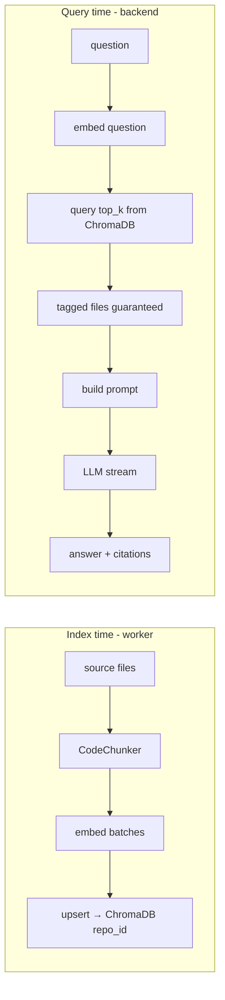

# RAG Pipeline

How CodeSensei answers questions about code: **Retrieval-Augmented Generation** grounded
in the repository's own source, with inline citations. The building blocks live in
`analysis-engine/engine/ai/`; the backend `AIService` and `ChatSessionService` drive them.

## Two phases

## Indexing (write, in the worker)

`RagChain.index_repository(files, sources)`:
1. **Chunk** with `CodeChunker` (`engine/ai/chunker.py`) — symbol-aware boundaries
   (functions/classes), falling back to overlapping line windows. Defaults:
   `target_lines=60`, `max_lines=200`, `overlap_lines=6`, `min_chunk_chars=40`. Each chunk
   carries `file_path`, `language`, `line_start/end`, `symbol_name/kind`, and a stable
   `chunk_id` (hash of path + line range).
2. **Embed** in batches (default 16) via the configured embedding provider.
3. **Upsert** to the repo's Chroma collection `repo_<repository_id>` (idempotent by
   `chunk_id`).

Returns `IndexingResult(chunks_indexed, files_indexed, files_skipped)`. Failures raise
`IndexingDegraded` — the analysis job still succeeds (see
[../architecture/analysis-pipeline.md](../architecture/analysis-pipeline.md)).

## Querying (read, in the backend at chat time)

`RagChain.stream_chat(request)`:
1. **Embed** the question with the same embedding model used at index time (the
   `embedding_model` stamp guards against mismatches).
2. **Retrieve** top-k chunks from ChromaDB (`AI_TOP_K_CHUNKS`, default 8; min score 0.0).
3. **Tagged files get guaranteed slots** — if the user attached `attached_paths` (e.g. via
   "Ask AI about this node"), those files' chunks are forced into context even if their
   similarity score is lower.
4. **Build the prompt** (`engine/ai/prompts.py`) — system instructions + retrieved context
   (with file/line provenance) + recent conversation history.
5. **Stream tokens** from the LLM and emit SSE events:
   `token` → incremental text, `citations` → numbered, de-duplicated source list,
   `done` → end, `error` → failure.

## Citations

Each retrieved chunk used in the answer becomes a citation
`{file_path, line_start, line_end, symbol?, snippet}`. The backend de-duplicates and numbers
them; the frontend renders `[1]`, `[2]`… markers that map to a source list, and persists
them on the assistant message (`chat_messages.citations` JSONB). This is what makes answers
**verifiable** rather than hand-wavy.

## Stateless vs. session chat

| | `POST /ai/chat` | `POST /chat-sessions/{id}/chat` |
| --- | --- | --- |
| Service | `AIService.stream_chat` | `ChatSessionService.stream_chat` |
| History | client-supplied | loaded from DB |
| Persistence | none | saves user + assistant turns, citations, attached context; bumps `last_activity_at` |
| Ownership | repo read check | session owner check |

## Context budget & retrieval tuning

| Knob | Default | Effect |
| --- | --- | --- |
| `AI_TOP_K_CHUNKS` | 8 | More chunks = broader context, larger prompt |
| `AI_MAX_CONTEXT_TOKENS` | 8192 | Caps prompt size; older history trimmed first |
| Chunk size (`target/max/overlap`) | 60/200/6 | Granularity vs. retrieval precision |
| Embedding batch | 16 | Throughput vs. provider rate limits |

## Limitations (honest)
- Retrieval quality is bounded by the free embedding model (`all-MiniLM-L6-v2`, 384-dim).
- The LLM is free-tier (Groq) and rate-limited (~30 req/min) — heavy use can throttle.
- Chunks are file/region level; the model reasons over imports, not a true call graph.
- No re-ranking step today (pure ANN similarity + tagged-file guarantees).

Providers and how to switch them: [providers.md](providers.md). Vector store details:
[vector-store.md](vector-store.md).
