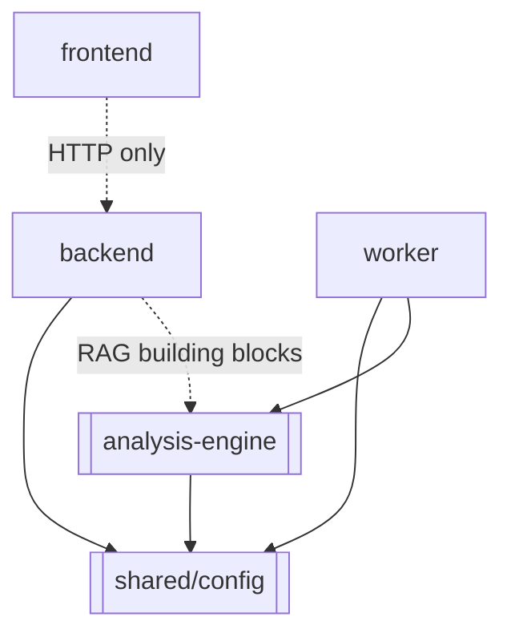

# Component Architecture

How the codebase is physically organized into components and how they depend on each
other. This complements the [high-level-design.md](high-level-design.md) (runtime view)
with a *static / build-time* view.

## Repository layout (monorepo)

```
github-repo-intelligence-platform/
├── frontend/            # React SPA (Vite, TS strict)
├── backend/             # FastAPI API service
├── worker/              # RQ worker service (imports analysis-engine)
├── analysis-engine/     # Standalone analysis + RAG library (own pyproject.toml)
├── shared/              # Cross-service config (defaults, providers, versioning)
├── docker/              # Compose files (dev, base, free-tier, prod, observability)
├── infrastructure/      # nginx, prometheus, grafana provisioning
├── .github/workflows/   # CI (ci.yml, release.yml, codeql.yml)
├── docs/                # This documentation suite
└── scripts/, Makefile   # Dev ergonomics
```

## Component dependency graph



- **`shared/`** is the lowest layer: `defaults.py` (all default config values),
  `providers.py` (provider type metadata), `analysis_version.py` (freshness stamps). Both
  backend and worker import it so they agree on defaults.
- **`analysis-engine/`** depends only on `shared/`. It contains both the static-analysis
  pipeline *and* the RAG building blocks (chunker, embeddings, vector store, prompts, LLM
  clients). It has no knowledge of FastAPI, RQ, or the database.
- **`worker/`** wires the engine to the database and Chroma (persistence + indexing).
- **`backend/`** is the API; it reuses the engine's RAG building blocks at chat time but
  owns its own persistence (services + repositories + ORM).
- **`frontend/`** depends on nothing in the repo except the HTTP contract.

## Backend internal components (`backend/app/`)

| Package | Role |
| --- | --- |
| `api/v1/endpoints/` | HTTP routers (15 files) |
| `schemas/` | Pydantic request/response models |
| `services/` | Business logic (13 services) |
| `repositories/` | Data access (generic base + 10 specialized) |
| `models/` | SQLAlchemy ORM (11 tables) |
| `core/` | config, dependencies (DI), auth, security, middleware, logging, exceptions |
| `db/` | engine + session factory + Base |
| `cache/` | async Redis façade |
| `workers/` | `JobDispatcher` (RQ enqueue abstraction) |
| `observability/` | Prometheus + OpenTelemetry + structlog setup |

Deep dive: [../backend/README.md](../backend/README.md).

## Frontend internal components (`frontend/src/`)

| Folder | Role |
| --- | --- |
| `pages/` | One component per route |
| `components/{layout,graph,ai-chat,metrics,architecture,repository,analysis,common,auth,dead-code}/` | Feature-grouped UI |
| `hooks/` | TanStack Query hooks + custom hooks (`useMediaQuery`, `useDebouncedValue`) |
| `store/` | Zustand stores (`uiStore`, `themeStore`, `nodeContextStore`) |
| `api/` | Typed API client modules (one per backend resource) |
| `lib/` | `api.ts` (axios + `ApiError`), `sse.ts` (POST-capable streaming), `graphModel.ts`, `format.ts`, `queryClient.ts`, `config.ts` |
| `routes/` | `router.tsx` (route table + guards) |
| `types/` | Shared TypeScript API types |

Deep dive: [../frontend/README.md](../frontend/README.md).

## Why a monorepo with a standalone engine?

- **Single PR spans full features** (API + UI + engine) without cross-repo coordination.
- **The engine is a library, not a service** — it's imported by the worker and reused by
  the backend, and it can be unit-tested in isolation with no infrastructure.
- **`shared/` prevents config drift** between backend and worker (same defaults, same
  version constants).

Trade-offs and alternatives: [../decisions/0007-analysis-engine.md](../decisions/0007-analysis-engine.md).
