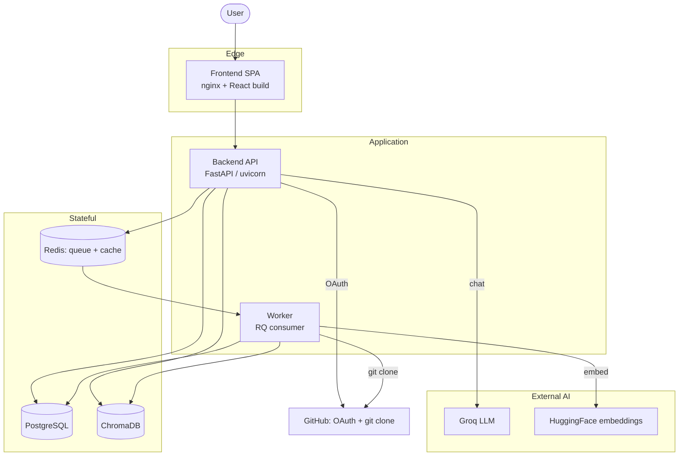
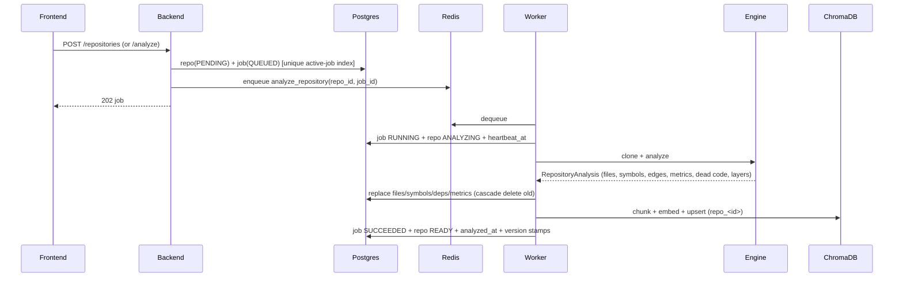
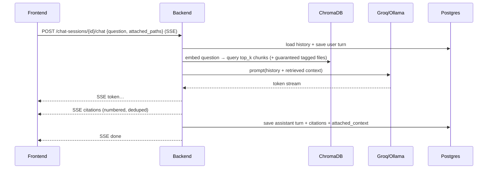

# High-Level Design (HLD)

> Scope: the whole system — services, responsibilities, data flows, and the request/job
> lifecycles. For class/schema/API-contract detail see
> [low-level-design.md](low-level-design.md).

## 1. Goals & constraints

| Goal | Implication |
| --- | --- |
| Analyze arbitrary public GitHub repos | Sandboxed clone + multi-language parsing + size/file limits |
| Don't block the API on slow work | Background worker + queue; SSE progress |
| Grounded AI answers | Vector store + RAG + citations |
| Run on free tiers | Stateless API/worker; managed Postgres/Redis; cloud LLM/embeddings |
| Safe multi-user | OAuth, IDOR checks, per-user data isolation |
| Recover from failure | Idempotent re-analysis, heartbeat reaper, best-effort indexing |

## 2. Component view (C4 level 2)

## 3. Responsibilities per service

### Frontend ([frontend/](../../frontend/))
SPA. Renders dashboards, the Cytoscape dependency graph, charts, the Mermaid architecture
diagram, and the chat UI. Talks only to `/api/v1`. Consumes two SSE streams (analysis
progress, chat tokens). Stateless; can be served from any static host / CDN.

### Backend ([backend/](../../backend/))
The API and orchestrator. Handles auth, validation, authorization, CRUD, enqueues
analysis jobs, serves analysis results, runs the RAG chat (retrieval + LLM streaming),
manages chat sessions, and runs the stuck-job reaper in its lifespan. Stateless aside
from in-memory rate-limit counters.

### Worker ([worker/](../../worker/))
Consumes analysis jobs from Redis. For each job: clone → run the analysis engine →
persist structured results to Postgres → chunk + embed + upsert to ChromaDB → update job
status/progress/heartbeat. Best-effort indexing (analysis still succeeds if indexing
degrades).

### Analysis engine ([analysis-engine/](../../analysis-engine/))
A pure library (no web framework). Orchestrates clone → walk → parse (parallel) → graph →
metrics → dead code → architecture, returning a `RepositoryAnalysis` dataclass. Also
hosts the RAG building blocks (chunker, embeddings, vector store, prompts, LLM clients).

### Data stores
- **PostgreSQL** — system of record for users, repos, jobs, files, symbols, dependencies,
  metrics, stars, chat sessions/messages.
- **Redis** — RQ job queue + result cache.
- **ChromaDB** — one vector collection per repository (`repo_<repository_id>`).

## 4. Primary data flows

### 4.1 Analysis (write path)

### 4.2 Progress (read path, streaming)

`GET /repositories/{id}/events` opens an SSE stream. The backend polls the job row every
~1s and emits `AnalysisProgressEvent`s (`queued` → `running` with `progress`/message →
`succeeded`/`failed`), closing on a terminal state. The worker's progress reporter writes
both `progress`/`progress_message` and `heartbeat_at`.

### 4.3 AI chat (RAG, streaming)

## 5. Lifecycles

### Repository status
`PENDING → CLONING → ANALYZING → READY` (happy path) or `→ FAILED` (any error / reaped).

### Analysis job status
`QUEUED → RUNNING → SUCCEEDED` or `→ FAILED` (exception or reaper) or `CANCELLED`.

A **partial unique index** (`uq_active_job_per_repository`) forbids two `QUEUED`/`RUNNING`
jobs for the same repo, so concurrent "Analyze" clicks return `409` instead of double-work.

## 6. Scaling model

| Bottleneck | Scale strategy |
| --- | --- |
| API throughput | Add backend replicas (stateless behind a proxy; move rate-limit to Redis) |
| Analysis throughput | Add worker processes/containers (RQ is multi-consumer safe) |
| Retrieval latency | Per-repo Chroma collections keep working sets small |
| DB | Connection pooling now; read replicas / partitioning later |
| LLM rate limits | Provider is swappable; queueing / paid tier raises limits |

See [interview/scalability.md](../interview/scalability.md) for the deeper discussion.

## 7. Failure handling (summary)

- **Worker crash mid-job** → heartbeat goes stale → **reaper** marks job FAILED and repo
  FAILED so the user can retry.
- **Indexing (Chroma/embeddings) fails** → `IndexingDegraded` logged; analysis still
  SUCCEEDS (graph/metrics available, chat may be degraded).
- **Duplicate analyze** → unique active-job index → `409`.
- **Invalid/malicious URL** → rejected by `validate_github_url` before any work.

Full runbooks: [operations/runbooks.md](../operations/runbooks.md).
