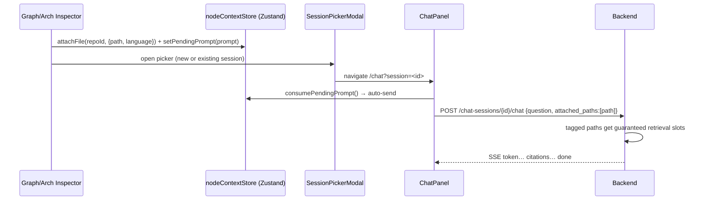

# Low-Level Design (LLD)

> Modules, classes, the layering contract, API contracts, and sequence detail. Pairs with
> [high-level-design.md](high-level-design.md) (the big picture) and
> [../database/schema.md](../database/schema.md) (the data model).

## 1. Backend layering contract

```
Router  ──calls──►  Service  ──calls──►  Repository  ──uses──►  ORM Model  ──►  Postgres
  ▲                    ▲                                                          
  │ Pydantic schema    │ pure business logic (no FastAPI imports)                 
  │ in/out             │                                                          
DI container (app/core/dependencies.py) constructs the chain per request.
```

**Rules enforced by convention:**
- Routers never write SQL; services never import FastAPI; repositories never contain
  business rules. This keeps services unit-testable without HTTP and repositories
  swappable.

## 2. Dependency injection — `app/core/dependencies.py`

FastAPI `Annotated[T, Depends(factory)]` aliases assemble the graph each request:

```
SettingsDep → DbSessionDep → <Entity>RepoDep → <Entity>ServiceDep → router
                           ↘ CacheDep (Redis)
                           ↘ JobDispatcherDep (RQ)
CurrentUserDep / OptionalUserDep → decode JWT cookie → load User
verify_repository_access → load repo, 404 if not readable by caller
```

Representative aliases (see backend report for the full list): `RepositoryServiceDep`,
`AnalysisServiceDep`, `AIServiceDep`, `ChatSessionServiceDep`, `StarServiceDep`,
`ProfileServiceDep`, plus all `*RepoDep` and the two user dependencies.

## 3. Key classes & responsibilities

### Services (`app/services/`)
| Class | Core methods | Responsibility |
| --- | --- | --- |
| `RepositoryService` | `submit`, `get_for_user`, `list`, `list_public`, `list_public_grouped`, `public_repository_group`, `delete`, `set_visibility`, `to_read_model(s)` | Repo lifecycle + access control + read-model mapping |
| `AnalysisService` | `trigger`, `get_job`, `latest_job_for_repository`, `list_jobs`, `poll_until_terminal` | Job creation + status + SSE polling |
| `AIService` | `stream_chat`, `delete_repository_index`, `_build_runtime` | Stateless RAG chat + vector cleanup |
| `ChatSessionService` | `create_session`, `list_sessions`, `get/rename/delete_session`, `list_messages`, `stream_chat` | Persistent conversations + auto-save turns |
| `DependencyService` / `MetricService` / `DeadCodeService` / `ImpactService` / `ArchitectureService` / `DocumentationService` | `get_graph` / `complexity_ranking` / `report` / `analyze` / `report` / `generate` | One analysis read-model each |
| `StarService` | `star`, `unstar`, `is_starred`, `starred_ids`, `list_starred` | Idempotent stars + denormalized count |
| `ProfileService` | `get_profile`, `list_public_repositories` | Public profile reads |
| `AuthService` | `new_state`, `authorize_url`, `exchange_code` | GitHub OAuth flow |
| `analysis_reaper` (module) | `reap_stale_jobs`, `run_reaper_loop` | Crash recovery loop in app lifespan |

### Repositories (`app/repositories/`)
A generic `BaseRepository` provides typed CRUD (`get`, `list`, `add`, `delete`, `commit`).
Specialized repos add domain queries (e.g. `RepositoryRepository.list_public(...)`,
`ChatSessionRepository.list_for_user_repo(...)`, `StarRepository.count_for_repo(...)`).

### Models (`app/models/`)
11 ORM classes on a shared `Base` with `UUIDPrimaryKeyMixin` (uuid PK) and
`TimestampMixin` (`created_at`/`updated_at`). Full field/constraint listing:
[../database/schema.md](../database/schema.md).

## 4. API contract conventions

| Concern | Convention |
| --- | --- |
| Base path | `/api/v1` |
| Auth | httpOnly cookie `codesensei_session` (JWT HS256); `CurrentUserDep` (required) / `OptionalUserDep` |
| Pagination | `?page=&page_size=` → `PaginatedResponse[T] {items, total, page, page_size}` |
| Async work | `POST …/analyze` returns `202` + `AnalysisJobRead` |
| Streaming | SSE: `text/event-stream`, framed `event: <name>\ndata: <json>\n\n` |
| Errors | JSON `{detail}`; `404` for not-found/forbidden (avoids leaking existence), `409` duplicate job, `429` rate-limited |
| IDOR | `verify_repository_access` dependency or in-service ownership check before mutation |

Endpoint inventory (38 routes / 15 files): see [../backend/api-reference.md](../backend/api-reference.md).

## 5. Streaming contracts

### Analysis progress — `AnalysisProgressEvent`
```jsonc
// event: progress
{ "status": "running", "progress": 62, "message": "graph: resolving imports", "job_id": "…" }
// terminal
{ "status": "succeeded" }  // or "failed" with "error"
```

### Chat tokens — `ChatTokenEvent`
```jsonc
{ "event": "token", "content": "…" }
{ "event": "citations", "citations": [{ "file_path": "…", "line_start": 1, "line_end": 40, "symbol": null, "snippet": "…" }] }
{ "event": "done" }
{ "event": "error", "error": "…" }
```

## 6. Sequence: "Ask AI about this node" (cross-feature)



## 7. Concurrency & transactions

- One async SQLAlchemy session per request (DI-scoped); services call `commit()` explicitly.
- Worker uses its own sync/async session per job; persistence replaces a repo's files in a
  single transaction (cascade delete old rows, insert new) for atomic re-analysis.
- The unique active-job partial index enforces "one in-flight analysis per repo" at the
  database level (not just app logic).

## 8. Versioning & freshness

`shared/config/analysis_version.py` defines `ANALYSIS_VERSION`, `PIPELINE_VERSION`,
`SCHEMA_VERSION`. Each successful analysis stamps these onto the repo row plus
`embedding_model` ("provider:model"). The frontend compares stamps to current constants to
show a "stale analysis" banner and offer re-analysis. See
[../features/repository-analysis.md](../features/repository-analysis.md).
