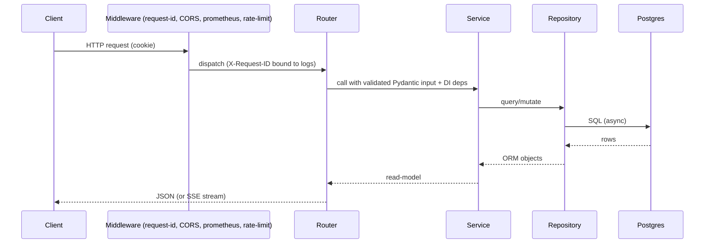

# Backend Documentation

The backend is a **FastAPI** service using **SQLAlchemy 2.0 (async)** + **asyncpg**,
**Pydantic v2**, **Alembic**, and **structlog**. It is layered (router → service →
repository → model) and fully async.

| Doc | Covers |
| --- | --- |
| This file | Structure, layering, DI, middleware, jobs, reaper, config |
| [api-reference.md](api-reference.md) | Every endpoint (method, path, auth, summary) |
| [services.md](services.md) | Each service class and its methods |
| [../database/schema.md](../database/schema.md) | The data model |
| [../security/threat-model.md](../security/threat-model.md) | Authn/authz, IDOR, SSRF, rate limiting |

## Directory map (`backend/app/`)

```
app/
├── api/v1/
│   ├── endpoints/   # 15 routers: auth, repositories, analysis, discover, chat_sessions,
│   │                #   ai, dependencies, complexity, dead_code, impact, architecture,
│   │                #   documentation, stars, users, health
│   └── router.py    # aggregates all routers under /api/v1
├── schemas/         # Pydantic request/response models (one file per resource)
├── services/        # business logic (13 services)
├── repositories/    # data access (BaseRepository + 10 specialized)
├── models/          # SQLAlchemy ORM (11 tables)
├── core/            # config, dependencies (DI), auth, security, middleware, logging, exceptions
├── db/              # base.py (Base + mixins), session.py (engine + factory)
├── cache/           # redis_cache.py (async façade)
├── workers/         # job_dispatcher.py (RQ enqueue)
├── observability/   # metrics.py (Prometheus + OTel + structlog)
└── main.py          # app factory + lifespan (reaper task, engine dispose)
```

## Layering contract

```
Router (thin)  →  Service (all logic)  →  Repository (all SQL)  →  ORM Model  →  Postgres
   ▲ Pydantic        ▲ no FastAPI imports
```

- Routers parse input, call **one** service, and shape the response. They never write SQL.
- Services hold business rules and are unit-testable without HTTP.
- Repositories encapsulate queries behind a generic `BaseRepository` (typed CRUD) plus
  domain-specific methods.

## Dependency injection (`core/dependencies.py`)

FastAPI `Annotated[T, Depends(factory)]` aliases build the chain per request:
`SettingsDep → DbSessionDep → <Entity>RepoDep → <Entity>ServiceDep`. Auth is provided by
`CurrentUserDep` (required) and `OptionalUserDep` (nullable), which decode the JWT session
cookie and load the `User`. `verify_repository_access` is a side-effect dependency that
loads a repo and raises `404` if the caller can't read it (owner or public).

## Request lifecycle



## Middleware (outermost → innermost)

1. **CORS** — allowlist from `APP_CORS_ORIGINS`.
2. **Prometheus** — request metrics.
3. **RequestContext** — generates/propagates `X-Request-ID`, binds structlog context,
   logs completion with `duration_ms`.
4. **RateLimit** — sliding-window per IP (`API_RATE_LIMIT_PER_MINUTE`), honors
   `X-Forwarded-For`/`X-Real-IP`, exempts `/healthz` `/readyz` `/metrics`, returns `429`
   with `Retry-After`.

## Background jobs

- **Enqueue:** `app/workers/job_dispatcher.py` `JobDispatcher.enqueue_analysis(repo_id,
  job_id)` pushes the task `worker.app.tasks.analyze_repository.run` onto the
  `REDIS_QUEUE_NAME` queue with `WORKER_JOB_TIMEOUT_SECONDS`.
- **Consume:** the separate worker service (see [../ai/](../ai/) and the worker docs).
- **Reaper:** `app/services/analysis_reaper.py` runs in `main.py`'s lifespan as an
  `asyncio` task: an immediate startup sweep + a periodic loop that fails stale
  `RUNNING`/`QUEUED` jobs and flips their repos to `FAILED`.

## Configuration

Pydantic v2 `BaseSettings` in `app/core/config.py` reads ~60 env vars (grouped: app, auth,
mock-auth, features, API, Postgres, Redis, Chroma, AI providers, worker, reaper,
observability). Production hardening: rejects the default secret key / DB password, forces
`secure` cookies, and disables mock-auth. Full variable reference:
[../deployment/environment-variables.md](../deployment/environment-variables.md).

## Observability

- `/metrics` (Prometheus / OpenMetrics) with custom counters (`analysis_jobs_enqueued_total`,
  `ai_chat_requests_total`, `build_info`).
- Optional OpenTelemetry tracing to `OTEL_EXPORTER_OTLP_ENDPOINT`.
- structlog JSON logs with request-id context.
