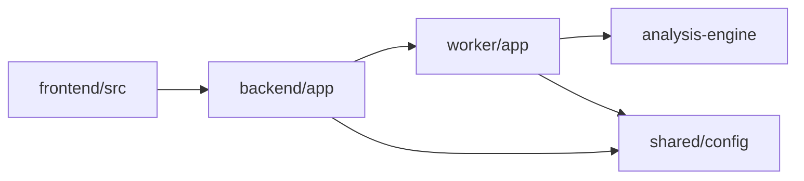
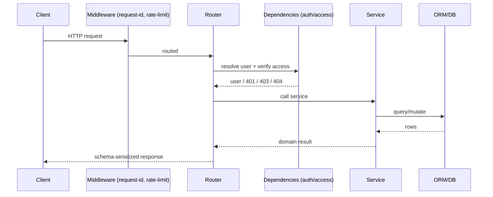
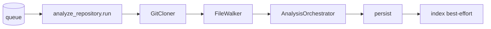
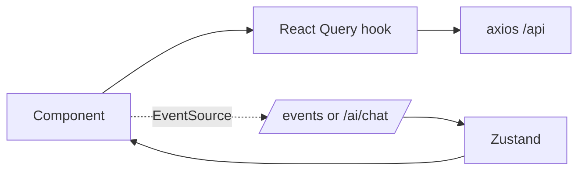
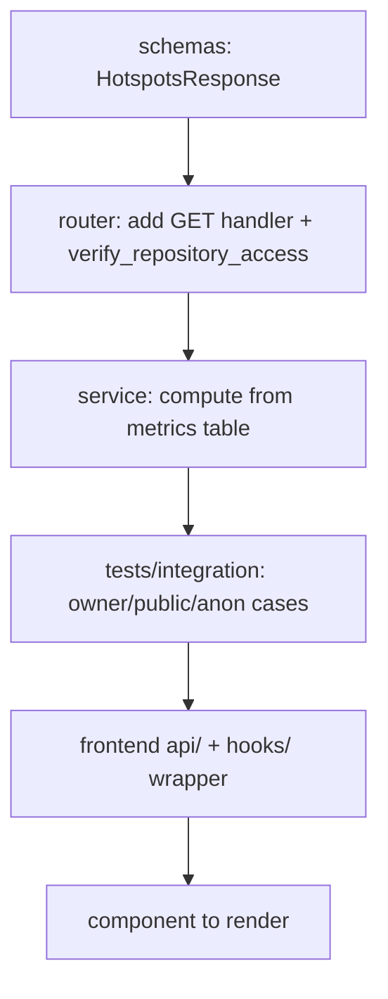

# Code Walkthrough

> **Audience:** a new engineer who wants to understand the codebase well enough to make
> their first change confidently.
> **Scope:** a guided, layer-by-layer tour — what each folder does, where requests flow,
> and "where do I change X?" Pair with [../architecture/low-level-design.md](../architecture/low-level-design.md).

---

## 1. The 10,000-foot view



Four codebases, one shared config module. Reading order for a newcomer:
`shared/config` → `backend/app/core` → `backend/app/routers` → `worker/app/tasks` →
`analysis-engine` → `frontend/src`.

---

## 2. `shared/config` — start here

| File | What it holds |
| --- | --- |
| `defaults.py` | All default constants + provider metadata (single source of truth) |

Everything downstream reads config from here. The first thing to understand is
**how a setting flows**: `defaults.py` constant → `Settings` field (env override) →
derived property (`postgres_dsn_async`, `mock_auth_enabled`, …) → used by code.

---

## 3. `backend/app` — the API

```
backend/app/
├── main.py          # app factory: middleware, routers, startup safeguards
├── core/
│   ├── config.py        # Settings + derived properties
│   ├── security.py      # JWT, cookies, OAuth helpers, safe_join
│   ├── dependencies.py  # get_optional_user / get_current_user / verify_repository_access
│   ├── database.py      # async engine + session
│   └── observability.py # structlog + Prometheus + middleware
├── routers/         # HTTP surface (one module per resource)
├── services/        # business logic (Repository/Analysis/AI + JobDispatcher)
├── schemas/         # Pydantic request/response models
└── models/          # SQLAlchemy ORM
```

### Request lifecycle



**Where do I change…**

| Task | File(s) |
| --- | --- |
| Add/modify an endpoint | `routers/<resource>.py` + a `schemas/` model |
| Change business logic | `services/<X>Service` |
| Change auth/access rules | `core/dependencies.py` (+ `core/security.py`) |
| Add config | `shared/config/defaults.py` + `core/config.py` |
| Change DB shape | `models/` + a new Alembic revision |
| Add a metric/log field | `core/observability.py` |

### Key files to read first

- `core/dependencies.py` — the auth/authz trio. `get_optional_user` never raises;
  `verify_repository_access` encodes the owner/public/IDOR rules.
- `core/security.py` — JWT encode/decode, cookie helpers, OAuth, and `safe_join`.
- `services/AIService` — async wrapper around the sync `RagChain` (`asyncio.to_thread`).
- `services/JobDispatcher` — the seam that tests fake (`FakeJobDispatcher`).

---

## 4. `worker/app` — the pipeline

```
worker/app/
├── worker.py                    # RQ worker entrypoint
└── tasks/analyze_repository.py  # the state machine
```

`analyze_repository.py` is the heart of the system. Read it top-to-bottom and you'll see
the state machine: mark `RUNNING` → clone → walk → parse → persist → index → `SUCCEEDED`
(or `FAILED`). The `DbProgressReporter` writes 0–100 progress throttled every 25 files.



**Where do I change…**

| Task | File |
| --- | --- |
| Pipeline stages/order | `tasks/analyze_repository.py` |
| Progress reporting | `DbProgressReporter` in the same module |
| Concurrency/limits | env: `WORKER_CONCURRENCY`, `ENGINE_PARSE_WORKERS`, caps |

> Remember: the worker is **synchronous** (psycopg2, blocking redis, ThreadPool). Don't
> bring an event loop into it (ADR-006).

---

## 5. `analysis-engine` — the library

```
analysis-engine/
├── cloner.py        # GitCloner (shallow clone)
├── walker.py        # FileWalker (.gitignore aware)
├── orchestrator.py  # AnalysisOrchestrator (threadpool parse)
├── parsers/         # per-language tree-sitter adapters
├── chunking.py      # symbol-aware CodeChunk builder
└── rag/             # RagChain, embeddings, ChromaDB client
```

**Where do I change…**

| Task | File |
| --- | --- |
| Support a new language | add a `parsers/` adapter + extension mapping |
| Tune chunking | `chunking.py` (`target_lines`, `max_lines`, `overlap`) |
| Change retrieval/prompting | `rag/` (`RagChain`, top-k, prompt) |
| Change embeddings | `rag/` embedding provider selection |

Detail: [../architecture/analysis-pipeline.md](../architecture/analysis-pipeline.md)
and [../ai/rag-pipeline.md](../ai/rag-pipeline.md).

---

## 6. `frontend/src` — the SPA

```
frontend/src/
├── api/         # axios client + typed endpoint wrappers
├── stores/      # Zustand (transient client state)
├── hooks/       # React Query hooks + SSE hooks
├── pages/       # routed views
├── components/  # graph (Cytoscape), diagrams (Mermaid), charts (Recharts)
└── lib/
```



**Where do I change…**

| Task | File(s) |
| --- | --- |
| Call a new endpoint | `api/` wrapper + a `hooks/` React Query hook |
| Add a page/route | `pages/` + router config |
| Render analysis (graph/charts) | `components/` (Cytoscape/Recharts/Mermaid) |
| Live updates (progress/chat) | the SSE hook + Zustand store |

- **React Query** = server cache (repos, jobs, analyses).
- **Zustand** = transient UI state (current repo, streaming buffers).

---

## 7. A change, end-to-end (worked example)

*"Add a new per-repo insight endpoint `GET /repositories/{id}/hotspots`."*



1. **schema** in `schemas/` for the response.
2. **router** handler gated by `verify_repository_access`.
3. **service** method querying `metrics`/`symbols`.
4. **tests** for owner/public/anonymous access (don't skip IDOR cases).
5. **frontend** api wrapper + hook + component.

This mirrors the existing complexity/dead-code/architecture endpoints — copy one as a
template.

---

## 8. Conventions

| Convention | Rule |
| --- | --- |
| Layering | `routers → services → models`; routers don't embed business logic |
| Types | `mypy --strict`; annotate everything you touch |
| Validation | at the boundary via Pydantic; trust internal calls |
| Access control | every per-repo endpoint calls `verify_repository_access` |
| Tests | hermetic; add a fake/override instead of a real service |
| Config | new settings go through `shared/config/defaults.py` |

---

## 9. Related documents

- [../architecture/low-level-design.md](../architecture/low-level-design.md) — schema + contracts
- [KNOWLEDGE_TRANSFER_GUIDE.md](KNOWLEDGE_TRANSFER_GUIDE.md) — ownership map + onboarding
- [TESTING_STRATEGY.md](TESTING_STRATEGY.md) — how to test your change
- [Source-Code-Walkthrough.md](../development/code-walkthrough.md) — earlier supporting walkthrough
