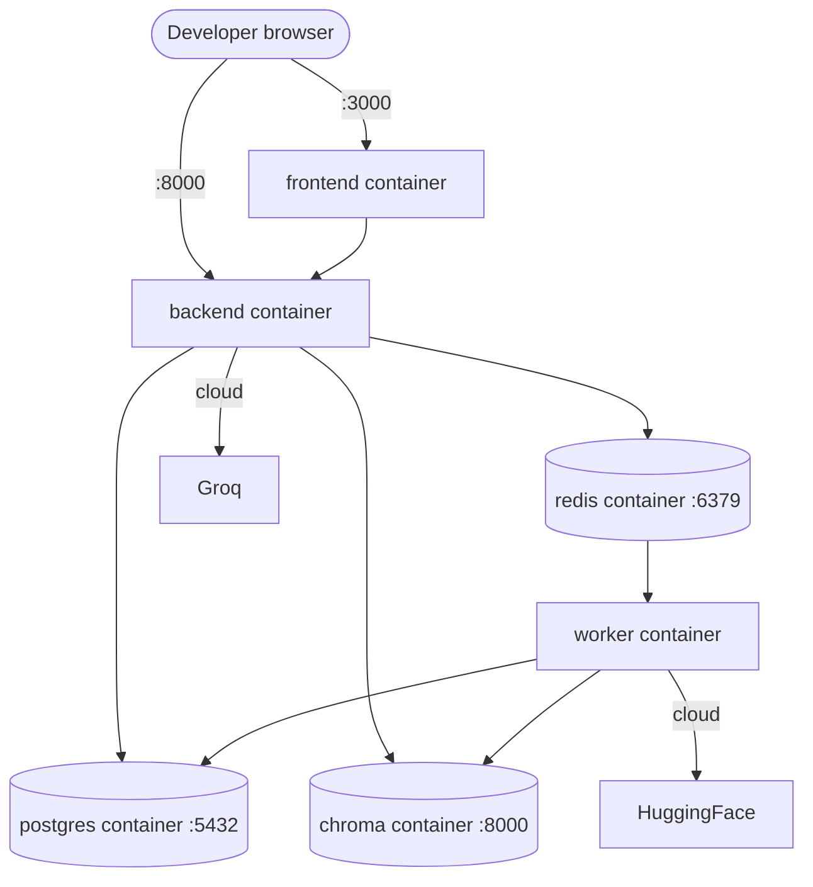
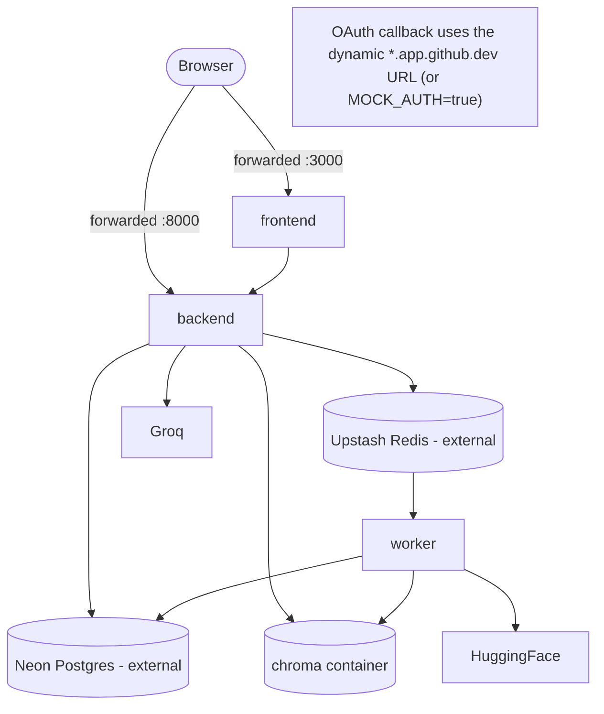
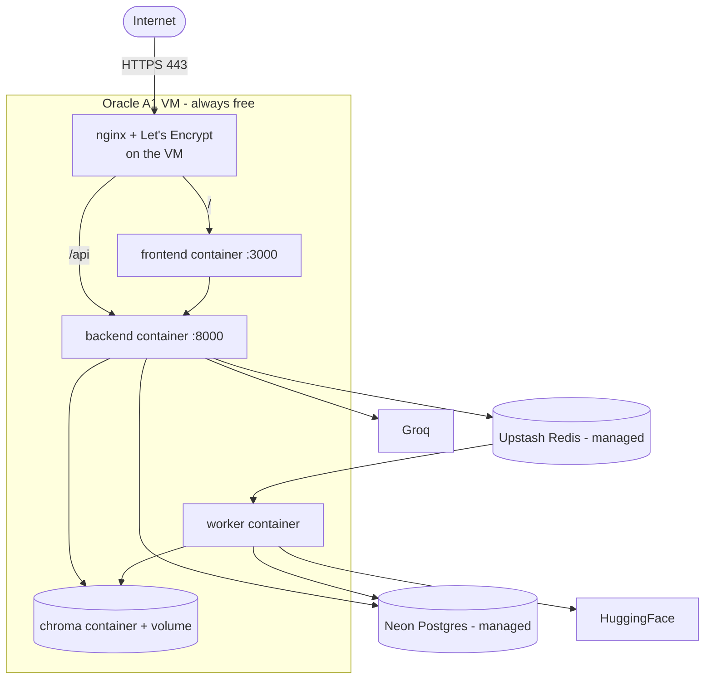

# Deployment Topology Diagrams

## Local (Docker Compose, free-tier shape)

## GitHub Codespaces

## Oracle Cloud Free Tier (production-shaped)

Notes:
- Compute (frontend/backend/worker) is stateless; durable state is Neon + Upstash + the
  Chroma volume.
- Both the OCI security list **and** the host iptables must allow 80/443.
- Migration between these topologies is mostly a `.env` change — see
  [../deployment/migration.md](../deployment/migration.md).
