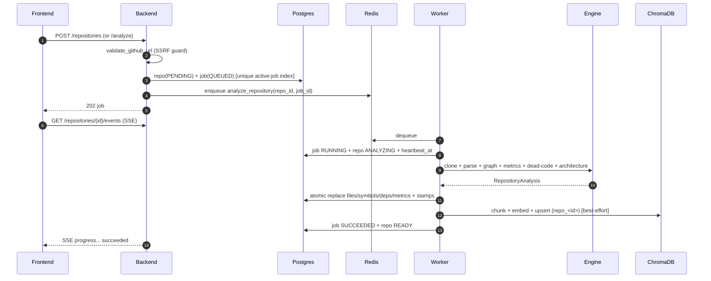
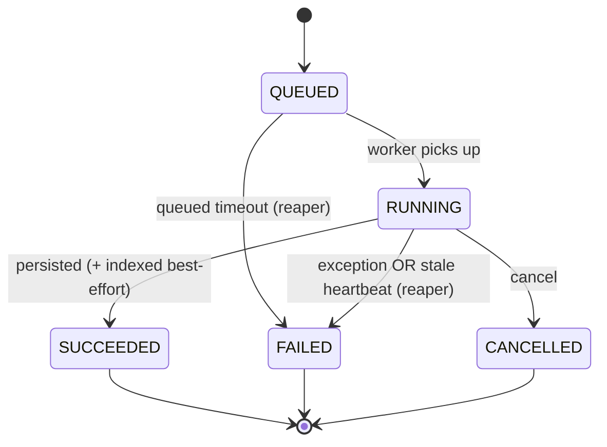
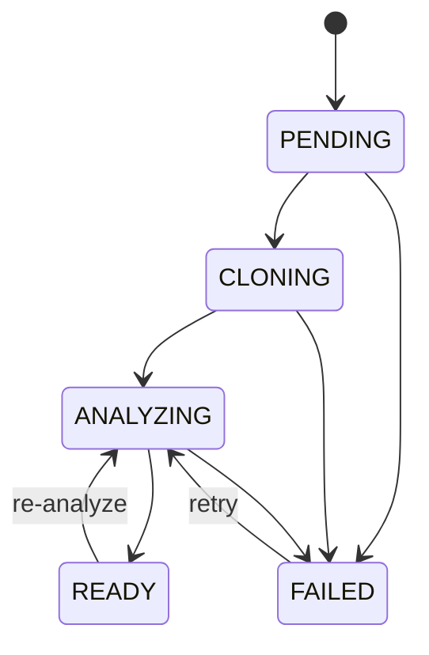
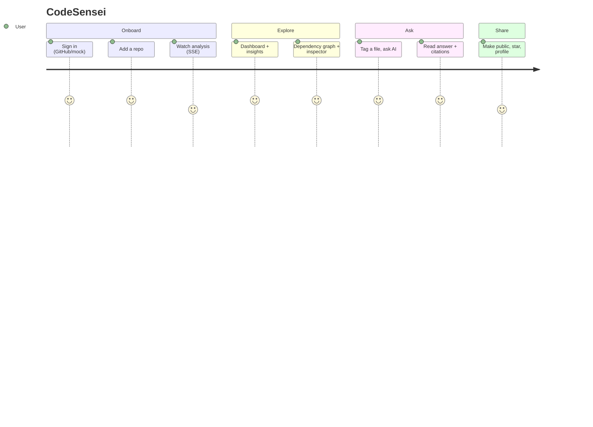

# Flow Diagrams

## Authentication (GitHub OAuth)

```mermaid
sequenceDiagram
  autonumber
  participant U as User
  participant FE as Frontend
  participant BE as Backend
  participant GH as GitHub
  U->>FE: Click "Sign in"
  FE->>BE: GET /auth/github/login
  BE-->>U: 302 to GitHub consent (state cookie)
  U->>GH: Approve
  GH-->>BE: GET /auth/github/callback?code&state
  BE->>BE: verify state; exchange code to token
  BE->>GH: GET /user profile
  BE->>BE: upsert user; mint JWT
  BE-->>U: Set httpOnly cookie; 302 to frontend
  FE->>BE: GET /auth/me to fetch user
```

## Repository analysis (write path)



## AI chat (RAG, read path)

```mermaid
sequenceDiagram
  autonumber
  participant FE as Frontend
  participant BE as Backend
  participant PG as Postgres
  participant CH as ChromaDB
  participant LLM as Groq/Ollama
  FE->>BE: POST /chat-sessions/{id}/chat {question, attached_paths} (SSE)
  BE->>PG: check ownership; load history; save user turn
  BE->>CH: embed question to top-k chunks (+ tagged files guaranteed)
  BE->>LLM: prompt(system + context + history)
  LLM-->>BE: token stream
  BE-->>FE: SSE token...
  BE-->>FE: SSE citations (numbered, deduped)
  BE->>PG: save assistant turn + citations + attached_context
  BE-->>FE: SSE done
```

## Analysis job state machine



## Repository status



## Core user journey


