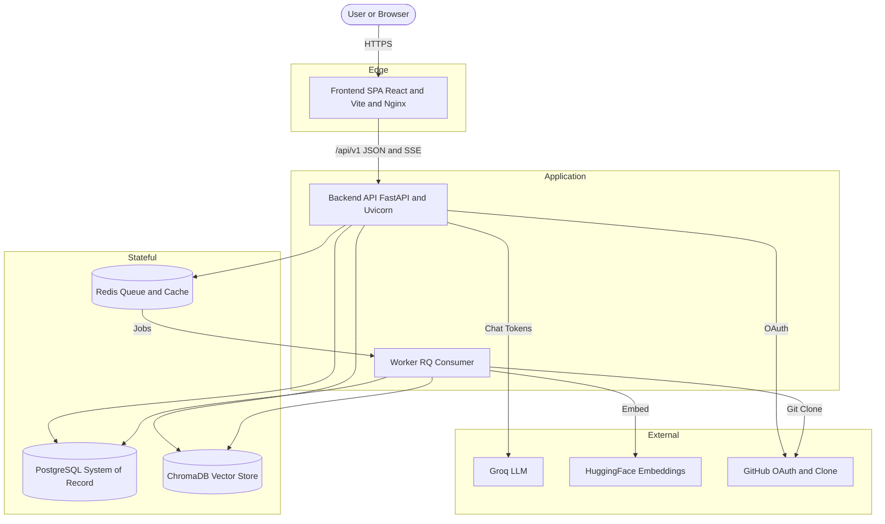
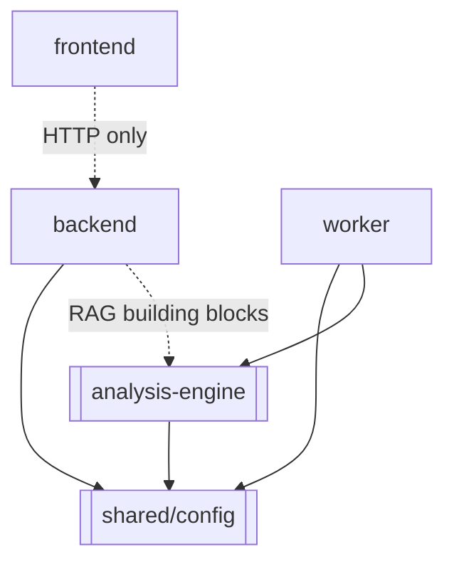
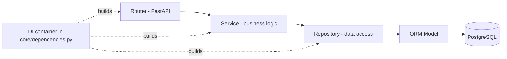

# System Architecture Diagrams

## Container view (C4 level 2)

```mermaid
flowchart TB
  user([User or Browser])
  subgraph Edge
    fe[Frontend SPA React and Vite and Nginx]
  end
  subgraph Application
    be[Backend API FastAPI and Uvicorn]
    wk[Worker RQ Consumer]
  end
  subgraph Stateful
    pg[(PostgreSQL System of Record)]
    rd[(Redis Queue and Cache)]
    ch[(ChromaDB Vector Store)]
  end
  subgraph External
    groq[Groq LLM]
    hf[HuggingFace Embeddings]
    gh[GitHub OAuth and Clone]
  end

  user -->|HTTPS| fe
  fe -->|/api/v1 JSON and SSE| be
  be -->|OAuth| gh
  be --> pg
  be --> rd
  be --> ch
  be -->|Chat Tokens| groq
  rd -->|Jobs| wk
  wk -->|Git Clone| gh
  wk --> pg
  wk --> ch
  wk -->|Embed| hf
```

## Component dependencies (build-time)

```mermaid
flowchart TD
  shared[[shared/config]]
  engine[[analysis-engine]]
  backend[backend]
  worker[worker]
  frontend[frontend]

  backend --> shared
  worker --> shared
  worker --> engine
  backend -. RAG building blocks .-> engine
  engine --> shared
  frontend -. HTTP only .-> backend
```

## Backend layering

```mermaid
flowchart LR
  R[Router - FastAPI] --> S[Service - business logic]
  S --> Repo[Repository - data access]
  Repo --> M[ORM Model]
  M --> PG[(PostgreSQL)]
  DI[DI container in core/dependencies.py] -.builds.-> R
  DI -.builds.-> S
  DI -.builds.-> Repo
```
