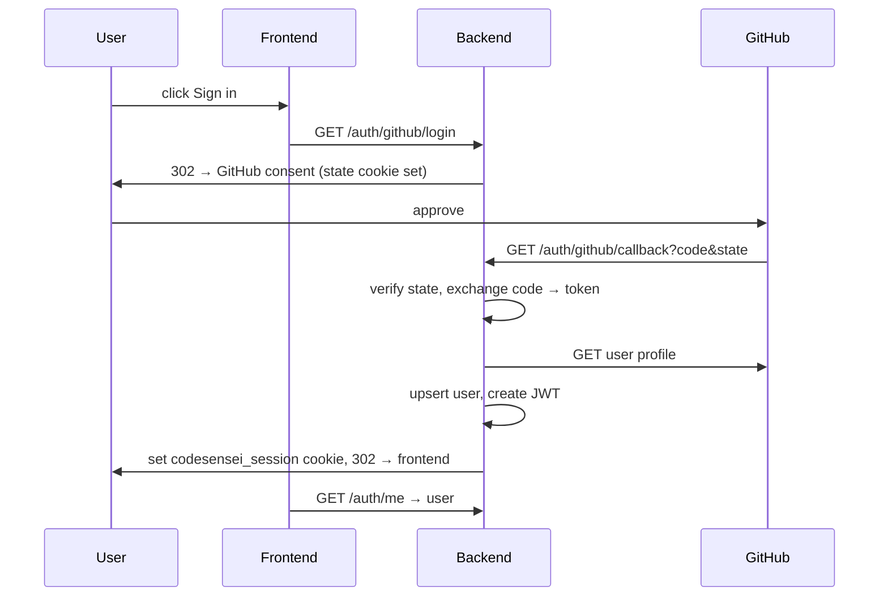

# Feature: Authentication

## What it does
Lets a user sign in with their GitHub account. A successful login mints a JWT session token
stored in an httpOnly cookie; the SPA then treats the user as authenticated. A **dev-only
mock-auth** mode auto-authenticates as a fixed user so the whole app is usable without
GitHub during development.

## Why it exists
The audience is developers who already have GitHub. OAuth avoids passwords entirely, gives
a stable identity (`github_id`), and provides avatar/username for profiles. Mock auth keeps
local/dev iteration fast and CI hermetic.

## User workflow
1. Visit the app → `RequireAuth` finds no session → redirect to `/login`.
2. Click "Sign in with GitHub" → backend redirects to GitHub consent (with anti-CSRF state).
3. GitHub redirects back to the callback → backend exchanges code for a token, fetches the
   profile, upserts the user, sets the session cookie, redirects to the SPA.
4. The SPA's `useMe()` now returns the user.

## Backend implementation
- **Service:** `AuthService` (`auth_service.py`): `new_state()`, `authorize_url(state)`,
  `exchange_code(code)` (token → profile → `UserRepository` upsert).
- **Routes:** `auth.py` — `/auth/github/login`, `/auth/github/callback`, `/auth/me`,
  `/auth/logout`, `/auth/dev-login`.
- **Tokens:** `core/auth.py` — HS256 JWT `{sub, gh, iat, exp}` signed with `APP_SECRET_KEY`.
- **Cookie:** `SESSION_COOKIE_NAME` (`codesensei_session`), `httpOnly`, `secure` in prod,
  `SameSite=Lax`, TTL `SESSION_TTL_SECONDS`.
- **Mock auth:** when `mock_auth_enabled` (only in non-prod), `get_current_user` returns a
  fixed mock user — no GitHub round-trip.

## Frontend implementation
- `useMe()` → `GET /auth/me` (`User | null`, never retried).
- `RequireAuth` gates protected routes; `LoginPage` offers OAuth + dev login;
  `useLogout()` clears the cookie and the query cache.

## Tables involved
- `users` (upsert by `github_id`).

## APIs
`GET /auth/github/login`, `GET /auth/github/callback`, `GET /auth/me`, `POST /auth/logout`,
`POST /auth/dev-login`.

## Edge cases handled
- **CSRF on OAuth** — short-lived state cookie verified on callback.
- **Expired/invalid JWT** — `decode_session_token` returns `None` → treated as logged out.
- **Private email** — `email` is nullable.
- **Returning user** — upsert updates profile fields, keeps the same row.

## Security considerations
- Token in **httpOnly** cookie (not JS-readable) → mitigates XSS token theft.
- `secure` + `SameSite=Lax` in production.
- Mock auth and dev login are **hard-disabled** when `APP_ENV=production`.
- Default `APP_SECRET_KEY` is rejected in production.
See [../security/threat-model.md](../security/threat-model.md).

## Future improvements
- Refresh tokens / shorter access TTL.
- Additional OAuth providers (Google, GitLab) — would slot in beside `AuthService`.
- Private-repo support via stored, encrypted GitHub tokens.
