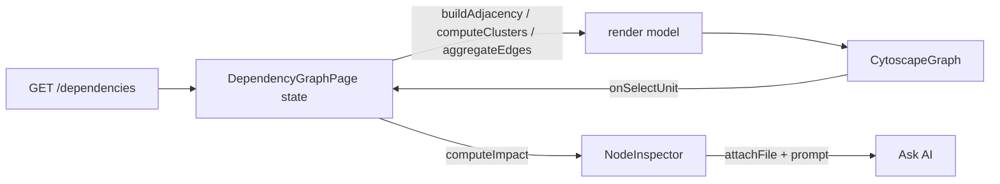

# The Dependency Graph — Complete Feature Guide

> Everything about CodeSensei's interactive **Dependency Graph**: what it is, the tech behind
> it, every visual encoding (color, shape, size, edges), every control and option (toolbar,
> focus mode, depth, on-canvas controls, keyboard), the node intelligence inspector, how to
> use it to get real answers, how it's built, and how to extend it.
>
> **Audience:** end users who want to use the feature well, engineers who want to upgrade it,
> and developers who want to reuse the approach in their own application.
>
> **Source files:**
> [`frontend/src/pages/DependencyGraphPage.tsx`](../frontend/src/pages/DependencyGraphPage.tsx) ·
> [`frontend/src/components/graph/CytoscapeGraph.tsx`](../frontend/src/components/graph/CytoscapeGraph.tsx) ·
> [`frontend/src/components/graph/GraphToolbar.tsx`](../frontend/src/components/graph/GraphToolbar.tsx) ·
> [`frontend/src/components/graph/NodeInspector.tsx`](../frontend/src/components/graph/NodeInspector.tsx) ·
> [`frontend/src/lib/graphModel.ts`](../frontend/src/lib/graphModel.ts)
>
> Related: [features/dependency-graph.md](features/dependency-graph.md) (feature overview),
> [features/architecture-explorer.md](features/architecture-explorer.md) (same engine, layer
> view), [ai/](ai/) (the "Ask AI about this node" target).

---

## Table of contents
1. [What the dependency graph is](#1-what-the-dependency-graph-is)
2. [The technology behind it](#2-the-technology-behind-it)
3. [Data model: nodes, edges, clusters](#3-data-model-nodes-edges-clusters)
4. [Visual encoding (read the graph at a glance)](#4-visual-encoding)
5. [Relationship highlighting & focus](#5-relationship-highlighting--focus)
6. [The toolbar — every option](#6-the-toolbar--every-option)
7. [On-canvas controls & keyboard shortcuts](#7-on-canvas-controls--keyboard-shortcuts)
8. [The Node Intelligence inspector](#8-the-node-intelligence-inspector)
9. [Ask AI about a node](#9-ask-ai-about-a-node)
10. [How to use it — recipes](#10-how-to-use-it--recipes)
11. [Limitations & gotchas](#11-limitations--gotchas)
12. [How it's built (for engineers)](#12-how-its-built-for-engineers)
13. [Extending / upgrading the feature](#13-extending--upgrading-the-feature)
14. [Reusing this approach in your own app](#14-reusing-this-approach-in-your-own-app)
15. [Quick reference](#15-quick-reference)

---

## 1. What the dependency graph is

The dependency graph visualizes **how the files in a repository depend on each other**. Each
node is a file (or a folder cluster); each directed edge means "the source imports/uses the
target". It answers questions that are painful to answer by reading code:

- *What does this file depend on?* (outgoing edges)
- *What depends on this file — what breaks if I change it?* (incoming edges)
- *Are there dependency cycles?*
- *How is the repo clustered into modules?*
- *Which files are the most central / critical?*

It is one of the five analysis surfaces; the same rendering engine also powers the
[Architecture Explorer](features/architecture-explorer.md).

> **Honest scope:** edges are **file-level import edges**. The analyzer emits `import` edges
> (not per-function `call` edges), so "usage" is at file granularity, not a true call graph.
> See [§11](#11-limitations--gotchas) and [ADR-0008](decisions/0008-dependency-graph.md).

---

## 2. The technology behind it

| Concern | Tech | Notes |
| --- | --- | --- |
| Graph rendering | **Cytoscape.js** (`cytoscape@3.30.4`) via `react-cytoscapejs` | Canvas-based, performant for hundreds of nodes |
| Layouts | **cose-bilkent** (organic) + **dagre** (hierarchy) | registered once at module load |
| Graph math | pure TS in `lib/graphModel.ts` | adjacency, reachability, clustering, impact — testable, no Cytoscape |
| Data source | `GET /api/v1/repositories/{id}/dependencies` | `{ nodes, edges, cycles }` from Postgres |
| State | React state in `DependencyGraphPage.tsx` | level, expansion, filters, selection, focus, depth |
| Theming | theme store + Tailwind tokens | light/dark aware node/edge/label colors |

**Why Cytoscape:** mature, canvas-accelerated (handles big graphs), pluggable layouts, and a
rich style/selector system that makes the directional highlighting clean to express.

**Why the math is separate:** all traversal/clustering/impact logic lives in `graphModel.ts`
as pure functions (`buildAdjacency`, `reachable`, `chainDepth`, `computeImpact`,
`computeClusters`, `aggregateEdges`). That keeps it unit-testable and independent of the
renderer — you could swap Cytoscape for another library without touching the logic.

---

## 3. Data model: nodes, edges, clusters

### Raw data (from the API)
```ts
GraphNode  { id, path, language, line_count, in_degree, out_degree }
GraphEdge  { from, to, kind, symbol }     // kind is "import" in practice
DependencyGraph { nodes, edges, cycles }  // cycles: string[][]
```

### Units (what's actually drawn)
The UI rarely draws every file. It **folds files into folder clusters** based on which folders
are expanded (`computeClusters`). A drawn node is a **`GraphUnit`**:
```ts
GraphUnit {
  id, kind: "file" | "folder", label, path,
  fileIds[], fileCount, language, totalLines, expandable, depth
}
```
- With **nothing expanded** → one cluster per top-level folder (the *repository* overview).
- Expanding a folder reveals its sub-folders/files; when every ancestor of a file is expanded,
  the **file itself** becomes a node.

### Aggregated edges
When files are folded into clusters, their edges are **aggregated** (`aggregateEdges`) into
folder→folder edges with a **`weight`** = number of underlying file→file edges. Self-loops are
dropped. This is why edges get thicker between heavily-coupled folders.

---

## 4. Visual encoding

Read the graph without clicking anything:

### Node color = language
`colorForLanguage` maps languages to fixed hues (folders use their dominant language's color):

| Language | Color | | Language | Color |
| --- | --- | --- | --- | --- |
| Python | `#3a7eff` (blue) | | Rust | `#a855f7` (purple) |
| TypeScript | `#1f5fef` (indigo) | | Ruby | `#e11d48` (rose) |
| JavaScript | `#d97706` (amber) | | C# | `#7c3aed` (violet) |
| Go | `#16a34a` (green) | | C / C++ | `#0891b2` (cyan) |
| Java | `#dc2626` (red) | | unknown | `#7d8597` (gray) |

### Node shape = kind
- **File** → circle.
- **Folder cluster** → rounded rectangle, semi-transparent fill (`background-opacity 0.18`)
  with a colored border, and a label like `name/ · <fileCount>`.

### Node size = magnitude
- **File** size scales with **lines of code**: `14 + min(40, log10(max(LOC,1)) * 12)`.
  Bigger file ≈ bigger circle (log-scaled so huge files don't dominate).
- **Folder** size scales with **file count**: `34 + min(70, sqrt(fileCount) * 7)`.

### Edge direction & width
- Arrowheads point **source → target** (source depends on target).
- Edge width scales with aggregated **weight**: `1 + min(6, log2(weight + 1))`.
  Thicker edge ≈ more underlying dependencies between those units.

### Label
File basename / `folder/ · count`, truncated with ellipsis, placed below the node.

### Theme
Label, node border, and edge colors adapt to light/dark mode (e.g. edges
`#c2c8d4` light / `#3f444d` dark).

---

## 5. Relationship highlighting & focus

### Selecting a node (single click)
Selecting any node immediately highlights its **direct** relationships using a fixed
direction palette:

| Meaning | Color | Class |
| --- | --- | --- |
| **Selected** node | `#1f5fef` (blue, thick border) | `focus` / `selected` |
| **Depends on this** (incoming) | `#2563eb` (blue) | `dep-in`, edge `edge-in` |
| **This depends on** (outgoing) | `#d97706` (amber) | `dep-out`, edge `edge-out` |
| Unrelated | dimmed to `opacity 0.12` (still visible for context) | `dimmed` |

Incoming vs. outgoing is computed from the **aggregated edges**, so it works for both files
and collapsed folders. The graph **auto-fits to the selection** after a short settle so the
highlighted neighborhood is framed on screen. A small **legend** appears top-left while a
highlight is active.

### Hovering
Hovering a node lifts it and its immediate edges/neighbours (emphasis) without changing the
selection — a quick way to trace a path.

### Focus mode (isolation)
**Focus** mode hides everything except the selected file's reachable set (transitive), so you
can study one neighborhood in isolation. It's directional:
- **both** (default), **up** (only dependents), or **down** (only dependencies).
- Bounded by a **depth** control (see toolbar) so huge graphs stay legible.

Focus is entered from the toolbar **Focus** toggle, the inspector's **Dependents /
Dependencies** buttons, the keyboard `f`, or a deep link `?focus=<fileId>&dir=up|down`.

---

## 6. The toolbar — every option

`GraphToolbar.tsx`. Controls, left to right / top to bottom:

### Search & jump
A search box ("Search & jump to a file…"). Type any part of a path; pick a result to
**expand all its ancestor folders and select it** — the fastest way to find a specific file in
a large repo. Full-width on mobile, `w-72` on desktop.

### View level (Segmented)
| Option | Effect |
| --- | --- |
| **Repository** | collapse everything → one node per top-level folder (overview) |
| **Modules** | expand one level deeper |
| **Files** | expand everything → every file is a node (large repos get dense) |

You can also **double-click a folder** node to expand/collapse just that folder, regardless of
the level.

### Layout (Segmented)
| Option | Engine | Best for |
| --- | --- | --- |
| **Organic** | cose-bilkent (force-directed) | seeing clusters & natural grouping |
| **Hierarchy** | dagre (layered, left→right) | seeing direction/flow & layering |

### Focus (Toggle)
Enables [focus mode](#5-relationship-highlighting--focus) on the selected file. Disabled until
a file is selected (tooltip explains).

### Depth (appears only in focus mode)
A dropdown: **1 hop / 2 hops / 3 hops / All**. Limits how far the transitive reachable set
extends — start at 1–2 hops for big graphs, expand as needed.

### Language filter
Toggle chips per language (colored dot matches the node color). Active chips restrict the
graph to those languages — great for isolating, say, only the TypeScript files.

### Hide isolated (Toggle)
Hides files with no dependencies in either direction (no edges) to reduce clutter.

### Cycles only (Toggle)
Shows only files that participate in a dependency **cycle** — the fastest way to find circular
dependencies (the stat bar also shows a cycle count in red).

### Reset
Restores the default view: repository level, organic layout, no selection, no filters, no
focus.

### Stats bar
`<visibleUnits> nodes shown · <totalFiles> files · <totalEdges> edges · <cycles> cycles`
(cycle count is highlighted when > 0).

---

## 7. On-canvas controls & keyboard shortcuts

### On-canvas controls (bottom-right overlay)
| Button | Action |
| --- | --- |
| **+** | zoom in (animated, around center) |
| **−** | zoom out |
| **⌖ (crosshair)** | **fit to selection** — frame the highlighted neighborhood (disabled when nothing is highlighted) |
| **⤢ (expand)** | **fit graph** — frame the whole graph |

These are touch-accessible on mobile. (They're tagged `data-graph-overlay` so a global "fill
host" style can't stretch them over the canvas — a real bug that was fixed.)

You can also **pan** by dragging the background and **zoom** with the scroll wheel /
pinch.

### Keyboard shortcuts
| Key | Action |
| --- | --- |
| `Esc` | exit focus mode (if on), else clear the selection |
| `f` | toggle focus mode on the selected file |

(Shortcuts are ignored while typing in an input/textarea/select.)

---

## 8. The Node Intelligence inspector

`NodeInspector.tsx`. Selecting a **file** node fills the right-hand panel with a rich,
IDE-like breakdown. (Selecting a **folder** shows a folder summary + expand/collapse + "Ask AI
about this module".)

### Sections (for a file)
1. **Identity** — basename, full path, plus badges: architectural **Layer**, **language**,
   **file type** (extension), and an **"In dependency cycle"** badge if applicable.
2. **Ask AI about this file** — primary button (see [§9](#9-ask-ai-about-a-node)).
3. **Impact analysis** — a **criticality meter** (0–100 score + Low/Moderate/High/Critical
   label, color-coded) plus four metrics:
   - **Impact scope** — files affected if this changes (transitive dependents).
   - **Depends on** — files it transitively needs (transitive dependencies).
   - **Impact depth** — longest dependent chain (in hops).
   - **Dependency depth** — longest dependency chain (in hops).
4. **Code structure** — LOC; functions & classes (from complexity data, when available);
   dependents; dependencies; cyclomatic & cognitive complexity.
5. **Explore relationships** — two buttons (**Dependents** ↑ blue / **Dependencies** ↓ amber)
   that enter directional focus mode; each shows its count.
6. **Usage** — clickable lists: **Depended on by** (blue dot) and **Depends on** (amber dot).
   Clicking a path **selects that file** (navigate the graph by reading).
7. **Repository context** — Layer + Module.
8. **AI actions** — quick-prompt chips (see below).

### How criticality is computed
`computeImpact(fileId, adjacency, totalFiles)` in `graphModel.ts` blends:
- direct fan-in (saturating at ~12 importers),
- transitive **reach share** (what fraction of the repo it touches),
- **hub-ness** (many dependents *and* dependencies),

into a 0–100 score → label thresholds: **Critical ≥ 75**, **High ≥ 45**, **Moderate ≥ 20**,
else **Low**. The same function powers the standalone [Impact page](features/insights.md).

---

## 9. Ask AI about a node

Every file inspector includes one-click AI actions that **tag the file** and route you into a
chat session with a prompt pre-filled:

| Action | What it asks |
| --- | --- |
| **Explain this file** | purpose + key responsibilities |
| **Summarize responsibilities** | concise bulleted list of what it owns |
| **Find potential risks** | bugs, fragile patterns, tight coupling, missing error handling |
| **Show impact of changes** | blast radius + what to test |
| **Explain dependencies** | what it depends on and why |
| **Explain dependents** | what depends on it + impact |
| **Explain complexity** | where it's complex + how to simplify |
| **Onboarding explainer** | how it fits the overall architecture |

**How the tagging works:** the inspector calls `nodeContextStore.attachFile(repoId, {path,
language})` + `setPendingPrompt(prompt)`, opens the session picker (new or existing session),
and navigates to `/chat?session=<id>`. The chat consumes the pending prompt and sends it with
the file as `attached_paths`, which RAG gives **guaranteed retrieval slots** — so the answer
is grounded in *that* file. The file shows as a removable **Context chip** in the composer.
See [features/ai-chat.md](features/ai-chat.md).

---

## 10. How to use it — recipes

**"What breaks if I change this file?"**
1. Search/jump to the file → select it.
2. Read **Impact analysis** (impact scope + criticality).
3. Click **Dependents** to focus its upstream; raise **Depth** to see the full blast radius.
4. Click **Show impact of changes** to get an AI explanation + test suggestions.

**"Find circular dependencies."**
1. Toggle **Cycles only**. The stat bar shows the cycle count.
2. Switch to **Hierarchy** layout to see the back-edges clearly.

**"Understand the module structure of a big repo."**
1. Start at **Repository** level (folder clusters). Note thick edges = heavy coupling.
2. Double-click a folder to drill in; use **Organic** layout to see natural groups.

**"Isolate one feature/area."**
1. Use **Language filter** to drop noise, or
2. Select a key file and enter **Focus** (both) at **Depth 2** to study its neighborhood.

**"Onboard to an unfamiliar file."**
1. Select it → **Repository context** (layer/module) + **Usage** lists.
2. Click through **Depended on by** to see who relies on it.
3. **Onboarding explainer** AI action for a narrative.

**"Trace a path quickly."** Hover nodes to light up immediate edges without losing your
selection.

---

## 11. Limitations & gotchas

- **File-level edges only.** Edges are `import` relationships between files, not per-function
  calls. "Usage" and impact are file-granular. (Schema + UI are ready for richer edges —
  [ADR-0008](decisions/0008-dependency-graph.md).)
- **Folded edges are aggregated.** At folder level an edge's weight is the count of underlying
  file→file edges; expand to see the real ones.
- **Very large repos** at **Files** level get dense — prefer Repository/Modules + focus +
  filters.
- **Layout is non-deterministic** (organic) — positions vary run to run; use **Fit** controls.
- **Canvas can't be screenshotted** by headless tools (WebGL) — verify via the live `cy`
  instance if you automate tests ([troubleshooting/README.md](troubleshooting/README.md)).
- Two historical rendering bugs are fixed: graph stuck zoomed off-screen (layout fit timing)
  and a CSS overlay covering the canvas — hard-refresh for the latest bundle if you see them.

---

## 12. How it's built (for engineers)

### Component responsibilities
- **`DependencyGraphPage.tsx`** — owns all state (level, `expanded` set, layout, `selectedId`,
  filters, `focusMode`/`focusDirection`/`focusDepth`), derives the render model with
  `graphModel.ts`, computes the `highlight` object and `selectedImpact`, and wires the toolbar
  + canvas + inspector. Handles the `?focus=` deep link and keyboard shortcuts.
- **`CytoscapeGraph.tsx`** — pure renderer. Takes `units`, `edges`, `selectedId`, `highlight`,
  `layout`. Builds Cytoscape elements, runs the layout (then **re-fits** after it settles),
  applies selection/highlight/hover classes via a stylesheet, and renders the on-canvas
  controls + legend. Exposes `onSelectUnit` / `onToggleFolder`.
- **`GraphToolbar.tsx`** — stateless controls; calls back into the page.
- **`NodeInspector.tsx`** — presentational panel driven by the selected unit + adjacency +
  impact + complexity; hosts the AI actions.
- **`graphModel.ts`** — pure graph math (no Cytoscape): `buildAdjacency`, `reachable`,
  `chainDepth`, `computeImpact`, `computeClusters`, `aggregateEdges`, `colorForLanguage`,
  `classifyLayer`.

### Key data flow


### The highlighting algorithm (selection)
For the selected unit, scan `aggregatedEdges`: edges whose **target** is the selection →
sources are **incoming** (depend on this); edges whose **source** is the selection → targets
are **outgoing** (this depends on). In focus mode, use transitive `reachable(...)` sets
(bounded by depth) mapped from file ids to units instead.

### The fit fix (important)
cose-bilkent with `animate:"end"` could fit to collapsed pre-animation positions and clamp
zoom to max, stranding the graph off-screen. The renderer uses `animate:false` + `fit:true`
**and** a `setTimeout(250ms)` `cy.fit()` after `run.run()` so the final layout is always
framed. (Documented in [troubleshooting/README.md](troubleshooting/README.md).)

---

## 13. Extending / upgrading the feature

| Goal | Where to change | Notes |
| --- | --- | --- |
| Add a language color | `LANGUAGE_COLORS` in `graphModel.ts` | one line |
| Change node size formula | `elements` builder in `CytoscapeGraph.tsx` | tweak the `size` expression |
| Add an edge style (e.g. by `kind`) | stylesheet in `CytoscapeGraph.tsx` + carry `kind` in `aggregateEdges` | currently weight-only |
| New layout (e.g. concentric) | register the Cytoscape plugin + add a Segmented option | mirror dagre/cose |
| Symbol/call-level edges | backend analyzer emits `call`/`reference` edges → they flow through unchanged | the schema already supports `kind` + `symbol` |
| Minimap | add a Cytoscape minimap/navigator plugin overlay | tag it `data-graph-overlay` |
| New inspector metric | add to `computeImpact` (math) + a `Metric` in `NodeInspector` | keep math in `graphModel.ts` |
| New AI action | add to `AI_ACTIONS` in `NodeInspector.tsx` | prompt template + label |
| Persist/share a view | encode level/expansion/selection in the URL (focus deep link exists) | extend query params |

**Upgrade priorities** (highest leverage first): symbol/call edges → minimap for huge graphs →
saved/shareable views → edge styling by dependency kind.

---

## 14. Reusing this approach in your own app

The pattern is portable. To build a similar graph feature:

1. **Separate the math from the renderer.** Keep adjacency/reachability/clustering/impact as
   pure functions (like `graphModel.ts`) so they're testable and renderer-agnostic.
2. **Fold to clusters for scale.** Don't draw every node — aggregate into folders/groups with
   weighted edges and progressive expansion. This is the single biggest usability win on large
   graphs.
3. **Encode meaning visually:** color = category, size = magnitude (log-scale!), shape = kind,
   edge width = weight, arrow = direction.
4. **Make selection directional:** distinct colors for incoming vs. outgoing + dim-but-keep
   the rest for context. Add hover emphasis and auto-fit-to-selection.
5. **Always re-fit after async layout** (the off-screen bug is universal to force-directed
   layouts).
6. **Keep overlays out of any "fill parent" CSS** (tag them) so controls don't cover the
   canvas.
7. **Tie the graph to action** — a rich inspector + "explain this node" turns a picture into a
   workflow.

Cytoscape + dagre + cose-bilkent is a solid, free stack for this; the same ideas transfer to
D3, Sigma.js, or React Flow.

---

## 15. Quick reference

**Colors:** Python `#3a7eff` · TS `#1f5fef` · JS `#d97706` · Go `#16a34a` · Java `#dc2626` ·
Rust `#a855f7` · Ruby `#e11d48` · C# `#7c3aed` · C/C++ `#0891b2` · unknown `#7d8597`.
**Highlight:** selected `#1f5fef` · depends-on-this `#2563eb` · this-depends-on `#d97706` ·
dimmed `opacity 0.12`.
**Shapes:** file = circle · folder = rounded rectangle (count label).
**Size:** file ∝ log(LOC) · folder ∝ √(fileCount). **Edge width ∝ log2(weight)**.
**Layouts:** Organic (cose-bilkent) · Hierarchy (dagre).
**Toolbar:** Search · Level (Repo/Modules/Files) · Layout · Focus · Depth (1/2/3/All) ·
Language filter · Hide isolated · Cycles only · Reset.
**On-canvas:** +, −, Fit-to-selection, Fit-graph. **Keys:** `Esc` clear/exit, `f` focus.
**Interactions:** click = select+highlight · double-click folder = expand/collapse · hover =
emphasize · drag = pan · wheel/pinch = zoom.
**Inspector:** Identity · Ask AI · Impact (criticality 0–100) · Code structure · Explore ·
Usage (clickable) · Repository context · AI actions.
**API:** `GET /api/v1/repositories/{id}/dependencies` → `{ nodes, edges, cycles }`.
