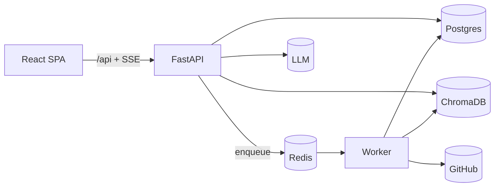

# Interview Defense Guide

> **Audience:** you, before an SDE-1/SDE-2 interview, defending CodeSensei.
> **Scope:** elevator pitches, whiteboard-ready explanations of HLD/LLD/RAG/Auth/Deploy,
> and **190 questions with ideal answers** across Backend, System Design, AI/RAG,
> Security, DevOps, and Database — plus follow-ups.
>
> **How to use it:** internalize the pitches + the 5 explanations first; they cover 80% of
> a conversation. Then drill the Q&A. Every answer is honest about tradeoffs — interviewers
> reward "here's the limitation and the fix" over "it's perfect".

---

## Part A — Elevator pitches

### 30-second version
> "CodeSensei is a GitHub repository intelligence platform. You give it a public repo URL;
> it clones and parses the code with tree-sitter into a graph of files, symbols and
> dependencies, computes complexity, dead-code and impact analysis, and lets you ask
> natural-language questions answered by an LLM grounded in the actual code — with
> file-and-line citations. It's a FastAPI backend, a React frontend, and an async worker,
> all containerized, runnable on a free tier."

### 1-minute version
> Add: "The key design decision is decoupling: analysis is slow and CPU-bound, so the API
> enqueues a job to Redis and returns immediately while a separate worker clones, parses,
> persists to Postgres, and embeds code into ChromaDB. Progress streams to the browser over
> Server-Sent Events. The AI uses RAG — retrieve the top-k relevant code chunks, then prompt
> the model — instead of fine-tuning, so answers are grounded, always current, and citable.
> Auth is GitHub OAuth with a JWT in an httpOnly cookie, and access control is IDOR-safe.
> It's fully tested with a hermetic suite — 69 tests that need no external services."

### 5-minute version (structured)
1. **Problem:** reading unfamiliar code is slow; static tools are dense, chat assistants
   hallucinate. CodeSensei combines deterministic analysis with grounded AI.
2. **Architecture:** four stateless units (frontend, backend, worker, engine library) +
   three stores (Postgres, Redis, ChromaDB). Queue decoupling is the spine.
3. **Analysis pipeline:** clone (shallow) → walk (.gitignore-aware, capped) → parse
   (tree-sitter, threadpool) → persist (batched) → index (best-effort embeddings).
4. **AI/RAG:** symbol-aware chunking → embeddings → top-k cosine retrieval → low-temp
   prompt → streamed tokens + citations.
5. **Cross-cutting:** OAuth+JWT cookies, CSRF state, IDOR-safe authz, Prometheus metrics,
   structured logs, health probes, rate limiting.
6. **Honesty:** I know the limits — ephemeral ChromaDB, in-memory rate limiter, no shared
   clone cache — and I have a roadmap to fix each. That self-awareness is the point.

---

## Part B — Whiteboard explanations

### B1. Explain the HLD

"Stateless API and worker; stores hold state. The API never does heavy work inline — it
delegates to the worker via a queue and streams progress back. This keeps latency low and
lets each tier scale independently." Detail: [../architecture/high-level-design.md](../architecture/high-level-design.md).

### B2. Explain the LLD
"Layering is `routers → services → models`. Routers own HTTP contracts and call
`verify_repository_access`; services own business logic; models are SQLAlchemy. The data
model is a graph: `users → repositories → {analysis_jobs, source_files}`,
`source_files → {symbols, dependencies, metrics}`, all UUID PKs with cascade deletes."
Detail: [../architecture/low-level-design.md](../architecture/low-level-design.md).

### B3. Explain the RAG pipeline
"Index time: chunk code around symbol boundaries (target 60 lines, max 200, 6 overlap),
embed with the configured provider, store per-repo in ChromaDB. Query time: embed the
question, top-k=8 cosine retrieval, assemble within an 8192-token budget, prompt at
temperature 0.2, stream tokens, emit citations from chunk metadata." Detail:
[../ai/rag-pipeline.md](../ai/rag-pipeline.md).

### B4. Explain Auth
"GitHub OAuth with a random `state` cookie for CSRF. On callback I verify state, exchange
the code, upsert the user, and set an HS256 JWT in an httpOnly, secure, samesite=lax
cookie. Authorization: owners get everything, public repos are read-only to others, and an
anonymous request for a private repo gets 404 — not 403 — to avoid leaking existence."
Detail: [../security/threat-model.md](../security/threat-model.md).

### B5. Explain Deployment
"Four containers via Docker Compose on a single VM; Postgres and Redis are managed free
tiers (Neon, Upstash); LLM/embeddings are Groq/HuggingFace or local Ollama. TLS at a
reverse proxy; health via /healthz and /readyz; rollback by repinning the previous
immutable image." Detail: [../deployment/README.md](../deployment/README.md).

---

## Part C — Backend (50)

**1. Why FastAPI over Flask/Django?** Async-first (ASGI) fits an I/O-bound API; Pydantic
v2 validation + automatic OpenAPI; type-driven. Django is heavier than needed; Flask lacks
native async/validation.

**2. Why async in the API?** It serves many concurrent connections (SSE streams, DB/Redis
I/O) efficiently on one process by not blocking on I/O.

**3. Why is the worker synchronous?** It's CPU-bound (tree-sitter, git) and processes one
job at a time; an event loop adds complexity with no benefit. Parallelism comes from a
ThreadPool over files (ADR-006).

**4. How do you avoid blocking the event loop in AI calls?** `AIService` wraps the sync
`RagChain` with `asyncio.to_thread`, so embedding/LLM work runs off the loop.

**5. What does `202 Accepted` mean here?** The analysis request was accepted and queued;
the result isn't ready. The client then subscribes to SSE for progress.

**6. How is streaming implemented?** Server-Sent Events via `sse-starlette` — one-way
server→client token/progress streams over plain HTTP.

**7. SSE vs WebSockets — why SSE?** Streaming is one-directional; SSE is simpler,
proxy-friendly, auto-reconnects. WebSockets' bidirectionality is unused (ADR-002).

**8. How does Nginx handle SSE?** `proxy_buffering off` and a long read timeout so events
flush immediately and long-lived streams aren't cut.

**9. How do you validate input?** Pydantic v2 schemas at the boundary — types, lengths,
enums. Internal calls trust validated data.

**10. How are settings managed?** `pydantic-settings` `Settings` loads defaults from
`shared/config/defaults.py`, overridden by env, exposing derived properties (DSNs, flags).

**11. What's the dependency-injection story?** FastAPI `Depends` — `get_optional_user`,
`get_current_user`, `verify_repository_access`, DB session. Tests override these.

**12. How do you paginate?** `GET /repositories` takes `page`/`page_size` (+ `status`
filter), owner-scoped, with indexed columns backing it.

**13. How do you structure errors?** Proper HTTP codes (401/403/404/429/422), with 404 for
IDOR cases; FastAPI returns structured JSON.

**14. Why UUID primary keys?** Non-enumerable, safe to expose, generated client/server-side
without coordination, good for distributed systems.

**15. Downsides of UUIDs?** Larger than ints; random UUIDs hurt index locality. Acceptable
at this scale; UUIDv7 would help if it mattered.

**16. How do you prevent N+1 queries?** Targeted queries/joins in services; denormalized
counters on `repositories` avoid per-row aggregation on list views.

**17. How are long jobs bounded?** `JOB_TIMEOUT=1800s`, clone timeout 300s, file/size caps;
RQ kills runaway jobs.

**18. Retry strategy?** `tenacity` for transient external calls; job-level `RETRY_MAX=3`.

**19. How is progress reported?** `DbProgressReporter` writes `analysis_jobs.progress`
(0–100) throttled every 25 files; SSE reads the row.

**20. Why throttle progress writes?** To avoid hammering Postgres on every file; 25-file
granularity is smooth enough for a UI.

**21. How do you handle partial failure in indexing?** Best-effort: catch, log, and still
mark the job SUCCEEDED with degraded AI. Core analysis is unaffected.

**22. Idempotency of analysis?** Unique constraints (`repository_id,path`;
`from,to,kind,symbol`) plus re-persist logic keep re-analysis from duplicating.

**23. How is the API documented?** Auto-generated OpenAPI/Swagger at `/docs` from Pydantic
+ type hints.

**24. Where does business logic live?** In services, not routers — routers only frame HTTP
and enforce access.

**25. How do you keep backend & worker config in sync?** A shared `defaults.py` both import;
one source of truth (ADR-013).

**26. How do you handle CORS?** `cors_origins` derived from config; restricted to the known
frontend origin.

**27. What's the rate-limit implementation?** In-memory sliding 60s window per IP, health
exempt, 429 + Retry-After. Honest limitation: not global across replicas (ADR-009).

**28. How would you make rate limiting distributed?** Move counters to Redis (token bucket
/ sliding window) keyed by IP/user.

**29. How do you stream LLM tokens to the client without buffering?** Async generator
yielding SSE events; Nginx buffering disabled end-to-end.

**30. How do you cancel an in-flight analysis?** Job has a `CANCELLED` status; RQ supports
cancellation; the state machine handles terminal transitions.

**31. How are timestamps handled?** Every table has `created_at`/`updated_at`; job rows add
`queued_at/started_at/completed_at`.

**32. How do you serialize enums?** SQLAlchemy `Enum` columns ↔ Pydantic enums; stable
string values in the API.

**33. Why separate `metrics` into its own 1:1 table?** Keeps wide metric columns off the
hot `source_files` row and lets metrics be indexed independently.

**34. How do you handle large responses (graphs)?** Return `{nodes, edges}` computed from
indexed tables; cap/aggregate where needed; client renders with Cytoscape.

**35. How is the health check meaningful?** `/healthz` = process alive; `/readyz` = checks
DB/Redis/etc. reachable. Different probes for different questions.

**36. What happens on a malformed repo URL?** Pydantic + URL validation reject it (only
github.com public repos accepted) before any work.

**37. How do you avoid leaking secrets in logs?** Structured logging of explicit fields;
secrets never logged; `.env` gitignored.

**38. How do you test endpoints without a DB/Redis?** Hermetic fixtures: SQLite +
fakeredis + FakeJobDispatcher + dependency overrides (69 tests).

**39. How do you ensure type safety?** `mypy --strict` in CI; everything annotated.

**40. What's your migration tool?** Alembic; each schema change is a reversible revision;
expand/contract for zero downtime.

**41. How do you handle concurrent analyses of the same repo?** `UNIQUE(owner_id,url,branch)`
de-dupes the repo row; jobs are tracked per repo. (Clone caching is a known gap.)

**42. Why batch DB writes in the worker?** Fewer round-trips; one transaction per repo for
consistency and speed.

**43. How do you expose metrics?** `prometheus-client` at `/metrics` with counters and a
latency histogram.

**44. How do you correlate logs for one request?** `X-Request-ID` injected by middleware,
attached to every log line, returned to the client.

**45. What's the difference between `get_optional_user` and `get_current_user`?** Optional
never raises (returns None for anonymous, enabling public reads); current raises 401.

**46. How would you add a new insight endpoint?** schema → router (with
`verify_repository_access`) → service querying metrics/symbols → tests → frontend hook.

**47. Why Pydantic v2 specifically?** Faster (Rust core), stricter, better typing; aligns
with FastAPI.

**48. How do you handle file encoding issues during parsing?** `chardet` sniffs encoding;
binaries skipped; undecodable files excluded.

**49. What's your approach to backpressure?** File/size/count caps + job timeout + worker
concurrency bound the work; queue absorbs bursts.

**50. Biggest backend weakness?** The in-memory rate limiter and worker-tested-on-SQLite
gap. Both have clear fixes (Redis limiter, PG CI job).

---

## Part D — System Design (50)

**1. Walk me through the architecture.** (Use Part B1.) Stateless API+worker, queue
decoupling, three stores, SSE streaming.

**2. Why decouple analysis behind a queue?** Long CPU/IO work can't block HTTP; queue gives
async processing, retries, progress, and independent scaling (ADR-001).

**3. What if the worker dies mid-job?** The job stays RUNNING; RQ timeout/retry re-runs it;
on restart the pipeline re-derives state (idempotent-friendly writes).

**4. How do you scale the API?** Stateless → N replicas behind a load balancer. Caveat: the
in-memory rate limiter becomes N× until moved to Redis.

**5. How do you scale workers?** Add worker containers; all pull from the same Redis queue.
Caveat: no shared clone cache yet.

**6. Where's the bottleneck?** Analysis throughput (clone+parse+embed) and, at scale, the
ephemeral vector store and non-distributed limiter.

**7. How do you handle a 50k-file monorepo?** Caps truncate at 5000 files; I'd surface a
"partial analysis" signal and add incremental/diff-based analysis.

**8. How does progress reach the browser reliably?** SSE with auto-reconnect; progress is
persisted in the DB so a reconnect resumes from current state.

**9. Why Postgres for a graph?** Relational + indexes is sufficient at this scale; one
fewer store than Neo4j; transactions and cascade deletes for free (ADR-005).

**10. When would you switch to a graph DB?** If transitive queries dominate and profiling
shows app-side walks are too slow on large graphs.

**11. How do you compute impact analysis?** Reverse-dependency walk over the `dependencies`
table from the changed file; return transitively affected files.

**12. How do you detect cycles?** Graph traversal over dependencies; report strongly
connected components.

**13. CAP-wise, what are you?** Effectively CP for the system-of-record (Postgres); AI index
is AP-ish and disposable.

**14. How do you keep the AI index consistent with code?** Re-index on analysis; same
embedding model at index and query time; re-index on model change.

**15. What's your caching strategy?** Redis for transient cache; React Query on the client;
denormalized counters reduce recompute.

**16. How do you handle thundering herd on a popular repo?** De-dupe by repo identity;
(future) shared clone cache + single-flight per repo+commit.

**17. How do you bound cost?** Free-tier providers; caps on repo size/files; low LLM
temperature/short context; best-effort indexing.

**18. How do you stream tokens at scale?** Each SSE connection is cheap; the LLM call is the
real cost; horizontal API scaling + provider quotas govern it.

**19. What's the failure isolation story?** AI failures degrade only chat; analysis is
independent; partial failure, not total.

**20. How do you do zero-downtime deploys?** Immutable images, rolling replicas,
expand/contract migrations, health-gated readiness.

**21. How do you roll back?** Repin the previous image tag and `up -d`; Alembic downgrade if
schema changed.

**22. How would you add multi-tenancy?** Org/team entities, tenant-scoped queries, per-tenant
vector collections, RBAC, per-tenant rate limits (Stage 3 roadmap).

**23. How do you shard the vector store?** Per-repo collections already isolate; shard by
repo/tenant across nodes or use a managed vector DB.

**24. How do you handle GitHub rate limits on cloning?** Shallow clones; (future) clone
cache; backoff/retry with tenacity.

**25. What's your data retention policy?** Cascade delete on repo removal; ephemeral vectors;
managed DB snapshots for backups.

**26. How do you ensure idempotent job processing?** Unique constraints + status state
machine; re-running a job re-derives the same persisted state.

**27. How do you observe the system?** Metrics (Prometheus), logs (structlog JSON + request
IDs), health probes; alerting is a documented gap to ship as code.

**28. What SLOs would you set?** API p95 latency, 5xx error rate, worker job success ratio,
`/readyz` uptime.

**29. How do you load-test it?** Locust/k6 against read endpoints + concurrent analyses;
currently a documented gap (no gate yet).

**30. How would you add search across repos?** Index symbols/files in Postgres (or a search
engine) and/or cross-repo vector collections; careful with tenant isolation.

**31. Why SSE polling the DB for progress instead of pub/sub?** Simplicity at current scale;
Redis pub/sub is the upgrade if polling pressure grows.

**32. How do you handle slow LLM providers?** Streaming hides latency; timeouts + error
events; fallback to local Ollama.

**33. What's the single point of failure?** Postgres (system of record). Mitigate with a
managed HA tier + tested backups.

**34. How do you do capacity planning?** Per-provider free limits documented; scale by
adding replicas/workers and upgrading managed tiers.

**35. How do you prevent abuse?** Rate limiting, size/file caps, auth required for writes,
job timeouts.

**36. How would you support private repos?** Expanded OAuth scopes + encrypted token storage
+ per-user clone credentials (roadmap Stage 2).

**37. How do you handle schema evolution safely?** Expand/contract Alembic migrations; deploy
code and schema independently.

**38. What's the read/write split?** Reads are indexed Postgres queries; writes are batched
in the worker; read replicas are the scaling lever.

**39. How do you keep the frontend fast?** Static SPA via Nginx/CDN; React Query caching;
SSE for live updates instead of polling.

**40. How do you design the dependency graph payload?** Nodes (files) + edges (typed
dependencies); cap/cluster for huge graphs; client lays out with dagre/cose.

**41. Trade-off: RQ vs Celery?** RQ is lighter, Redis-native, enough for a linear pipeline;
Celery's advanced routing is unneeded (ADR-010).

**42. Trade-off: monolith vs services here?** A pragmatic split — API and worker only —
gives async benefits without microservice sprawl.

**43. How do you guarantee a job runs exactly once?** RQ gives at-least-once; idempotent
writes make re-runs safe (effectively once in outcome).

**44. How do you handle a poisoned job (always fails)?** `RETRY_MAX` then terminal FAILED
with an error message; surfaced to the user.

**45. How would you add webhooks for auto re-analysis?** GitHub push webhook → enqueue
incremental analysis → diff-based re-parse (roadmap).

**46. What's the blast radius of an XSS?** Limited — token is in an httpOnly cookie, so it
can't be read by script; React escapes output; CSP/security headers add defense.

**47. How do you measure analysis quality?** Deterministic parts are testable; RAG needs an
eval set (question→expected citations) — a documented gap.

**48. How do you handle multi-region?** Stage 4+: regional API/worker pools, HA Postgres,
data residency, vector DB per region.

**49. What would you change if you restarted?** Persist Chroma from day one; Redis limiter
from day one; a clone cache abstraction; PG-backed worker tests.

**50. What's the strongest part of the design?** Clean decoupling + graceful degradation +
IDOR-safe authz + grounded, citable AI — and that the weaknesses are documented, not hidden.

---

## Part E — AI / RAG (30)

**1. What is RAG?** Retrieval-Augmented Generation: retrieve relevant context (code chunks)
and put it in the prompt so the model answers from real data, not memory.

**2. Why RAG over fine-tuning?** Grounded, always current, citable, cheap, model-agnostic;
fine-tuning is costly, stale per commit, and can't cite (ADR-004).

**3. How do you chunk code?** Symbol-aware: chunk around functions/classes; target 60 lines,
max 200, 6-line overlap, min 40 chars. Preserves semantic units.

**4. Why not fixed-size chunks?** They split functions mid-body and destroy meaning;
symbol-aware chunks retrieve coherent units.

**5. What embeddings do you use?** `all-MiniLM-L6-v2` (HuggingFace) or `nomic-embed-text`
(Ollama) or local — chosen by `EMBEDDING_PROVIDER`.

**6. Why must index/query embeddings match?** Vectors from different models aren't
comparable; mismatched models break retrieval. Changing the model requires re-indexing.

**7. What's your retrieval method?** Top-k=8 cosine similarity over a per-repo ChromaDB
collection.

**8. Why k=8?** Balances recall vs the 8192-token context budget; enough context without
drowning the model.

**9. How do you build the prompt?** Retrieved chunks (with file:line) + the question +
instruction to answer only from context; temperature 0.2.

**10. Why low temperature?** Factual, deterministic, less hallucination — right for code Q&A.

**11. How do citations work?** Each chunk carries `file_path` + `line_start/end`; the API
emits a `citations` SSE event so users can verify.

**12. Can it still hallucinate?** Yes — grounding + low temp reduce but don't eliminate it.
Citations let users catch it; that's the safety net.

**13. What's the biggest RAG weakness?** Retrieval quality — if the right chunk isn't
retrieved, the answer suffers. Cross-file reasoning is limited by what 8 chunks contain.

**14. How would you improve retrieval?** Hybrid (keyword+vector) search, re-ranking, and
**graph-aware retrieval** expanding along dependency edges using the graph I already store.

**15. How do you isolate repos in the vector store?** One ChromaDB collection per repo
(`repo_{id}`); a query can't cross repos; deleting a repo drops its collection.

**16. How do you stream answers?** Async generator yields tokens as SSE events; the sync RAG
chain runs via `asyncio.to_thread`.

**17. How do you handle LLM provider outages?** Emit an `error` event; analysis features are
unaffected; can switch to local Ollama.

**18. What's `AI_MAX_CONTEXT_TOKENS` for?** Caps how much retrieved context goes into the
prompt (8192); closest chunks first, excess dropped.

**19. How do you evaluate RAG quality?** Currently a gap; plan: a labeled set of
question→expected-citation pairs and measure retrieval hit-rate.

**20. Groq vs Ollama — when each?** Groq for fast free cloud inference (llama-3.3-70b);
Ollama (deepseek-coder) for private/offline.

**21. How big are embeddings batched?** `AI_EMBEDDING_BATCH_SIZE=16` — throughput vs memory.

**22. What if a repo is huge — does the index fit?** Caps bound it; per-repo collection;
large repos may need persistent/sharded vector storage.

**23. Why cosine distance?** Standard for normalized sentence embeddings; magnitude-invariant
semantic similarity.

**24. How do you keep answers within the repo's scope?** Per-repo collection + prompt
instruction + access control on the repo before retrieval.

**25. What metadata do chunks store?** chunk_id, file_path, language, line range,
symbol_name, symbol_kind, content — enough to cite and display.

**26. How would you add conversation memory?** The chat request carries `history`; I'd
manage context window and possibly summarize prior turns.

**27. How do you prevent prompt injection from repo content?** Treat retrieved code as data,
constrain the system prompt, and don't execute model output; a known general LLM risk to
monitor.

**28. What's the cost model of RAG here?** Embedding cost at index time (once per analysis) +
per-question LLM tokens; both bounded by caps and free tiers.

**29. Could you fine-tune later?** Yes — distilled per-language models are a Stage 5 idea,
complementing (not replacing) RAG.

**30. Why is grounding+citations a product differentiator?** It turns "plausible text" into
"checkable claims" — trust is the core UX problem for AI code assistants.

---

## Part F — Security (20)

**1. How does authentication work?** GitHub OAuth → HS256 JWT in an httpOnly cookie.

**2. Why httpOnly cookie not localStorage?** localStorage is readable by any XSS;
httpOnly cookies aren't readable by JS, shrinking token-theft risk (ADR-007).

**3. How do you handle CSRF?** OAuth `state` cookie (random, 600s) verified on callback +
`samesite=lax` cookies.

**4. What's the IDOR defense?** Anonymous requests for a private repo return **404**, not
403, so existence isn't leaked; ownership checked on every per-repo endpoint.

**5. Where's authorization enforced?** `verify_repository_access` — owner full, public
read-only, else 403/404.

**6. How is the JWT signed?** HS256 with `APP_SECRET_KEY` (≥32 chars enforced).

**7. Token revocation?** Logout clears the cookie; tokens otherwise valid until 7-day expiry;
rotating the secret mass-invalidates. A `jti` denylist is the upgrade.

**8. How do you protect against path traversal?** `safe_join` rejects `..` and backslashes
(cross-platform), keeping file ops inside the workspace.

**9. Why reject backslashes?** On Linux a backslash is a literal char; a naïve traversal
check could miss `..\..\` style inputs — closing a real cross-platform gap.

**10. SQL injection?** Parameterized SQLAlchemy queries; no string-built SQL.

**11. How are secrets managed?** Env vars, `.env` gitignored, `.env.example` documents shape;
CI secret scanning; secret manager in prod.

**12. What's the mock-auth risk?** It's a dev backdoor — hard-disabled in production via
`mock_auth_enabled = mock_auth and app_env != "production"`, with a startup log and unit
tests.

**13. How do you rate-limit abuse?** 60 req/min/IP sliding window, health exempt, 429 +
Retry-After. Not distributed yet (known).

**14. Cookie flags in production?** httpOnly, secure (HTTPS-only), samesite=lax, path=/.

**15. What OAuth scopes do you request?** `read:user user:email` — least privilege for
identity.

**16. How do you prevent XSS?** React output escaping + httpOnly cookies + security headers
(content-type-options, frame-options, referrer-policy) at Nginx.

**17. Threat model framework?** STRIDE — spoofing (signed JWT), tampering (signature),
repudiation (request-id logs), info disclosure (IDOR 404), DoS (limits), elevation (authz).

**18. Biggest security gap?** Non-distributed rate limiter + no token revocation list. Both
have concrete fixes (Redis limiter, jti denylist).

**19. How do you handle dependency vulnerabilities?** Pinned versions; plan a CI CVE/SBOM
gate (documented gap).

**20. Is data encrypted?** In transit via TLS at the edge; at rest via the managed DB
provider; customer-managed keys are an enterprise-stage item.

---

## Part G — DevOps (20)

**1. How is it containerized?** Multi-stage `python:3.12-slim` (backend/worker) and
`node:20-alpine`→`nginx:1.27-alpine` (frontend), all non-root.

**2. Why multi-stage builds?** Discard build deps → small, secure runtime images.

**3. Why non-root containers?** Limits blast radius if a container is compromised.

**4. What's in CI?** ruff, mypy --strict, hermetic pytest (69), frontend vitest + build,
image build + scan.

**5. Why hermetic tests in CI?** No external services → fast, deterministic pipelines.

**6. How do you deploy?** `docker compose pull && up -d` with immutable images on a VM behind
a TLS proxy.

**7. How do you roll back?** Repin previous image tag; Alembic downgrade if needed.

**8. How do you monitor?** Prometheus `/metrics`, structured logs, `/healthz`/`/readyz`.

**9. What metrics matter most?** 5xx rate, p95 latency, job success ratio, queue depth.

**10. How do you trace a request?** `X-Request-ID` across logs end-to-end.

**11. Liveness vs readiness?** Liveness = process up (`/healthz`); readiness = deps reachable
(`/readyz`).

**12. How do you handle config across envs?** 12-factor env vars; `APP_ENV` switches prod
behaviors (secure cookies, disabled mock auth).

**13. How do you back up data?** Managed Postgres snapshots + periodic `pg_dump`; Redis/Chroma
are disposable.

**14. How do you scale in production?** Replicate stateless API/worker; managed DB/Redis
tiers; (future) K8s HPA on queue depth.

**15. What's the resource footprint?** ~2 GB total (backend 512M, worker 768M, frontend
128M, chroma 512M) — fits a free VM.

**16. How do you secure the supply chain?** Pinned deps, image scanning, secret scanning,
non-root; SBOM gate planned.

**17. How do you handle zero-downtime schema changes?** Expand/contract Alembic + rolling
deploy.

**18. What's your incident runbook coverage?** Stuck jobs, empty AI, latency/429s, failed
analysis, backend won't start — all documented.

**19. Biggest ops gap?** Alerts/dashboards are documented but not shipped as code; load
testing isn't gated.

**20. How would you add autoscaling?** K8s HPA: API on CPU/latency, workers on Redis queue
depth.

---

## Part H — Database (20)

**1. Why PostgreSQL?** Relational integrity, transactions, mature indexing, JSON if needed,
great managed free tiers (Neon).

**2. Describe the schema.** users → repositories → {analysis_jobs, source_files};
source_files → {symbols, dependencies, metrics}. UUID PKs, timestamps, cascade deletes.

**3. Why cascade deletes?** Deleting a repo cleanly removes all derived rows in one op.

**4. What are your key uniqueness constraints?** `repositories(owner_id,url,branch)`,
`source_files(repository_id,path)`, `dependencies(from,to,kind,symbol)`, `metrics.file_id`.

**5. What indexes exist and why?** On FKs and filter columns: repo status/owner, symbol
(file_id,kind) and is_used, metrics cyclomatic/dead_code_score — to back list/insight queries.

**6. How do you store enums?** SQLAlchemy `Enum` columns (RepositoryStatus,
AnalysisJobStatus, SymbolKind, DependencyKind).

**7. Async vs sync drivers?** API uses `asyncpg`; worker uses `psycopg2` (sync) — matched to
each workload (ADR-006).

**8. How do you migrate schema?** Alembic revisions with up/down; expand/contract for zero
downtime.

**9. How do you avoid N+1?** Joins/targeted queries + denormalized counters on repositories.

**10. Why denormalize file_count/total_lines/languages?** Avoid aggregating on every list
request; written once at persist time.

**11. How do you model the dependency graph relationally?** `dependencies(from_file_id,
to_file_id, kind, symbol, line)` — directed typed edges between source_files.

**12. How do you query impact analysis?** Reverse walk from a file over `dependencies`;
bounded transitive expansion.

**13. Would recursive CTEs help?** Yes — for bounded transitive queries on large graphs
instead of app-side walks (a scaling improvement).

**14. How do you handle big BLOB-ish content?** Source content isn't stored wholesale in PG;
metadata + metrics live in PG, embeddings in ChromaDB.

**15. Connection pooling?** Async engine pool in the API; managed DB connection limits
respected; worker uses its own sync pool.

**16. How do you ensure metric rows stay 1:1 with files?** Unique FK on `metrics.file_id`.

**17. Transaction strategy in the worker?** Batch insert within a transaction per repo for
consistency and throughput.

**18. How do you handle migrations in CI/CD?** `alembic upgrade head` on deploy; tested
upgrade+downgrade on a copy.

**19. What about read scaling?** Read replicas; the schema is index-covered for the common
queries.

**20. Database weakness today?** Worker integration is tested on SQLite, not Postgres —
DB-specific behavior is under-tested; fix with a PG CI job.

---

## Part I — Rapid-fire follow-ups (drill these)

| Q | A |
| --- | --- |
| "Prove the mock-auth backdoor can't open in prod." | `mock_auth_enabled = mock_auth and app_env != "production"`; unit-tested; startup log. |
| "What's the very first thing you'd fix?" | Persist ChromaDB — the AI index dying on restart is the worst demo risk. |
| "Three API replicas — real rate limit?" | 3×60/min, because the limiter is in-memory. Fix: Redis limiter. |
| "Why 404 not 403 for a stranger?" | Don't leak that the private repo exists (IDOR). |
| "How fresh are AI answers?" | As fresh as the last analysis; re-index reflects the current snapshot. |
| "Worst case latency for analysis?" | Bounded by 300s clone + 1800s job timeout + caps. |
| "What breaks if Postgres is down?" | Everything write/read — it's the system of record; reads of cached data may survive briefly. |
| "What breaks if Chroma is down?" | Only AI chat; analysis and graphs are fine. |
| "Why SSE not WebSockets again?" | One-way streams; simpler, proxy-friendly, auto-reconnect. |
| "Most impressive thing here?" | Grounded, citable RAG layered on deterministic analysis, with honest, documented limits. |

---

## Part J — Closing framing

When asked "what did you learn / what would you do differently", say:
> "I learned to make deliberate MVP tradeoffs and **write them down** rather than pretend
> they don't exist. If I restarted, I'd persist the vector store and make rate limiting
> distributed from day one, and I'd test the worker against Postgres in CI. The architecture
> — queue decoupling, RAG with citations, IDOR-safe authz — I'd keep exactly as is."

That answer demonstrates ownership, judgment, and self-awareness — which is what an SDE-1/2
interviewer is actually testing.

---

## Related documents

- [../architecture/high-level-design.md](../architecture/high-level-design.md)
- [../architecture/low-level-design.md](../architecture/low-level-design.md)
- [../ai/rag-pipeline.md](../ai/rag-pipeline.md)
- [../security/threat-model.md](../security/threat-model.md)
- [STAFF_ENGINEER_REVIEW.md](STAFF_ENGINEER_REVIEW.md) — know the weaknesses cold
