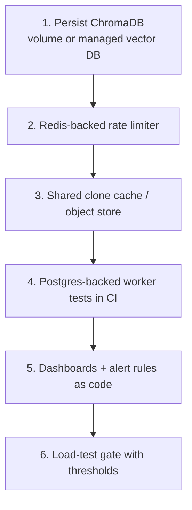

# Production Readiness Review

> **Audience:** anyone signing off (or refusing to sign off) a production release.
> **Scope:** an honest scorecard across the dimensions that matter, with evidence and
> gaps. This is a *review*, not marketing — gaps are stated plainly.
> Companion critique: [../reviews/staff-engineer-review.md](../reviews/staff-engineer-review.md).

---

## 1. Verdict

| | |
| --- | --- |
| **Overall** | ✅ Ready for **single-instance / portfolio / small-team** production |
| **Not yet ready for** | High-scale multi-replica SaaS without the fixes in §4 |
| **Top 3 blockers for scale** | ephemeral ChromaDB · in-memory rate limiter · no shared clone cache |

The system is **production-shaped**: containerized, observable, tested, secured, and
documented. It runs as a real product on a free VM. The honest caveat is that a couple of
deliberate MVP simplifications must be addressed before horizontal scale-out.

---

## 2. Scorecard

Scale: ✅ strong · 🟡 adequate with gaps · 🔴 needs work.

| Dimension | Score | Evidence | Gap |
| --- | --- | --- | --- |
| **Security** | ✅ | OAuth + httpOnly JWT + CSRF state + IDOR-safe 404 + path-traversal defense + non-root containers | In-memory rate limiter not global; no token revocation list |
| **Reliability** | 🟡 | Job retries, timeouts, graceful AI degradation, health probes | Single API/worker by default; ephemeral Chroma |
| **Scalability** | 🟡 | Stateless API+worker; queue decoupling; indexed schema | Rate limiter + clone cache + Chroma persistence block scale-out |
| **Observability** | ✅ | Prometheus metrics, structured JSON logs, request IDs, `/healthz` `/readyz` | No bundled dashboards/alert rules shipped |
| **Maintainability** | ✅ | Clear layering, ADRs, `mypy --strict`, ruff, centralized config | Two DB driver stacks; per-language parser upkeep |
| **Testing** | 🟡 | 69 hermetic tests, IDOR matrix, config-gate unit tests | Worker tested on SQLite not PG; thin RAG/E2E/perf coverage |
| **Performance** | 🟡 | Async API, threadpool parse, batched writes, caps | No load-test gate; unknown ceilings |
| **Operability** | ✅ | Compose stacks, rollback via immutable images, runbooks | Manual scaling; no autoscaler |
| **Documentation** | ✅ | This suite (HLD/LLD/ADR/security/ops/reviews) | — |

---

## 3. Evidence by dimension

### Security ✅
- GitHub OAuth with CSRF `state` cookie (600s).
- JWT HS256 in `httpOnly`, `secure`-in-prod, `samesite=lax` cookie.
- `verify_repository_access`: owner/public/`403`/IDOR-safe `404`.
- `safe_join` rejects `..` and backslashes (cross-platform).
- Mock auth hard-disabled in production (`mock_auth_enabled` gate) + unit-tested.
- Non-root container users; parameterized ORM queries; Pydantic validation at the edge.
- Detail: [../security/threat-model.md](../security/threat-model.md).

### Reliability 🟡
- Jobs: `RETRY_MAX=3`, `JOB_TIMEOUT=1800s`, clone timeout 300s.
- **Graceful degradation:** indexing failure → job still `SUCCEEDED`, AI degraded only.
- Health endpoints separate liveness (`/healthz`) from readiness (`/readyz`).
- Gap: default single instances; Chroma loss on restart (availability of AI feature).

### Scalability 🟡
- API + worker are stateless → replicate horizontally.
- Queue fans work out across workers; schema is index-covered.
- Gaps (the real ones): in-memory rate limiter (ADR-009), no shared clone cache,
  ephemeral Chroma (ADR-011).

### Observability ✅
- Metrics: `http_requests_total`, `http_request_duration_seconds`,
  `analysis_jobs_enqueued_total`, `ai_chat_requests_total`, `app_build_info`,
  worker `files_processed`/`chunks_indexed`/`job_outcome`.
- Structured JSON logs with `X-Request-ID` + `duration_ms`.
- Gap: dashboards/alert rules are described, not shipped as code.

### Testing 🟡
- 69 hermetic backend tests (SQLite + fakeredis + mock auth), `ruff` + `mypy --strict`.
- IDOR access-control matrix + config-gate unit tests.
- Gaps in §2 / [TESTING_STRATEGY.md](../testing/README.md#8-honest-gaps-what-is-not-well-covered).

---

## 4. Must-fix-before-scale (prioritized)

| # | Fix | Why it's blocking | Effort |
| --- | --- | --- | --- |
| 1 | Persist Chroma | AI feature resets on every restart | S |
| 2 | Distributed rate limiter | limit becomes N× with N replicas | S–M |
| 3 | Shared clone cache | duplicate clones waste time/bandwidth at scale | M |
| 4 | PG-backed worker tests | SQLite hides enum/constraint behavior | S |
| 5 | Alerts/dashboards as code | metrics exist but nobody's watching | S |
| 6 | Load testing | ceilings unknown | M |

---

## 5. Go-live checklist

**Infrastructure**
- [ ] HTTPS terminating proxy in front; SSE not re-buffered
- [ ] `APP_ENV=production`; `APP_SECRET_KEY` ≥ 32 chars, from secret manager
- [ ] Managed Postgres + Redis provisioned; `/readyz` green
- [ ] OAuth app callback URL matches the public origin

**Security**
- [ ] `MOCK_AUTH` not relied upon (and ignored in prod regardless)
- [ ] Secrets not in git; rotation plan for `APP_SECRET_KEY`
- [ ] Rate limiting active; size/file caps in place

**Reliability/Operability**
- [ ] Liveness/readiness probes wired
- [ ] DB backup taken **and** test-restored
- [ ] Runbooks reviewed ([../operations/runbooks.md](../operations/runbooks.md))
- [ ] Rollback path verified (previous image tag)

**Observability**
- [ ] Prometheus scraping `/metrics`
- [ ] Alerts on 5xx rate, p95 latency, worker failure ratio, `/readyz`

---

## 6. Risk register (top items)

| Risk | Likelihood | Impact | Severity | Mitigation |
| --- | --- | --- | --- | --- |
| Chroma reset wipes AI index | High (on restart) | Medium (AI only) | 🟡 | Persist Chroma (#1) |
| Rate limiter ineffective at scale | Medium | Medium | 🟡 | Redis limiter (#2) |
| Postgres outage | Low | High (full outage) | 🟡 | Managed HA tier + backups |
| LLM provider throttling | Medium | Low–Med (AI only) | 🟢 | Local Ollama / paid tier |
| Large monorepo truncated | Medium | Low | 🟢 | Documented caps; raise limits on bigger host |

---

## 7. Sign-off

| Reviewer role | Question | Where answered |
| --- | --- | --- |
| Security | "Can a stranger read a private repo?" | No — IDOR-safe `404` ([security doc](../security/threat-model.md)) |
| SRE | "Can I see and recover from failures?" | Yes — metrics/logs/runbooks ([ops doc](../operations/runbooks.md)) |
| Architect | "Will it scale, and what blocks it?" | Yes, with §4 fixes ([HLD](../architecture/high-level-design.md)) |
| Eng manager | "Is it maintainable?" | Yes — ADRs, types, tests, docs |

**Recommendation:** approve for single-instance/small-team production now; gate
multi-replica scale-out on the §4 fixes.

---

## 8. Related documents

- [../reviews/staff-engineer-review.md](../reviews/staff-engineer-review.md) — the unfiltered critique
- [../reviews/architecture-review.md](../reviews/architecture-review.md) — original limitations notes
- [DEVOPS_AND_OPERATIONS.md](DEVOPS_AND_OPERATIONS.md) — operating it
- [../overview/future-roadmap.md](../overview/future-roadmap.md) — where the fixes land
