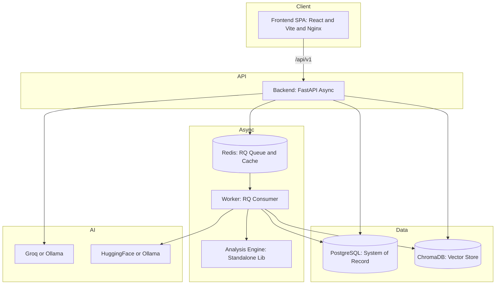

# Architecture Summary

A one-page technical overview. For the full treatment see [architecture/](../architecture/).

## Services

CodeSensei is a small distributed system of independently deployable services:



| Service | Path | Runtime | Scales by |
| --- | --- | --- | --- |
| Frontend | [frontend/](../../frontend/) | nginx serving a static SPA build | CDN / replicas (stateless) |
| Backend | [backend/](../../backend/) | uvicorn (FastAPI) | horizontal replicas (stateless) |
| Worker | [worker/](../../worker/) | RQ `SimpleWorker` burst loop | more worker processes/containers |
| Analysis Engine | [analysis-engine/](../../analysis-engine/) | imported library (not a service) | parallel parse workers per job |
| PostgreSQL | container or Neon | `postgres:16` | vertical / read replicas |
| Redis | container or Upstash | `redis:7` | managed |
| ChromaDB | container | `chromadb/chroma:0.5.5` | vertical / per-collection |

## Layered backend (Clean Architecture-ish)

```
HTTP (FastAPI routers)  ──►  Services (business logic)  ──►  Repositories (data access)  ──►  Models (SQLAlchemy ORM)
        │                          │                                                            │
        └── Pydantic schemas       └── DI container (core/dependencies.py)                      └── PostgreSQL
```

- **Routers** (`app/api/v1/endpoints/*.py`) — thin; parse input, call a service, shape output.
- **Services** (`app/services/*.py`) — all business logic; never touch FastAPI.
- **Repositories** (`app/repositories/*.py`) — all SQL; generic CRUD base + specialized queries.
- **Models** (`app/models/*.py`) — SQLAlchemy ORM with UUID PKs and timestamp mixins.
- **DI** (`app/core/dependencies.py`) — wires sessions → repositories → services via `Annotated[T, Depends(...)]`.

See [backend/README.md](../backend/README.md) and [architecture/low-level-design.md](../architecture/low-level-design.md).

## The five processing pipelines

| Pipeline | Trigger | Where | Doc |
| --- | --- | --- | --- |
| **Repository analysis** | submit / refresh | worker → analysis engine | [architecture/analysis-pipeline.md](../architecture/analysis-pipeline.md) |
| **Dependency graph** | analysis + graph page | engine builder → `dependencies` table → frontend graph model | [features/dependency-graph.md](../features/dependency-graph.md) |
| **Architecture diagram** | architecture page | `architecture_service` classifies layers → Mermaid | [features/architecture-explorer.md](../features/architecture-explorer.md) |
| **AI chat (RAG)** | chat | backend `ai_service` → ChromaDB → LLM (SSE) | [ai/rag-pipeline.md](../ai/rag-pipeline.md) |
| **Session management** | chat sessions | `chat_session_service` + `chat_sessions`/`chat_messages` | [features/ai-chat.md](../features/ai-chat.md) |

## Cross-cutting concerns

| Concern | Implementation |
| --- | --- |
| **Auth** | GitHub OAuth → HS256 JWT in httpOnly `codesensei_session` cookie; mock-auth in dev |
| **Authz / IDOR** | `verify_repository_access` + ownership checks in services; public/private gating |
| **Async jobs** | RQ queue; unique active-job index; heartbeat + background reaper for crash recovery |
| **Streaming** | SSE for analysis progress and chat tokens (custom POST-capable client on the frontend) |
| **Caching** | Redis for query results; TanStack Query on the client |
| **Config** | Pydantic v2 `BaseSettings`; ~60 env vars; production hardening guards |
| **Observability** | Prometheus `/metrics`, optional OpenTelemetry tracing, structlog JSON logs |
| **Rate limiting** | sliding-window per-IP middleware (exempts health endpoints) |

## Why this architecture (one-liners)

- **Worker + queue** because analysis is slow (clone + parse) and must not block the API.
- **Vector DB separate from Postgres** because RAG retrieval is a different access pattern (ANN) than relational queries.
- **Standalone analysis engine** so the parsing logic is testable and reusable independent of the web stack.
- **Env-driven providers** so the same code runs locally (Ollama) and on free tiers (Groq + HuggingFace).

Full rationale with trade-offs and alternatives: [decisions/](../decisions/) and
[design-decisions.md](design-decisions.md).
