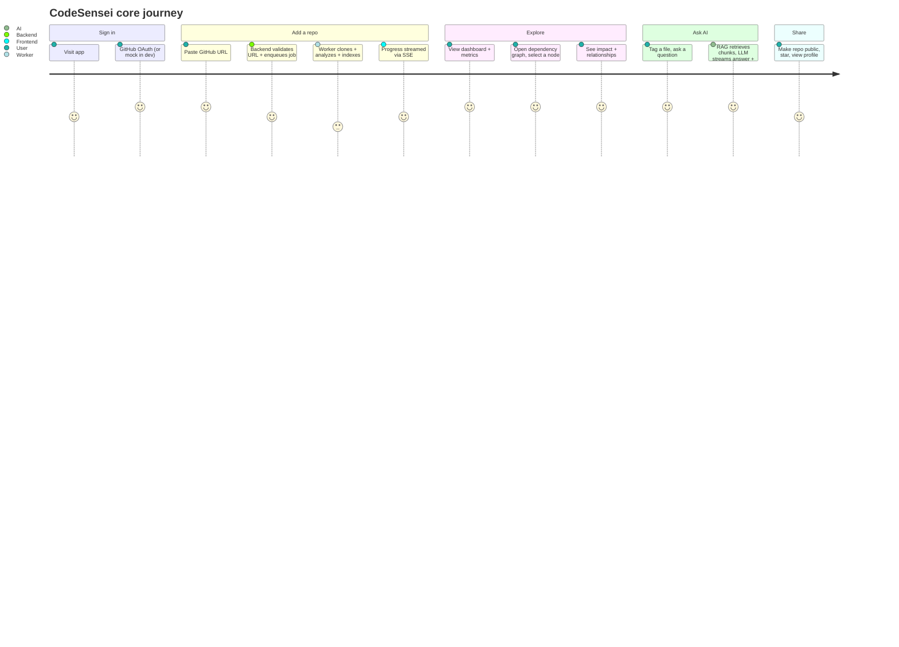

# Business Problem, Goals & Personas

## The problem

Understanding an unfamiliar codebase is slow and manual. When an engineer joins a team,
explores an open-source project, or returns to old code, they face the same questions:

- *Where does this functionality live?*
- *What depends on this file — what breaks if I change it?*
- *How is this project structured (layers, modules)?*
- *Which files are the most complex / risky?*
- *Is this symbol even used anywhere?*

Existing tools answer fragments of this (IDEs do go-to-definition, linters flag
complexity, GitHub shows file trees) but nothing combines **structural analysis** with
**natural-language Q&A grounded in the actual code**. Reading the code top-to-bottom
does not scale to large repositories.

## Why this project exists

CodeSensei exists to make a repository **explainable**. It treats a codebase as data:
parse it, structure it, index it, and put a conversational + visual interface on top so a
human can build a mental model in minutes instead of days. As a portfolio project, it
also exists to demonstrate the ability to design and ship a **complete distributed
system** with AI, on free infrastructure, to a production standard.

## Project goals

1. **Comprehension over correctness** — help users *understand* code, not grade it.
2. **Multi-language** — Python (native AST), plus JS/TS/Go/Rust/Java/C/C++/C#/Ruby via
   tree-sitter, with a regex fallback so nothing is unanalyzable.
3. **Grounded AI** — every chat answer is backed by retrieved source chunks and shows
   citations; no hallucinated file references.
4. **Zero-cost operability** — must run end-to-end on free tiers.
5. **Production shape** — async API, background workers, queue, vector store, migrations,
   observability, security hardening, CI.
6. **Low coupling** — swap any external provider (LLM, embeddings, DB, Redis, OAuth) by
   configuration, not code.

## User personas

### 1. "Onboarding Omar" — engineer joining a new team
- **Need:** understand a large unfamiliar service fast.
- **Uses:** AI chat ("explain `payment_service.py`", "what calls this?"), architecture
  view, dependency graph focus mode.
- **Success:** can make a safe first change within hours.

### 2. "Reviewer Riya" — tech lead / staff engineer
- **Need:** assess structure and risk of a repo.
- **Uses:** architecture layers, complexity rankings, dependency cycles, impact analysis.
- **Success:** identifies hot-spots and architectural smells quickly.

### 3. "Explorer Eli" — open-source contributor
- **Need:** evaluate and understand a repo before contributing.
- **Uses:** discovery hub, public repo views, AI chat, stars.
- **Success:** decides whether/where to contribute.

### 4. "Author Aanya" — the project owner (portfolio / interviews)
- **Need:** a system that demonstrates senior-level engineering breadth.
- **Uses:** the whole stack as a talking point; this `docs/` tree as the evidence.
- **Success:** can defend every design decision in an interview.

## High-level user journey

See [features/](../features/) for each step in depth and
[user-journey.md](user-journey.md) for the detailed request-by-request flow.
