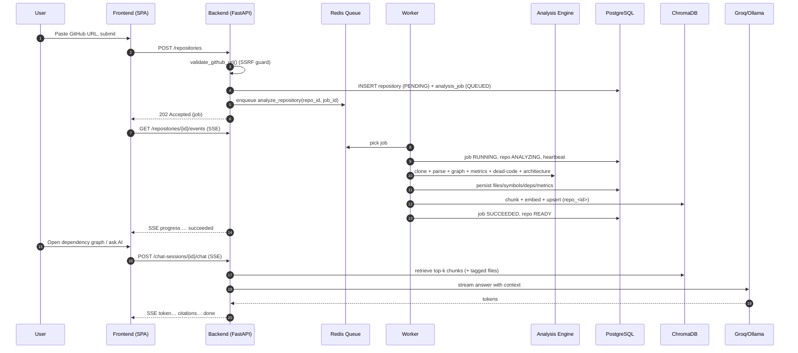

# Core Features & User Journey

A catalogue of every user-facing feature with a one-paragraph description and a pointer
to its deep-dive doc. Detailed per-feature documentation (workflow, backend, frontend,
tables, APIs, edge cases, security) lives in [features/](../features/).

## Feature catalogue

| # | Feature | Summary | Deep dive |
| --- | --- | --- | --- |
| 1 | **GitHub Login** | OAuth 2.0 Authorization-Code login; JWT session in an httpOnly cookie. A dev-only mock-auth mode auto-authenticates without GitHub. | [features/authentication.md](../features/authentication.md) |
| 2 | **Repository Submission** | Paste a GitHub URL (+ optional branch); the URL is validated (SSRF-safe), a repo row + analysis job are created, and a worker job is enqueued. | [features/repository-submission.md](../features/repository-submission.md) |
| 3 | **Repository Analysis** | Background worker clones, parses, builds graph/metrics/dead-code/architecture, persists rows, and indexes chunks for RAG. Progress is streamed over SSE. | [features/repository-analysis.md](../features/repository-analysis.md) |
| 4 | **Dependency Graph** | Interactive Cytoscape graph: cluster/expand folders, language filters, cycles-only, focus mode (incoming/outgoing, depth), directional highlighting, on-canvas zoom/fit, rich node inspector with impact + criticality. | [features/dependency-graph.md](../features/dependency-graph.md) |
| 5 | **Complexity** | Ranked files by cyclomatic complexity (responsive bar chart) plus a detail table (LOC, cognitive, functions, classes). | [features/insights.md](../features/insights.md) |
| 6 | **Dead Code** | Table of unused symbols with kind, location, confidence, and reason. | [features/insights.md](../features/insights.md) |
| 7 | **Architecture Explorer** | Files grouped into layers (controllers/services/repositories/models/…); Mermaid diagram + drill-down with the same node inspector. | [features/architecture-explorer.md](../features/architecture-explorer.md) |
| 8 | **Impact Analysis** | Pick a file → transitive dependents/dependencies, chain depths, and a 0–100 criticality score with a risk label. | [features/insights.md](../features/insights.md) |
| 9 | **AI Chat** | RAG chat grounded in the repo; streams tokens via SSE, returns numbered citations, supports tagging specific files as guaranteed context. | [features/ai-chat.md](../features/ai-chat.md) |
| 10 | **Chat Sessions** | Persistent, user-private conversations per repo: create, rename, delete, auto-titled; messages + citations + attached context saved. | [features/ai-chat.md](../features/ai-chat.md) |
| 11 | **Ask AI About a Node** | From the graph/architecture inspector, one-click prompts ("Explain this file", "Find potential risks", "Show impact of changes") tag the file and route into a chat session. | [features/dependency-graph.md](../features/dependency-graph.md) |
| 12 | **Public Repositories / Discover** | Toggle a repo public; browse a **repository-centric** hub (one card per `(url, branch)`, search/sort/paginate). Open a repo to see all its public analyses by different users. | [features/discover-and-social.md](../features/discover-and-social.md) |
| 13 | **Stars / Favorites** | Star/unstar any repo (idempotent); denormalized `star_count`; "Your stars" page. | [features/discover-and-social.md](../features/discover-and-social.md) |
| 14 | **User Profiles** | Public profile page per username with avatar, stats, and their public repositories. | [features/discover-and-social.md](../features/discover-and-social.md) |
| 15 | **Repository Refresh** | Re-trigger analysis; a unique active-job index prevents duplicate concurrent runs (returns `409` if one is already in flight). Re-submitting an already-analyzed repo offers Open/Refresh/Cancel instead of duplicating it. | [features/repository-analysis.md](../features/repository-analysis.md) |

## Detailed user journey (request-by-request)

For the technical pipeline behind step "clone + parse + …", see
[architecture/analysis-pipeline.md](../architecture/analysis-pipeline.md). For the RAG
flow behind "retrieve + stream", see [ai/rag-pipeline.md](../ai/rag-pipeline.md).
