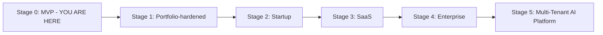
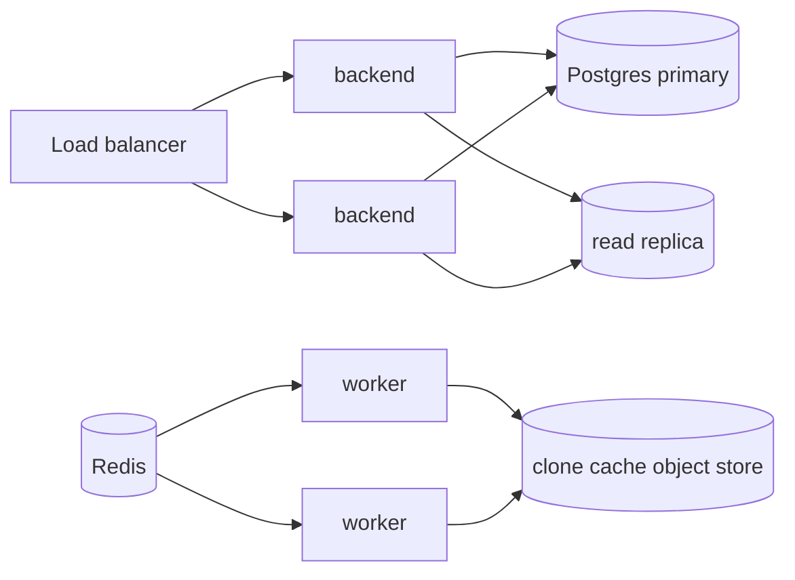
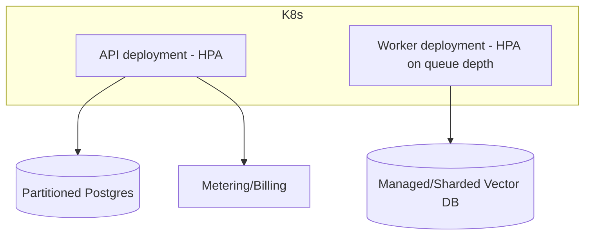
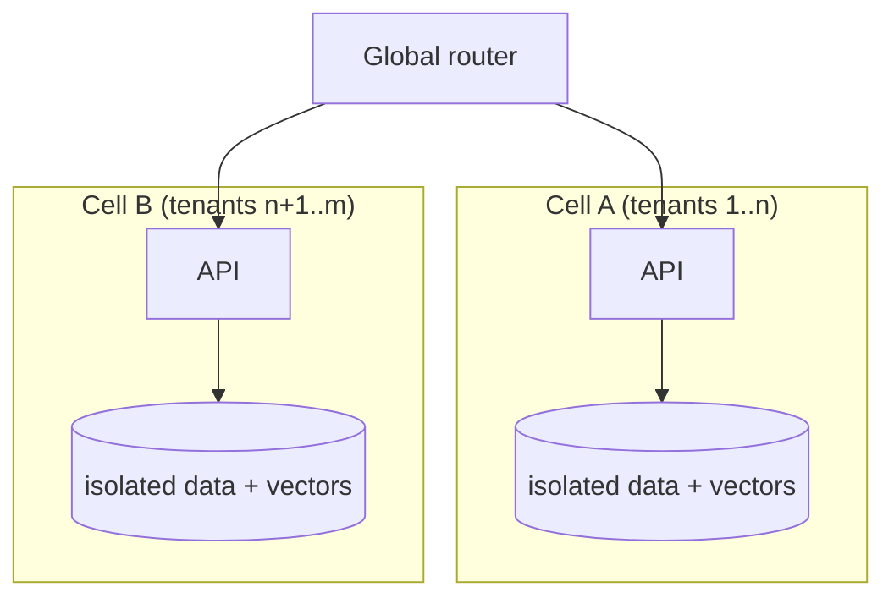

# Future Roadmap

> **Audience:** product/leadership and engineers planning evolution.
> **Scope:** a 5-stage growth path from "portfolio project" to "multi-tenant AI SaaS",
> each stage giving **Architecture · Infrastructure · Security · Team · Costs · Scaling**.
> Today's debt that seeds Stage 1 is in [../reviews/staff-engineer-review.md](../reviews/staff-engineer-review.md).

---

## Where we are today

Single-instance, free-tier, single-user ownership model, ephemeral AI index. Feature-
complete and documented, with known, bounded debt.

---

## Stage 1 — Portfolio-hardened (fix the known debt)

**Goal:** remove the embarrassing-in-a-demo issues; make it bulletproof for a single
instance.

| Dimension | Plan |
| --- | --- |
| **Architecture** | Persist ChromaDB (volume); surface "truncated analysis" signal; graceful empty-index readiness check |
| **Infrastructure** | Single VM + TLS proxy (Caddy); committed Prometheus alert rules + Grafana dashboard JSON |
| **Security** | Redis-backed distributed rate limiter; shorter JWT TTL + refresh or `jti` denylist |
| **Team** | 1 engineer |
| **Costs** | $0–5/mo (Oracle free VM or tiny VPS) |
| **Scaling** | Still single instance; vertical only |

**Exit criteria:** restart-safe AI; alerts fire; rate limit holds. Maps to the P0/P1 items
in [../operations/production-readiness-review.md](../operations/production-readiness-review.md#4-must-fix-before-scale-prioritized).

---

## Stage 2 — Startup (first real users)

**Goal:** support real, concurrent users and private repos.

| Dimension | Plan |
| --- | --- |
| **Architecture** | Shared clone cache (object store, keyed by repo+commit); incremental re-analysis (diff-based) instead of full re-clone; pluggable auth-provider interface |
| **Infrastructure** | 2–3 backend replicas behind a load balancer; 2 worker replicas; managed Postgres + Redis (paid tiers); CDN for the SPA |
| **Security** | Private-repo support (expanded OAuth scopes, encrypted token storage); CVE/SBOM gate in CI; secret manager |
| **Team** | 2–4 engineers; basic on-call rotation |
| **Costs** | ~$100–500/mo |
| **Scaling** | Horizontal API + workers; read replica for heavy queries |

---

## Stage 3 — SaaS (paying customers, teams)

**Goal:** a billable product with team accounts.

| Dimension | Plan |
| --- | --- |
| **Architecture** | Organizations + team membership; RBAC; usage metering; webhook-driven re-analysis on push; graph-aware + hybrid RAG retrieval; re-ranking |
| **Infrastructure** | Kubernetes; horizontal pod autoscaling for workers (queue-depth driven); managed vector DB (or sharded persistent Chroma); blue/green deploys |
| **Security** | SSO (Google/GitLab/SAML); audit logs; per-tenant data isolation; pen-test; rate limits per plan |
| **Team** | 5–10 engineers; dedicated SRE; security owner |
| **Costs** | ~$1k–5k/mo |
| **Scaling** | Autoscaled workers; partitioned Postgres; vector DB sharding |

---

## Stage 4 — Enterprise (large orgs, compliance)

**Goal:** sell to enterprises with compliance and self-host requirements.

| Dimension | Plan |
| --- | --- |
| **Architecture** | Self-hosted/air-gapped option (local Ollama embeddings + LLM); enterprise connectors (GitHub Enterprise, Bitbucket, self-hosted GitLab); fine-grained RBAC; data residency controls |
| **Infrastructure** | Multi-region; HA Postgres (Patroni/managed); disaster recovery with tested RTO/RPO; private networking |
| **Security** | SOC 2 / ISO 27001 posture; encryption at rest + in transit; customer-managed keys; SSO/SCIM; comprehensive audit trail |
| **Team** | 15–30 engineers; platform, security, and compliance teams |
| **Costs** | ~$10k–50k/mo + compliance overhead |
| **Scaling** | Multi-region active/active for API; regional worker pools |

---

## Stage 5 — Multi-Tenant AI Platform

**Goal:** a platform others build on; deep code intelligence as a service.

| Dimension | Plan |
| --- | --- |
| **Architecture** | Full multi-tenancy with strong isolation; plugin/extension API; fine-tuned/distilled code models per language; agentic workflows (auto-refactor suggestions, PR review bots) built on the graph + RAG core; public API + SDKs |
| **Infrastructure** | Global, cell-based architecture; GPU fleets for local inference; feature store; streaming ingestion of repo events at scale |
| **Security** | Tenant isolation guarantees; zero-trust; continuous compliance; model governance/eval gates |
| **Team** | 30+; ML platform, infra, security, DevRel |
| **Costs** | $100k+/mo |
| **Scaling** | Cell-based sharding by tenant; independent blast radii; capacity planning per cell |

---

## Cross-cutting evolution themes

| Theme | Stage 0 → 5 |
| --- | --- |
| **Vector store** | Ephemeral Chroma → persistent volume → managed/sharded → multi-region vector DB |
| **Auth** | GitHub-only → +private repos → SSO → SCIM/SAML → tenant-isolated identity |
| **Rate limiting** | In-memory → Redis → per-plan → per-tenant fairness |
| **RAG** | Top-k vector → graph-aware + hybrid + re-rank → fine-tuned models → agentic |
| **Compute** | 1 worker → replicas → HPA → GPU fleets/cells |
| **Data** | Single Postgres → read replicas → partitioned → multi-region HA |
| **Ops** | Compose → K8s → multi-region → cell-based |

---

## Near-term backlog (concrete next tickets)

1. Persist ChromaDB to a volume + readiness check for empty collections. *(P0)*
2. Redis-backed distributed rate limiter. *(P0)*
3. Postgres-service CI job for the integration suite. *(P1)*
4. Content-addressed clone cache. *(P1)*
5. Graph-aware retrieval (expand along dependency edges) + a small RAG eval set. *(P1)*
6. Commit Prometheus alert rules + Grafana dashboard. *(P2)*
7. Pluggable auth-provider interface (Google/GitLab seam). *(P2)*

---

## Related documents

- [../reviews/staff-engineer-review.md](../reviews/staff-engineer-review.md) — the debt these stages pay down
- [../operations/production-readiness-review.md](../operations/production-readiness-review.md) — must-fix-before-scale
- [../ai/rag-pipeline.md](../ai/rag-pipeline.md) — graph-aware retrieval idea
- [Future-Enhancements.md](Future-Enhancements.md) — earlier supporting reference
