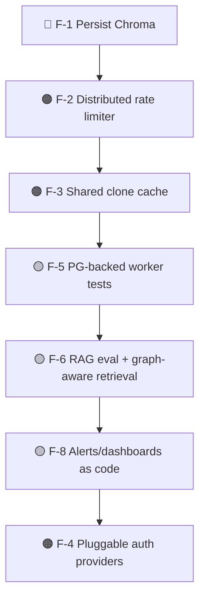

# Staff Engineer Review (Brutally Honest)

> **Purpose:** a no-flattery critique, as a skeptical staff/principal engineer would
> give in a design review. The goal is to find what's wrong, not to praise what's right.
> Each finding has **What / Why it matters / Impact / Severity / Recommended fix.**
>
> **Severity legend:** 🔴 critical · 🟠 high · 🟡 medium · 🟢 low.

---

## 0. Executive judgment

This is a **genuinely good SDE-1/SDE-2-level project** — it makes real architectural
choices (queue decoupling, RAG with citations, IDOR-safe authz) and defends them. It is
**not** a production SaaS, and a few decisions are MVP shortcuts dressed in production
clothing. The most damning single fact: **the AI feature's entire index disappears on
restart** because ChromaDB runs ephemeral by default. Everything else is fixable; that one
will embarrass you in a live demo if the container bounces.

If I were reviewing this for a promotion packet or a senior interview, I'd respect it.
If I were reviewing it as "can we put paying customers on it Monday?", the answer is no
until §1 items are fixed.

---

## 1. Critical & high-severity findings

### F-1 🔴 ChromaDB is ephemeral — the AI index is not durable
- **What:** free-tier compose runs Chroma with `IS_PERSISTENT=false`.
- **Why it matters:** restart/redeploy/crash → all embeddings gone. The headline "AI Q&A"
  feature silently returns empty until every repo is re-analyzed.
- **Impact:** broken demos; user-visible data loss of derived state; surprise re-index
  cost.
- **Severity:** 🔴 (it's the flagship feature).
- **Fix:** mount a persistent volume for Chroma, or move to a managed/persistent vector
  store. Add a readiness check that flags an empty collection for a `READY` repo.

### F-2 🟠 In-memory rate limiter is not distributed
- **What:** sliding-window counter lives in process memory.
- **Why it matters:** with N API replicas the real limit is N×60/min; restart resets it;
  it's trivially defeated by load-balancing across instances.
- **Impact:** ineffective abuse protection exactly when you scale (when you need it most).
- **Severity:** 🟠.
- **Fix:** Redis-backed limiter (token bucket / sliding window). Redis is already a
  dependency — there's no excuse at scale.

### F-3 🟠 No shared clone cache across workers
- **What:** each worker shallow-clones independently; nothing is shared or cached.
- **Why it matters:** re-analyzing the same repo, or scaling workers, re-clones every
  time — wasted bandwidth, disk, and time; GitHub rate limits loom.
- **Impact:** poor throughput economics at scale; duplicated work.
- **Severity:** 🟠.
- **Fix:** content-addressed clone cache on shared storage (object store / NFS), keyed by
  repo+commit; or analyze from a fetched tarball.

### F-4 🟠 Single OAuth provider, github.com-only, hard-wired
- **What:** identity is GitHub-only; repo validation accepts only `github.com` public
  repos.
- **Why it matters:** limits the addressable users and repos; a real product needs
  Google/GitLab and private repos behind appropriate scopes.
- **Impact:** product ceiling; not a bug, but a scope trap that's easy to ossify.
- **Severity:** 🟠 (product), 🟢 (security).
- **Fix:** abstract an auth-provider interface now (the seam is small) before more code
  assumes GitHub.

---

## 2. Medium-severity findings

### F-5 🟡 Worker is tested on SQLite, not PostgreSQL
- **What:** hermetic tests use SQLite; production is Postgres.
- **Why it matters:** enum handling, constraint semantics, `BigInteger`, concurrency, and
  index behavior differ. SQLite-green ≠ Postgres-green.
- **Impact:** a class of DB-specific bugs can't be caught in CI.
- **Severity:** 🟡.
- **Fix:** add a Postgres-service CI job that runs the integration suite against real PG.

### F-6 🟡 RAG quality is untested and structurally limited
- **What:** retrieval is top-k vector only; no re-ranking, no hybrid keyword search, no
  eval harness. Cross-file reasoning is at the mercy of what 8 chunks happen to contain.
- **Why it matters:** answer quality silently regresses with model/chunking changes; the
  dependency graph (which you already have!) isn't used to improve retrieval.
- **Impact:** the "intelligence" is shallower than the marketing implies.
- **Severity:** 🟡.
- **Fix:** add a small eval set (question → expected citations); add graph-aware retrieval
  expanding along `IMPORT`/`CALL` edges; consider hybrid search + re-rank.

### F-7 🟡 Graph algorithms run in the application, not the database
- **What:** impact/cycle analyses are app-side walks over the relational graph.
- **Why it matters:** fine now; for very large repos, transitive walks get expensive and
  chatty against Postgres.
- **Impact:** latency cliffs on big graphs.
- **Severity:** 🟡.
- **Fix:** recursive CTEs for bounded transitive queries, or materialized closure tables;
  revisit a graph DB only if profiling demands it.

### F-8 🟡 Observability exists but nobody's watching
- **What:** metrics/logs/health are implemented; dashboards and alert rules are documented
  but not shipped as code.
- **Why it matters:** unmonitored metrics are decoration. An outage is only "observable"
  if something alerts.
- **Impact:** slow incident detection.
- **Severity:** 🟡.
- **Fix:** commit Prometheus alert rules + a Grafana dashboard JSON to the repo.

### F-9 🟡 Hard file/repo caps silently truncate large repos
- **What:** 5000 files, 2 MB/file, 500 MB repo caps; walk simply stops.
- **Why it matters:** a large monorepo is analyzed *partially* and the user may not
  realize the result is incomplete.
- **Impact:** misleading analysis on big repos.
- **Severity:** 🟡.
- **Fix:** surface a "truncated: analyzed X of Y files" signal in the UI/response.

### F-10 🟡 No token revocation; 7-day JWT TTL
- **What:** logout clears the cookie but the JWT remains valid until expiry if captured.
- **Why it matters:** a stolen token is usable for up to 7 days; only `APP_SECRET_KEY`
  rotation mass-invalidates.
- **Impact:** longer exposure window after token theft.
- **Severity:** 🟡.
- **Fix:** shorter TTL + refresh, or a Redis denylist of revoked `jti`s.

---

## 3. Low-severity / polish

| # | Finding | Severity | Fix |
| --- | --- | --- | --- |
| F-11 | Two DB driver stacks (asyncpg + psycopg2) to maintain | 🟢 | Accepted tradeoff (ADR-006); document clearly (done) |
| F-12 | Per-language parser adapters are ongoing upkeep | 🟢 | Golden-file tests per language |
| F-13 | Shared `defaults.py` couples backend+worker | 🟢 | Intentional; keep it config-only |
| F-14 | No load/perf gate; ceilings unknown | 🟢→🟡 | Add a k6/Locust smoke threshold |
| F-15 | SSE relies on polling the job row for progress | 🟢 | Fine at this scale; revisit with pub/sub if needed |
| F-16 | Free LLM (Groq ~30 rpm) will `429` under light concurrency | 🟢 | Document; local Ollama / paid tier |

---

## 4. What's genuinely good (credit where due)

Not everything is a flaw — these are above the bar for the level:

- **Queue-decoupled async pipeline** with progress streaming — the right core decision.
- **IDOR-safe authorization** returning `404` to strangers — many seniors get this wrong.
- **Citations in RAG** — converts "plausible" into "verifiable"; the right product instinct.
- **Hermetic tests** (SQLite + fakeredis + mock auth) — fast, deterministic, runnable
  anywhere; `mypy --strict` + warnings-as-errors.
- **Graceful AI degradation** — indexing failure doesn't fail the job.
- **Honest documentation** — limitations are written down (this very file).
- **Non-root multi-stage images**, centralized config, clean layering.

---

## 5. Technical-debt ledger (prioritized)

| Priority | Item | Theme |
| --- | --- | --- |
| P0 | F-1 persist Chroma | data durability |
| P0 | F-2 distributed limiter | security at scale |
| P1 | F-3 clone cache | throughput |
| P1 | F-5 PG tests | correctness |
| P1 | F-6 RAG quality | product depth |
| P2 | F-8 alerting | operability |
| P2 | F-4 auth providers | product reach |

These map directly onto [../overview/future-roadmap.md](../overview/future-roadmap.md)
and the must-fix list in [../operations/production-readiness-review.md](../operations/production-readiness-review.md#4-must-fix-before-scale-prioritized).

---

## 6. Questions I'd ask the author in review

1. "What happens to AI chat 30 seconds after a `docker compose restart`?" (F-1)
2. "You have three API replicas — what's the *actual* request limit?" (F-2)
3. "Two people analyze `torvalds/linux` at once — how many clones happen?" (F-3)
4. "Your tests are green on SQLite — what Postgres behavior aren't you testing?" (F-5)
5. "How do you know retrieval returned the *right* code, not just *similar* code?" (F-6)
6. "A repo has 50k files — what does the user see, and do they know it's partial?" (F-9)

If the author can answer these crisply (they're answered above), that's a strong signal.
The project's real strength is not that it's flawless — it's that **the flaws are known,
bounded, and documented.**

---

## 7. Related documents

- [../operations/production-readiness-review.md](../operations/production-readiness-review.md)
- [ARCHITECTURE_REVIEW.md](ARCHITECTURE_REVIEW.md)
- [../decisions/README.md](../decisions/README.md)
- [../overview/future-roadmap.md](../overview/future-roadmap.md)
