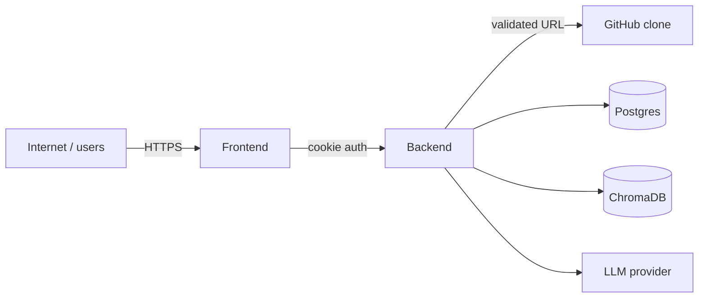

# Security Threat Model & Controls

A practical review of how CodeSensei defends itself, mapped to the OWASP-style risks that
matter for this system. Honest about residual limitations.

## Trust boundaries

Untrusted inputs: the submitted GitHub URL, repository *contents* (parsed + embedded + fed
to the LLM), and all request parameters.

## Controls by risk

| Risk | Control | Where |
| --- | --- | --- |
| **Broken auth** | GitHub OAuth + HS256 JWT in httpOnly cookie; prod rejects default secret | `core/auth.py`, `config.py` |
| **IDOR / broken access control** | `verify_repository_access` + per-service ownership checks; "my" lists filter by cookie identity; `404` (not `403`) to avoid existence leaks | endpoints + services |
| **SSRF** | `validate_github_url` — HTTPS GitHub only; rejects SSH, ports, userinfo, query strings, non-GitHub hosts | `core/security.py` |
| **Path traversal** | `safe_join`, `validate_branch_name`, slugged workspace paths | `core/security.py`, worker clone |
| **XSS** | React escaping by default; tokens in httpOnly cookie (not JS-readable); Mermaid/markdown rendered from controlled/derived data | frontend |
| **CSRF** | `SameSite=Lax` cookie; OAuth anti-CSRF state cookie; state-changing routes require the cookie | `core/auth.py` |
| **Rate abuse / DoS** | sliding-window per-IP limiter (`API_RATE_LIMIT_PER_MINUTE`), `429` + `Retry-After`; repo size/file caps | `core/middleware.py`, `config.py` |
| **Secret leakage** | secrets only via env; prod guards reject defaults; no secrets in logs | `config.py`, structlog setup |
| **Multi-tenant isolation** | per-user repos/sessions; per-repo Chroma collections dropped on delete | services, `ai_service.delete_repository_index` |
| **Job abuse / duplication** | unique active-job index; reaper for stuck jobs | DB + `analysis_reaper` |

## Authentication detail
- Token claims `{sub, gh, iat, exp}`; expiry `SESSION_TTL_SECONDS`.
- Cookie: `httpOnly`, `secure` (prod), `SameSite=Lax`, path `/`.
- Mock auth & dev login are **hard-disabled** in production (`mock_auth_enabled` /
  `dev_login_enabled` return false when `APP_ENV=production`).

## Authorization detail
- **Owned resources** (repo mutate, sessions, stars, visibility, delete): require auth +
  ownership.
- **Readable resources** (repo read, insights, graph, architecture): owner *or* `is_public`,
  else `404`.
- Identity always comes from the verified cookie, never from request bodies/params.

## AI-specific risks
- **Prompt injection** from repository content (a file could contain "ignore instructions").
  Mitigations: constrained system prompt, read-only surface (the model can't act), and
  output is informational. Residual risk acknowledged — see limitations.
- **Data isolation**: a repo's vectors live in its own collection; chat retrieval is scoped
  to one repo; deleting a repo drops its collection.
- **Citations** can only reference files the repo contains (derived from retrieved chunks).

## Residual limitations (honest)
- Rate limiting is **in-memory per process** — behind multiple replicas it's per-replica;
  production should move it to Redis.
- No WAF / bot management beyond rate limiting.
- Prompt injection is mitigated, not eliminated (inherent to LLMs over untrusted text).
- Cloned repo content is parsed/executed-as-data only (no code execution), but parsing
  untrusted code at scale still warrants sandboxing hardening for a true production launch.

## Secrets inventory
`APP_SECRET_KEY`, `GITHUB_OAUTH_CLIENT_SECRET`, `GROQ_API_KEY`, `HUGGINGFACE_API_KEY`,
`POSTGRES_PASSWORD`, `REDIS_PASSWORD`. All via env; never committed. See
[../deployment/environment-variables.md](../deployment/environment-variables.md).
