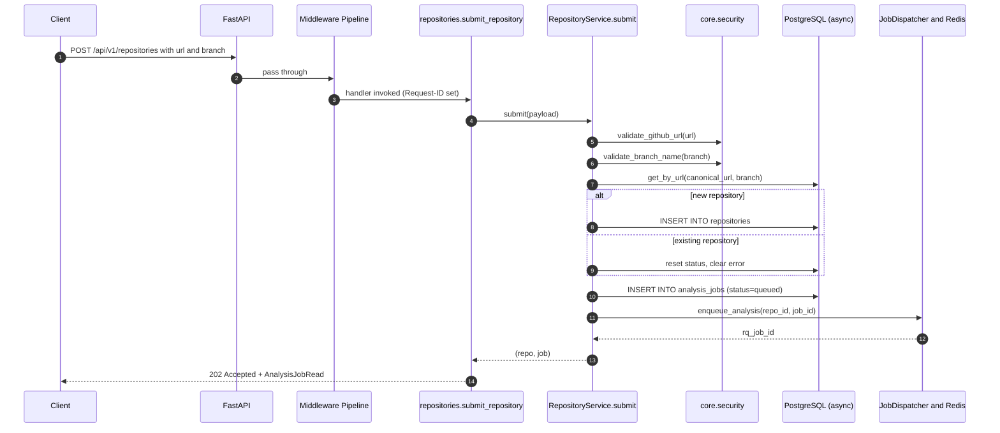

# Phase 2 — Backend (verification guide)

This document closes out **Phase 2** of CodeSensei.
It explains every key decision, lists every file added, walks
through the request flow end-to-end, and gives step-by-step verification
commands you can run locally without the worker or analysis engine running.

---

## 1 · What we built

A production-grade FastAPI backend that owns the **system of record** and the
**HTTP / SSE API** for the platform. It does not perform analysis itself —
that's the worker's job in Phase 3. The backend's responsibilities:

| Responsibility | Implementation |
| --- | --- |
| Validated repository submission | `POST /api/v1/repositories` |
| Persistent storage of analyses | PostgreSQL via SQLAlchemy 2.0 async |
| Job orchestration | RQ via `JobDispatcher`, enqueued from request handlers |
| Read-side queries (graphs, metrics, dead-code, impact, architecture) | Repository + Service layers |
| Live progress | SSE on `/repositories/{id}/events` |
| AI Q&A contract | `POST /api/v1/ai/chat` (SSE) — stub today, RAG in Phase 4 |
| Health & observability | `/healthz`, `/readyz`, `/metrics` (Prometheus) |
| Cross-cutting concerns | Request IDs, structured logs, rate limiting, redaction |

The backend is built bottom-up using **Clean Architecture** and is
**enforced** by an `import-linter` contract in `pyproject.toml`:
`api → services → repositories → models`. Higher layers never import
downward across boundaries; lower layers never import upward.

---

## 2 · Decisions worth highlighting

1. **Async everywhere (FastAPI + SQLAlchemy 2.0 + asyncpg + redis.asyncio).**
   Analysis jobs are I/O-heavy; async lets a single worker process serve
   thousands of in-flight SSE connections without thread overhead.
2. **Repository pattern, not raw queries in services.** Every persistence
   call goes through a `BaseRepository[T]` subclass. Services stay focused
   on business rules; tests can swap in fakes.
3. **`Annotated[T, Depends(...)]` for DI.** Every dependency is a named
   type alias in `app/core/dependencies.py`. This is mypy-strict friendly
   and means endpoints declare *exactly* what they need.
4. **Domain exceptions, not HTTP exceptions, inside services.**
   `DomainError` subclasses carry both `error_code` and `status_code`. A
   single FastAPI exception handler maps them to a uniform error envelope:
   `{"error": "...", "message": "...", "details": {...}}`.
5. **Strict input validation.** `validate_github_url` only accepts HTTPS,
   `github.com`, no credentials, no query strings, no custom ports.
   `validate_branch_name` enforces Git's reference rules.
   `safe_join` blocks every traversal vector. These are the highest-value
   security controls for a tool that clones arbitrary user-supplied URLs.
6. **SSE for progress + chat streaming.** REST polling would burn battery
   on the dashboard and add server load. SSE is one-way, proxy-friendly,
   and works with browser EventSource out of the box.
7. **`import-linter` layered contract in `pyproject.toml`.** Prevents
   architectural drift over time. Run with `make lint`.
8. **First-class observability from day 1.** Structured logs (JSON in
   prod), redaction filter for secrets, Prometheus metrics, request IDs
   propagated through every log line.

---

## 3 · Files added in Phase 2

### Application code (`backend/app/`)

```
app/
├── __init__.py                       # __version__
├── main.py                           # FastAPI factory + lifespan + handlers
├── core/
│   ├── config.py                     # Pydantic Settings (env vars)
│   ├── logging.py                    # structlog + redaction
│   ├── security.py                   # URL / branch / path-traversal guards
│   ├── exceptions.py                 # DomainError hierarchy
│   ├── middleware.py                 # request-context + rate limiter
│   └── dependencies.py               # DI type aliases (Annotated[...])
├── db/
│   ├── base.py                       # Declarative Base, mixins, naming conv.
│   └── session.py                    # async engine + session factory
├── models/                           # 6 ORM models
│   ├── repository.py
│   ├── analysis_job.py
│   ├── source_file.py
│   ├── symbol.py
│   ├── dependency.py
│   └── metric.py
├── schemas/                          # Pydantic DTOs (11 modules)
│   ├── common.py · repository.py · analysis.py
│   ├── dependency.py · metric.py · dead_code.py
│   ├── impact.py · architecture.py · documentation.py · ai.py
├── repositories/                     # 6 data-access classes + base
│   ├── base.py · repository_repository.py · analysis_job_repository.py
│   ├── source_file_repository.py · symbol_repository.py
│   ├── dependency_repository.py · metric_repository.py
├── services/                         # 8 service classes
│   ├── repository_service.py · analysis_service.py
│   ├── dependency_service.py · metric_service.py
│   ├── dead_code_service.py · impact_service.py
│   ├── architecture_service.py · documentation_service.py
├── workers/
│   └── job_dispatcher.py             # RQ enqueue (typed)
├── cache/
│   └── redis_cache.py                # async Redis JSON cache
├── observability/
│   └── metrics.py                    # Prometheus middleware + counters
└── api/v1/
    ├── router.py                     # aggregator
    └── endpoints/                    # 10 endpoint modules
        ├── repositories.py · analysis.py · dependencies.py
        ├── dead_code.py · complexity.py · impact.py
        ├── architecture.py · documentation.py · ai.py · health.py
```

### Migrations (`backend/alembic/`)

* `alembic.ini` · `alembic/env.py` · `alembic/script.py.mako`
* `alembic/versions/0001_initial.py` — full schema, six tables, four enums.

### Tests (`backend/tests/`)

* `conftest.py` — async SQLite engine, `TestClient` with DI overrides.
* `unit/test_security.py` — URL / branch / path-traversal coverage.
* `integration/test_health.py` — `/healthz`, OpenAPI surface, error envelopes.

### Tooling

* `backend/pyproject.toml` — dependencies pinned; ruff / mypy strict /
  pytest / coverage / `import-linter` contracts configured.
* `backend/Dockerfile`, `backend/.dockerignore`.

---

## 4 · Execution flow (request lifecycle)

Take **`POST /api/v1/repositories`** (the most interesting endpoint) — here
is what happens, end-to-end:



The same general shape holds for every endpoint: middleware → handler →
service → repository → DB. SSE endpoints (`/events`, `/ai/chat`) replace
the synchronous response with an async generator yielding
`{"event": ..., "data": ...}` frames via `sse_starlette`.

---

## 5 · Verification — local smoke run (no Postgres needed)

You can verify the backend end-to-end without spinning up Postgres or
Redis: the test suite uses an **in-memory SQLite** engine and stubs the
job dispatcher.

```powershell
# from the repo root
cd backend

# 1. Install (one-time)
python -m venv .venv
.\.venv\Scripts\Activate.ps1
pip install -e .[dev]

# 2. Lint, type-check, architecture contracts
ruff check app tests
mypy app
lint-imports        # import-linter — fails if architecture is violated

# 3. Run the test suite
pytest -q
# Expected: all green, coverage report printed.

# 4. Boot the API with SQLite (dev only)
$env:POSTGRES_HOST = "skip"     # readiness will report degraded; that's fine
uvicorn app.main:app --reload --port 8000

# 5. Hit the surface
curl http://localhost:8000/healthz
curl http://localhost:8000/openapi.json | python -m json.tool | Select-Object -First 40
```

For the **full stack** (Postgres + Redis + Chroma + Ollama):

```powershell
# From the repo root
docker compose -f docker/docker-compose.yml up -d postgres redis
cd backend
alembic upgrade head
uvicorn app.main:app --reload --port 8000

# In another shell:
curl http://localhost:8000/readyz   # postgres + redis should both report "ok"
```

---

## 6 · What's intentionally deferred

* **Worker tasks (`worker.app.tasks.analyze_repository.run`)** — Phase 5.
  The `JobDispatcher.enqueue_analysis` call already points at the correct
  symbol; once the worker package lands, jobs flow without API changes.
* **Real AST parsing / dependency extraction** — Phase 3 (`analysis-engine/`).
  Services like `ArchitectureService` use path-prefix heuristics today and
  will switch to richer engine-derived data once Phase 3 lands; the API
  contract is final.
* **LLM-augmented documentation and Q&A** — Phase 4. The contract surface
  (`DocumentationRequest`, `ChatRequest`, SSE `ChatTokenEvent`) is final;
  today's responses are facts-only Markdown / a clear "not configured"
  stream.
* **Production secrets management.** `.env.example` is committed; real
  secrets go through Docker secrets / cloud secret managers in Phase 10.

---

## 7 · Done-definition checklist

* [x] Layered architecture enforced by `import-linter`.
* [x] All endpoints return typed Pydantic responses.
* [x] Domain errors map to a uniform JSON envelope.
* [x] Structured JSON logs with redaction (`password|token|secret|key`).
* [x] Prometheus metrics middleware + counters/histograms.
* [x] Per-IP sliding-window rate limit on all `/api/*` routes.
* [x] Request IDs propagated from middleware into every log line.
* [x] Alembic initial migration covering all six tables + four enums.
* [x] Tests for security validators, OpenAPI surface, error envelopes.
* [x] SSE endpoints for analysis progress + AI chat (stub today).
* [x] Dockerfile multi-stage, non-root, healthcheck on `/healthz`.

Phase 2 is complete. Phase 3 (`analysis-engine/`) begins next.
