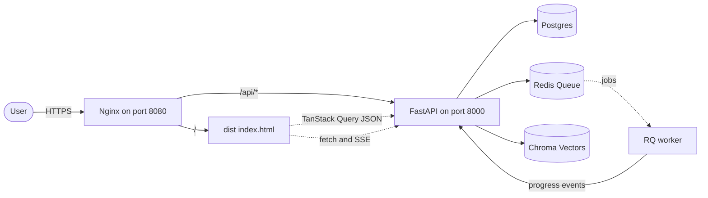

# Phase 6 — Frontend Verification

> **Status:** Complete  
> **Stack:** Vite 5 · React 18 · TypeScript 5 (strict + `noUncheckedIndexedAccess`) · TanStack Query 5 · Zustand 5 · Tailwind 3 · Cytoscape · Recharts · Mermaid  
> **Build output:** `frontend/dist/` (production-ready static SPA, served by nginx)  
> **Container:** `frontend/Dockerfile` — multi-stage `node:20-alpine` → `nginx:1.27-alpine`, non-root `spa` user, port 8080

The frontend is a single-page application that consumes the FastAPI backend
documented in [docs/Phase-02-Backend-Verification.md](Phase-02-Backend-Verification.md)
and the streaming endpoints introduced in
[docs/Phase-04-AI-Engine-Verification.md](Phase-04-AI-Engine-Verification.md).

---

## 1 · Architectural decisions

| # | Decision | Rationale |
|---|---|---|
| 1 | **Vite + SWC over Next.js / CRA** | This is a pure SPA (no SSR requirement). Vite's dev-server starts in <1 s and the SWC plugin halves cold-start type-stripping time. CRA is unmaintained. |
| 2 | **TypeScript strict + `noUncheckedIndexedAccess`** | Catches the "array access returns `T \| undefined`" class of bugs at compile time — already prevented one in [src/lib/format.ts](../frontend/src/lib/format.ts). |
| 3 | **TanStack Query for server state, Zustand for UI state** | Two distinct shapes of state: server data (caching, revalidation, optimistic updates) and UI ephemera (sidebar collapsed). Mixing them in a single store is a known anti-pattern. |
| 4 | **Fetch-based SSE client over native `EventSource`** | `EventSource` is GET-only, but the chat endpoint is POST. [src/lib/sse.ts](../frontend/src/lib/sse.ts) implements a small `TextDecoderStream` parser that handles both methods, abortable via `AbortSignal`. |
| 5 | **Cytoscape.js over React Flow / d3-force** | The dependency graph requires production-grade layout algorithms (dagre for hierarchies, cose-bilkent for organic) that React Flow cannot reproduce. Cytoscape ships them as plug-ins. |
| 6 | **Recharts over Chart.js / ECharts** | Recharts is a thin declarative React wrapper over d3 — diff-friendly and has no imperative `useRef` lifecycle. Charts in this app are simple (Bar, Pie). |
| 7 | **Mermaid lazy-loaded** | Mermaid weighs ~440 KB gzip. Only architecture page uses it, so [`MermaidDiagram`](../frontend/src/components/architecture/MermaidDiagram.tsx) does `await import("mermaid")` inside `useEffect`. |
| 8 | **Tailwind only — no CSS-in-JS** | Avoids runtime cost of emotion/styled-components. A small custom palette (`ink`, `accent`, `success`, `warning`, `danger`) is declared in [tailwind.config.js](../frontend/tailwind.config.js). |
| 9 | **Path alias `@/*` → `src/*`** | Preserved in both `tsconfig.json` and `vite.config.ts` so editor and bundler agree. (Removed deprecated `baseUrl` for TS 7 compatibility.) |
| 10 | **Vendor code-split via `manualChunks`** | Splits `vendor-react`, `vendor-charts`, `vendor-graph`, `vendor-mermaid`, `vendor-query` so the initial bundle is dominated only by what the landing page needs. |
| 11 | **nginx SPA fallback + `/api/` proxy** | [`nginx.conf`](../frontend/nginx.conf) rewrites unknown URLs to `index.html` (client-side routing) and proxies `/api/` to `backend:8000`. Critical setting: `proxy_buffering off` for SSE. |

---

## 2 · Generated files

| Layer | Path | Purpose |
|---|---|---|
| Config | [frontend/package.json](../frontend/package.json) | Pinned dependency versions (Vite, React, TanStack Query, Cytoscape, Recharts, Mermaid …). |
| Config | [frontend/tsconfig.json](../frontend/tsconfig.json) | Strict TS, `noUncheckedIndexedAccess`, `paths` alias. |
| Config | [frontend/vite.config.ts](../frontend/vite.config.ts) | Vendor chunk-split, dev proxy, Vitest happy-dom env. |
| Config | [frontend/tailwind.config.js](../frontend/tailwind.config.js) | Custom palette + container plugin. |
| Config | [frontend/nginx.conf](../frontend/nginx.conf) | SPA fallback + SSE-friendly `/api` proxy. |
| Config | [frontend/Dockerfile](../frontend/Dockerfile) | Multi-stage build to non-root nginx. |
| Config | [frontend/playwright.config.ts](../frontend/playwright.config.ts) | E2E baseline (used in Phase 7). |
| Types | [frontend/src/types/api.ts](../frontend/src/types/api.ts) | Mirrors the backend's Pydantic schemas. |
| Lib | [frontend/src/lib/api.ts](../frontend/src/lib/api.ts) | Axios client + `ApiError` normaliser (reads the backend `{error, message, details}` envelope; exposes `status`, `code`, `details`). |
| Lib | [frontend/src/lib/sse.ts](../frontend/src/lib/sse.ts) | Fetch-based SSE async-iterator. |
| Lib | [frontend/src/lib/queryClient.ts](../frontend/src/lib/queryClient.ts) | TanStack Query defaults. |
| Lib | [frontend/src/lib/format.ts](../frontend/src/lib/format.ts) | `cn`, `formatNumber`, `formatBytes`, `formatRelativeTime`, `parseLanguages`, `shortRepoName`, `truncate`. |
| API | [frontend/src/api/repositories.ts](../frontend/src/api/repositories.ts) | List / get / create / delete. |
| API | [frontend/src/api/analysis.ts](../frontend/src/api/analysis.ts) | Trigger + SSE-stream progress. |
| API | [frontend/src/api/dependencies.ts](../frontend/src/api/dependencies.ts) | Graph fetch. |
| API | [frontend/src/api/metrics.ts](../frontend/src/api/metrics.ts) | Complexity ranking. |
| API | [frontend/src/api/dead-code.ts](../frontend/src/api/dead-code.ts) | Dead-code report. |
| API | [frontend/src/api/architecture.ts](../frontend/src/api/architecture.ts) | Layers + Mermaid source. |
| API | [frontend/src/api/impact.ts](../frontend/src/api/impact.ts) | Impact analysis. |
| API | [frontend/src/api/ai.ts](../frontend/src/api/ai.ts) | Streaming chat. |
| Hook | [frontend/src/hooks/useRepositories.ts](../frontend/src/hooks/useRepositories.ts) | Listing + mutations. |
| Hook | [frontend/src/hooks/useAnalysisProgress.ts](../frontend/src/hooks/useAnalysisProgress.ts) | SSE with exponential reconnect. |
| Hook | [frontend/src/hooks/useAnalysisJobs.ts](../frontend/src/hooks/useAnalysisJobs.ts) | Re-trigger / list jobs. |
| Hook | [frontend/src/hooks/useInsights.ts](../frontend/src/hooks/useInsights.ts) | Graph / complexity / dead-code / architecture queries (each accepts an `enabled` gate so it only fires once analysis is ready). |
| Hook | [frontend/src/hooks/useChatStream.ts](../frontend/src/hooks/useChatStream.ts) | Chat state machine. |
| Store | [frontend/src/store/uiStore.ts](../frontend/src/store/uiStore.ts) | Sidebar collapse only. |
| Store | [frontend/src/store/themeStore.ts](../frontend/src/store/themeStore.ts) | Light/dark theme with `localStorage` + OS-preference fallback. |
| UI | [frontend/src/components/common/Button.tsx](../frontend/src/components/common/Button.tsx) | Primary/secondary/ghost/danger variants. |
| UI | [frontend/src/components/common/Card.tsx](../frontend/src/components/common/Card.tsx) | Section header + body. |
| UI | [frontend/src/components/common/Spinner.tsx](../frontend/src/components/common/Spinner.tsx) | Accessible spinner. |
| UI | [frontend/src/components/common/StatusBadge.tsx](../frontend/src/components/common/StatusBadge.tsx) | 8 status variants. |
| UI | [frontend/src/components/common/EmptyState.tsx](../frontend/src/components/common/EmptyState.tsx) | Empty/zero-state primitive. |
| UI | [frontend/src/components/common/ErrorState.tsx](../frontend/src/components/common/ErrorState.tsx) | Error panel + retry. |
| UI | [frontend/src/components/common/ThemeToggle.tsx](../frontend/src/components/common/ThemeToggle.tsx) | Light/dark switch (role="switch"). |
| Analysis | [frontend/src/components/analysis/AnalysisProgress.tsx](../frontend/src/components/analysis/AnalysisProgress.tsx) | 9-stage pipeline progress visualisation. |
| Analysis | [frontend/src/components/analysis/AnalysisGate.tsx](../frontend/src/components/analysis/AnalysisGate.tsx) | `useAnalysisGate` — renders a friendly in-progress / failed / error panel on insight pages until the repository is ready. |
| Layout | [frontend/src/components/layout/Sidebar.tsx](../frontend/src/components/layout/Sidebar.tsx) | Workspace + per-repo nav. |
| Layout | [frontend/src/components/layout/Topbar.tsx](../frontend/src/components/layout/Topbar.tsx) | Theme toggle + refresh + sidebar toggle. |
| Layout | [frontend/src/components/layout/AppShell.tsx](../frontend/src/components/layout/AppShell.tsx) | Three-zone layout. |
| Repository | [frontend/src/components/repository/RepositoryCard.tsx](../frontend/src/components/repository/RepositoryCard.tsx) | Grid card. |
| Repository | [frontend/src/components/repository/RepositoryAddDialog.tsx](../frontend/src/components/repository/RepositoryAddDialog.tsx) | Add-repo modal. |
| Graph | [frontend/src/components/graph/CytoscapeGraph.tsx](../frontend/src/components/graph/CytoscapeGraph.tsx) | Cytoscape host with dagre layout, language-coloured nodes. |
| Charts | [frontend/src/components/metrics/ComplexityChart.tsx](../frontend/src/components/metrics/ComplexityChart.tsx) | Cyclomatic vs cognitive bar chart. |
| Charts | [frontend/src/components/metrics/LanguageChart.tsx](../frontend/src/components/metrics/LanguageChart.tsx) | Donut chart. |
| Dead code | [frontend/src/components/dead-code/DeadCodeTable.tsx](../frontend/src/components/dead-code/DeadCodeTable.tsx) | Findings table with confidence bar. |
| Architecture | [frontend/src/components/architecture/MermaidDiagram.tsx](../frontend/src/components/architecture/MermaidDiagram.tsx) | Lazy Mermaid renderer. |
| Chat | [frontend/src/components/ai-chat/ChatPanel.tsx](../frontend/src/components/ai-chat/ChatPanel.tsx) | Streaming chat UI with citations. |
| Page | [frontend/src/pages/RepositoryListPage.tsx](../frontend/src/pages/RepositoryListPage.tsx) | Workspace landing page. |
| Page | [frontend/src/pages/RepositoryDashboardPage.tsx](../frontend/src/pages/RepositoryDashboardPage.tsx) | Repo overview + live progress. |
| Page | [frontend/src/pages/DependencyGraphPage.tsx](../frontend/src/pages/DependencyGraphPage.tsx) | Dependency graph + inspector. |
| Page | [frontend/src/pages/ComplexityPage.tsx](../frontend/src/pages/ComplexityPage.tsx) | Complexity ranking. |
| Page | [frontend/src/pages/DeadCodePage.tsx](../frontend/src/pages/DeadCodePage.tsx) | Dead-code findings. |
| Page | [frontend/src/pages/ArchitecturePage.tsx](../frontend/src/pages/ArchitecturePage.tsx) | Layers + Mermaid diagram. |
| Page | [frontend/src/pages/ImpactAnalysisPage.tsx](../frontend/src/pages/ImpactAnalysisPage.tsx) | Impact form + risk-score panel. |
| Page | [frontend/src/pages/AIAssistantPage.tsx](../frontend/src/pages/AIAssistantPage.tsx) | RAG chat workspace. |
| Page | [frontend/src/pages/NotFoundPage.tsx](../frontend/src/pages/NotFoundPage.tsx) | 404. |
| Routing | [frontend/src/routes/router.tsx](../frontend/src/routes/router.tsx) | `createBrowserRouter` config. |
| Bootstrap | [frontend/src/App.tsx](../frontend/src/App.tsx) | Provider tree. |
| Bootstrap | [frontend/src/main.tsx](../frontend/src/main.tsx) | React 18 root. |
| Tests | [frontend/src/lib/__tests__/format.test.ts](../frontend/src/lib/__tests__/format.test.ts) | 17 cases. |
| Tests | [frontend/src/lib/__tests__/sse.test.ts](../frontend/src/lib/__tests__/sse.test.ts) | 11 cases. |
| Tests | [frontend/src/components/common/__tests__/StatusBadge.test.tsx](../frontend/src/components/common/__tests__/StatusBadge.test.tsx) | 10 cases. |

---

## 3 · Execution flow



### Page render sequence

1. **`main.tsx`** mounts `<App/>` inside `StrictMode`.
2. **`App.tsx`** wraps `<RouterProvider>` in `<QueryClientProvider>`.
3. The router resolves to **`AppShell`** → renders `<Sidebar/> <Topbar/> <Outlet/>`.
4. The active page calls a hook (`useRepositories`, `useDependencyGraph`, …); the hook fires
   an axios request through `apiClient`; TanStack Query memoises the response under a key
   like `["dependencies", repositoryId]`.
5. SSE streams (analysis progress, AI tokens) are consumed via `openSse()` async-generators
   that the page-level hooks subscribe to.

---

## 4 · Verification commands

Run from **`frontend/`**:

```powershell
# 1. Install (first time only — ~480 packages)
npm install --no-audit --no-fund

# 2. Static checks
npm run typecheck    # tsc --noEmit (strict, noUncheckedIndexedAccess)

# 3. Unit tests (Vitest + happy-dom + @testing-library)
npm run test         # 38 tests across 3 files

# 4. Production build
npm run build        # tsc -b && vite build → dist/

# 5. Local preview against the running backend
$env:VITE_API_BASE_URL = "http://localhost:8000"
npm run dev          # http://localhost:5173 with /api proxied
```

### Latest measured outcome

| Step | Result |
|---|---|
| `npm install` | 645 packages added (some deprecation warnings from transitive deps) |
| `npm run typecheck` | exit code 0, no diagnostics |
| `npm run test` | **38 / 38 passed** in 2.36 s (sse 11, format 17, StatusBadge 10) |
| `npm run build` | `dist/` written, **largest gzipped chunk 164 KB** (`vendor-graph`), Mermaid lazy-loaded as a separate chunk; build completed in ~28 s |

Initial-page payload (no Mermaid, no Cytoscape) is dominated by
**`vendor-react` (65 KB gzip) + `vendor-query` (13 KB) + `index` (35 KB)** ≈ **115 KB gzipped**,
well under typical SPA budgets.

### Docker workflow (used in Phase 8)

```powershell
docker build -t codesensei-frontend ./frontend
docker run --rm -p 8080:8080 -e VITE_API_BASE_URL=http://backend:8000 codesensei-frontend
```

The container runs as the unprivileged `spa` user, listens on **8080**, and serves
the static `dist/` while proxying `/api/` to the backend service.

---

## 5 · What's deferred to later phases

- **Phase 7 — Cross-stack tests:** Playwright scripts exercising the full repo → analyse → graph → chat flow against a docker-compose stack.
- **Phase 8 — Dockerization:** wiring frontend into `docker-compose.yml` alongside backend, worker, postgres, redis, chroma, ollama.
- **Phase 9 — Observability:** front-end RUM (Web Vitals → backend → Prometheus).
- **Phase 10 — CI/CD:** `frontend-build`, `frontend-test`, and `frontend-typecheck` jobs in GitHub Actions.
