# Phase 7 — Cross-Stack Test Verification

This phase wires the platform's quality gates together: a hermetic backend
integration suite, an OpenAPI ↔ TypeScript contract test, a browser-driven
end-to-end spec, and a load profile. Together they enforce that any
breaking change — whether in a Pydantic schema, a SQL query, an SSE event
name, or a UI route — fails CI before it can ship.

## 1. Decisions

| # | Decision | Rationale | Alternative considered |
|---|----------|-----------|------------------------|
| 1 | Backend integration tests use SQLite (`aiosqlite`) with `StaticPool` | Keeps the suite hermetic, parallel-safe, and < 10 s. `StaticPool` is required so seeded rows are visible across all connections of an in-memory DB. | Spinning up a Postgres container per CI run — slower and harder for local devs |
| 2 | A `FakeJobDispatcher` stands in for the real `JobDispatcher` | The production dispatcher boots a Redis client on first use; tests must not depend on Redis. The fake records every `enqueue_analysis` call so we can assert on them. | `unittest.mock.MagicMock` — provides no observability over enqueued jobs |
| 3 | A `fakeredis.aioredis.FakeRedis`-backed `RedisCache` overrides the real cache via `app.dependency_overrides[get_cache]` | Insight services call `cache.get_json` / `set_json`; a no-op cache would mask cache-related bugs. `fakeredis` gives realistic semantics without a server. | Patching the cache to always miss — hides serialisation issues |
| 4 | Removed `@lru_cache` from `get_redis_cache(settings)` | `Settings` is unhashable (Pydantic v2), so the decorated factory crashed at first call. Replaced with a module-level dict keyed by `settings.redis_url`. | Add `__hash__` to `Settings` — couples application code to caching strategy |
| 5 | `MetricRepository.averages` aggregates in Python, not SQL | `func.percentile_cont(...)` is Postgres-only. Computing median client-side from a few thousand rows is cheap and keeps the query portable to SQLite. | Dialect-conditional SQL — adds complexity for an aggregate that's already fast |
| 6 | Contract tests live at the **repo root** under `tests/contract/` | They span multiple workspaces (backend OpenAPI ↔ frontend TS). Putting them in either project would imply ownership it doesn't have. | Duplicate the test in both — drift hazard |
| 7 | Contract test inspects the in-process FastAPI app instead of an HTTP-served `/openapi.json` | Avoids needing a running server, makes it CI-cheap, and runs in milliseconds. | Hit a deployed environment — flaky and slow |
| 8 | Playwright spec mocks all `**/api/v1/**` routes with `page.route` | E2E tests should validate UI behaviour, not act as second-tier integration tests. Mocked APIs let the spec assert on UI states deterministically. | Stand up the full Docker stack — too slow for tight feedback loops |
| 9 | Locust profile is read-heavy (8:4:3:2:2 read-to-write ratio) | Mirrors the real dashboard usage pattern: users open the list far more often than they submit new repos. | Round-robin tasks — produces an unrealistic load curve |
| 10 | Single shared Python venv at `analysis-engine/.venv` is used for backend, contract, and load tests | The platform already uses one venv for backend + worker + engine; adding another for tests would just be infrastructure. | Per-suite venvs — extra setup with no upside |

## 2. Files generated

| Path | Purpose |
|------|---------|
| [backend/tests/conftest.py](../backend/tests/conftest.py) | Adds `FakeJobDispatcher`, `fake_dispatcher`, `fake_cache`, `seeded_repository`, and dependency overrides for `_make_job_dispatcher` + `get_cache`. Switches the in-memory engine to `StaticPool`. |
| [backend/tests/integration/test_repositories.py](../backend/tests/integration/test_repositories.py) | Repository CRUD: POST happy + invalid + duplicate, list filtering, GET, DELETE. |
| [backend/tests/integration/test_analysis.py](../backend/tests/integration/test_analysis.py) | Analysis trigger, list jobs, latest job, 404 paths. |
| [backend/tests/integration/test_insights.py](../backend/tests/integration/test_insights.py) | Dependency graph, complexity, dead-code happy-path + readiness gating. |
| [backend/app/cache/redis_cache.py](../backend/app/cache/redis_cache.py) | Replaced `@lru_cache` factory with a DSN-keyed module dict + `dispose_redis_cache`. |
| [backend/app/repositories/metric_repository.py](../backend/app/repositories/metric_repository.py) | Portable averages — computes mean/median in Python instead of `percentile_cont`. |
| [tests/contract/test_openapi_contract.py](../tests/contract/test_openapi_contract.py) | OpenAPI endpoint surface, schema field-name parity, enum parity, frontend TS-union snapshots. |
| [tests/contract/__init__.py](../tests/contract/__init__.py) | Package marker. |
| [tests/pytest.ini](../tests/pytest.ini) | Repo-root pytest config so `pytest tests/` works from anywhere. |
| [frontend/tests/e2e/repository-flow.spec.ts](../frontend/tests/e2e/repository-flow.spec.ts) | Playwright spec: list page, add-repo dialog, mocked POST submission. |
| [tests/load/locustfile.py](../tests/load/locustfile.py) | Read-heavy `DashboardUser` profile with 7 task weights. |
| [docs/Phase-07-Cross-Stack-Tests-Verification.md](Phase-07-Cross-Stack-Tests-Verification.md) | This document. |

## 3. Execution flow

```mermaid
flowchart TB
    subgraph Backend["Backend integration suite"]
        A[pytest collects tests]
        A --> B[create_app test_settings]
        B --> C[app.dependency_overrides]
        C --> D[TestClient HTTP request]
        D --> E[FastAPI router]
        E --> F[Service layer]
        F --> G[Repository layer]
        G --> H[(in-memory SQLite StaticPool)]
        F --> I[FakeJobDispatcher records call]
        F --> J[fakeredis-backed RedisCache]
    end

    subgraph Contract["Contract suite"]
        K[Import FastAPI app]
        K --> L[app.openapi]
        L --> M[Assert paths and schemas and enums]
        M --> N[Read frontend api.ts and regex]
    end

    subgraph E2E["Playwright E2E"]
        O[Start Vite dev server]
        O --> P[Browser to root route]
        P --> Q[page.route mocks API]
        Q --> R[UI assertions]
    end

    subgraph Load["Locust load"]
        S[Real backend running]
        S --> T[DashboardUser read-heavy mix]
        T --> U[Aggregate p95 / RPS]
    end
```



## 4. Verification commands

> All commands assume PowerShell, run from
> `c:\Users\NikhilKumarShahMAQSo\Desktop\personal-projects\github-repo-intelligence-platform`.

### Backend integration suite (60 tests)

```powershell
cd backend
$env:PYTHONPATH = $PWD
..\analysis-engine\.venv\Scripts\python.exe -m pytest tests/ -q
```

Expected: `60 passed`.

### Contract suite (27 tests)

```powershell
cd ..
..\github-repo-intelligence-platform\analysis-engine\.venv\Scripts\python.exe `
    -m pytest tests/contract/ -q
```

Expected: `27 passed`.

### Frontend unit tests (still 38 from Phase 6)

```powershell
cd frontend
npm run typecheck
npm run test
```

Expected: `38 tests passed`.

### Playwright E2E (browsers must be installed once)

```powershell
cd frontend
npx playwright install --with-deps chromium firefox
npm run dev          # in another shell — leaves Vite on :5173
npm run test:e2e
```

Expected: `2 passed` per browser.

### Locust load run (live backend required)

```powershell
cd ..
..\github-repo-intelligence-platform\analysis-engine\.venv\Scripts\pip.exe install locust
..\github-repo-intelligence-platform\analysis-engine\.venv\Scripts\locust.exe `
    -f tests/load/locustfile.py `
    --host http://localhost:8000 `
    --headless --users 50 --spawn-rate 5 --run-time 60s
```

Expected: zero failures on `/healthz` and `GET /repositories`; p95 latency
under 200 ms for all read tasks on a developer machine.

## 5. Test inventory summary

| Suite | Tests | Runtime | Stack touched |
|-------|------:|--------:|---------------|
| Backend integration | 60 | ~5 s | FastAPI + SQLAlchemy + fakeredis |
| Contract | 27 | ~3 s | OpenAPI + frontend TS regex |
| Frontend unit | 38 | ~4 s | Vitest + happy-dom |
| Playwright E2E | 2 × 2 browsers | ~20 s | Real Vite, mocked API |
| Locust profile | 7 tasks | open-ended | Live backend |

Total automated assertions: **125 + load profile**.
