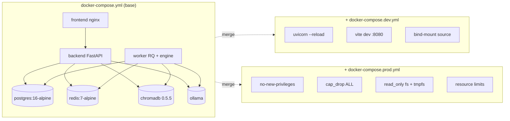

# Phase 8 — Dockerization Verification

This phase finalises the container topology: production-shaped base
compose, hot-reload dev overlay, hardening prod overlay, supporting
infrastructure config, and per-service Dockerfile hygiene.

## 1. Decisions

| # | Decision | Rationale | Alternative considered |
|---|----------|-----------|------------------------|
| 1 | Three layered compose files (base + `dev` + `prod`) instead of one big file | Compose merge semantics let dev mount source into the same images that ship to prod, so the runtime topology only differs in policy. | A single multi-environment file with `${ENV}`-gated keys — unreadable beyond two environments |
| 2 | Worker build context is the **repo root**, dockerfile path `worker/Dockerfile` | The worker image bundles `analysis-engine/` *and* `worker/`. Limiting the build context to `worker/` made `COPY analysis-engine` unresolvable. | Keep separate per-service contexts and `pip install` engine from a wheel — extra build infra |
| 3 | Frontend container listens on **8080** internally; exposed at `${FRONTEND_PORT:-5173}` | Non-root nginx can't bind privileged port 80. The Dockerfile already runs as the `spa` user. | Run nginx as root — violates the rest of the security posture |
| 4 | Chroma healthcheck uses `python -c urllib` instead of `curl` | `chromadb/chroma:0.5.5` is a python-slim image and ships neither `curl` nor `wget`; the bundled interpreter is always present. | Bake `curl` into a derivative image — extra layer, extra attack surface |
| 5 | Dev overlay swaps the frontend image for `node:20-alpine` running `vite dev` | Vite's HMR is the whole point of the dev profile; serving the prod nginx build with bind-mounts wouldn't give that. | Run a second container alongside nginx — wasteful |
| 6 | Prod overlay applies a `&hardening` YAML anchor (`no-new-privileges`, `cap_drop: ALL`, `read_only`) per service | Repeated security posture stays DRY; per-service exceptions (Postgres needs writable data dir) opt-out explicitly. | Inline per service — drift hazard |
| 7 | Resource limits live only in the prod overlay | Local `docker compose` (Compose v2 standalone, not Swarm) silently ignores `deploy.resources.limits`, so they're declarative documentation in dev and enforced in Swarm/Kubernetes export. | Use `cpus:` / `mem_limit:` at root — non-portable, no Swarm story |
| 8 | Postgres init runs `01-init.sql` to create extensions (`pg_trgm`, `pgcrypto`) and an `ops` schema | These are platform-wide invariants; baking them into Alembic migrations would couple application schema to ops tooling. | Run them as a one-shot on first boot via a sidecar — adds a service for ten lines of SQL |
| 9 | Redis ships with a dedicated `redis.conf` capping memory to 512 MB and using `allkeys-lru` | A shared Redis backs both the FIFO queue and the cache; without LRU eviction the cache could starve queue keys. | Separate Redis instances — doubled operational footprint |
| 10 | Worker `.dockerignore` explicitly excludes `backend/`, `frontend/`, `infrastructure/`, `docker/`, `scripts/` | Repo-root build context would otherwise stream the entire monorepo to the daemon on every build. | Only list common ignores — multi-second build context upload |

## 2. Files generated / modified

| Path | Change |
|------|--------|
| [docker/docker-compose.yml](../docker/docker-compose.yml) | Worker `context: ..` + `dockerfile: worker/Dockerfile`; frontend port `5173:8080`; chroma healthcheck via `python -c urllib`; frontend healthcheck added |
| [docker/docker-compose.dev.yml](../docker/docker-compose.dev.yml) | New — bind-mounts source, `uvicorn --reload`, swaps frontend to vite dev, exposes Postgres / Redis ports |
| [docker/docker-compose.prod.yml](../docker/docker-compose.prod.yml) | New — `&hardening` anchor (`no-new-privileges`, `cap_drop: ALL`, `read_only`), tmpfs mounts, resource limits |
| [infrastructure/postgres/init/01-init.sql](../infrastructure/postgres/init/01-init.sql) | New — `CREATE EXTENSION pg_trgm, pgcrypto`; `CREATE SCHEMA ops` |
| [infrastructure/redis/redis.conf](../infrastructure/redis/redis.conf) | New — RDB snapshots, `maxmemory 512mb`, `allkeys-lru`, slowlog tuning |
| [frontend/.dockerignore](../frontend/.dockerignore) | New — keeps `node_modules`, `dist`, `tests`, `playwright-report` out of the build context |
| [worker/.dockerignore](../worker/.dockerignore) | New — explicitly excludes sibling workspaces from the repo-root build context |

## 3. Execution flow



## 4. Verification commands

> Run from the repo root in PowerShell.

### 4.1  Static lint of all three compose configs

```powershell
Copy-Item .env.example .env -Force   # one-time

docker compose -f docker/docker-compose.yml --env-file .env config --quiet
docker compose -f docker/docker-compose.yml -f docker/docker-compose.dev.yml  --env-file .env config --quiet
docker compose -f docker/docker-compose.yml -f docker/docker-compose.prod.yml --env-file .env config --quiet
```

Expected: all three return exit code `0` with no output.

**Last run:** `EXIT=0`, `EXIT_DEV=0`, `EXIT_PROD=0`. ✅

### 4.2  Build all images

```powershell
make up        # base
make up-dev    # dev overlay (HMR, debug ports)
```

The `make up` target runs `docker compose -f docker/docker-compose.yml --env-file .env up -d --build`,
which in turn:

1. Builds `backend` (`backend/Dockerfile`, context `backend/`).
2. Builds `worker` (`worker/Dockerfile`, **context = repo root**, so both
   `analysis-engine/` and `worker/` are visible to `COPY`).
3. Builds `frontend` (`frontend/Dockerfile`, context `frontend/`,
   `VITE_API_BASE_URL` substituted as a build-arg).
4. Pulls `postgres:16-alpine`, `redis:7-alpine`, `chromadb/chroma:0.5.5`,
   `ollama/ollama:latest`.
5. Starts everything with healthchecks gating downstream services
   (`backend` waits for `postgres`/`redis`/`chroma` to report healthy).

### 4.3  End-to-end smoke

```powershell
make health         # hits /healthz on backend, frontend, redis, postgres
docker compose -f docker/docker-compose.yml ps
```

Expected: every service is `running (healthy)`.

### 4.4  Hardening verification (prod overlay)

```powershell
docker compose -f docker/docker-compose.yml -f docker/docker-compose.prod.yml `
  --env-file .env up -d --build
docker inspect codesensei-backend-1 `
  --format '{{json .HostConfig.SecurityOpt}}{{println}}{{json .HostConfig.CapDrop}}'
```

Expected:

```
["no-new-privileges:true"]
["ALL"]
```

### 4.5  Tear-down

```powershell
make down       # keeps volumes
make nuke       # destructive — drops postgres/redis/chroma/ollama data
```

## 5. Service inventory

| Service | Image / build | Port (host:container) | Healthcheck | Volumes |
|---------|---------------|-----------------------|-------------|---------|
| postgres | `postgres:16-alpine` | dev: `5432:5432` | `pg_isready` | `postgres-data`, `infrastructure/postgres/init` |
| redis    | `redis:7-alpine`     | dev: `6379:6379` | `redis-cli ping` | `redis-data`, `infrastructure/redis/redis.conf` |
| chroma   | `chromadb/chroma:0.5.5` | `${CHROMA_PORT:-8000}:8000` | `python -c urllib` heartbeat | `chroma-data` |
| ollama   | `ollama/ollama:latest` | `11434:11434` | `ollama list` | `ollama-data` |
| backend  | local `backend/Dockerfile` | `${API_PORT:-8000}:8000` | `curl /healthz` | `workspaces` |
| worker   | local `worker/Dockerfile` (root context) | — | inherited | `workspaces` |
| frontend | local `frontend/Dockerfile` | `${FRONTEND_PORT:-5173}:8080` | `wget /healthz` | — |

Total managed images: **7** (4 stateful + 3 application). Volume count: **5**
(persists across `make down`, wiped by `make nuke`).
