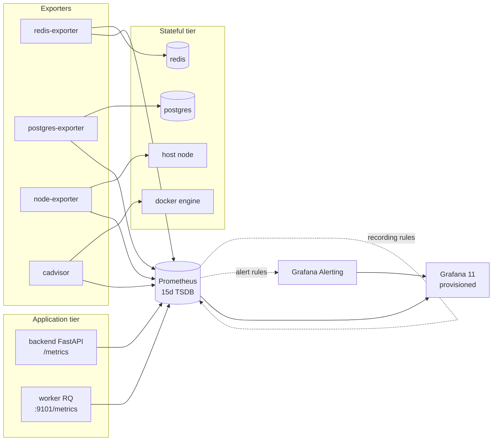

# Phase 9 — Observability Verification

This phase replaces the empty `infrastructure/` placeholder with a working
observability tier: structured backend metrics already existed, the worker
now exposes its own metrics endpoint, Prometheus scrapes everything,
recording rules pre-aggregate the heavy panels, alert rules guard SLOs,
and Grafana auto-provisions two dashboards.

## 1. Decisions

| # | Decision | Rationale | Alternative considered |
|---|----------|-----------|------------------------|
| 1 | Worker exposes its own `/metrics` on **port 9101** via `prometheus_client.start_http_server` | The worker is a long-running RQ consumer with no FastAPI; a dedicated HTTP server keeps the queue thread untouched. | Push to a Pushgateway — adds an extra moving part for a single-instance install |
| 2 | Metrics live in a separate `worker.app.metrics` module with a private `CollectorRegistry` | Keeps the global default registry free of side effects so unit tests can construct fresh registries without leakage. | Use the default registry — order-dependent, brittle in tests |
| 3 | `track_analysis_job()` context manager wraps the analyse fn but **does not** record outcome | Whether a run "succeeded" is decided after the persist phase; coupling the in-flight gauge to the success counter would mis-classify partial failures. | Decorator-style — less control over outcome timing |
| 4 | Recording rules pre-compute `:p95_5m`, `:rate1m`, `:5xx_ratio:rate5m` | Grafana panels read pre-aggregated series, keeping dashboard render time flat as cardinality grows. | Compute inline in the dashboard — slow at high refresh rates |
| 5 | Alerts (`BackendHighErrorRate`, `BackendHighLatency`, `AnalysisJobFailureRateHigh`, `WorkerDown`, etc.) live in `codesensei.yml` rule file | Ships with the platform; ops teams can fork-and-override without forking the whole repo. | Hard-code in Grafana — couples alerting to UI tool |
| 6 | No Alertmanager service (`alerting.alertmanagers: []`) | Single-tenant install; Grafana 11 fronts alert state via `alertingSimplifiedRouting`. | Run Alertmanager — ~80 MB resident with no consumers wired up |
| 7 | Observability stack joins **two networks**: `codesensei_internal` (to scrape app services) and `codesensei_observability` (for Grafana ↔ Prometheus) | Keeps the data plane and the scrape plane separate; only Prometheus + exporters straddle both. | One flat network — broadens the blast radius of a compromised exporter |
| 8 | Datasources + dashboards are file-provisioned | Idempotent: blow away `grafana-data` volume, restart, dashboards rebuild from `/etc/grafana/dashboards`. | Manual Grafana imports — drifts and is undocumented |
| 9 | Three exporters: `node-exporter`, `redis-exporter`, `postgres-exporter`, plus `cadvisor` | Covers host, queue, DB, and per-container resource curves — the four things that go wrong in production. | Skip cadvisor — leaves "which container is eating CPU?" unanswerable |
| 10 | Prometheus retains **15 days** of TSDB | Long enough to spot week-over-week trends; short enough that the volume stays under 5 GB on dev hardware. | 30 days default — wastes disk on a single-tenant box |

## 2. Files generated / modified

| Path | Change |
|------|--------|
| [worker/worker/app/metrics.py](../worker/worker/app/metrics.py) | New — Counter/Gauge/Histogram + `track_analysis_job` + `serve_metrics` |
| [worker/worker/app/__main__.py](../worker/worker/app/__main__.py) | Wires `serve_metrics` on startup; tolerates port-in-use |
| [worker/worker/app/settings.py](../worker/worker/app/settings.py) | Added `metrics_enabled` + `metrics_port` (default 9101) |
| [worker/worker/app/tasks/analyze_repository.py](../worker/worker/app/tasks/analyze_repository.py) | Wrapped run() in `track_analysis_job()`; emits files/chunks/outcome counters |
| [infrastructure/prometheus/prometheus.yml](../infrastructure/prometheus/prometheus.yml) | New — scrape config (backend, worker, redis-exporter, postgres-exporter, node-exporter, cadvisor) |
| [infrastructure/prometheus/rules/codesensei.yml](../infrastructure/prometheus/rules/codesensei.yml) | New — recording + alerting groups |
| [infrastructure/grafana/provisioning/datasources/prometheus.yml](../infrastructure/grafana/provisioning/datasources/prometheus.yml) | New — auto-provisioned datasource |
| [infrastructure/grafana/provisioning/dashboards/codesensei.yml](../infrastructure/grafana/provisioning/dashboards/codesensei.yml) | New — dashboard provider config |
| [infrastructure/grafana/dashboards/backend-overview.json](../infrastructure/grafana/dashboards/backend-overview.json) | New — request rate, p95 latency, 5xx ratio, top paths, AI usage |
| [infrastructure/grafana/dashboards/analysis-pipeline.json](../infrastructure/grafana/dashboards/analysis-pipeline.json) | New — jobs in-flight, completions, duration p50/p95/p99, files/chunks throughput |
| [docker/docker-compose.observability.yml](../docker/docker-compose.observability.yml) | New — Prometheus + Grafana + 4 exporters; uses `external: true` to attach to the base stack's networks |

## 3. Execution flow



## 4. Metric inventory

| Series | Source | Type | Use |
|--------|--------|------|-----|
| `http_requests_total{method,path,status}` | backend middleware | Counter | Traffic & error-rate panels |
| `http_request_duration_seconds_bucket{method,path}` | backend middleware | Histogram | p95 latency, SLO alert |
| `analysis_jobs_enqueued_total` | backend service | Counter | Submission rate |
| `ai_chat_requests_total{cache}` | backend AI service | Counter | Cache hit-rate panel |
| `app_build_info{version,env}` | backend | Gauge | Deploy markers |
| `worker_analysis_jobs_processed_total{status}` | worker | Counter | Failure-rate alert |
| `worker_analysis_job_duration_seconds_bucket` | worker | Histogram | Pipeline p50/p95/p99 |
| `worker_analysis_files_processed_total` | worker | Counter | Throughput |
| `worker_analysis_chunks_indexed_total` | worker | Counter | Embedding throughput |
| `worker_jobs_in_flight` | worker | Gauge | Backlog detection |
| `worker_build_info{version}` | worker | Gauge | Deploy markers |
| `up{job}` | Prometheus | Gauge | Uptime stat per service |

## 5. Verification commands

> Run from the repo root in PowerShell.

### 5.1  Static lint of the observability overlay

```powershell
Copy-Item .env.example .env -Force
docker compose -f docker/docker-compose.yml `
               -f docker/docker-compose.observability.yml `
               --env-file .env config --quiet
```

Expected: exit `0`, no output.

**Last run:** `EXIT=0`. ✅

### 5.2  YAML / JSON well-formedness (no docker required)

```powershell
$py = "..\github-repo-intelligence-platform\analysis-engine\.venv\Scripts\python.exe"
& $py -c "import yaml; yaml.safe_load(open('infrastructure/prometheus/prometheus.yml')); yaml.safe_load(open('infrastructure/prometheus/rules/codesensei.yml')); print('YAML OK')"
& $py -c "import json; json.load(open('infrastructure/grafana/dashboards/backend-overview.json')); json.load(open('infrastructure/grafana/dashboards/analysis-pipeline.json')); print('JSON OK')"
```

Expected: `YAML OK` and `JSON OK`.

**Last run:** both confirmed. ✅

### 5.3  Application + worker tests still green

```powershell
cd worker;  $env:PYTHONPATH="$PWD;..\backend"; ..\analysis-engine\.venv\Scripts\python.exe -m pytest tests/ -q
cd ..\backend; $env:PYTHONPATH=$PWD; ..\analysis-engine\.venv\Scripts\python.exe -m pytest tests/ -q
```

**Last run:** `14 passed` (worker), `60 passed` (backend). ✅

### 5.4  Live verification (Docker required)

```powershell
make up           # base stack
make obs-up       # Prometheus + Grafana + exporters

# Targets up?
Invoke-RestMethod http://localhost:9090/api/v1/targets | `
    Select-Object -ExpandProperty data | `
    Select-Object -ExpandProperty activeTargets | `
    ForEach-Object { "$($_.labels.job) -> $($_.health)" }

# Should print: backend → up, worker → up, redis → up, postgres → up,
#               node → up, cadvisor → up, prometheus → up.

# Worker /metrics directly
Invoke-WebRequest http://localhost:9101/metrics | Select-Object -ExpandProperty Content |
    Select-String "worker_analysis_jobs_processed_total"

# Grafana
Start-Process http://localhost:${env:GRAFANA_PORT-3000}
# Login admin/admin → "CodeSensei" folder → two dashboards.
```

### 5.5  Alerting smoke (kill the backend on purpose)

```powershell
docker compose -f docker/docker-compose.yml stop backend
# Wait 2 minutes, then:
Invoke-RestMethod http://localhost:9090/api/v1/alerts |
    Select-Object -ExpandProperty data |
    Select-Object -ExpandProperty alerts |
    Where-Object { $_.labels.alertname -eq "BackendDown" }
# Expect at least one alert with state="firing".
docker compose -f docker/docker-compose.yml start backend
```

## 6. Operational notes

* **Cardinality budget**: per-path labels are bounded by FastAPI route templates (≈30 routes), giving ~600 series for the request histogram. Add new labels deliberately.
* **Retention**: `--storage.tsdb.retention.time=15d` set in compose; tune via the `prometheus` service command list.
* **Dashboards as code**: edits made in the Grafana UI are *not* persisted — they're overwritten on container restart. Update the JSON in `infrastructure/grafana/dashboards/` and reload.
* **Resource cost**: full observability stack adds ~600 MB RAM and ~10% of one CPU on idle dev hardware; opt-in via `make obs-up`.
