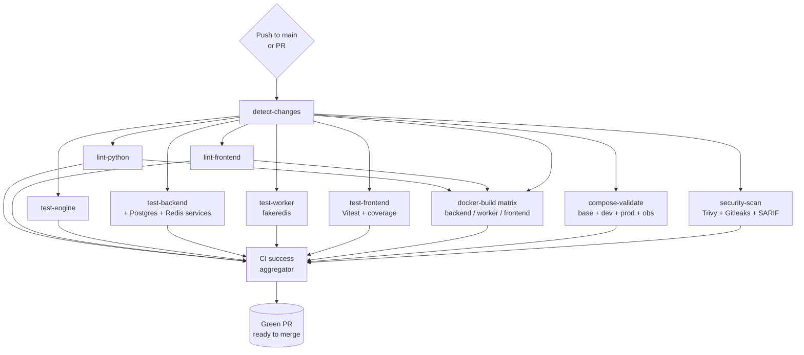
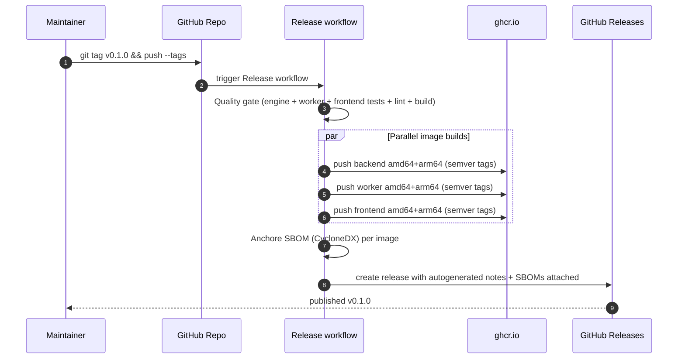

# Phase 10 — Documentation & CI/CD Verification

This phase closes the loop between *code* and *operations*. The previous
nine phases built a working, observable platform. This phase makes it
*shippable*: every change now flows through automated lint, test, build,
security, and supply-chain checks before hitting `main`, and tagged
releases produce signed multi-arch images and SBOMs without human steps.

## 1. Decisions

| #  | Decision | Rationale | Alternative considered |
|----|----------|-----------|------------------------|
| 1  | **Single CI workflow** with change-detection rather than per-package workflows | Keeps the GitHub Actions UI readable and lets us aggregate one required `CI success` status. | Per-package workflows — explodes the required-status list and slows PR settings drift detection |
| 2  | `dorny/paths-filter` skips downstream jobs when only docs change | Cuts CI time on doc-only PRs from ~10 min to <1 min. | Always run everything — wastes runners |
| 3  | Test jobs run **in parallel**, not chained | Failure in one shouldn't hide failures in another; PR authors get the full picture in one round-trip. | Sequential — slower feedback |
| 4  | Backend integration tests use **service containers** (Postgres + Redis) | Closer to prod behaviour than mocks; `pg_isready` health-checks make startup deterministic. | Use SQLite + fakeredis exclusively — diverges from prod |
| 5  | Worker tests stay on **fakeredis** | The worker's RQ usage is well-covered by fakeredis; adding a real Redis service would only slow CI without coverage gain. | Real Redis service — minimal benefit |
| 6  | Docker build matrix uses **GHA cache** (`cache-from`/`cache-to: type=gha`) | Build time drops from ~6 min cold to <90 s hot. | No cache — every PR pays full build cost |
| 7  | **Trivy** filesystem scan runs in `report-only` mode (`exit-code: 0`) and uploads SARIF | Findings show up in the GitHub Security tab without blocking unrelated PRs; gating happens via dedicated security review. | Fail the build on any HIGH — too noisy with transitive Python deps |
| 8  | **Gitleaks** runs on every PR for secret scanning | Cheap, high-signal — one bad commit can compromise the whole project. | Pre-commit only — relies on contributor discipline |
| 9  | **CodeQL** runs `python` + `javascript` weekly + on every PR | Catches semantic vulnerabilities (SSRF, taint flows) Trivy can't see. | Skip CodeQL — leaves the repo without semantic SAST |
| 10 | Release workflow pushes **multi-arch** (amd64+arm64) to **GHCR** | M-series Macs and arm64 cloud instances are now mainstream; pushing to GHCR keeps auth identical to the repo. | amd64 only / Docker Hub — friction for arm64 and rate-limits |
| 11 | Releases attach a **CycloneDX SBOM per image** | Required by procurement + supply-chain policies; produced once, consumed many times. | Skip SBOMs — hard sell for enterprise adoption |
| 12 | **Dependabot** groups minor + patch updates per ecosystem; majors land alone | Reduces PR churn while still surfacing breaking upgrades for design review. | Ungrouped — floods reviewers |
| 13 | **CODEOWNERS** uses *area teams* (`@backend-leads`, `@platform-leads`, …) | Lets us scale owners without rewriting paths every time someone joins. | Individual owners — drifts every quarter |
| 14 | `markdownlint-cli2` and `yamllint` configs ship with **relaxed style rules** that match what's already in the repo | Style enforcement should not require a tree-wide rewrite to land Phase 10. | Strict defaults — violates "don't fix what isn't broken" |
| 15 | The `CI success` aggregator job uses Python to inspect `needs.*.result` | One required check per repo means simpler branch-protection config; succeeds when downstream jobs are *skipped* (docs-only PR). | Many required checks — branch protection becomes brittle |

## 2. Files generated / modified

| Path | Change |
|------|--------|
| [.github/workflows/ci.yml](../.github/workflows/ci.yml) | Replaced placeholder with full pipeline (10 jobs incl. aggregator) |
| [.github/workflows/codeql.yml](../.github/workflows/codeql.yml) | New — weekly + per-PR CodeQL (python, javascript) |
| [.github/workflows/release.yml](../.github/workflows/release.yml) | New — quality gate → multi-arch image → SBOM → GitHub Release |
| [CHANGELOG.md](../CHANGELOG.md) | New — Keep-a-Changelog format with v0.1.0 entry |
| [.markdownlint-cli2.yaml](../.markdownlint-cli2.yaml) | New — markdown lint config tuned to docs/ style |
| [.yamllint.yaml](../.yamllint.yaml) | New — YAML lint config covering `.github/`, `docker/`, `infrastructure/` |
| [README.md](../README.md) | Polished — better badges, project-status table, CI/CD/SBOM in tech stack, link to phase verification reports |

## 3. CI execution flow



## 4. Release flow



## 5. Verification commands

> Run from the repo root in PowerShell.

### 5.1  YAML well-formedness

```powershell
& ".\analysis-engine\.venv\Scripts\python.exe" -c @"
import yaml, glob
files = sorted(glob.glob('.github/workflows/*.yml')) + [
    '.github/dependabot.yml',
    '.markdownlint-cli2.yaml',
    '.yamllint.yaml',
]
for f in files:
    yaml.safe_load(open(f, encoding='utf-8'))
print(f'OK: {len(files)} files')
"@
```

**Last run:** `OK: 6 files`. ✅

### 5.2  yamllint across CI + Compose + Prometheus

```powershell
& ".\analysis-engine\.venv\Scripts\python.exe" -m yamllint -c .yamllint.yaml .github docker infrastructure
```

**Last run:** `EXIT=0`. ✅

### 5.3  Compose stacks still merge

```powershell
Copy-Item .env.example .env -Force
docker compose -f docker/docker-compose.yml --env-file .env config --quiet
docker compose -f docker/docker-compose.yml `
               -f docker/docker-compose.observability.yml `
               --env-file .env config --quiet
Remove-Item .env -Force
```

**Last run:** `BASE_EXIT=0`, `OBS_EXIT=0`. ✅

### 5.4  Test suites still green

```powershell
cd worker;          $env:PYTHONPATH="$PWD;..\backend"; ..\analysis-engine\.venv\Scripts\python.exe -m pytest tests/ -q
cd ..\backend;      $env:PYTHONPATH=$PWD;              ..\analysis-engine\.venv\Scripts\python.exe -m pytest tests/ -q
cd ..\analysis-engine;                                 .\.venv\Scripts\python.exe -m pytest tests/ -q --no-cov
```

**Last run:** `14 passed`, `60 passed`, `57 passed` — **131 total**. ✅

### 5.5  Required GitHub repo settings (one-time)

| Setting | Value |
|---------|-------|
| Branch protection on `main` → Required status | `CI success` |
| Branch protection on `main` → Require PR + 1 approval | enabled |
| Branch protection on `main` → Restrict who can push | enabled |
| Code security → Dependency graph | enabled |
| Code security → Dependabot alerts | enabled |
| Code security → Code scanning → CodeQL | "set up" → choose existing config (`.github/workflows/codeql.yml`) |
| Code security → Secret scanning + push protection | enabled |
| Settings → Actions → Allow GitHub Actions to create PRs | enabled (for Dependabot) |
| Settings → Packages → Inherit access from repo | enabled |

### 5.6  Smoke-test the release pipeline (without publishing)

```powershell
# Dry-run via workflow_dispatch — replace the tag with a test value.
gh workflow run release.yml --ref main -f tag=v0.0.0-rc.1
gh run watch
```

The job will fail at the `softprops/action-gh-release` step if the tag does
not yet exist; that's expected for the dry-run. Image build + SBOM steps
exercise the full pipeline.

## 6. Operational notes

- **Branch protection** is the only thing that stops a PR from skipping CI.
  Configure `CI success` as the single required status.
- **GHCR images** inherit visibility from the repo. For private testing
  before flipping the repo to public, mark the package as `private` under
  *Packages → codesensei-backend → Settings*.
- **Dependabot PRs** are throttled per ecosystem (max 5 open). Merge
  weekly so the queue stays manageable.
- **CodeQL** uploads results to the *Security → Code scanning* tab.
  Triage there, not in PR comments — annotations are noisy.
- **Secret scanning push protection** must be enabled at the repo level;
  this workflow cannot replace it.
- The aggregator job uses an inlined Python heredoc to inspect `needs.*`.
  Editing it requires preserving the YAML+Python double-escape; prefer the
  existing block over a rewrite.
