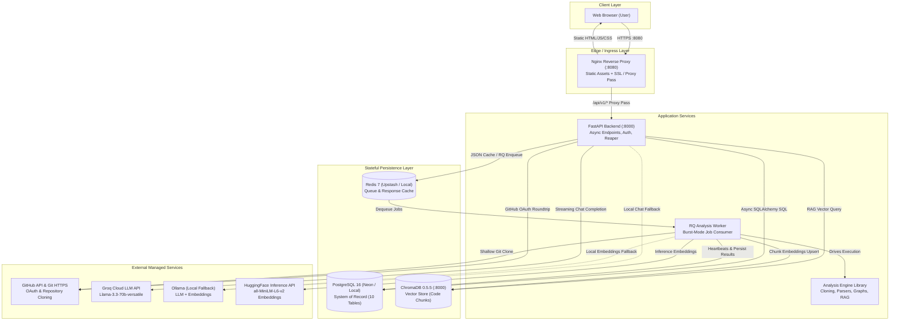

# 01. Project Overview — CodeSensei Platform

> **Status:** Grounded in codebase as of August 2026.  
> **Applicable Repository Components:** [backend/](file:///c:/Users/nikhil/Desktop/projectss/github-repo-intelligence-platform/codesensei-github-repo-intelligence-platform/backend), [worker/](file:///c:/Users/nikhil/Desktop/projectss/github-repo-intelligence-platform/codesensei-github-repo-intelligence-platform/worker), [analysis-engine/](file:///c:/Users/nikhil/Desktop/projectss/github-repo-intelligence-platform/codesensei-github-repo-intelligence-platform/analysis-engine), [frontend/](file:///c:/Users/nikhil/Desktop/projectss/github-repo-intelligence-platform/codesensei-github-repo-intelligence-platform/frontend).

---

## 1. What the System Does

**CodeSensei** is a full-stack, distributed **GitHub Repository Intelligence Platform**. Given a public GitHub repository URL, the system:
1. Performs a sandboxed, shallow Git clone (`depth=1`).
2. Runs static code analysis across multiple programming languages (Python AST, Tree-sitter, and Regex fallbacks).
3. Extracts declarations, functions, classes, and file-level import relationships.
4. Generates an interactive directed dependency graph, detecting circular import dependencies using Tarjan's Strongly Connected Components algorithm.
5. Computes cyclomatic and cognitive complexity metrics and estimates dead/unreachable symbols.
6. Performs reverse-dependency blast-radius analysis ("If I change file X, what breaks upstream?").
7. Clusters components into architectural layers and produces Mermaid architecture diagrams.
8. Indexes code semantically into ChromaDB using symbol-aware chunking and provides conversational natural-language Q&A (RAG) with inline file and line citations over streaming Server-Sent Events (SSE).
9. Provides a public repository discovery hub, starring system, and analyst profiles.

---

## 2. The Problem It Solves

Software engineers, architects, and technical leads waste significant time orienting themselves in unfamiliar codebases:
- **Slow Onboarding:** Navigating large open-source repositories or new company codebases typically requires days of manual file browsing.
- **Hidden Coupling:** IDEs provide localized "jump to definition", but do not visualize system-wide dependency structures or detect circular dependency chains across modules.
- **Risk Blindness:** Evaluating the blast radius of changing a core file or refactoring an interface requires manually tracing reverse dependencies.
- **Hallucinating AI Tools:** Generic LLM chat tools lack repository grounding, produce outdated APIs, and cannot point to exact file and line numbers.

CodeSensei solves this by treating a repository as a **structured data asset**: parsing it into a relational knowledge graph, computing objective graph and complexity metrics, and grounding an LLM retrieval pipeline in verified source code slices.

---

## 3. Users and Personas

| Persona | Primary Use Case | Key System Interactions |
| :--- | :--- | :--- |
| **New Hire / Onboarding Engineer** | Rapidly understand how a codebase is structured without asking senior peers for walkthroughs. | Explores Overview dashboard, inspects interactive Dependency Graph, asks questions in AI Chat with source citations. |
| **Staff / Senior Architect** | Audit codebase health, identify modularity violations, and detect refactoring risks. | Reviews Cyclomatic/Cognitive Complexity tables, inspects circular import cycles, analyzes reverse-dependency blast radius on impact view. |
| **Open Source Contributor** | Learn the execution flow of an unfamiliar open-source library before submitting a pull request. | Reads auto-generated onboarding documentation, inspects layer architecture Mermaid diagrams, tags specific files for AI context. |
| **Engineering Manager** | Gain visibility into technical debt, language distribution, and dead code ratios across projects. | Reviews Public Discover hub, language breakdown charts, and dead-code confidence tables. |

---

## 4. Core Capabilities

| Capability | Implementation Mechanism | Ground Truth Source |
| :--- | :--- | :--- |
| **Sandboxed Shallow Cloning** | `GitCloner` via GitPython (`depth=1`), branch-aware, workspace isolation. | [git_cloner.py](file:///c:/Users/nikhil/Desktop/projectss/github-repo-intelligence-platform/codesensei-github-repo-intelligence-platform/analysis-engine/engine/cloning/git_cloner.py) |
| **Multi-Language Parsing** | 3-tier registry: Python native AST, Tree-sitter (TS/JS/Go/Rust/Java/C/C++/C#/Ruby), Regex fallback. | [registry.py](file:///c:/Users/nikhil/Desktop/projectss/github-repo-intelligence-platform/codesensei-github-repo-intelligence-platform/analysis-engine/engine/parsers/registry.py) |
| **Interactive Graph & Cycles** | Directed file-level import graph with Cytoscape.js; cycle detection via Tarjan's SCC. | [builder.py](file:///c:/Users/nikhil/Desktop/projectss/github-repo-intelligence-platform/codesensei-github-repo-intelligence-platform/analysis-engine/engine/graph/builder.py), [cycles.py](file:///c:/Users/nikhil/Desktop/projectss/github-repo-intelligence-platform/codesensei-github-repo-intelligence-platform/analysis-engine/engine/graph/cycles.py) |
| **Complexity Ranking** | Cyclomatic + cognitive complexity scoring per file, function, and class. | [metric_service.py](file:///c:/Users/nikhil/Desktop/projectss/github-repo-intelligence-platform/codesensei-github-repo-intelligence-platform/backend/app/services/metric_service.py) |
| **Dead Code Detection** | Unused exported and unreferenced symbol reachability analysis with confidence weighting. | [detector.py](file:///c:/Users/nikhil/Desktop/projectss/github-repo-intelligence-platform/codesensei-github-repo-intelligence-platform/analysis-engine/engine/dead_code/detector.py) |
| **Impact Analysis** | Upstream reverse-dependency BFS traversal with exponential distance decay risk scoring. | [impact_service.py](file:///c:/Users/nikhil/Desktop/projectss/github-repo-intelligence-platform/codesensei-github-repo-intelligence-platform/backend/app/services/impact_service.py) |
| **Architecture Discovery** | Component and layer clustering (controllers, services, repos, models, infra) producing Mermaid syntax. | [classifier.py](file:///c:/Users/nikhil/Desktop/projectss/github-repo-intelligence-platform/codesensei-github-repo-intelligence-platform/analysis-engine/engine/architecture/classifier.py) |
| **Documentation Generator** | Fact-grounded markdown generator (README, Architecture, API, Onboarding, Summary) without LLM latency. | [documentation_service.py](file:///c:/Users/nikhil/Desktop/projectss/github-repo-intelligence-platform/codesensei-github-repo-intelligence-platform/backend/app/services/documentation_service.py) |
| **Grounded RAG AI Assistant** | Symbol-aware code chunking, ChromaDB vector search, token streaming via Groq or Ollama over SSE. | [rag_chain.py](file:///c:/Users/nikhil/Desktop/projectss/github-repo-intelligence-platform/codesensei-github-repo-intelligence-platform/analysis-engine/engine/ai/rag_chain.py) |
| **Persistent Multi-Turn Chat** | User-private persistent chat sessions, dual-transaction streaming, attached context chips. | [chat_session_service.py](file:///c:/Users/nikhil/Desktop/projectss/github-repo-intelligence-platform/codesensei-github-repo-intelligence-platform/backend/app/services/chat_session_service.py) |
| **Repository-Centric Social Hub** | Public discovery grouped by repository, idempotent starring, and user profile portfolios. | [discover.py](file:///c:/Users/nikhil/Desktop/projectss/github-repo-intelligence-platform/codesensei-github-repo-intelligence-platform/backend/app/api/v1/endpoints/discover.py), [stars.py](file:///c:/Users/nikhil/Desktop/projectss/github-repo-intelligence-platform/codesensei-github-repo-intelligence-platform/backend/app/api/v1/endpoints/stars.py) |
| **Crash Recovery & Heartbeats** | Periodic background reaper sweeping stale jobs; worker progress heartbeats clearing partial unique index. | [analysis_reaper.py](file:///c:/Users/nikhil/Desktop/projectss/github-repo-intelligence-platform/codesensei-github-repo-intelligence-platform/backend/app/services/analysis_reaper.py) |

---

## 5. Major Architectural Components

The platform consists of four primary custom software modules and three stateful backing services:

```
┌────────────────────────────────────────────────────────────────────────┐
│                              FRONTEND SPA                              │
│  React 18 + TypeScript + Vite + TailwindCSS + Zustand + Cytoscape.js   │
│  Served via Nginx on :8080 (Reverse Proxy to /api/v1)                  │
└───────────────────────────────────┬────────────────────────────────────┘
                                    │ HTTP / REST / SSE
                                    ▼
┌────────────────────────────────────────────────────────────────────────┐
│                              BACKEND API                               │
│  FastAPI (Uvicorn) + SQLAlchemy 2.0 Async + Pydantic v2 + structlog    │
│  - REST Endpoints & Authentication Guards (JWT Cookies)                │
│  - SSE Progress & AI Token Streamers                                   │
│  - Stuck-Job Background Reaper Loop                                    │
└───────┬───────────────────────────┬────────────────────────────┬───────┘
        │ Enqueue Job               │ SQL Read/Write             │ Cache / Ping
        ▼                           ▼                            ▼
┌───────────────┐           ┌───────────────┐            ┌───────────────┐
│  REDIS QUEUE  │           │  POSTGRESQL   │            │  REDIS CACHE  │
│  (Redis 7 /   │           │  (PG 16 /     │            │  (In-Memory   │
│  Upstash TLS) │           │  Neon Server) │            │  JSON TTL)    │
└───────┬───────┘           └───────▲───────┘            └───────────────┘
        │ Dequeue Job               │ Persist Rows
        ▼                           │
┌───────────────────────────────────┴────────────────────────────────────┐
│                             ANALYSIS WORKER                            │
│  Python RQ Consumer (SimpleWorker, Burst Mode for Serverless Redis)    │
│  Drives AnalysisOrchestrator: Clone -> Walk -> Parse -> Graph -> Index │
└───────┬───────────────────────────┬────────────────────────────────────┘
        │ Invokes                   │ Vector Upsert
        ▼                           ▼
┌───────────────────────────┐ ┌──────────────────────────────────────────┐
│      ANALYSIS ENGINE      │ │                 CHROMADB                 │
│ Standalone Python Library │ │  Standalone Vector Store (v0.5.5)        │
│ AST + Tree-sitter + Regex │ │  Collections: `repo_<repository_id>`     │
└───────────────────────────┘ └──────────────────────────────────────────┘
```

---

## 6. High-Level Architecture Diagram (Current Implementation)



---

## 7. High-Level Request & Data Flow

1. **Submission & Ingestion:**
   - User inputs a GitHub URL in the frontend.
   - Frontend issues `POST /api/v1/repositories`.
   - Backend validates the URL against strict SSRF rules, creates a `repositories` record with status `PENDING`, creates an `analysis_jobs` record with status `QUEUED`, and enqueues the job to Redis RQ.
   - Backend immediately responds with `202 Accepted` returning the job metadata.
   - The frontend establishes a persistent connection to `GET /api/v1/repositories/{id}/events` to receive real-time Server-Sent Events (SSE).

2. **Background Execution:**
   - The worker picks up the job from the Redis queue.
   - Worker marks job `RUNNING`, repository `ANALYZING`, and issues initial heartbeat.
   - `GitCloner` shallow-clones the repo to a sandboxed workspace.
   - `FileWalker` filters ignore paths and discovers source files.
   - `AnalysisOrchestrator` parses files concurrently via `ThreadPoolExecutor` using the 3-tier parser registry.
   - Graph builder resolves imports into dependency edges; Tarjan's algorithm checks for cycles.
   - Complexity metrics and dead-code reachability scores are calculated.
   - Architecture classifier clusters files into layers.
   - Worker wipes prior file data in PostgreSQL for the repository and atomically persists new source files, metrics, symbols, and dependencies.
   - Worker chunks code, calls embedding provider (HuggingFace or local), and upserts vectors into ChromaDB collection `repo_<repository_id>`.
   - Worker marks repository `READY` and job `SUCCEEDED`.

3. **Consumption & Exploration:**
   - SSE connection notifies frontend of `succeeded` status.
   - Frontend fetches analysis data across dedicated endpoints: Overview, Graph, Complexity, Dead Code, Architecture, and Impact.
   - Heavy read endpoints (Dependency Graph, Dead Code, Architecture) check Redis cache first before querying Postgres.

4. **Conversational RAG Q&A:**
   - User creates a persistent chat session (`POST /api/v1/repositories/{id}/chat-sessions`).
   - User sends a question (`POST /api/v1/chat-sessions/{id}/chat`).
   - Backend opens Transaction 1 to save the user turn.
   - Backend embeds the query, retrieves top-k similar chunks from ChromaDB, constructs a system prompt with source context, and streams tokens from Groq/Ollama.
   - Tokens and citations stream over SSE to the frontend in real time.
   - Upon stream completion, backend opens Transaction 2 to persist the assistant turn and citations.

---

## 8. Important Technical Characteristics

1. **Zero-Cost Deployment Topology:** The entire platform can run in two configurations:
   - **Self-Contained Local Stack:** All services (PostgreSQL, Redis, ChromaDB, Ollama, Backend, Worker, Frontend) run locally via Docker Compose.
   - **Free-Tier Cloud Stack:** Uses external serverless tiers (Neon PostgreSQL, Upstash Redis, Groq Cloud LLM, HuggingFace Inference API) with low container RAM limits (512MB backend, 1GB worker) requiring zero credit cards.
2. **Strict Concurrency Control:** A PostgreSQL partial unique index (`uq_active_job_per_repository`) guarantees at the database engine level that no two concurrent analysis jobs can run on the same repository.
3. **Resilient Self-Healing:** The backend runs a periodic stuck-job reaper that monitors worker heartbeat timestamps, failing dead jobs and unblocking repositories after worker crashes.
4. **IDOR Immunity:** Resource queries hide private repositories and unowned chat sessions behind generic `404 Not Found` responses, eliminating user enumeration vulnerabilities.
5. **Decoupled Engine:** The `analysis-engine` package is a standalone Python library with zero dependencies on FastAPI or PostgreSQL, enabling direct CLI execution, hermetic unit testing, and worker portability.
