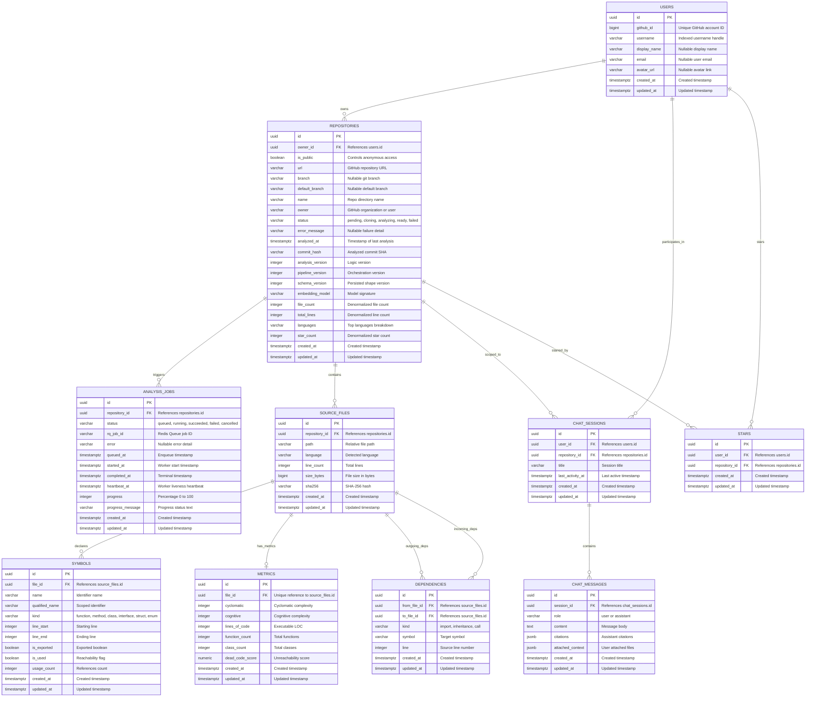
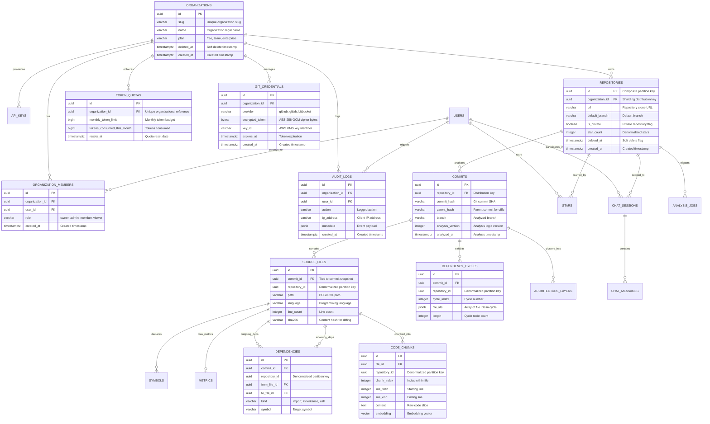

# 04. Domain Model & Relational Entities

> **Status:** Grounded directly in SQLAlchemy 2.0 ORM models and Alembic revisions 0001 through 0007.  
> **Source Verification:** [backend/app/models/](file:///c:/Users/nikhil/Desktop/projectss/github-repo-intelligence-platform/codesensei-github-repo-intelligence-platform/backend/app/models/), [backend/alembic/versions/](file:///c:/Users/nikhil/Desktop/projectss/github-repo-intelligence-platform/codesensei-github-repo-intelligence-platform/backend/alembic/versions/).

---

## 1. Entity-Relationship Diagram (Mermaid)

---

## 2. Detailed Entity Specifications

### 2.1 User (`users`)
- **Purpose:** Represents an authenticated user account, keyed primarily on their immutable GitHub account identity.
- **Primary Key:** `id` (`UUID`, default `uuid.uuid4`).
- **Fields:**
  - `github_id` (`BigInteger`, non-nullable, unique, indexed): Numeric GitHub ID. Single source of identity across re-authentications.
  - `username` (`String(255)`, non-nullable, indexed): Current GitHub handle.
  - `display_name` (`String(255)`, nullable): User's profile display name.
  - `email` (`String(320)`, nullable): User's primary email.
  - `avatar_url` (`String(1024)`, nullable): URL to GitHub avatar.
  - `created_at`, `updated_at` (`DateTime(timezone=True)`, non-nullable, default `now()`).
- **Relationships:**
  - `repositories`: `list[Repository]` back-populates `owner_user`, cascade `all, delete-orphan`.
- **Why It Exists:** Enables repository ownership, private chat session history, and starring without requiring passwords.

### 2.2 Repository (`repositories`)
- **Purpose:** Central entity representing an analyzed GitHub repository snapshot.
- **Primary Key:** `id` (`UUID`, default `uuid.uuid4`).
- **Foreign Keys:**
  - `owner_id` (`UUID`, nullable, references `users.id` with `ondelete="CASCADE"`, indexed). Nullable only for legacy rows created before auth was introduced.
- **Unique Constraints:**
  - `uq_repositories_owner_id_url_branch`: `(owner_id, url, branch)`. Ensures each user maintains their own independent copy of a repository branch.
- **Fields:**
  - `is_public` (`Boolean`, non-nullable, default `False`, indexed): When true, allows anyone with the link to read analysis data.
  - `url` (`String(2048)`, non-nullable, indexed): Canonical GitHub HTTPS URL.
  - `branch`, `default_branch` (`String(255)`, nullable): Analyzed branch name.
  - `name`, `owner` (`String(255)`, non-nullable, `owner` indexed): Extracted repository and organization names.
  - `status` (`Enum(RepositoryStatus)`, non-nullable, default `PENDING`, indexed): `pending`, `cloning`, `analyzing`, `ready`, `failed`.
  - `error_message` (`String(2048)`, nullable): Error explanation if analysis failed.
  - `analyzed_at` (`DateTime(timezone=True)`, nullable): Completion time of the most recent successful run.
  - `commit_hash` (`String(40)`, nullable): Git SHA-1 commit analyzed.
  - `analysis_version`, `pipeline_version`, `schema_version` (`Integer`, nullable): Monotonic version stamps from `shared/config/analysis_version.py`.
  - `embedding_model` (`String(255)`, nullable): Provider signature (`"provider:model"`) used during vector indexing.
  - `file_count` (`Integer`, default `0`), `total_lines` (`Integer`, default `0`), `languages` (`String(512)`, nullable): Denormalized aggregations.
  - `star_count` (`Integer`, default `0`, indexed): Denormalized star counter for fast discovery hub sorting.
- **Relationships:**
  - `jobs`: `list[AnalysisJob]` back-populates `repository`, cascade `all, delete-orphan`, `lazy="selectin"`.
  - `files`: `list[SourceFile]` back-populates `repository`, cascade `all, delete-orphan`.
- **Lifecycle & Cascades:** Deleting a repository cascades cleanly across all jobs, files, symbols, dependencies, metrics, chat sessions, and stars.

### 2.3 AnalysisJob (`analysis_jobs`)
- **Purpose:** Represents an individual background worker invocation to clone, parse, and analyze a repository.
- **Primary Key:** `id` (`UUID`, default `uuid.uuid4`).
- **Foreign Keys:**
  - `repository_id` (`UUID`, non-nullable, references `repositories.id` with `ondelete="CASCADE"`, indexed).
- **Unique Indexes:**
  - `uq_active_job_per_repository`: Partial unique index on `(repository_id)` `WHERE status IN ('queued', 'running')` (added in migration `0006_active_job_unique.py`).
- **Fields:**
  - `status` (`Enum(AnalysisJobStatus)`, non-nullable, default `QUEUED`, indexed): `queued`, `running`, `succeeded`, `failed`, `cancelled`.
  - `rq_job_id` (`String(64)`, nullable, indexed): Redis Queue job tracking identifier.
  - `error` (`String(4096)`, nullable): Failure message or stack trace snippet.
  - `queued_at` (`DateTime(timezone=True)`, non-nullable): Submission timestamp.
  - `started_at`, `completed_at` (`DateTime(timezone=True)`, nullable): Execution lifecycle timestamps.
  - `heartbeat_at` (`DateTime(timezone=True)`, nullable): Liveness heartbeat written periodically by worker.
  - `progress` (`Integer`, default `0`): Granular completion percentage (0–100).
  - `progress_message` (`String(512)`, nullable): Human-readable current operation description.
- **Why It Exists:** Tracks asynchronous execution status, feeds SSE events, and provides idempotency and crash recovery.

### 2.4 SourceFile (`source_files`)
- **Purpose:** Represents an individual analyzed source code file within a repository.
- **Primary Key:** `id` (`UUID`, default `uuid.uuid4`).
- **Foreign Keys:**
  - `repository_id` (`UUID`, non-nullable, references `repositories.id` with `ondelete="CASCADE"`, indexed).
- **Unique Constraints & Indexes:**
  - `uq_source_files_repo_path`: `(repository_id, path)`. Prevents duplicate files in a single repository run.
  - `ix_source_files_language`: Index on `(language)`.
- **Fields:**
  - `path` (`String(1024)`, non-nullable): POSIX relative path from repository root.
  - `language` (`String(32)`, non-nullable): Canonical detected language (`python`, `typescript`, `go`, etc.).
  - `line_count` (`Integer`, default `0`), `size_bytes` (`BigInteger`, default `0`).
  - `sha256` (`String(64)`, nullable): File content SHA-256 hash.
- **Relationships:**
  - `symbols`: `list[Symbol]`, cascade `all, delete-orphan`.
  - `metric`: `Metric | None`, cascade `all, delete-orphan`, `uselist=False`.
  - `outgoing_deps`: `list[Dependency]` (`from_file_id`), cascade `all, delete-orphan`.
  - `incoming_deps`: `list[Dependency]` (`to_file_id`).

### 2.5 Symbol (`symbols`)
- **Purpose:** Represents a declared identifier (function, class, interface, method, etc.) inside a source file.
- **Primary Key:** `id` (`UUID`, default `uuid.uuid4`).
- **Foreign Keys:**
  - `file_id` (`UUID`, non-nullable, references `source_files.id` with `ondelete="CASCADE"`, indexed).
- **Indexes:**
  - `ix_symbols_file_kind`: `(file_id, kind)`.
  - `ix_symbols_name`: `(name)`.
  - `ix_symbols_is_used`: `(is_used)`.
- **Fields:**
  - `name` (`String(512)`, non-nullable): Identifier name.
  - `qualified_name` (`String(1024)`, nullable): Scoped name (e.g. `ClassName.method_name`).
  - `kind` (`Enum(SymbolKind)`, non-nullable): `function`, `method`, `class`, `interface`, `struct`, `enum`, `variable`, `constant`, `type_alias`, `module`.
  - `line_start`, `line_end` (`Integer`, default `0`).
  - `is_exported` (`Boolean`, default `False`): True if exported or public.
  - `is_used` (`Boolean`, default `True`, indexed): Reachability indicator.
  - `usage_count` (`Integer`, default `0`): Internal references count.
- **Why It Exists:** Powers dead-code detection, symbol-aware code chunking, and node inspection.

### 2.6 Dependency (`dependencies`)
- **Purpose:** Directed edge representing an import, inheritance, call, or reference between two files.
- **Primary Key:** `id` (`UUID`, default `uuid.uuid4`).
- **Foreign Keys:**
  - `from_file_id` (`UUID`, non-nullable, references `source_files.id` with `ondelete="CASCADE"`, indexed).
  - `to_file_id` (`UUID`, non-nullable, references `source_files.id` with `ondelete="CASCADE"`, indexed).
- **Unique Constraints:**
  - `uq_dependencies_edge`: `(from_file_id, to_file_id, kind, symbol)`. Eliminates duplicate edges.
- **Fields:**
  - `kind` (`Enum(DependencyKind)`, non-nullable): `import`, `inheritance`, `call`, `instantiation`, `reference`.
  - `symbol` (`String(512)`, nullable): Specific imported symbol name.
  - `line` (`Integer`, nullable): Source file line number.
- **Why It Exists:** Powers dependency graph rendering, cycle detection (Tarjan's), and reverse-dependency blast-radius analysis.

### 2.7 Metric (`metrics`)
- **Purpose:** Per-file aggregated complexity and quality metrics computed by the analysis engine.
- **Primary Key:** `id` (`UUID`, default `uuid.uuid4`).
- **Foreign Keys:**
  - `file_id` (`UUID`, non-nullable, references `source_files.id` with `ondelete="CASCADE"`, unique, indexed).
- **Indexes:**
  - `ix_metrics_cyclomatic`: `(cyclomatic)`.
  - `ix_metrics_dead_code_score`: `(dead_code_score)`.
- **Fields:**
  - `cyclomatic` (`Integer`, default `0`): Cyclomatic complexity (decision points).
  - `cognitive` (`Integer`, default `0`): Cognitive complexity (nesting penalties).
  - `lines_of_code` (`Integer`, default `0`): Executable lines of code.
  - `function_count`, `class_count` (`Integer`, default `0`).
  - `dead_code_score` (`Numeric(precision=4, scale=3)`, default `0`): Unreachability likelihood (0.000 to 1.000).

### 2.8 ChatSession (`chat_sessions`)
- **Purpose:** Represents a persistent, private multi-turn conversation between a user and the AI assistant, grounded in a specific repository.
- **Primary Key:** `id` (`UUID`, default `uuid.uuid4`).
- **Foreign Keys:**
  - `user_id` (`UUID`, non-nullable, references `users.id` with `ondelete="CASCADE"`, indexed).
  - `repository_id` (`UUID`, non-nullable, references `repositories.id` with `ondelete="CASCADE"`, indexed).
- **Indexes:**
  - `ix_chat_sessions_user_repo_activity`: Composite index on `(user_id, repository_id, last_activity_at)`. Optimizes listing a user's conversations for a repo, newest first.
- **Fields:**
  - `title` (`String(200)`, default `"New chat"`). Auto-titled from the first question.
  - `last_activity_at` (`DateTime(timezone=True)`, server default `now()`): Bumped on every new message.
- **Privacy Invariant:** Visible strictly to `user_id`. Even if the repository is public, chat sessions are private. Non-owners receive 404.

### 2.9 ChatMessage (`chat_messages`)
- **Purpose:** Represents a single conversational turn within a `ChatSession`.
- **Primary Key:** `id` (`UUID`, default `uuid.uuid4`).
- **Foreign Keys:**
  - `session_id` (`UUID`, non-nullable, references `chat_sessions.id` with `ondelete="CASCADE"`, indexed).
- **Indexes:**
  - `ix_chat_messages_session_id`: `(session_id)`.
  - `ix_chat_messages_session_created`: `(session_id, created_at)`. Optimizes reading message history in chronological order.
- **Fields:**
  - `role` (`String(16)`, non-nullable): `"user"` or `"assistant"`.
  - `content` (`Text`, non-nullable): Full message text.
  - `citations` (`JSONB`, nullable): For assistant turns: array of `{file_path, line_start, line_end, symbol, snippet}`.
  - `attached_context` (`JSONB`, nullable): For user turns: array of `{path, language}` representing tagged context chips.

### 2.10 Star (`stars`)
- **Purpose:** Join entity representing a user's GitHub-style "star" on a repository.
- **Primary Key:** `id` (`UUID`, default `uuid.uuid4`).
- **Foreign Keys:**
  - `user_id` (`UUID`, non-nullable, references `users.id` with `ondelete="CASCADE"`, indexed).
  - `repository_id` (`UUID`, non-nullable, references `repositories.id` with `ondelete="CASCADE"`, indexed).
- **Unique Constraints:**
  - `uq_stars_user_repository`: `(user_id, repository_id)`. Guarantees a user can star a repository at most once.
- **Why It Exists:** Enables social appreciation and public discovery ranking while enforcing idempotency.

---

## 3. Scaled Architecture ER Diagram (Stage 2/3 Enterprise Schema) `[PROPOSED / SCALING OPTION]`

### 3.1 Does the Database Schema Change at Scale? Yes, and Why.

In a senior software engineering interview, when asked *"Does your relational schema change as you scale from 500 to 1,000,000 repositories?"*, the answer is an emphatic **YES**. 

A naive third-normal-form (3NF) relational schema designed for a single PostgreSQL instance breaks down under distributed horizontal scaling. Specifically, seven fundamental architectural requirements force the schema to evolve:

1. **Partitioning / Sharding Key Denormalization (`tenant_id` & `repository_id`):**
   - *Current Schema Problem:* In the Stage 0 schema, `symbols`, `dependencies`, and `metrics` only carry `file_id`. To distribute the database across multiple physical PostgreSQL nodes (e.g. using Citus or CockroachDB sharded by `repository_id` or `tenant_id`), any query retrieving dependencies or symbols for a repository would require cross-node distributed joins, destroying latency.
   - *Scaled Solution:* Denormalize `tenant_id` and `repository_id` onto every child table (`source_files`, `symbols`, `dependencies`, `metrics`, `code_chunks`). The primary key becomes composite: `PRIMARY KEY (tenant_id, id)` or `PRIMARY KEY (repository_id, id)`. This allows the distributed query router to colocate all data for a single repository on the exact same physical database shard with zero cross-node network hops.

2. **Multi-Tenancy, Organizations & RBAC (`organizations`, `organization_members`, `api_keys`):**
   - *Current Schema Problem:* Repositories are owned directly by a single individual `User` (`owner_id -> users.id`).
   - *Scaled Solution:* Enterprise scale demands organizational accounts with Role-Based Access Control (RBAC: `owner`, `admin`, `member`, `viewer`), SAML/SSO directory syncing, and automated machine API keys for CI/CD pipelines.

3. **Incremental Git Commit History & Branch Tracking (`commits`, `commit_files`):**
   - *Current Schema Problem:* Re-analysis executes a destructive full wipe-and-replace (`DELETE FROM source_files WHERE repository_id = :id`). All historical analysis snapshots are destroyed.
   - *Scaled Solution:* Decouple file analysis from the repository itself by introducing a `commits` entity. A repository owns multiple `commits` (`commit_hash`, `parent_hash`, `branch`, `analyzed_at`). `source_files` point to `commit_id`. This enables diff-based incremental re-analysis, branch-vs-branch comparisons, and PR regression tracking without wiping history.

4. **Encrypted Git Credentials for Private Repositories (`git_credentials`):**
   - *Current Schema Problem:* Only public repos are supported; no third-party OAuth access tokens are stored in the database.
   - *Scaled Solution:* To support private GitHub/GitLab/Bitbucket repositories, add a dedicated `git_credentials` entity storing encrypted OAuth refresh tokens and deploy keys using envelope encryption (AES-256-GCM + AWS KMS key IDs).

5. **Pre-Calculated Graph Entities (`dependency_cycles`, `architecture_layers`):**
   - *Current Schema Problem:* Tarjan's SCC cycle detection and architecture layer clustering are calculated in-memory by the API and cached in Redis.
   - *Scaled Solution:* For massive repositories (>10,000 files), running Tarjan's algorithm or computing blast radius dynamically on cache misses spikes API CPU. Pre-calculate and persist `dependency_cycles` and `architecture_layers` directly as relational rows during worker analysis.

6. **Soft Deletes & Asynchronous Purge (`deleted_at`, `status = 'archived'`):**
   - *Current Schema Problem:* Relational cascade deletes (`ON DELETE CASCADE`) across 50,000 dependent rows acquire massive exclusive table and row locks, degrading active read queries.
   - *Scaled Solution:* Replace hard cascade deletes with soft deletes (`deleted_at TIMESTAMP NULL`). An asynchronous background vacuum/purge worker purges rows in small batches during low-traffic windows.

7. **Vector Chunk Tracking & Token Quota Auditing (`code_chunks`, `audit_logs`, `token_quotas`):**
   - *Current Schema Problem:* Code chunks live exclusively in ChromaDB; token usage is not audited per user.
   - *Scaled Solution:* Track code chunks and embedding models relationally in `code_chunks` (enabling hybrid full-text + vector search with `pgvector`), alongside enterprise audit logs and per-tenant monthly token budget enforcement.

---

### 3.2 Scaled ER Diagram (Mermaid)

---

### 3.3 Deep Schema Evolution Comparison Table

| Schema Property | Current Stage 0 Schema `[IMPLEMENTED]` | Scaled Stage 2/3 Schema `[PROPOSED]` | Architectural Reason for Change |
| :--- | :--- | :--- | :--- |
| **Ownership Root** | `User` owns `Repository` (`owner_id -> users.id`) | `Organization` owns `Repository` (`organization_id`) | Enables enterprise B2B multi-tenancy, team workspaces, and RBAC permissions. |
| **Sharding Key** | Primary keys are standalone `UUID`s; no tenant keys on children. | Composite partition keys: `(organization_id, id)` or `(repository_id, id)` | Enables horizontal database sharding (Citus/CockroachDB) with zero cross-node joins. |
| **Analysis Versioning**| Destructive: `DELETE FROM source_files WHERE repository_id = :id` | Snapshotted: `COMMITS` owns `SOURCE_FILES` | Preserves commit history, enables branch diffs, and powers incremental Git re-analysis. |
| **Private Repositories**| Not supported; no credentials stored in database. | `GIT_CREDENTIALS` storing KMS-encrypted OAuth tokens/keys | Securely supports private GitHub/GitLab repositories with zero-leak worker decryption. |
| **Graph Cycles** | Tarjan's SCC calculated in-memory by API; cached in Redis. | Persisted `DEPENDENCY_CYCLES` table calculated by worker | Offloads heavy CPU graph traversals from API instances to background worker persistence. |
| **Vector Storage** | ChromaDB container (separate SQLite/HNSW store) | Relational `CODE_CHUNKS` with `pgvector` or distributed Qdrant | Unifies transactional consistency between relational data and vector embeddings. |
| **Deletion Behavior** | Hard `ON DELETE CASCADE` across all 10 tables | Soft deletes (`deleted_at`) with asynchronous purge worker | Eliminates massive relational table write locks during cascade deletions of large repos. |
| **Cost & Quotas** | Single in-memory rate limiter per API process | Relational `TOKEN_QUOTAS` + distributed Redis token bucket | Enforces enterprise monthly billing caps and prevents API abuse across scaled clusters. |
| **Compliance & Audit** | Ephemeral JSON stdout logs via `structlog` | Persistent `AUDIT_LOGS` table with tamper-evident records | Required for SOC2, HIPAA, and enterprise compliance reporting. |
