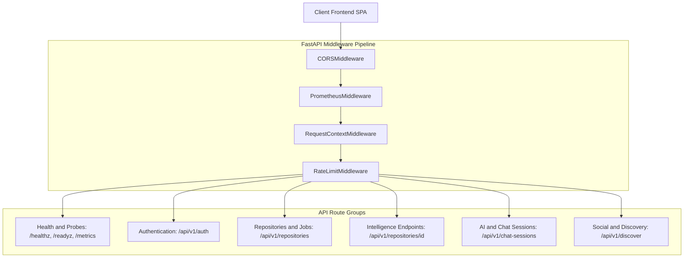

# 05. Complete API Documentation & Route Catalog

> **Status:** Fully discovered and verified from FastAPI router mounts and endpoints.  
> **Source Verification:** [backend/app/api/v1/router.py](file:///c:/Users/nikhil/Desktop/projectss/github-repo-intelligence-platform/codesensei-github-repo-intelligence-platform/backend/app/api/v1/router.py), [backend/app/main.py](file:///c:/Users/nikhil/Desktop/projectss/github-repo-intelligence-platform/codesensei-github-repo-intelligence-platform/backend/app/main.py).

---

## 1. API Architecture Diagram

---

## 2. Endpoint Classification Overview

| Category | Description | Endpoints |
| :--- | :--- | :--- |
| **Public / Anonymous** | Open to unauthenticated clients. Reads public data. | `GET /healthz`, `GET /readyz`, `GET /api/v1/discover/*`, `GET /api/v1/users/*`, `GET /api/v1/repositories/{id}` (if public), `GET /api/v1/repositories/{id}/*` (read-only if public). |
| **OAuth & Auth** | Manages OAuth redirect handshakes and session cookies. | `GET /api/v1/auth/github/login`, `GET /api/v1/auth/github/callback`, `POST /api/v1/auth/logout`, `POST /api/v1/auth/dev-login`. |
| **Authenticated** | Requires valid `codesensei_session` JWT cookie. | `GET /api/v1/auth/me`, `POST /api/v1/repositories`, `GET /api/v1/repositories`, `PATCH /api/v1/repositories/{id}/visibility`, `DELETE /api/v1/repositories/{id}`, `POST /api/v1/repositories/{id}/analyze`, `PUT/DELETE /api/v1/repositories/{id}/star`, `GET /api/v1/me/stars`, `POST /api/v1/repositories/{id}/chat-sessions`, `GET /api/v1/repositories/{id}/chat-sessions`, `GET/PATCH/DELETE /api/v1/chat-sessions/{id}`, `POST /api/v1/chat-sessions/{id}/chat`. |
| **Streaming (SSE)** | Long-lived HTTP connections streaming Server-Sent Events. | `GET /api/v1/repositories/{id}/events`, `POST /api/v1/ai/chat`, `POST /api/v1/chat-sessions/{id}/chat`. |
| **Internal / Metrics** | Internal observability scraping endpoints. | `GET /metrics` (Prometheus scrape target, exempt from rate limits). |
| **Admin / Privileged** | Currently none implemented (single-role user model). | *None implemented.* |
| **Webhooks** | Inbound webhooks from GitHub. | *None implemented.* |

---

## 3. Comprehensive Endpoint Catalog

### 3.1 Health & Probes

#### `GET /healthz`
- **Purpose:** Process liveness probe.
- **Auth / Guard:** Public.
- **Request:** None.
- **Response:** `200 OK` — `{"status": "ok", "version": "0.1.0"}`
- **Subsystems:** Memory check only.

#### `GET /readyz`
- **Purpose:** Deep readiness probe verifying database and cache connectivity.
- **Auth / Guard:** Public.
- **Request:** None.
- **Response:** `200 OK` — `{"status": "ok" | "degraded", "version": "0.1.0", "checks": {"postgres": "ok", "redis": "ok"}}`
- **Subsystems:** PostgreSQL (`SELECT 1`), Redis (`ping`).

#### `GET /metrics`
- **Purpose:** Prometheus metrics exposition.
- **Auth / Guard:** Public (internal network). Hidden from OpenAPI schema.
- **Response:** `200 OK` (text/plain; version=0.0.4).
- **Subsystems:** In-process Prometheus `REGISTRY`.

---

### 3.2 Authentication (`/api/v1/auth`)

#### `GET /api/v1/auth/github/login`
- **Purpose:** Initiates GitHub OAuth authorization flow.
- **Auth / Guard:** Public.
- **Response:** `307 Temporary Redirect` to `https://github.com/login/oauth/authorize`.
- **Side Effects:** Sets `codesensei_oauth_state` anti-CSRF cookie (`max_age=600`, `httpOnly=True`).

#### `GET /api/v1/auth/github/callback`
- **Purpose:** Handles OAuth redirect, exchanges code for token, upserts user, mints session.
- **Auth / Guard:** Public (validates `state` query param against `codesensei_oauth_state` cookie).
- **Query Params:** `code: str`, `state: str`.
- **Response:** `307 Temporary Redirect` to `FRONTEND_BASE_URL`.
- **Side Effects:** Sets `codesensei_session` cookie; clears `codesensei_oauth_state`.
- **Errors:** `401 Unauthorized` ("Invalid OAuth state" or token exchange failure).
- **Subsystems:** GitHub OAuth API, PostgreSQL (`users`).

#### `GET /api/v1/auth/me`
- **Purpose:** Returns the profile of the currently signed-in user.
- **Auth / Guard:** Authenticated (`CurrentUserDep`).
- **Response:** `200 OK` — `UserRead` (`id`, `github_id`, `username`, `display_name`, `email`, `avatar_url`, `created_at`).
- **Errors:** `401 Unauthorized`.
- **Subsystems:** PostgreSQL (`users`).

#### `POST /api/v1/auth/logout`
- **Purpose:** Clears session cookie.
- **Auth / Guard:** Public (idempotent).
- **Response:** `204 No Content`.
- **Side Effects:** Clears `codesensei_session` cookie.

#### `POST /api/v1/auth/dev-login`
- **Purpose:** Developer backdoor for local development. Disabled in production.
- **Auth / Guard:** Public (gated by `AUTH_DEV_LOGIN_ENABLED=true` and `APP_ENV != production`).
- **Body:** `{"username": "dev-user"}`
- **Response:** `200 OK` — `UserRead`. Sets session cookie.
- **Errors:** `404 Not Found` in production.
- **Subsystems:** PostgreSQL (`users`).

---

### 3.3 Repositories (`/api/v1/repositories`)

#### `POST /api/v1/repositories`
- **Purpose:** Submit a GitHub repository for analysis.
- **Auth / Guard:** Authenticated (`CurrentUserDep`).
- **Body (`RepositoryCreate`):** `{"url": "https://github.com/owner/repo", "branch": "main"}`
- **Response:** `202 Accepted` — `AnalysisJobRead` (`id`, `repository_id`, `status="queued"`, `queued_at`, etc.).
- **Errors:** `400 Bad Request` (invalid URL/SSRF), `409 Conflict` (`analysis_already_running`), `503 Service Unavailable` (Redis queue down).
- **Subsystems:** PostgreSQL (`repositories`, `analysis_jobs`), Redis (RQ enqueue).

#### `GET /api/v1/repositories`
- **Purpose:** List repositories owned by the authenticated caller.
- **Auth / Guard:** Authenticated (`CurrentUserDep`).
- **Query Params:** `page: int=1`, `page_size: int=20`, `status: RepositoryStatus=None`.
- **Response:** `200 OK` — `PaginatedResponse[RepositoryRead]`.
- **Subsystems:** PostgreSQL (`repositories`, `stars`).

#### `GET /api/v1/repositories/{repository_id}`
- **Purpose:** Fetch repository metadata and viewer star status.
- **Auth / Guard:** Public if `is_public=True`; otherwise authenticated owner only.
- **Path Params:** `repository_id: UUID`.
- **Response:** `200 OK` — `RepositoryRead` (includes `viewer_has_starred`, `star_count`, `analysis_version`).
- **Errors:** `404 Not Found` (IDOR masked).
- **Subsystems:** PostgreSQL (`repositories`, `stars`).

#### `PATCH /api/v1/repositories/{repository_id}/visibility`
- **Purpose:** Toggle repository public sharing.
- **Auth / Guard:** Authenticated owner only (`CurrentUserDep`).
- **Body:** `{"is_public": true | false}`
- **Response:** `200 OK` — `RepositoryRead`.
- **Errors:** `404 Not Found` (if not owner).
- **Subsystems:** PostgreSQL (`repositories`).

#### `DELETE /api/v1/repositories/{repository_id}`
- **Purpose:** Permanently delete a repository, its analysis data, and its vector collection.
- **Auth / Guard:** Authenticated owner only (`CurrentUserDep`).
- **Response:** `204 No Content`.
- **Side Effects:** Cascades PostgreSQL deletion; purges ChromaDB collection `repo_<id>`.
- **Errors:** `404 Not Found` (if not owner).
- **Subsystems:** PostgreSQL, ChromaDB.

---

### 3.4 Analysis Jobs (`/api/v1/repositories/{repository_id}/*`)

#### `POST /api/v1/repositories/{repository_id}/analyze`
- **Purpose:** Re-trigger analysis for an existing repository.
- **Auth / Guard:** Owner or public repo (`verify_repository_access`).
- **Response:** `202 Accepted` — `AnalysisJobRead`.
- **Errors:** `409 Conflict` (`analysis_already_running`).
- **Subsystems:** PostgreSQL (`analysis_jobs`), Redis (RQ enqueue).

#### `GET /api/v1/repositories/{repository_id}/jobs`
- **Purpose:** List recent analysis jobs for a repository.
- **Auth / Guard:** Owner or public (`verify_repository_access`).
- **Response:** `200 OK` — `list[AnalysisJobRead]`.
- **Subsystems:** PostgreSQL (`analysis_jobs`).

#### `GET /api/v1/repositories/{repository_id}/jobs/latest`
- **Purpose:** Get the most recent analysis job.
- **Auth / Guard:** Owner or public (`verify_repository_access`).
- **Response:** `200 OK` — `AnalysisJobRead`.
- **Subsystems:** PostgreSQL (`analysis_jobs`).

#### `GET /api/v1/repositories/{repository_id}/events`
- **Purpose:** Real-time analysis progress streaming via Server-Sent Events (SSE).
- **Auth / Guard:** Owner or public (`verify_repository_access`).
- **Response:** `text/event-stream` yielding JSON progress payloads.
- **Event Types:** `queued`, `running`, `progress`, `succeeded`, `failed`.
- **Subsystems:** PostgreSQL (`analysis_jobs` polling loop every 1s).

---

### 3.5 Intelligence & Insights (`/api/v1/repositories/{repository_id}/*`)

#### `GET /api/v1/repositories/{repository_id}/dependencies`
- **Purpose:** Get full dependency graph with detected cycles.
- **Auth / Guard:** Owner or public (`verify_repository_access`).
- **Response:** `200 OK` — `DependencyGraphResponse` (`nodes`, `edges`, `cycles`).
- **Caching:** Cached in Redis under key `repo:<id>:graph`.
- **Subsystems:** Redis Cache, PostgreSQL (`source_files`, `dependencies`).

#### `GET /api/v1/repositories/{repository_id}/dead-code`
- **Purpose:** Report unused functions, classes, and exported symbols.
- **Auth / Guard:** Owner or public (`verify_repository_access`).
- **Response:** `200 OK` — `DeadCodeReport` (`items`, `summary`).
- **Caching:** Cached in Redis under key `repo:<id>:dead_code`.
- **Subsystems:** Redis Cache, PostgreSQL (`symbols`, `source_files`).

#### `GET /api/v1/repositories/{repository_id}/complexity`
- **Purpose:** Rank files by cyclomatic and cognitive complexity.
- **Auth / Guard:** Owner or public (`verify_repository_access`).
- **Query Params:** `top_n: int = 10` (1..100).
- **Response:** `200 OK` — `ComplexityRanking`.
- **Subsystems:** PostgreSQL (`metrics`, `source_files`).

#### `POST /api/v1/repositories/{repository_id}/impact`
- **Purpose:** Compute upstream blast radius of modifying a specific file.
- **Auth / Guard:** Owner or public (`verify_repository_access`).
- **Body (`ImpactAnalysisRequest`):** `{"file_path": "src/core/auth.py", "max_depth": 3}`
- **Response:** `200 OK` — `ImpactAnalysisResponse` (`source_file`, `impacted_files`, `risk_score`, `summary`).
- **Subsystems:** PostgreSQL (`source_files`, `dependencies`).

#### `GET /api/v1/repositories/{repository_id}/architecture`
- **Purpose:** Discover architectural layers and generate Mermaid diagram syntax.
- **Auth / Guard:** Owner or public (`verify_repository_access`).
- **Response:** `200 OK` — `ArchitectureReport` (`layers`, `components`, `mermaid_diagram`, `summary`).
- **Caching:** Cached in Redis under key `repo:<id>:architecture`.
- **Subsystems:** Redis Cache, PostgreSQL (`source_files`, `dependencies`).

#### `POST /api/v1/repositories/{repository_id}/documentation`
- **Purpose:** Generate fact-grounded markdown documentation.
- **Auth / Guard:** Owner or public (`verify_repository_access`).
- **Body (`DocumentationRequest`):** `{"kind": "readme" | "architecture" | "api" | "onboarding" | "technical_design" | "summary"}`
- **Response:** `200 OK` — `DocumentationResponse` (`content_markdown`, `generated_at`).
- **Subsystems:** PostgreSQL (`repositories`, `source_files`, `metrics`, `dependencies`).

---

### 3.6 AI & Chat Sessions

#### `POST /api/v1/ai/chat`
- **Purpose:** Stateless token-streaming Q&A about a repository.
- **Auth / Guard:** Owner or public (`OptionalUserDep`).
- **Body (`ChatRequest`):** `{"repository_id": UUID, "question": str, "history": list, "top_k": int=5, "attached_paths": list[str]}`
- **Response:** `text/event-stream` streaming SSE tokens: `citations`, `token`, `done`, `error`.
- **Subsystems:** ChromaDB (vector search), Groq/Ollama (LLM streaming).

#### `POST /api/v1/repositories/{repository_id}/chat-sessions`
- **Purpose:** Create a new persistent chat session.
- **Auth / Guard:** Authenticated user with read access to repository (`CurrentUserDep`).
- **Body (`ChatSessionCreate`):** `{"title": "Investigating Auth Flow"}`
- **Response:** `201 Created` — `ChatSessionRead`.
- **Subsystems:** PostgreSQL (`chat_sessions`).

#### `GET /api/v1/repositories/{repository_id}/chat-sessions`
- **Purpose:** List caller's private chat sessions for a repository.
- **Auth / Guard:** Authenticated user with read access (`CurrentUserDep`).
- **Response:** `200 OK` — `PaginatedResponse[ChatSessionRead]`.
- **Subsystems:** PostgreSQL (`chat_sessions`).

#### `GET /api/v1/chat-sessions/{session_id}`
- **Purpose:** Fetch a single chat session.
- **Auth / Guard:** Session owner only (`CurrentUserDep`). Returns 404 for non-owners.
- **Response:** `200 OK` — `ChatSessionRead`.
- **Subsystems:** PostgreSQL (`chat_sessions`).

#### `PATCH /api/v1/chat-sessions/{session_id}`
- **Purpose:** Rename a chat session.
- **Auth / Guard:** Session owner only (`CurrentUserDep`).
- **Body (`ChatSessionUpdate`):** `{"title": "New Title"}`
- **Response:** `200 OK` — `ChatSessionRead`.
- **Subsystems:** PostgreSQL (`chat_sessions`).

#### `DELETE /api/v1/chat-sessions/{session_id}`
- **Purpose:** Delete a chat session and all messages.
- **Auth / Guard:** Session owner only (`CurrentUserDep`).
- **Response:** `204 No Content`.
- **Subsystems:** PostgreSQL (`chat_sessions`).

#### `GET /api/v1/chat-sessions/{session_id}/messages`
- **Purpose:** List historical messages in a session.
- **Auth / Guard:** Session owner only (`CurrentUserDep`).
- **Response:** `200 OK` — `PaginatedResponse[ChatMessageRead]` (includes citations and attached chips).
- **Subsystems:** PostgreSQL (`chat_messages`).

#### `POST /api/v1/chat-sessions/{session_id}/chat`
- **Purpose:** Send a question in a persistent session and stream assistant response over SSE.
- **Auth / Guard:** Session owner with read access to the repo (`CurrentUserDep`).
- **Body (`SessionChatRequest`):** `{"question": str, "attached": list[{"id": str, "path": str, "language": str}], "top_k": int=5}`
- **Response:** `text/event-stream` yielding SSE tokens: `citations`, `token`, `done`, `error`.
- **Transaction Model:** Tx1 saves user message -> LLM stream -> Tx2 saves assistant turn & citations.
- **Subsystems:** PostgreSQL (`chat_sessions`, `chat_messages`), ChromaDB, Groq/Ollama.

---

### 3.7 Social & Discovery Hub

#### `GET /api/v1/discover/repositories`
- **Purpose:** Browse public repositories grouped by `(url, branch)`.
- **Auth / Guard:** Public (annotates `viewer_has_starred` if signed in).
- **Query Params:** `page: int=1`, `page_size: int=24`, `sort: "stars" | "recent" | "files" | "lines"`, `q: str=None`, `language: str=None`.
- **Response:** `200 OK` — `PaginatedResponse[DiscoverRepositoryRead]`.
- **Subsystems:** PostgreSQL (`repositories`, `stars`).

#### `GET /api/v1/discover/repository`
- **Purpose:** View all public analyses performed on a given URL/branch.
- **Auth / Guard:** Public (`OptionalUserDep`).
- **Query Params:** `url: str`, `branch: str=None`.
- **Response:** `200 OK` — `RepositoryGroupDetail`.
- **Subsystems:** PostgreSQL (`repositories`, `users`, `stars`).

#### `PUT /api/v1/repositories/{repository_id}/star`
- **Purpose:** Star a repository (idempotent).
- **Auth / Guard:** Authenticated user with read access (`CurrentUserDep`).
- **Response:** `200 OK` — `StarState` (`starred: true`, `star_count: int`).
- **Subsystems:** PostgreSQL (`stars`, `repositories`).

#### `DELETE /api/v1/repositories/{repository_id}/star`
- **Purpose:** Unstar a repository (idempotent).
- **Auth / Guard:** Authenticated user with read access (`CurrentUserDep`).
- **Response:** `200 OK` — `StarState` (`starred: false`, `star_count: int`).
- **Subsystems:** PostgreSQL (`stars`, `repositories`).

#### `GET /api/v1/me/stars`
- **Purpose:** List repositories starred by the authenticated user.
- **Auth / Guard:** Authenticated user (`CurrentUserDep`).
- **Response:** `200 OK` — `PaginatedResponse[RepositoryRead]`.
- **Subsystems:** PostgreSQL (`stars`, `repositories`).

#### `GET /api/v1/users/{username}`
- **Purpose:** Get an analyst's public profile summary.
- **Auth / Guard:** Public.
- **Response:** `200 OK` — `PublicProfileRead` (`username`, `display_name`, `avatar_url`, `public_repository_count`, `total_stars_received`).
- **Subsystems:** PostgreSQL (`users`, `repositories`, `stars`).

#### `GET /api/v1/users/{username}/repositories`
- **Purpose:** List public analyzed repositories owned by a user.
- **Auth / Guard:** Public (`OptionalUserDep`).
- **Response:** `200 OK` — `PaginatedResponse[RepositoryRead]`.
- **Subsystems:** PostgreSQL (`repositories`, `stars`).
