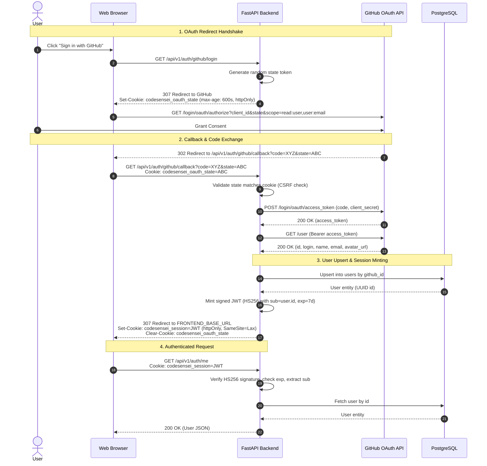

# 06. Authentication & Authorization Architecture

> **Status:** Codebase-grounded analysis of authentication primitives, session cookies, and route guards.  
> **Source Verification:** [backend/app/core/auth.py](file:///c:/Users/nikhil/Desktop/projectss/github-repo-intelligence-platform/codesensei-github-repo-intelligence-platform/backend/app/core/auth.py), [backend/app/core/dependencies.py](file:///c:/Users/nikhil/Desktop/projectss/github-repo-intelligence-platform/codesensei-github-repo-intelligence-platform/backend/app/core/dependencies.py), [backend/app/api/v1/endpoints/auth.py](file:///c:/Users/nikhil/Desktop/projectss/github-repo-intelligence-platform/codesensei-github-repo-intelligence-platform/backend/app/api/v1/endpoints/auth.py).

---

## 1. Authentication Architecture & Flow



---

## 2. Authentication Primitives & Token Lifecycle

### 2.1 Passwordless GitHub OAuth 2.0
CodeSensei contains **no password storage or verification logic**. User identity is strictly delegated to GitHub OAuth:
- **Requested Scopes:** `read:user`, `user:email`.
- **Identity Key:** `users.github_id` (`BigInteger`, unique, indexed). When an existing user logs in with a changed username, display name, or avatar, `UserRepository.upsert_from_github` updates their profile while preserving their stable internal UUID (`users.id`).

### 2.2 Stateless JWT Session Cookies
The session mechanism is intentionally stateless to allow horizontal scaling without a centralized session store:
- **Token Format:** Signed JSON Web Token (JWT) using the `HS256` symmetric algorithm, signed with `APP_SECRET_KEY`.
- **Claims Payload (`create_session_token` in `core/auth.py`):**
  ```python
  {
      "sub": str(user_id),       # Internal PostgreSQL UUID
      "gh": github_login,        # GitHub username handle
      "iat": int(now.timestamp()),
      "exp": int((now + timedelta(seconds=settings.session_ttl_seconds)).timestamp())
  }
  ```
- **Cookie Security Attributes (`_set_session_cookie` in `endpoints/auth.py`):**
  - `key`: `codesensei_session` (configurable via `SESSION_COOKIE_NAME`).
  - `httponly`: `True` — completely prevents JavaScript access via `document.cookie`, mitigating token theft via XSS.
  - `samesite`: `"lax"` — protects against cross-site request forgery while permitting top-level navigation redirects.
  - `secure`: `True` in production (`settings.is_production`), `False` in local development.
  - `max_age`: `604800` seconds (7 days, configurable via `SESSION_TTL_SECONDS`).
  - `path`: `"/"`.

### 2.3 Refresh Mechanism & Logout
- **No Refresh Token Flow:** To maintain architectural simplicity, the system does not implement a dual-token (access/refresh) lifecycle. The 7-day session token remains valid until expiry or explicit logout.
- **Logout Behavior:** `POST /api/v1/auth/logout` explicitly deletes the `codesensei_session` cookie on the client response. Because JWTs are stateless, the token is not server-revoked; clearing the cookie terminates browser access.

### 2.4 Anti-CSRF OAuth State
To prevent OAuth login CSRF attacks, `GET /api/v1/auth/github/login` generates a cryptographically random state token (`auth_service.new_state()`) using `secrets.token_urlsafe(32)`. This value is stored in an `httpOnly` cookie (`codesensei_oauth_state`) with a 10-minute TTL (`_STATE_TTL_SECONDS=600`). On callback, the backend asserts that the query parameter matches the cookie:
```python
expected_state = request.cookies.get(_OAUTH_STATE_COOKIE)
if not expected_state or expected_state != state:
    raise UnauthorizedError("Invalid OAuth state")
```

---

## 3. Dependency Injection & Authorization Guards

Authorization is implemented across three reusable FastAPI dependencies in [backend/app/core/dependencies.py](file:///c:/Users/nikhil/Desktop/projectss/github-repo-intelligence-platform/codesensei-github-repo-intelligence-platform/backend/app/core/dependencies.py):

### 3.1 `OptionalUserDep` (`get_optional_user`)
- Resolves the current user from the session cookie if present and valid.
- If no cookie exists, or if signature verification fails, or if the user UUID no longer exists in the database, it **returns `None` without raising an exception**.
- Used by public surfaces (Discover hub, public user profiles, repository detail) that render differently for authenticated vs anonymous users (e.g. populating `viewer_has_starred`).

### 3.2 `CurrentUserDep` (`get_current_user`)
- Consumes `OptionalUserDep`.
- If `user is None`, raises `UnauthorizedError("Authentication required")`, which the exception handler maps to **`401 Unauthorized`**.
- Used by all mutating endpoints (create repo, delete repo, star repo, create chat session).

### 3.3 `verify_repository_access`
Router-level access guard applied to `/repositories/{repository_id}/*`:
```python
async def verify_repository_access(
    repository_id: uuid.UUID,
    request: Request,
    user: OptionalUserDep,
    repo_repo: RepositoryRepoDep,
) -> None:
    repo = await repo_repo.get(repository_id)
    if repo is None:
        raise RepositoryNotFoundError(f"Repository {repository_id} not found")

    is_owner = user is not None and repo.owner_id is not None and repo.owner_id == user.id
    if is_owner:
        return

    safe_method = request.method in ("GET", "HEAD", "OPTIONS")
    if repo.is_public and safe_method:
        return

    if user is not None and repo.is_public:
        raise ForbiddenError("You do not have write access to this repository")
    raise RepositoryNotFoundError(f"Repository {repository_id} not found")
```

---

## 4. Security Audit of Routes & IDOR Masking

### 4.1 IDOR Protection via 404 Masking
A critical security pattern implemented in `verify_repository_access` and `ChatSessionService` is **generic 404 masking**:
- If an unauthenticated caller or an authenticated non-owner requests a private repository (`/repositories/{id}`) or an unowned chat session (`/chat-sessions/{id}`), the system raises `NotFoundError` (**`404 Not Found`**), **never `403 Forbidden`**.
- **Rationale:** Returning `403 Forbidden` leaks whether an ID exists in the database, enabling attackers to systematically enumerate valid UUIDs (Insecure Direct Object Reference). Masking existence behind 404 closes this enumeration channel.

### 4.2 Comprehensive Route Protection Audit

| Endpoint | Auth Requirement | Authorization Guard | Verdict / Risk Analysis |
| :--- | :--- | :--- | :--- |
| `POST /repositories` | Required | `CurrentUserDep` | **SECURE:** Authenticated only; repository created with `owner_id = user.id`. |
| `GET /repositories` | Required | `CurrentUserDep` | **SECURE:** SQL filtered strictly by `owner_id = user.id`. |
| `GET /repositories/{id}` | Optional | Service check | **SECURE:** Accessible if owner or `is_public=true`; otherwise 404. |
| `PATCH /repositories/{id}/visibility`| Required | Service check | **SECURE:** Enforces `owner_id = user.id`; raises 404 otherwise. |
| `DELETE /repositories/{id}` | Required | Service check | **SECURE:** Enforces `owner_id = user.id`; purges DB + Chroma. |
| `POST /repositories/{id}/analyze` | Optional | `verify_repository_access` | **INCONSISTENCY:** Mutating POST allowed on public repo by anonymous caller if not gated. *Audit Note:* Non-owners re-triggering analysis on public repos consumes worker resources. Recommended fix: require `CurrentUserDep`. |
| `GET /repositories/{id}/events` | Optional | `verify_repository_access` | **SECURE:** Allowed if public or owner; 404 otherwise. |
| `GET /repositories/{id}/dependencies`| Optional | `verify_repository_access` | **SECURE:** Allowed if public or owner; 404 otherwise. |
| `GET /repositories/{id}/dead-code` | Optional | `verify_repository_access` | **SECURE:** Allowed if public or owner; 404 otherwise. |
| `GET /repositories/{id}/complexity`| Optional | `verify_repository_access` | **SECURE:** Allowed if public or owner; 404 otherwise. |
| `POST /repositories/{id}/impact` | Optional | `verify_repository_access` | **SECURE:** Safe read-only calculation despite POST method; allowed if public or owner. |
| `GET /repositories/{id}/architecture`| Optional | `verify_repository_access` | **SECURE:** Allowed if public or owner; 404 otherwise. |
| `POST /repositories/{id}/documentation`| Optional | `verify_repository_access` | **SECURE:** Safe read-only rendering despite POST method; allowed if public or owner. |
| `POST /ai/chat` | Optional | Service check | **SECURE:** Verifies repo read access (`is_public` or owner); 404 otherwise. |
| `POST /repositories/{id}/chat-sessions`| Required | `CurrentUserDep` + Read access | **SECURE:** Caller must authenticate and be able to read repository. |
| `GET /repositories/{id}/chat-sessions`| Required | `CurrentUserDep` | **SECURE:** SQL strictly filters `user_id = user.id`. Conversations are always private. |
| `GET /chat-sessions/{id}` | Required | `CurrentUserDep` | **SECURE:** SQL enforces `user_id = user.id`; returns 404 if not owner. |
| `PATCH /chat-sessions/{id}` | Required | `CurrentUserDep` | **SECURE:** SQL enforces `user_id = user.id`; returns 404 if not owner. |
| `DELETE /chat-sessions/{id}` | Required | `CurrentUserDep` | **SECURE:** SQL enforces `user_id = user.id`; returns 404 if not owner. |
| `GET /chat-sessions/{id}/messages`| Required | `CurrentUserDep` | **SECURE:** Verifies session ownership; returns 404 if not owner. |
| `POST /chat-sessions/{id}/chat` | Required | `CurrentUserDep` | **SECURE:** Verifies session ownership AND ensures repository is still readable. |
| `PUT /repositories/{id}/star` | Required | `CurrentUserDep` | **SECURE:** Verifies repo read access; unique constraint prevents duplicate stars. |
| `DELETE /repositories/{id}/star` | Required | `CurrentUserDep` | **SECURE:** Verifies repo read access; deletes user's star row. |
| `GET /me/stars` | Required | `CurrentUserDep` | **SECURE:** SQL filters strictly by `user_id = user.id`. |
| `POST /auth/dev-login` | None | Hard-gated in code | **SECURE:** Returns 404 unconditionally when `APP_ENV=production`. |

---

## 5. Summary of Security Strengths & Identified Risks

### Strengths
1. **Stateless JWT in httpOnly Cookie:** Immune to standard XSS token-stealing attacks (`localStorage` is not used).
2. **Complete IDOR Immunity:** All unowned resources return 404 rather than 403, preventing attackers from probing valid repository or session IDs.
3. **Chat Privacy Invariant:** Even if a repository is public, chat sessions and messages are strictly private to the user who created them.
4. **Hardcoded Dev Gating:** Developer login and mock auth are compiled with fail-safe checks that reject execution if `APP_ENV=production`.

### Identified Inconsistencies & Recommendations
1. **Public Re-Analysis Triggering:** `POST /api/v1/repositories/{id}/analyze` allows an authenticated user to re-trigger analysis on *someone else's* public repository. While this refreshes public data, it allows external users to consume background worker CPU and queue time. **Recommendation:** Restrict `POST /repositories/{id}/analyze` strictly to the repository owner (`is_owner`), or implement a strict per-user daily re-analysis rate limit.
2. **Stateless Token Invalidation:** If a user's cookie is compromised, logging out does not invalidate the JWT server-side until the 7-day expiration. **Recommendation:** For enterprise scale, maintain a Redis token blocklist or bump a `token_version` column on the `users` table upon logout.
