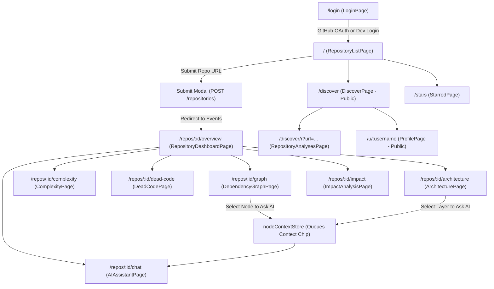
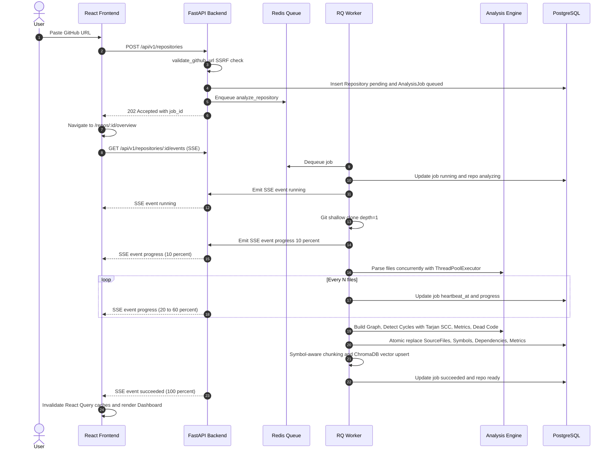
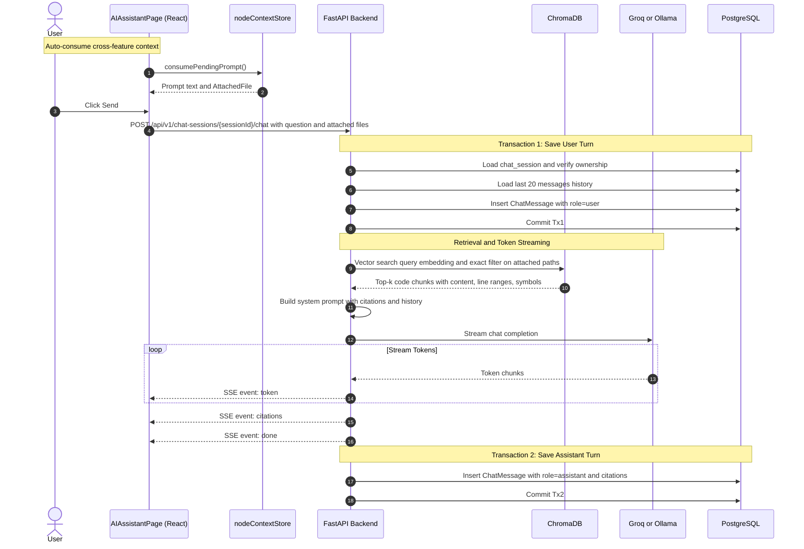

# 07. Complete End-to-End User Flows

> **Status:** Codebase-grounded analysis of frontend pages, state stores, and backend endpoints.  
> **Source Verification:** [frontend/src/pages/](file:///c:/Users/nikhil/Desktop/projectss/github-repo-intelligence-platform/codesensei-github-repo-intelligence-platform/frontend/src/pages/), [frontend/src/routes/router.tsx](file:///c:/Users/nikhil/Desktop/projectss/github-repo-intelligence-platform/codesensei-github-repo-intelligence-platform/frontend/src/routes/router.tsx), [frontend/src/store/nodeContextStore.ts](file:///c:/Users/nikhil/Desktop/projectss/github-repo-intelligence-platform/codesensei-github-repo-intelligence-platform/frontend/src/store/nodeContextStore.ts).

---

## 1. Flow Overview & Sitemap

---

## 2. Major User Journeys

### Journey 1: Authentication & Onboarding
1. **Initial Visit:** Unauthenticated user navigates to `/`. The React router's `RequireAuth` guard detects no active session (`auth.me` query returns 401) and redirects to `/login`.
2. **Authentication Method:**
   - **Production:** User clicks "Sign in with GitHub". Browser redirects to `/api/v1/auth/github/login`, then to GitHub. Upon consent, GitHub redirects back to `/api/v1/auth/github/callback`. Backend verifies anti-CSRF state cookie, exchanges code, creates/updates user in PostgreSQL, sets `codesensei_session` cookie, and redirects to `/`.
   - **Development:** User fills the Dev Login form (`username`), triggering `POST /api/v1/auth/dev-login`. Backend sets session cookie and returns user object.
3. **Landing:** Browser enters `RepositoryListPage` (`/`), listing all previously submitted repositories owned by the user.

---

### Journey 2: Repository Submission & Analysis

---

### Journey 3: Graph Exploration & Cycle Inspection
1. **Navigation:** User navigates to `/repos/:id/graph` ([DependencyGraphPage.tsx](file:///c:/Users/nikhil/Desktop/projectss/github-repo-intelligence-platform/codesensei-github-repo-intelligence-platform/frontend/src/pages/DependencyGraphPage.tsx)).
2. **Data Fetching:** TanStack Query calls `GET /api/v1/repositories/:id/dependencies`. Backend checks Redis cache `repo:<id>:graph`; if missed, fetches nodes and edges from PostgreSQL, executes Tarjan's SCC to detect cycles, caches in Redis, and returns JSON.
3. **Visualization (Cytoscape.js):**
   - Files render as circular nodes colored by programming language.
   - Node size reflects lines of code (LOC).
   - Directed arrows represent file-level imports.
4. **Interactions:**
   - **Filter by Language:** User toggles language checkboxes; Cytoscape hides irrelevant nodes.
   - **Highlight Cycles:** User clicks "Highlight Cycles". The UI iterates through detected SCCs (`response.cycles`), highlighting cyclic edges in bold red.
   - **Node Inspection:** Clicking a node opens the slide-out `NodeInspector` panel displaying LOC, cyclomatic complexity, incoming/outgoing dependencies, and declared symbols.
   - **Cross-Context Queueing:** In `NodeInspector`, user clicks "Ask AI about this file". The frontend calls `nodeContextStore.attachFile(repoId, file)`, sets `pendingPrompt = "Explain what this file does and how it relates to its dependencies"`, and navigates to `/repos/:id/chat`.

---

### Journey 4: Impact Analysis (Blast Radius Calculation)
1. **Navigation:** User navigates to `/repos/:id/impact` ([ImpactAnalysisPage.tsx](file:///c:/Users/nikhil/Desktop/projectss/github-repo-intelligence-platform/codesensei-github-repo-intelligence-platform/frontend/src/pages/ImpactAnalysisPage.tsx)).
2. **File Selection:** User selects or searches for a target file (e.g. `backend/app/core/auth.py`) and sets maximum depth slider (1–5, default 3).
3. **Calculation:** User clicks "Analyze Impact", triggering `POST /api/v1/repositories/:id/impact`.
4. **Backend Processing (`ImpactService`):**
   - Executes upstream reverse-dependency BFS traversal starting at the target file.
   - For every reached file, computes distance-decay risk score: `risk = exp(-0.5 * (distance - 1))`.
   - Computes aggregate risk score squashed via sigmoid: `overall_risk = 1.0 - exp(-score / 8)`.
5. **Presentation:** Frontend displays a summary card with risk rating (`Low`, `Medium`, `High`, `Critical`), a list of impacted upstream files sorted by proximity and risk, and direct links to inspect each dependent file.

---

### Journey 5: Conversational AI & Context-Grounded RAG

---

### Journey 6: Social Discovery, Starring & Public Sharing
1. **Public Discovery:** Any visitor navigates to `/discover` ([DiscoverPage.tsx](file:///c:/Users/nikhil/Desktop/projectss/github-repo-intelligence-platform/codesensei-github-repo-intelligence-platform/frontend/src/pages/DiscoverPage.tsx)). TanStack Query calls `GET /api/v1/discover/repositories`.
2. **Repository-Centric Browsing:** Repositories display as cards grouped by `(url, branch)`. The card shows total stars, primary languages, file count, and number of public analyses.
3. **Inspecting Public Analysis:** Clicking a repository card navigates to `/discover/r?url=...` ([RepositoryAnalysesPage.tsx](file:///c:/Users/nikhil/Desktop/projectss/github-repo-intelligence-platform/codesensei-github-repo-intelligence-platform/frontend/src/pages/RepositoryAnalysesPage.tsx)), listing every public analysis created for that repository by different users.
4. **Starring:** Authenticated users click the Star button on a card or dashboard header. The frontend sends `PUT /api/v1/repositories/:id/star`. The backend updates PostgreSQL `stars` and increments `repositories.star_count`, returning `StarState(starred=True, star_count=N)`.
5. **Public Profiles:** Clicking an analyst's username navigates to `/u/:username` ([ProfilePage.tsx](file:///c:/Users/nikhil/Desktop/projectss/github-repo-intelligence-platform/codesensei-github-repo-intelligence-platform/frontend/src/pages/ProfilePage.tsx)), showing their public portfolio and total stars received across all projects.
