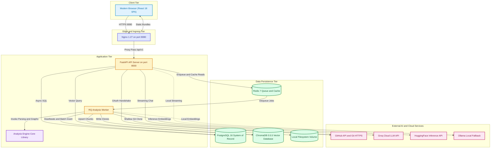

# 08. Current System Architecture (Stage 0 Design)

> **Status:** Ground truth design of the running codebase and Docker Compose configurations.  
> **Source Verification:** [docker/docker-compose.yml](file:///c:/Users/nikhil/Desktop/projectss/github-repo-intelligence-platform/codesensei-github-repo-intelligence-platform/docker/docker-compose.yml), [docker/docker-compose.free-tier.yml](file:///c:/Users/nikhil/Desktop/projectss/github-repo-intelligence-platform/codesensei-github-repo-intelligence-platform/docker/docker-compose.free-tier.yml), [backend/app/main.py](file:///c:/Users/nikhil/Desktop/projectss/github-repo-intelligence-platform/codesensei-github-repo-intelligence-platform/backend/app/main.py).

---

## 1. System Architecture Diagram (Current Implementation)

---

## 2. Component Inventory & Responsibilities

### 2.1 Frontend Tier (`frontend/`)
- **Technology:** React 18, TypeScript (strict mode), Vite 5, TailwindCSS 3, Zustand 5, TanStack Query 5 (React Query), Cytoscape.js 3, Lucide React.
- **Runtime Container:** Alpine-based Nginx container (`nginx:1.27-alpine`). Listens on port `:8080` (non-root user).
- **Responsibilities:**
  - Single-Page Application (SPA) routing via `react-router-dom`.
  - Client-side route authentication enforcement (`RequireAuth`).
  - Interactive directed dependency graph visualization and cycle highlighting using Cytoscape.js with the `cose` (Compound Spring Embedder) layout.
  - Real-time Server-Sent Events consumption for analysis progress (`/events`) and AI token streaming (`/chat`).
  - Cross-feature contextual state management (`useNodeContextStore`) bridging the dependency graph and architecture viewers with the AI chat assistant.

### 2.2 Backend API Tier (`backend/`)
- **Technology:** Python 3.12, FastAPI 0.115, Uvicorn, SQLAlchemy 2.0 (Asyncio with `asyncpg`), Pydantic v2, Alembic 1.14, structlog, prometheus_client, sse-starlette, PyJWT.
- **Runtime Container:** `python:3.12-slim` listening on `:8000`.
- **Responsibilities:**
  - REST API endpoint routing under `/api/v1/`.
  - Stateless authentication: OAuth code exchange, JWT signing/decoding, and cookie issuance.
  - Access control and IDOR mitigation via dependency injection guards (`verify_repository_access`).
  - Request middleware pipeline: CORS headers, Prometheus request metrics, `X-Request-ID` binding, and sliding-window IP rate limiting.
  - Response caching over Redis for compute-heavy graph and architecture queries.
  - Analysis job dispatching to Redis Queue (`JobDispatcher`).
  - Background stuck-job reaper task running within the application lifespan loop (`run_reaper_loop`).

### 2.3 Background Analysis Worker (`worker/`)
- **Technology:** Python 3.12, Redis Queue (RQ) 2.0, SQLAlchemy 2.0 Core/ORM, structlog, prometheus_client.
- **Runtime Container:** `python:3.12-slim` sharing root workspace volumes with the host.
- **Responsibilities:**
  - Dequeues analysis jobs from Redis.
  - Executes in `SimpleWorker(burst=True)` mode: creates a fresh connection, processes available jobs, and drops idle connections to maintain compatibility with serverless Redis providers (Upstash) that enforce idle disconnect timeouts.
  - Drives the `AnalysisOrchestrator` through cloning, walking, parsing, graph creation, and metrics calculation.
  - Persists atomic database snapshots: wipes prior files/symbols/metrics/dependencies for the repository and batch-inserts the new analysis run.
  - Manages real-time progress reporting and periodic `heartbeat_at` updates to the `analysis_jobs` table.
  - Conducts symbol-aware chunking and upserts embeddings into ChromaDB.
  - Exposes worker metrics on port `:9101`.

### 2.4 Analysis Engine Library (`analysis-engine/`)
- **Technology:** Standalone Python library, `tree-sitter`, `tree-sitter-languages`, `chardet`, native `git` CLI (`subprocess.run`).
- **Responsibilities:**
  - Pure, stateless static code analysis with zero web or database framework dependencies.
  - Sandboxed Git cloning (`GitCloner`) enforcing shallow depth (`depth=1`), timeouts, and size limits.
  - Multi-language AST and regex parsing via `ParserRegistry`.
  - Dependency graph generation (`GraphBuilder`) and cycle detection using Tarjan's Strongly Connected Components algorithm.
  - Complexity calculation (cyclomatic decision points + cognitive nesting penalties).
  - Dead code reachability scoring.
  - Architectural layer classification (`classify_architecture`) producing Mermaid flowchart syntax.
  - Symbol-aware code chunking (`CodeChunker`) and RAG chain coordination (`RagChain`).

### 2.5 Relational Database (`PostgreSQL 16`)
- **Technology:** PostgreSQL 16 (Hosted on Neon Serverless in free-tier, or local container).
- **Driver:** `asyncpg` for backend API; `psycopg2-binary` for worker and Alembic migrations.
- **Responsibilities:**
  - Canonical system of record across 10 tables.
  - Enforces relational referential integrity and cascading deletes (`ON DELETE CASCADE`).
  - Enforces job concurrency mutual exclusion via partial unique index `uq_active_job_per_repository`.
  - Maintains denormalized counters (`star_count`, `file_count`, `total_lines`) for fast list views.

### 2.6 Queue & Cache (`Redis 7`)
- **Technology:** Redis 7 (Hosted on Upstash in free-tier, or local container).
- **Responsibilities:**
  - Background task queue (`rq:queue:analysis-jobs`).
  - In-memory JSON cache for expensive endpoint outputs (`repo:<id>:graph`, `repo:<id>:dead_code`, `repo:<id>:architecture`) with 1-hour TTL.

### 2.7 Vector Database (`ChromaDB 0.5.5`)
- **Technology:** ChromaDB standalone HTTP server (`chromadb/chroma:0.5.5`).
- **Responsibilities:**
  - Stores high-dimensional code chunk embeddings partitioned by collection: `repo_<repository_id>`.
  - Executes nearest-neighbor cosine similarity queries for RAG context retrieval.
  - Purged synchronously upon repository deletion to protect privacy and bound storage.

### 2.8 External AI Providers
- **Groq Cloud API:** Provides high-throughput, low-latency LLM completions on the free tier using `llama-3.3-70b-versatile` (rate-limited at 30 requests/minute).
- **HuggingFace Inference API:** Provides serverless cloud embeddings on the free tier using `sentence-transformers/all-MiniLM-L6-v2` (384 dimensions).
- **Ollama (Local Alternative):** Local containerized fallback providing both chat completion and embedding generation when offline or avoiding external cloud APIs.

---

## 3. Inter-Component Communication Protocols & Failure Behaviors

| From | To | Protocol / Transport | Data Transferred | Failure Behavior |
| :--- | :--- | :--- | :--- | :--- |
| **Browser** | **Nginx** | HTTPS (Port 8080) | Static assets, REST API calls, SSE streams | Browser displays network error / offline toast. |
| **Nginx** | **Backend** | HTTP/1.1 (Port 8000) | Reverse-proxied `/api/v1/*` requests | Nginx returns `502 Bad Gateway` if backend is down. |
| **Backend** | **PostgreSQL** | Async TCP (Port 5432, SSL) | SQL queries via SQLAlchemy / asyncpg | Connection pool retry; raises 500 or 503; `/readyz` marks `degraded`. |
| **Backend** | **Redis** | Redis Protocol (RESP) | Enqueue RQ jobs; GET/SET JSON cache | `QueueUnavailableError` maps to HTTP 503; cache errors fall back to DB. |
| **Backend** | **ChromaDB** | HTTP REST (Port 8000) | Query embedding vector, top-k chunks | Falls back to empty context; logs warning; UI receives answer with disclaimer. |
| **Backend** | **Groq API** | HTTPS REST / SSE | OpenAI-compatible chat completion payload | Emits SSE `error` event followed by `done`; client renders retry banner. |
| **Worker** | **Redis** | Redis Protocol (RESP / TLS) | Dequeue RQ job specs | Worker reconnects on next poll interval; drops connection to prevent timeout. |
| **Worker** | **GitHub** | Git over HTTPS (Port 443) | Git packfiles (shallow clone) | Cloner raises `CloneError` or `RepositoryTooLargeError`; job fails cleanly. |
| **Worker** | **PostgreSQL** | Sync TCP (Port 5432, SSL) | Heartbeat updates, batch row inserts | Transaction rolls back; job marks failed; reaper unblocks repository. |
| **Worker** | **HuggingFace** | HTTPS REST | Batch code chunk texts -> dense vectors | Worker raises `IndexingDegraded`; logs warning; analysis still succeeds. |
| **Worker** | **ChromaDB** | HTTP REST (Port 8000) | Chunk text, metadata, embedding vectors | Worker logs warning; marks indexed chunks as 0; job succeeds without vectors. |
