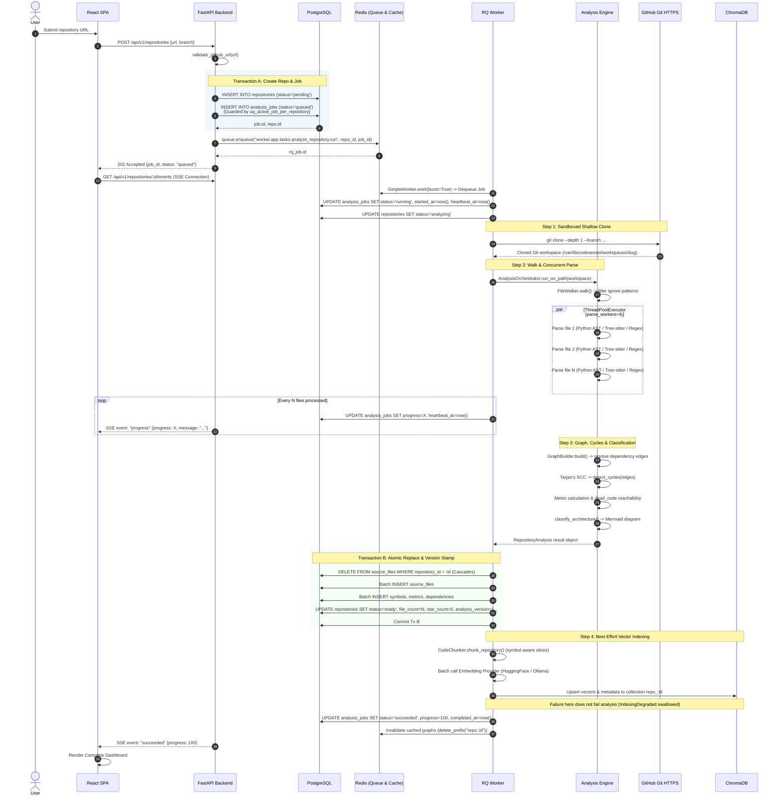
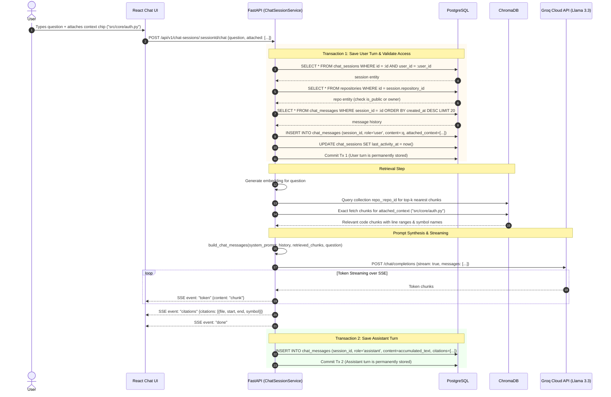
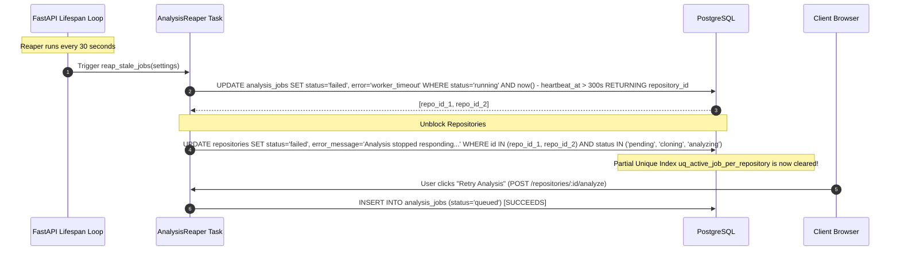

# 09. Detailed Execution & Data Flows

> **Status:** Codebase-grounded execution traces and sequence diagrams.  
> **Source Verification:** [backend/app/services/](file:///c:/Users/nikhil/Desktop/projectss/github-repo-intelligence-platform/codesensei-github-repo-intelligence-platform/backend/app/services/), [worker/worker/app/tasks/analyze_repository.py](file:///c:/Users/nikhil/Desktop/projectss/github-repo-intelligence-platform/codesensei-github-repo-intelligence-platform/worker/worker/app/tasks/analyze_repository.py), [analysis-engine/engine/orchestrator.py](file:///c:/Users/nikhil/Desktop/projectss/github-repo-intelligence-platform/codesensei-github-repo-intelligence-platform/analysis-engine/engine/orchestrator.py).

---

## 1. Analysis Ingestion & Background Pipeline Flow

This flow represents the primary write path of the system: moving from an HTTP submission, through background queuing and shallow cloning, into multi-threaded parsing, atomic persistence, and best-effort vector indexing.



---

## 2. Persistent RAG Streaming Execution Flow (Dual-Transaction Pattern)

This flow details how the platform handles multi-second LLM streaming without holding long-lived database transactions open, ensuring user turns are never rolled back if clients disconnect.



---

## 3. Synchronous vs. Asynchronous Work Separation

To preserve high API responsiveness, the architecture enforces a strict divide between synchronous request/response operations and asynchronous background processing:

```
┌─────────────────────────────────────────────────────────────────────────┐
│                      SYNCHRONOUS (FastAPI API Layer)                    │
│  - Request validation & SSRF URL checks (< 2ms)                         │
│  - Database lookups & cached reads (< 10ms)                             │
│  - Tarjan's SCC cycle detection on cached graphs (< 15ms)               │
│  - Impact analysis reverse BFS walk (< 25ms)                            │
│  - Enqueueing analysis jobs into Redis (< 5ms)                          │
│  - Token streaming over SSE (Long-lived connection, zero worker blocking)│
└────────────────────────────────────┬────────────────────────────────────┘
                                     │ Redis Queue (Job ID)
                                     ▼
┌─────────────────────────────────────────────────────────────────────────┐
│                      ASYNCHRONOUS (RQ Worker Layer)                     │
│  - Shallow Git cloning over network (2s - 60s)                          │
│  - Filesystem tree walking & binary decoding (100ms - 5s)               │
│  - Concurrently parsing source files via ThreadPoolExecutor (1s - 30s)  │
│  - Resolving imports into dependency edges (200ms - 2s)                 │
│  - Batch PostgreSQL deletion & re-insertion (500ms - 3s)                │
│  - Code chunking & embedding generation (2s - 45s)                      │
│  - ChromaDB vector upsertion (500ms - 5s)                               │
└─────────────────────────────────────────────────────────────────────────┘
```

---

## 4. Stuck-Job Reaper Flow (Crash Recovery)

If an analysis worker dies unexpectedly (OOM kill, host termination, or network partition during git clone), the repository would remain stuck in `ANALYZING` and the active job in `RUNNING`. The `AnalysisReaper` recovers the system automatically:


