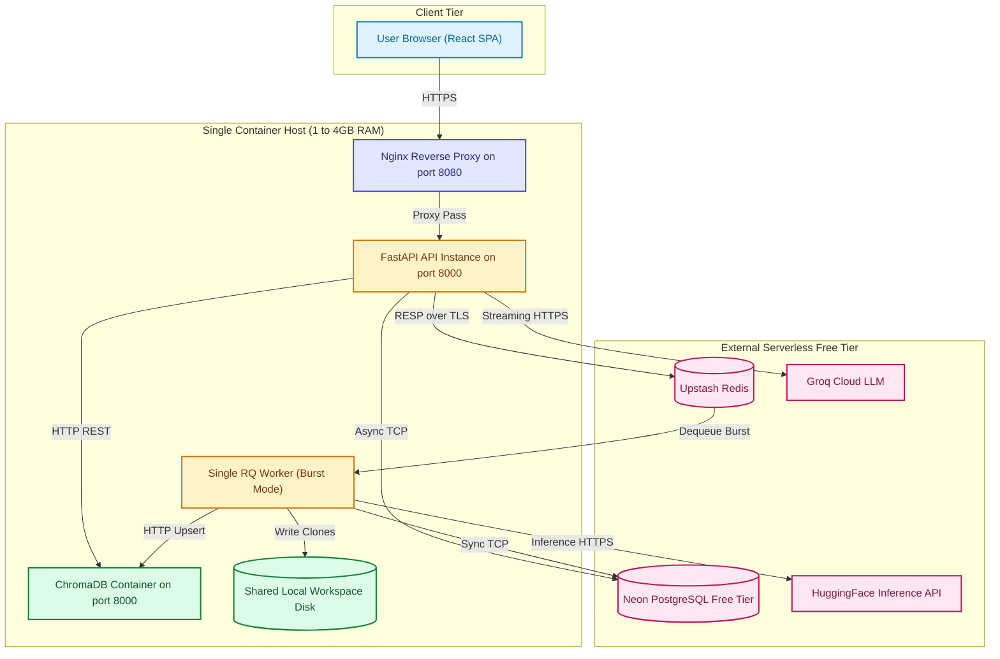
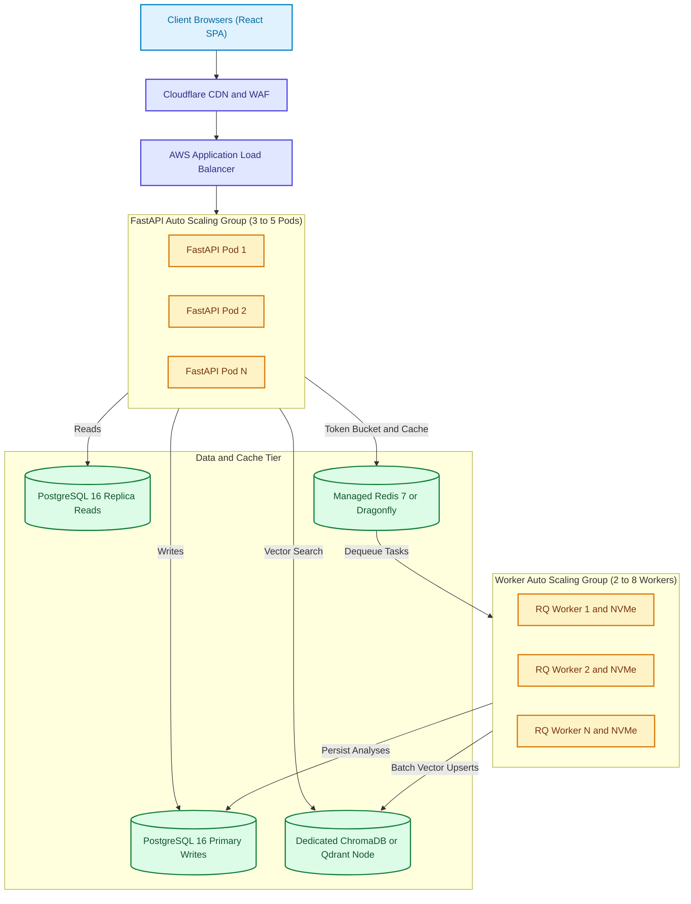
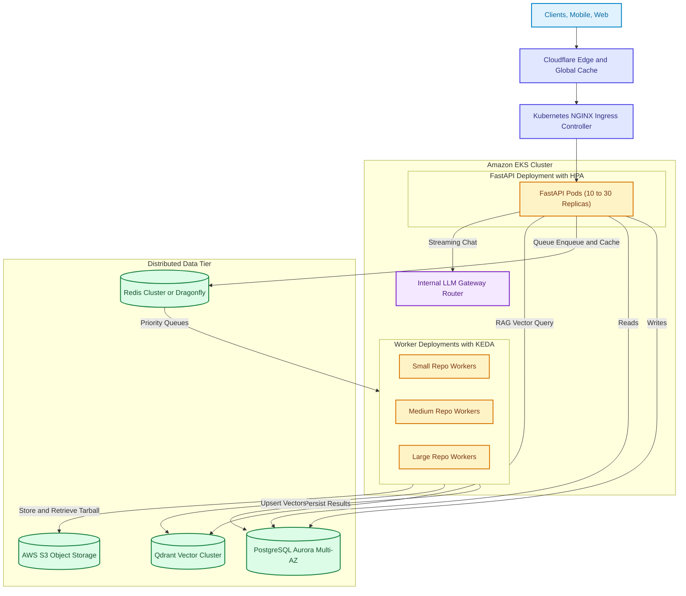
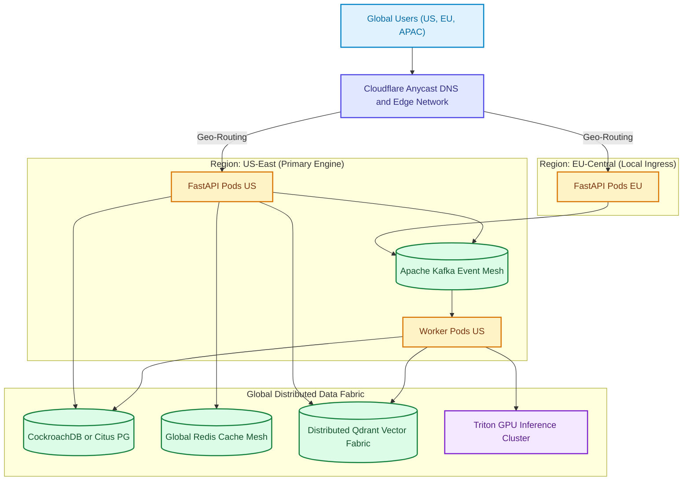

# 15. Progressive Scaling Architecture (Stage 0 to Stage 3)

> **Status:** Progressive system design models mapping current implementation to enterprise scale.  
> **Source Verification:** [docker/docker-compose.free-tier.yml](file:///c:/Users/nikhil/Desktop/projectss/github-repo-intelligence-platform/codesensei-github-repo-intelligence-platform/docker/docker-compose.free-tier.yml), [backend/app/core/config.py](file:///c:/Users/nikhil/Desktop/projectss/github-repo-intelligence-platform/codesensei-github-repo-intelligence-platform/backend/app/core/config.py).

---

## 1. The 9 Independent Scaling Dimensions

When scaling CodeSensei, bottlenecks emerge along 9 distinct dimensions rather than a single generic metric:

```
                  ┌────────────────────────────────────────┐
                  │          A. Concurrent Users           │
                  │  (Auth sessions, active SSE streams)   │
                  └───────────────────┬────────────────────┘
                                      │
┌─────────────────────────┐           │           ┌─────────────────────────┐
│       B. Requests       │           │           │     C. Data Volume      │
│ (Read-heavy, 95% reads, │           │           │ (Files, symbols, edges, │
│  Graph & Chat queries)  │           │           │  embeddings, chat logs) │
└────────────┬────────────┘           │           └────────────┬────────────┘
             │                        │                        │
┌────────────┴────────────┐    CODESENSEI         ┌────────────┴────────────┐
│   D. Background Jobs    │      SCALING          │   E. AI/LLM Throughput  │
│  (Cloning, AST parsing, │     TOPOLOGY          │ (Groq/Ollama rate limits│
│   heartbeat management) │                       │  token context budgets) │
└────────────┬────────────┘           │           └────────────┬────────────┘
             │                        │                        │
┌────────────┴────────────┐           │           ┌────────────┴────────────┐
│    F. External APIs     │           │           │   G. Multi-Tenancy /    │
│ (GitHub clone limits,   │           │           │      Fair-Share         │
│  HuggingFace embeddings)│           │           │(Noisy neighbors, quotas)│
└────────────┬────────────┘           │           └────────────┬────────────┘
             │                        │                        │
┌────────────┴────────────┐           │           ┌────────────┴────────────┐
│  H. High Availability   │           │           │   I. Global Latency     │
│ (SPOFs, failover, zero- │           │           │(Edge static caching,    │
│      downtime deploy)   │           │           │ multi-region vector DB) │
└─────────────────────────┘           │           └─────────────────────────┘
                                      ▼
```

---

## 2. Stage 0: Current Architecture (Proof-of-Concept / Free-Tier)

### 2.1 Topology & Overview
The current implementation runs on minimal, zero-cost infrastructure: a single compute node or local development environment coupled with external serverless free tiers (Neon PostgreSQL, Upstash Redis, Groq Cloud API, HuggingFace Inference API).



### 2.2 Characteristics & Limits
- **Capacity:** ~500 total repositories, 5–10 concurrent users, 1–2 background analysis jobs at a time.
- **Bottlenecks:**
  - Single worker CPU/disk saturation during Git cloning.
  - In-memory rate limiting (isolated per API process).
  - ChromaDB memory exhaustion on a 512MB RAM container.
  - Upstash daily command quota limits (10,000 commands/day).
  - Groq rate limits (30 requests/min).

---

## 3. Stage 1: Moderate Growth (10x — 100K Users, 50K Repositories)

### 3.1 What Changed and Why
1. **Stateless API Cluster:** Scale FastAPI horizontally across multiple instances (3–5 replicas) behind an AWS Application Load Balancer (ALB) to handle concurrent HTTP/SSE traffic.
2. **Dedicated Redis Cluster / Dragonfly:** Replace serverless Upstash with a self-managed, high-throughput Redis instance (or Dragonfly) with persistent TCP connections, enabling standard RQ pubsub and Redis-backed distributed rate limiting.
3. **Dedicated PostgreSQL with Read Replicas:** Transition from Neon free tier to Amazon RDS PostgreSQL (Primary for writes + 1 Read Replica for Discover hub, Dependency Graph reads, and user profiles).
4. **Independent Auto-Scaling Worker Pool:** Decouple background workers into a dedicated Auto Scaling Group (ASG) running 2–8 workers scaled dynamically on Redis queue depth (`rq:queue:codesensei_analysis`).
5. **Ephemeral NVMe Worker Scratch Disks:** Replace shared Docker workspace volumes with fast local NVMe instance storage for Git clones.

### 3.2 Architecture Diagram (Stage 1)



### 3.3 Trade-offs & New Failure Modes
- **Trade-offs:** Introduces read-replica replication lag (users might refresh immediately after analysis and see stale metadata for ~100ms); requires centralized Redis rate limiting instead of zero-network in-memory checks.
- **New Failure Modes:** Read replica falling behind primary; Redis cluster node failover dropping in-flight job messages.

---

## 4. Stage 2: Large Scale (100x — 1M Users, 500K Repositories)

### 4.1 What Changed and Why
1. **Queue Partitioning by Repository Size:** Replace single monolithic RQ queue with tiered priority queues:
   - `queue:small` (<5MB repos, 15s timeout, high worker concurrency).
   - `queue:medium` (5–50MB repos, 60s timeout).
   - `queue:large` (50–100MB repos, dedicated beefy instances).
   Prevents a 90MB repository clone from blocking dozens of 1MB repos.
2. **Transition from ChromaDB to Managed Qdrant / pgvector:** Single-node ChromaDB cannot shard across multiple machines. Migrate vectors to a distributed Qdrant cluster with HNSW indexing and collection sharding.
3. **Multi-Provider LLM Fallback Router:** Implement a resilient LLM gateway (LiteLLM / custom proxy) with circuit-breaker failover:
   - Primary: Groq Cloud API (Llama 3.3 70B).
   - Secondary on 429/500: Anthropic Claude 3.5 Haiku or OpenAI GPT-4o-mini.
   - Tertiary: Self-hosted vLLM cluster running on GPU spot instances.
4. **S3 Object Storage for Raw Source Snapshots:** Instead of retaining cloned git directories on worker disks, workers stream parsed ASTs directly and store raw compressed repo tarballs in AWS S3 with a 7-day lifecycle rule.
5. **Kubernetes (EKS) Orchestration:** Container management via Kubernetes using KEDA (Kubernetes Event-driven Autoscaling) to scale worker pods directly from Redis queue length to zero when idle.

### 4.2 Architecture Diagram (Stage 2)



### 4.3 Trade-offs & New Failure Modes
- **Trade-offs:** Significantly higher operational complexity; distributed vector databases require careful collection partition key management; multi-provider LLM routing requires prompt normalization.
- **New Failure Modes:** Cross-AZ network latency spikes; Qdrant shard rebalancing causing vector query timeouts.

---

## 5. Stage 3: Very Large Scale (Enterprise / Global — 10M+ Users)

### 5.1 What Changed and Why
1. **Multi-Region Active-Active Edge Serving:** Deploy API instances across US-East, EU-Central, and AP-Southeast. Route users to the closest region via Anycast DNS and Cloudflare Workers.
2. **Kafka Event Streaming Backbone:** Replace Redis Queue with Apache Kafka. Every repository event (`repo.submitted`, `repo.cloned`, `repo.parsed`, `graph.built`, `vectors.indexed`) is an immutable event published to partitioned Kafka topics, enabling parallel downstream consumers (analytics, compliance scanning, indexers).
3. **Database Sharding & Tenant Partitioning:** Horizontally shard PostgreSQL using Citus or CockroachDB partitioned on `tenant_id` / `owner_id`.
4. **Fine-Tuned Dedicated Embedding Microservices:** Replace third-party HuggingFace APIs with custom Triton Inference Server clusters running accelerated ONNX models on AWS Inferentia or NVIDIA L4 GPUs.
5. **Incremental Git AST Differencing:** Instead of re-parsing entire repositories on code pushes, ingest GitHub webhooks, compute git tree diffs, re-parse only modified files, and patch the relational dependency graph and vector collection in real time.

### 5.2 Architecture Diagram (Stage 3)



---

## 6. Progressive Scaling Evolution Summary

| Dimension | Stage 0 (Current) | Stage 1 (Moderate) | Stage 2 (Large) | Stage 3 (Enterprise) |
| :--- | :--- | :--- | :--- | :--- |
| **Users** | 100 | 100,000 | 1,000,000 | 10,000,000+ |
| **Repositories** | 500 | 50,000 | 500,000 | 10,000,000+ |
| **API Topology** | 1 Uvicorn process | 3–5 FastAPI pods behind ALB | 10–30 Pods in K8s (HPA) | Multi-region Active-Active |
| **Workers** | 1 Burst RQ worker | 2–8 Auto-scaling RQ workers | 10–50 KEDA worker pods | Distributed Kafka consumer mesh |
| **Queuing** | Single Upstash Redis queue | Self-hosted Redis 7 | Tiered priority queues (S/M/L)| Apache Kafka partitioned topics |
| **Relational DB** | Neon Serverless PG (0.5GB) | RDS PG Primary + 1 Replica | Aurora PG Multi-AZ (1W, 3R) | CockroachDB / Citus Sharding |
| **Vector DB** | ChromaDB container (512MB) | Dedicated Chroma / Qdrant | Sharded Qdrant Cluster | Distributed Qdrant Vector Fabric |
| **LLM Provider** | Groq Cloud free API (30 rpm)| Groq Cloud paid API | Multi-provider fallback gateway| Private self-hosted vLLM GPU pool |
| **Embeddings** | HuggingFace Serverless API | HuggingFace Dedicated | CPU/GPU local transformers | Triton ONNX GPU cluster |
| **Rate Limiting** | In-memory per process | Redis-backed token bucket | Distributed Envoy / Kong WAF | Cloudflare Edge Rate Limiting |
