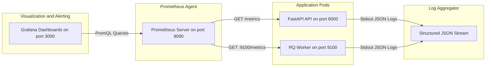

# 19. Observability & Telemetry Architecture

> **Status:** Codebase-grounded telemetry reference based on structlog, Prometheus metrics, and health probes.  
> **Source Verification:** [backend/app/core/logging.py](file:///c:/Users/nikhil/Desktop/projectss/github-repo-intelligence-platform/codesensei-github-repo-intelligence-platform/backend/app/core/logging.py), [backend/app/core/metrics.py](file:///c:/Users/nikhil/Desktop/projectss/github-repo-intelligence-platform/codesensei-github-repo-intelligence-platform/backend/app/core/metrics.py), [docker/docker-compose.observability.yml](file:///c:/Users/nikhil/Desktop/projectss/github-repo-intelligence-platform/codesensei-github-repo-intelligence-platform/docker/docker-compose.observability.yml).

---

## 1. Observability Architecture Overview



---

## 2. Structured Logging with `structlog`

CodeSensei configures structured logging via `structlog` in `backend/app/core/logging.py`:
- **Format:** Machine-readable JSON logs in production (`APP_ENV=production`); colored human-readable console output in development (`APP_ENV=development`).
- **Context Binding:** Every request is tagged with an immutable contextual dictionary:
  - `request_id`: UUID generated by `RequestContextMiddleware` or extracted from incoming `X-Request-ID` header.
  - `method`, `path`, `client_ip`: HTTP request metadata.
  - `user_id`: Authenticated caller UUID bound dynamically when session token is verified.
- **Example Production Log Entry:**
  ```json
  {
    "event": "analysis_job_enqueued",
    "timestamp": "2026-08-27T13:45:12.345Z",
    "level": "info",
    "logger": "backend.app.workers.job_dispatcher",
    "request_id": "9b1deb4d-3b7d-4bad-9bdd-2b0d7b3dcb6d",
    "user_id": "c4a7d3f2-1b8e-4a90-9f12-3456789abcde",
    "repository_id": "11111111-2222-3333-4444-555555555555",
    "job_id": "aaaa1111-bb22-cc33-dd44-ee55ff667788",
    "rq_job_id": "8877ff55-ee44-dd33-cc22-bb11aaaa0000"
  }
  ```

---

## 3. Prometheus Metrics Catalog

Prometheus metrics are collected via the official `prometheus_client` and exposed on `/metrics`:

| Metric Name | Type | Labels | Purpose / SLO Monitored |
| :--- | :--- | :--- | :--- |
| `http_requests_total` | Counter | `method`, `path`, `status` | Total HTTP requests handled; calculates error rate (5xx ratio). |
| `http_request_duration_seconds`| Histogram | `method`, `path` | Request latency distribution; tracks p95 and p99 API latencies. |
| `analysis_jobs_enqueued_total` | Counter | *None* | Throughput counter of repository analyses submitted. |
| `analysis_jobs_completed_total`| Counter | `status` (`succeeded`, `failed`)| Background worker completion outcomes. |
| `ai_chat_requests_total` | Counter | `provider`, `status` | AI chat usage and provider error ratios (e.g. Groq 429 rate limits). |
| `app_build_info` | Gauge | `version`, `commit_hash` | Fixed gauge (value=1) exposing current Git commit and deployment version. |

---

## 4. Health Probes & Dependency Checks

The API exposes two discrete health check endpoints following standard cloud-native liveness/readiness semantics:

### 4.1 Liveness Probe (`GET /healthz`)
- **Purpose:** Answers: *"Is the Uvicorn/FastAPI process running and able to handle HTTP requests?"*
- **Check:** Lightweight in-memory return of static status. Zero external I/O.
- **Response:** `200 OK` — `{"status": "ok", "version": "0.1.0"}`
- **K8s / Docker Action on Failure:** Restarts container.

### 4.2 Deep Readiness Probe (`GET /readyz`)
- **Purpose:** Answers: *"Are backing dependencies healthy enough to accept write and read traffic?"*
- **Checks Executed Concurrently:**
  1. **PostgreSQL Check:** Executes `SELECT 1` via `AsyncSession` with a 2-second timeout.
  2. **Redis Check:** Executes `client.ping()` with a 2-second timeout.
- **Response:**
  - Healthy: `200 OK` — `{"status": "ok", "version": "0.1.0", "checks": {"postgres": "ok", "redis": "ok"}}`
  - Degraded: `200 OK` — `{"status": "degraded", "checks": {"postgres": "error: Connection refused", "redis": "ok"}}`
- **K8s / Ingress Action on Failure:** Temporarily removes the pod from load balancer routing until readiness recovers.

---

## 5. Grafana Dashboard & Telemetry Stack

Defined in [docker/docker-compose.observability.yml](file:///c:/Users/nikhil/Desktop/projectss/github-repo-intelligence-platform/codesensei-github-repo-intelligence-platform/docker/docker-compose.observability.yml):
- **Prometheus Service:** Runs `prom/prometheus:v2.54.0` listening on `:9090`. Configured via `infrastructure/prometheus/prometheus.yml` to scrape the API (`backend:8000/metrics`) and Worker (`worker:9100/metrics`) every 15 seconds.
- **Grafana Service:** Runs `grafana/grafana:11.2.0` listening on `:3000`. Auto-provisions Prometheus as default data source and includes dashboards for:
  - API Request Rate & 5xx Error Rate.
  - P50, P95, and P99 API Latencies.
  - Active Queue Depth & Worker Processing Duration.
  - AI Assistant Token Generation Speeds & Error Spikes.
