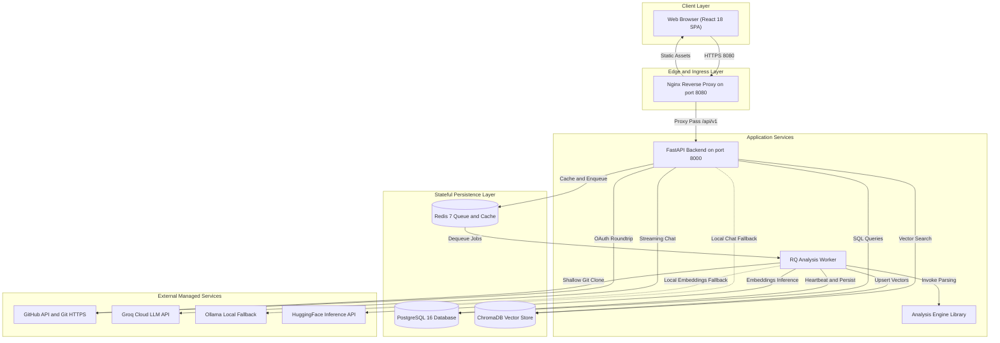
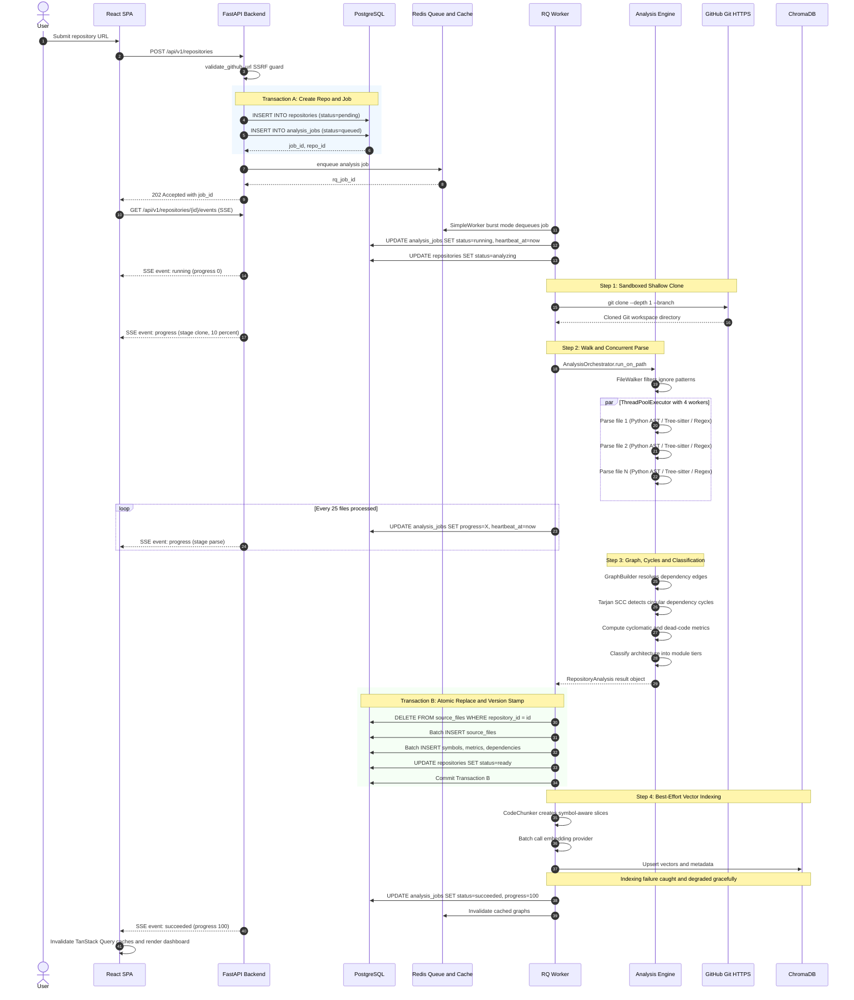
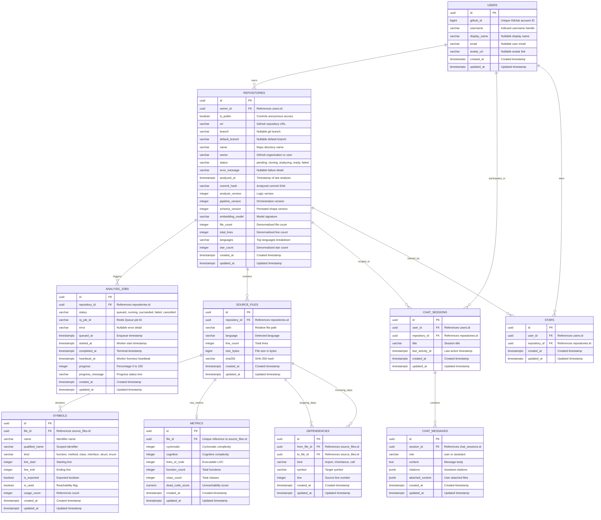
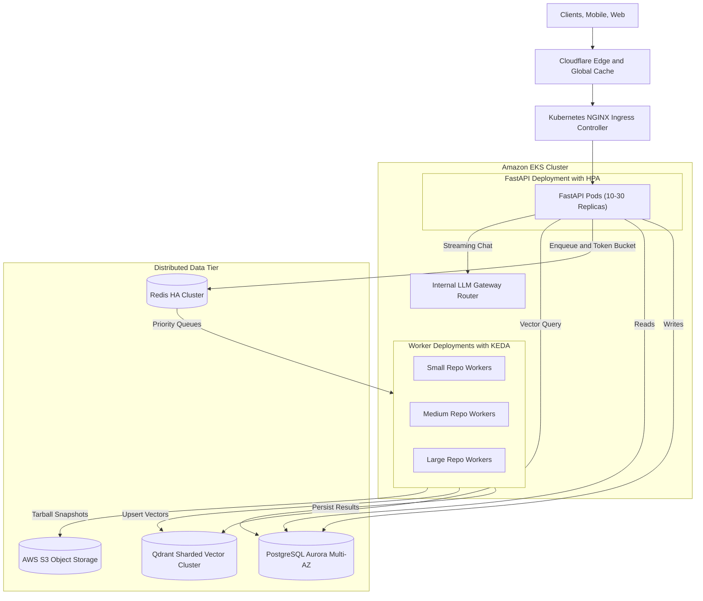

# PROJECT_SOURCE_OF_TRUTH.md: CodeSensei Platform

> **Authoritative Technical Reference & Architecture Ground Truth**  
> **Document Purpose:** Single source of truth for the codebase as of August 2026. Designed for deep engineering audits, senior/staff technical interview preparation, and extraction of resume-grade technical accomplishments.  
> **Ground Truth Rule:** Every entity, route, algorithm, failure mode, and architectural trade-off documented here is directly derived from active repository code. Hypothetical extensions and scaling roadmaps are strictly isolated and labeled `[PROPOSED / SCALING OPTION]`.

---

# Table of Contents
1. [Project Overview](#1-project-overview)
2. [Current Feature Inventory](#2-current-feature-inventory)
3. [System Architecture & Current-State Topology](#3-system-architecture--current-state-topology)
4. [End-to-End User Flows & Sequence Traces](#4-end-to-end-user-flows--sequence-traces)
5. [Core Execution & Asynchronous Processing Engine](#5-core-execution--asynchronous-processing-engine)
6. [Data Model & Relational Database Schema](#6-data-model--relational-database-schema)
7. [Comprehensive API Reference](#7-comprehensive-api-reference)
8. [Authentication, Authorization & Session Management](#8-authentication-authorization--session-management)
9. [Application Security & Hardening Realities](#9-application-security--hardening-realities)
10. [Error Handling, Failure Scenarios & Reliability](#10-error-handling-failure-scenarios--reliability)
11. [Frontend Architecture & State Topology](#11-frontend-architecture--state-topology)
12. [Backend Architecture & Service Boundaries](#12-backend-architecture--service-boundaries)
13. [Technology Stack & Architectural Alternatives](#13-technology-stack--architectural-alternatives)
14. [Engineering Decisions & Trade-Off Matrix](#14-engineering-decisions--trade-off-matrix)
15. [Scaling the System (Stages 1 through 3)](#15-scaling-the-system-stages-1-through-3)
16. [Bottlenecks & Critical Breaking Points](#16-bottlenecks--critical-breaking-points)
17. [Comprehensive Edge-Case Inventory](#17-comprehensive-edge-case-inventory)
18. [Testing Architecture & Verification Reality](#18-testing-architecture--verification-reality)
19. [Observability, Telemetry & Operations](#19-observability-telemetry--operations)
20. [Deployment & Infrastructure Topology](#20-deployment--infrastructure-topology)
21. [Verified Current Technical Limitations](#21-verified-current-technical-limitations)
22. [Future Architecture & Roadmap Proposals](#22-future-architecture--roadmap-proposals)
23. [Senior / Staff Interview Technical Discussion Map](#23-senior--staff-interview-technical-discussion-map)
24. [Resume-Ready Technical Building Blocks](#24-resume-ready-technical-building-blocks)
25. [Source-of-Truth Governance Rules](#25-source-of-truth-governance-rules)

---

# 1. Project Overview

### 1.1 What the Project Does
CodeSensei is a distributed GitHub repository intelligence and exploration platform. Given any publicly accessible Git repository URL, CodeSensei performs automated shallow cloning, multi-language static code analysis (parsing abstract syntax trees and grammar definitions), constructs an interactive directed dependency graph, identifies circular architectural dependencies, calculates modular complexity and blast-radius metrics, and indexes the code for an interactive retrieval-augmented generation (RAG) conversational AI assistant that provides verifiable file-path and line-number citations.

### 1.2 The Problem It Solves
Software engineers spend up to 70% of onboarding or architectural auditing time reading unfamiliar source code. Traditional tools provide fragmented views:
- **IDEs & GitHub:** Display flat file trees and linear text files without global architectural context.
- **Linters:** Produce thousands of localized static warnings without revealing module coupling, structural layers, or circular import chains.
- **General-Purpose LLMs:** Hallucinate non-existent function names, obsolete package APIs, or file paths because they lack grounded, up-to-date repository context.

CodeSensei combines deterministic compiler graph analysis with retrieval-augmented conversational AI, allowing developers to explore architecture visually and verify AI answers against exact source code lines.

### 1.3 Intended Audience
- **Software Engineers & Technical Leads:** Conducting architectural audits, refactoring planning, and onboarding onto legacy codebases.
- **Open-Source Contributors:** Seeking a rapid understanding of project structure, high-complexity hotspots, and module dependency chains before submitting pull requests.

### 1.4 Core Capabilities
1. **Sandboxed Repository Ingestion:** Shallow clones Git repositories with automated branch detection, size caps (100MB), and timeouts (120s).
2. **Multi-Tier Static Parsing:** Analyzes Python, TypeScript, JavaScript, Go, Rust, Java, C++, C, and Ruby using native Python AST, Tree-sitter, and Regex fallbacks.
3. **Graph Theory Dependency Modeling:** Resolves file-level import relationships into a directed graph, executing Tarjan's Strongly Connected Components (SCC) algorithm in $O(V+E)$ time to detect circular dependency cycles.
4. **Impact Analysis (Blast Radius):** Traverses reverse-dependency graphs using Breadth-First Search (BFS) with exponential decay distance weighting ($\exp(-0.5 \cdot (d-1))$) to predict which upstream files break when a target file is modified.
5. **Architectural Layer Classification:** Groups files into topological tiers (Core/Data/Business/Presentation) and generates interactive Mermaid sequence diagrams.
6. **Complexity & Dead Code Heuristics:** Computes McCabe Cyclomatic Complexity, cognitive nesting penalties, and unreferenced internal symbol confidence scores.
7. **Streaming Context-Grounded AI Assistant:** Embeds symbol-aware code chunks into a vector database (ChromaDB) and streams low-temperature conversational responses over Server-Sent Events (SSE) from Groq Cloud (Llama-3.3-70B) or local Ollama.

### 1.5 Main Use-Case Flow
```
User Submits GitHub URL ──► Async Enqueue (HTTP 202) ──► Background Worker Clones & Parses
                                                                    │
User Explores Visual Graph, Cycles & Chat ◄── SSE Streams Succeeded ◄┘
```

### 1.6 Key Design Characteristics
- **Strict Decoupling:** Static analysis is CPU- and disk-intensive; the API accepts jobs in milliseconds and delegates work to background workers via Redis Queue (RQ).
- **Zero-Cost Free-Tier Engineering:** Runs entirely on free-tier serverless services (Neon PostgreSQL, Upstash Redis, Groq Cloud, HuggingFace Inference API) with zero persistent compute charges.
- **Self-Healing Recovery:** Background reaper loops automatically detect and unwedge crashed worker jobs.
- **Dual-Transaction Streaming:** Disconnects database connections during long LLM streams to prevent connection pool exhaustion.

---

# 2. Current Feature Inventory

### 2.1 Repository Ingestion & Shallow Cloning
- **What It Does:** Accepts a GitHub repository URL, validates it against SSRF attacks, creates database tracking records, and queues background cloning.
- **How It Works:** `GitCloner` executes `git clone --depth 1 --single-branch` using `GitPython` in a temporary workspace (`/var/lib/codesensei/workspaces/<slug>`).
- **Frontend Components:** `RepoSubmissionModal.tsx`, `DashboardHeader.tsx`.
- **Backend Modules:** `backend/app/api/v1/endpoints/repositories.py`, `backend/app/services/repository_service.py`, `analysis-engine/engine/cloner/git_cloner.py`.
- **APIs Involved:** `POST /api/v1/repositories`, `GET /api/v1/repositories/{id}/events`.
- **Database Entities:** `Repository`, `AnalysisJob`.
- **External Services:** GitHub HTTPS Git server.
- **Edge Cases:** Repository >100MB triggers `RepoTooLargeError`; slow networks trigger 120s `TimeoutExpired`; private repos fail with `GIT_TERMINAL_PROMPT=0`.
- **Current Limitations:** Public repositories only. Private repositories requiring user GitHub OAuth tokens are not implemented.

### 2.2 Multi-Language Static Code Analysis
- **What It Does:** Discovers source code files, filters build artifacts (`node_modules`, `.git`), and extracts symbols, imports, lines of code, and branching metrics.
- **How It Works:** `FileWalker` discovers files. `AnalysisOrchestrator` runs a `ThreadPoolExecutor` (4 workers) dispatching files to `ParserRegistry`. Python files use native `ast`; non-Python files use Tree-sitter for LOC/branches and `RegexParser` for symbols.
- **Frontend Components:** `MetricsCard.tsx`, `LanguageBreakdownBar.tsx`.
- **Backend Modules:** `analysis-engine/engine/orchestrator.py`, `analysis-engine/engine/parsers/*`.
- **Database Entities:** `SourceFile`, `Symbol`, `Metrics`.
- **Edge Cases:** Malformed binary files fall back from UTF-8 to `chardet` Latin-1; unparseable syntax falls back to regex.
- **Current Limitations:** Tree-sitter extracts LOC and cyclomatic branching, but relies on regex for non-Python symbol declarations. Cross-file type resolution (LSP) is not supported.

### 2.3 Interactive Dependency Graph & Circular Cycle Detection
- **What It Does:** Renders an interactive force-directed graph of file import dependencies, highlights circular dependency cycles, and filters by directory or language.
- **How It Works:** `GraphBuilder` maps import statements to file paths. `CycleDetector` executes Tarjan's Strongly Connected Components (SCC) algorithm in $O(V+E)$ time. Frontend renders via Cytoscape.js canvas with `cose` layout.
- **Frontend Components:** `DependencyGraph.tsx`, `GraphControls.tsx`, `CycleAlertBanner.tsx`.
- **Backend Modules:** `analysis-engine/engine/graph/builder.py`, `analysis-engine/engine/graph/cycles.py`, `backend/app/services/dependency_service.py`.
- **APIs Involved:** `GET /api/v1/repositories/{id}/dependencies`.
- **Database Entities:** `Dependency`, `SourceFile`.
- **Caching:** Full graph cached in Redis (`repo:<id>:graph`, TTL 3600s).
- **Current Limitations:** Edges represent file-level imports, not function-level call graphs.

### 2.4 Impact Analysis (Refactoring Blast Radius)
- **What It Does:** Calculates which files would be affected if a selected file is modified.
- **How It Works:** `ImpactAnalyzer` traverses incoming dependency edges via BFS, calculating blast radius scores with exponential distance decay:
  $$\text{Score}(u) = \sum_{v \in \text{Upstream}(u)} \exp(-0.5 \cdot (\text{dist}(u, v) - 1))$$
- **Frontend Components:** `ImpactAnalysisPanel.tsx`, `FileImpactModal.tsx`.
- **Backend Modules:** `analysis-engine/engine/graph/impact.py`, `backend/app/services/dependency_service.py`.
- **APIs Involved:** `POST /api/v1/repositories/{id}/impact`.
- **Current Limitations:** Does not perform semantic diffing; assumes any modification to a file impacts all upstream dependents equally.

### 2.5 Complexity & Dead Code Analysis
- **What It Does:** Identifies codebase hotspots: high cyclomatic/cognitive complexity files and potential unreferenced dead code.
- **How It Works:** Measures decision branching (`if`, `while`, `for`, `case`). Evaluates dead code by comparing internal symbol usage counters against unexported symbols (confidence 0.95 vs. 0.60 for unused exports).
- **Frontend Components:** `ComplexityTable.tsx`, `DeadCodePanel.tsx`.
- **Backend Modules:** `analysis-engine/engine/metrics/complexity.py`, `analysis-engine/engine/metrics/dead_code.py`.
- **APIs Involved:** `GET /api/v1/repositories/{id}/metrics/summary`, `GET /api/v1/repositories/{id}/metrics/dead-code`.
- **Database Entities:** `Metrics`, `Symbol`.

### 2.6 Retrieval-Augmented Conversational AI Assistant
- **What It Does:** Answers architectural and implementation questions about the codebase with verifiable file-path and line-number citations.
- **How It Works:** Code chunks sliced along AST symbol boundaries are vectorized in ChromaDB. When asked a question, Chroma retrieves top-k chunks, which are assembled into a prompt and streamed over SSE from Groq (Llama-3.3-70B) or Ollama.
- **Frontend Components:** `ChatPanel.tsx`, `MessageBubble.tsx`, `CitationChip.tsx`, `ContextTagBar.tsx`.
- **Backend Modules:** `backend/app/services/ai_service.py`, `backend/app/services/chat_session_service.py`, `analysis-engine/engine/ai/*`.
- **APIs Involved:** `POST /api/v1/chat-sessions/{id}/chat`, `GET /api/v1/chat-sessions`.
- **Database Entities:** `ChatSession`, `ChatMessage`.
- **External Services:** Groq Cloud API, HuggingFace Inference API, Ollama (optional local).
- **Current Limitations:** Ephemeral ChromaDB storage in free tier; rate limits on Groq free tier (30 requests/min).

### 2.7 Discover Hub & Social Starring
- **What It Does:** Community showcase of analyzed public repositories with language filtering and starring.
- **How It Works:** Queries public repositories sorted by `star_count DESC`. Idempotent starring updates `stars` join table and bumps denormalized counter.
- **Frontend Components:** `DiscoverPage.tsx`, `RepoCard.tsx`, `StarButton.tsx`.
- **APIs Involved:** `GET /api/v1/discover/repositories`, `PUT /api/v1/repositories/{id}/star`, `DELETE /api/v1/repositories/{id}/star`.
- **Database Entities:** `Repository`, `Star`, `User`.

---

# 3. System Architecture & Current-State Topology

### 3.1 Component Decomposition
1. **Frontend Client (React 18 SPA):** Vite-bundled SPA served by Nginx 1.27-alpine on port `:8080`. Manages UI state via Zustand and TanStack Query, rendering force-directed graphs via Cytoscape.js HTML5 canvas.
2. **Backend API Gateway (FastAPI 0.115):** Uvicorn-hosted async application on port `:8000`. Handles authentication, REST contracts, SSE event streaming, database transactions via SQLAlchemy 2.0 Async (`asyncpg`), and runs the background `AnalysisReaper` loop.
3. **Background Worker (Python RQ 2.0):** Standalone container running `SimpleWorker` in burst mode. Connects to Redis Queue, invokes the analysis engine, performs batch SQL persistence, and upserts vectors.
4. **Analysis Engine:** Pure, stateless Python library imported exclusively by the worker. Manages Git cloning, AST parsing, graph algorithms, and RAG chunking.
5. **Relational Database (PostgreSQL 16):** Hosted on Neon Serverless (production) or local container. System of record for 10 relational entities, enforcing partial unique constraints and cascading deletes.
6. **In-Memory Broker & Cache (Redis 7):** Hosted on Upstash (production) or local container. Serves as RQ job queue and API response cache.
7. **Vector Database (ChromaDB 0.5.5):** Standalone HTTP service storing code chunk embeddings partitioned by collection (`repo_<repository_id>`).

### 3.2 Current System Architecture Diagram



---

# 4. End-to-End User Flows & Sequence Traces

### 4.1 GitHub OAuth Authentication Flow
1. User clicks "Sign in with GitHub" on `/login`.
2. Frontend redirects browser to `GET /api/v1/auth/github`.
3. Backend generates a cryptographically random `state` token, signs it, sets an `httpOnly` cookie (`codesensei_oauth_state`, 600s TTL), and redirects to `https://github.com/login/oauth/authorize`.
4. User authorizes CodeSensei on GitHub; GitHub redirects back to `GET /api/v1/auth/github/callback?code=...&state=...`.
5. Backend verifies returned `state` against cookie. If valid, exchanges authorization `code` for GitHub access token via HTTPS POST.
6. Backend fetches user profile (`GET https://api.github.com/user`), upserts row in `users` table, and mints an HS256 JWT session token.
7. Backend sets JWT in an `httpOnly`, `SameSite=Lax`, `secure` cookie (`codesensei_session`, 7-day TTL) and redirects browser to `/dashboard`.

### 4.2 Repository Submission & Analysis Flow (Sequence Trace)



### 4.3 Streaming AI Chat Flow (Dual-Transaction Pattern)
1. User types question on `/repos/:id/chat` (optionally tagging file chips).
2. Frontend issues `POST /api/v1/chat-sessions/{id}/chat`.
3. **Transaction 1 (5ms):** API validates session ownership, verifies rate limits, reads last 20 messages, inserts `ChatMessage(role='user')`, updates `last_activity_at`, commits, and **closes the database connection**.
4. **Retrieval:** API queries ChromaDB collection `repo_<id>` for top-$k$ ($k=8$) cosine-similar code chunks, plus exact file fetches for any tagged chips.
5. **Streaming:** API formats system prompt with fenced code chunks, calls Groq API with `stream=True`, and yields SSE tokens (`event: token`) to the browser.
6. **Transaction 2 (5ms):** Upon stream completion, API opens a second short database transaction, inserts `ChatMessage(role='assistant', citations=...)`, commits, and closes connection.

---

# 5. Core Execution & Asynchronous Processing Engine

### 5.1 Pipeline Stage Breakdown
1. **SSRF Pre-Validation:** `validate_github_url` ensures HTTPS scheme, `github.com` domain, port 443/none, and alphanumeric owner/repo regex before worker sees the job.
2. **Sandboxed Cloning:** `GitCloner` clones shallow `depth=1` to disk. Blocks command injection by passing arguments as strict arrays to Git executable; sets `GIT_TERMINAL_PROMPT=0` to fail instantly on private repos.
3. **Ignore-Aware File Discovery:** Traverses directory tree skipping `.git`, `node_modules`, `vendor`, `__pycache__`, binaries, and custom patterns from `.gitignore`.
4. **Concurrent Multi-Tier Parsing:** Spawns 4 worker threads. Python files parse into native Python `ast.AST`. Non-Python files invoke Tree-sitter for LOC and cyclomatic branching decisions, delegating symbol declarations to `RegexParser`.
5. **Graph Resolution & Cycle Detection:** Resolves relative imports into fully qualified repository paths. Builds directed adjacency list; executes Tarjan's SCC to detect strongly connected components with length >1.
6. **Blast-Radius Computation:** Reverse-dependency BFS weighted by distance decay.
7. **Atomic PostgreSQL Ingestion:** Wraps persistence in an explicit transaction scope. Hard-deletes previous `source_files` (cascading cleanly) and executes bulk inserts via SQLAlchemy Core `insert()`.
8. **Symbol-Aware RAG Chunking:** Slices code files along class/function boundaries (target 60 lines, max 200 lines, 6 lines overlap). Generates 384-dimensional embeddings via HuggingFace or Ollama. Upserts vectors to ChromaDB collection `repo_<repository_id>`.

### 5.2 Failure & Self-Healing Architecture
- **Worker Heartbeat Tracking:** Background worker writes `heartbeat_at = now()` to `analysis_jobs` at every stage transition and throttled every 25 files processed.
- **Analysis Reaper:** FastAPI application runs an asynchronous lifespan background loop (`AnalysisReaper`) every 30 seconds. Queries for jobs with `status IN ('queued', 'running')` and `heartbeat_at < now() - INTERVAL '300 seconds'`. Marks expired jobs `failed`, sets parent repository to `failed`, clearing the partial unique index and enabling immediate user retry.
- **Graceful Vector Degradation:** If ChromaDB or HuggingFace fails during indexing, worker catches `IndexingDegraded`, logs a warning, sets `indexed_chunks=0`, and still completes analysis as `READY`. Code navigation and graphs remain fully functional.

---

# 6. Data Model & Relational Database Schema

### 6.1 Database Entity-Relationship Diagram (ERD)



### 6.2 Key Relational Constraints & Invariants
1. **Mutual Exclusion on Active Jobs:** Alembic migration `0006_active_job_unique.py` enforces:
   ```sql
   CREATE UNIQUE INDEX uq_active_job_per_repository ON analysis_jobs (repository_id) WHERE status IN ('queued', 'running');
   ```
   Guarantees zero duplicate active analysis jobs at the database engine level.
2. **Cascading Deletions:** Every child table references its parent with `ON DELETE CASCADE`. Deleting a repository atomically purges jobs, files, symbols, metrics, dependencies, stars, and chat sessions.
3. **Idempotent Starring:** `uq_stars_user_repository` enforces `(user_id, repository_id)` uniqueness.

---

# 7. Comprehensive API Reference

The backend exposes **27 distinct endpoints** mounted under prefix `/api/v1`:

| Method | Path | Auth | Purpose | Key Validation / Errors |
| :--- | :--- | :---: | :--- | :--- |
| `GET` | `/auth/github` | None | Initiates GitHub OAuth flow | Sets CSRF state cookie |
| `GET` | `/auth/github/callback` | None | Exchanges OAuth code for JWT | 400 if state mismatch / code invalid |
| `POST` | `/auth/logout` | Optional | Clears session cookie | Clears cookie with `max_age=0` |
| `GET` | `/auth/me` | User | Returns authenticated profile | 401 if unauthenticated |
| `POST` | `/auth/dev-login` | None | Instant local mock login | 403 if `APP_ENV=production` |
| `POST` | `/repositories` | User | Submits repo for analysis | 400 SSRF invalid URL; 409 already running |
| `GET` | `/repositories` | User | Paginated list of owned repos | Supports `page`, `page_size`, `status` |
| `GET` | `/repositories/{id}` | Optional | Detailed repository metadata | 404 if private & unowned (IDOR mask) |
| `DELETE` | `/repositories/{id}` | User | Deletes repository and data | 403 if not owner; cascades in DB + Chroma |
| `POST` | `/repositories/{id}/reanalyze`| User | Triggers fresh re-analysis | 409 if analysis already running |
| `GET` | `/repositories/{id}/jobs` | Optional | Lists analysis job history | 404 if unowned private repo |
| `GET` | `/repositories/{id}/events` | Optional | SSE stream of job progress | `text/event-stream`; auto-keepalive |
| `GET` | `/repositories/{id}/dependencies` | Optional | Returns graph nodes, edges, cycles| 404 if unowned; cached in Redis (1h) |
| `POST` | `/repositories/{id}/impact` | Optional | Calculates blast radius score | Validates `file_path` exists in repo |
| `GET` | `/repositories/{id}/metrics/summary` | Optional | LOC, cyclomatic, dead code counts| Cached in Redis (1h) |
| `GET` | `/repositories/{id}/metrics/dead-code` | Optional | Top dead-code candidate symbols | Filtered by confidence threshold |
| `GET` | `/repositories/{id}/architecture` | Optional | Mermaid diagram & module tiers | Generated from topological sort |
| `GET` | `/repositories/{id}/chat-sessions` | User | Lists user's chats for repo | Scoped strictly to authenticated user |
| `POST` | `/repositories/{id}/chat-sessions` | User | Creates new chat session | 404 if unowned private repo |
| `GET` | `/chat-sessions/{id}` | User | Retrieves chat session history | 404 if session belongs to another user |
| `DELETE`| `/chat-sessions/{id}` | User | Deletes chat session & messages | 404 if session belongs to another user |
| `POST` | `/chat-sessions/{id}/chat` | User | Sends question, streams tokens | SSE stream; Dual-Transaction pattern |
| `PUT` | `/repositories/{id}/star` | User | Stars repository idempotently | Increments denormalized counter |
| `DELETE`| `/repositories/{id}/star` | User | Unstars repository idempotently | Decrements denormalized counter |
| `GET` | `/discover/repositories` | None | Public directory of repositories | Supports `language`, `search`, pagination |
| `GET` | `/users/{username}` | None | Public user profile & repos | 404 if user does not exist |
| `GET` | `/healthz` & `/readyz` | None | Liveness & Readiness probes | Checks DB, Redis, ChromaDB connections |

---

# 8. Authentication, Authorization & Session Management

### 8.1 Authentication Architecture
- **Stateless Cookie JWT:** Mints HS256-signed JWTs containing `sub` (user UUID), `gh` (GitHub numeric ID), and `exp` (7-day timestamp).
- **Cookie Security Flags:** Stored exclusively in cookie named `codesensei_session` configured with `httponly=True`, `samesite="lax"`, `secure=(APP_ENV == "production")`, and `max_age=604800`.
- **Zero Local Password Storage:** The platform maintains zero user passwords; authentication is completely delegated to GitHub OAuth 2.0.

### 8.2 Authorization & IDOR Masking
- **Dependency Guard (`verify_repository_access`):** Applied on all repository endpoints.
  - If user is repository owner $\rightarrow$ Access Granted.
  - If repository has `is_public = True` $\rightarrow$ Read-Only Access Granted.
  - If repository has `is_public = False` and user is NOT owner (or anonymous) $\rightarrow$ Returns **`404 Not Found`** (never `403 Forbidden`).
  - **Security Invariant:** Returning 404 prevents malicious actors from enumerating private repository existence via IDOR attacks.

---

# 9. Application Security & Hardening Realities

| Defense Vector | Implementation Reality | Location in Code | Limitation |
| :--- | :--- | :--- | :--- |
| **SSRF** | `validate_github_url` enforces https, domain `github.com`, port 443/none, no credentials, regex `/<owner>/<repo>`. | [validators.py](file:///c:/Users/nikhil/Desktop/projectss/github-repo-intelligence-platform/codesensei-github-repo-intelligence-platform/backend/app/core/validators.py#L25) | Only validates hostname; does not inspect IP post-DNS. |
| **Path Traversal** | `safe_join` verifies target path resides within workspace root and rejects backslashes (`\`) unconditionally. | [path_utils.py](file:///c:/Users/nikhil/Desktop/projectss/github-repo-intelligence-platform/codesensei-github-repo-intelligence-platform/analysis-engine/engine/utils/path_utils.py#L12) | None; robust path sandboxing. |
| **Command Injection** | Branch names validated via regex; `GitPython` passes arguments as discrete arrays, bypassing shell invocation. | [validators.py](file:///c:/Users/nikhil/Desktop/projectss/github-repo-intelligence-platform/codesensei-github-repo-intelligence-platform/backend/app/core/validators.py#L48) | None; shell execution disabled. |
| **SQL Injection** | Exclusively uses SQLAlchemy 2.0 ORM with parameterized query compilation. | Across all services | Raw SQL execution is forbidden. |
| **XSS** | JWT session stored exclusively in `httpOnly` cookies; inaccessible to JavaScript `document.cookie`. | [auth.py](file:///c:/Users/nikhil/Desktop/projectss/github-repo-intelligence-platform/codesensei-github-repo-intelligence-platform/backend/app/api/v1/endpoints/auth.py#L65) | Requires strict Nginx CSP headers for full defense. |
| **OAuth CSRF** | Cryptographically random `state` cookie signed and verified upon callback (600s TTL). | [auth.py](file:///c:/Users/nikhil/Desktop/projectss/github-repo-intelligence-platform/codesensei-github-repo-intelligence-platform/backend/app/api/v1/endpoints/auth.py#L32) | None; standard state verification. |
| **Rate Limiting** | `RateLimitMiddleware` enforces in-memory sliding window (60 requests/minute per client IP). | [middleware.py](file:///c:/Users/nikhil/Desktop/projectss/github-repo-intelligence-platform/codesensei-github-repo-intelligence-platform/backend/app/core/middleware.py#L85) | In-memory only; limits reset on restart or pod scaling. |

---

# 10. Error Handling, Failure Scenarios & Reliability

### 10.1 Global Exception Envelope
All uncaught exceptions are intercepted by `GlobalExceptionHandlerMiddleware` in `backend/app/core/middleware.py`, returning standard JSON:
```json
{
  "error": {
    "code": "ANALYSIS_ALREADY_RUNNING",
    "message": "An analysis is already in progress for this repository.",
    "request_id": "req_01J6ABC123...",
    "details": {}
  }
}
```

### 10.2 Failure Scenarios & Self-Healing Matrix
- **Redis Queue Outage:** `JobDispatcher` catches `redis.exceptions.RedisError`, logs error, raises `QueueUnavailableError` $\rightarrow$ maps to **HTTP 503 Service Unavailable**. The database transaction creating the repository is rolled back.
- **Worker OOM-Kill / Mid-Flight Crash:** `AnalysisReaper` background loop detects missing heartbeat (>300s), marks job `failed`, marks repository `failed`, and releases the database partial unique index.
- **Client Disconnect During LLM Stream:** Handled via **Dual-Transaction Pattern**. User question was already committed in Tx 1. When the client disconnects, FastAPI terminates the generator; uncommitted assistant tokens are dropped without rolling back user history.
- **ChromaDB Outage:** Best-effort vector indexing swallows `IndexingDegraded`. Repository analysis still marks `READY`. Code graph and complexity tools remain 100% operational.

---

# 11. Frontend Architecture & State Topology

### 11.1 Client-Side Division of Concerns
- **Routing:** React Router v6 with declarative nested layouts (`AppLayout`, `RepoLayout`, `AuthLayout`).
- **Server Cache & Synchronization:** TanStack Query v5 handles data fetching, query deduplication, background re-fetching, and cache invalidation.
- **Cross-Surface Context Store (`nodeContextStore` via Zustand):**
  - Allows visual interactions (e.g. clicking "Ask AI about this file" inside Cytoscape.js or the Architecture Viewer) to attach file context chips.
  - Chat interface reads from `nodeContextStore` to populate tagged chips in the message input automatically.
- **Graph Visualization:** Cytoscape.js canvas rendering with force-directed physics computed in background Web Workers, preventing main UI thread layout freezes.

---

# 12. Backend Architecture & Service Boundaries

### 12.1 Layered Architecture Pattern
```
routers (HTTP / SSE / Validation)
  └── services (Business Logic / Orchestration / Transactions)
        └── models & persistence (SQLAlchemy ORM / Raw Core Inserts)
```
- **Stateless API:** Zero persistent in-memory session state; any API instance can service any request.
- **Asynchronous Lifespan Management:** Uses FastAPI `lifespan(app)` context manager to start and cleanly cancel background tasks (`AnalysisReaper`).
- **Hermetic Library Boundaries:** The `analysis-engine` package is completely decoupled from FastAPI and SQLAlchemy, making it independently testable and portable.

---

# 13. Technology Stack & Architectural Alternatives

| Technology | Where Used | Why It Fits This Project | Reasonable Alternative | Why Alternative Was Not Chosen |
| :--- | :--- | :--- | :--- | :--- |
| **FastAPI 0.115** | Backend API | Native async I/O fits SSE streaming & concurrent queries; Pydantic v2 validation. | Django / Flask | Django is heavyweight with sync ORM baggage; Flask lacks native async/OpenAPI. |
| **PostgreSQL 16** | System of Record | ACID transactions for bulk batch persistence; partial unique indexing for concurrency. | MongoDB | MongoDB lacks atomic partial unique constraints and relational cascading deletes. |
| **Redis Queue (RQ)**| Background Queue | Lightweight FIFO queue over Redis; `SimpleWorker(burst=True)` handles serverless timeouts. | Celery | Celery has high configuration overhead and hangs on serverless Redis idle disconnects. |
| **ChromaDB 0.5.5** | Vector DB | Standalone HTTP vector store with native collection-level isolation (`repo_<id>`). | Qdrant / Pinecone | Standalone Chroma runs with minimal memory footprint in free tier. |
| **React 18 + Vite 5**| Frontend SPA | Fast HMR; optimal for heavy client-side canvas rendering (Cytoscape.js). | Next.js (SSR) | SSR offers zero performance benefit for client-side force-directed canvas graphs. |
| **Cytoscape.js 3.30**| Graph Viewer | Canvas-based rendering maintains 60 FPS across 1,000+ nodes; built-in physics layouts. | D3.js / React Flow| React Flow DOM nodes cause layout thrashing on >500 nodes; D3 requires manual layout code. |
| **Groq Cloud API** | LLM Inference | Free tier Llama-3.3-70B running at ~300 tokens/second for instant SSE streaming. | OpenAI GPT-4o | OpenAI has per-token costs; Groq provides free high-speed open-weights inference. |

---

# 14. Engineering Decisions & Trade-Off Matrix

### 1. Concurrency Mutual Exclusion via PostgreSQL Partial Unique Index
- **Decision:** Use `CREATE UNIQUE INDEX ... WHERE status IN ('queued', 'running')` instead of distributed Redis locks (Redlock).
- **Benefits:** Zero external network hops; immune to clock drift or Redis master-replica failovers; ACID consistency.
- **Trade-off:** Confines mutual exclusion enforcement strictly to PostgreSQL.
- **When It Stops Working:** When submissions exceed 10,000 req/sec across sharded databases.

### 2. Dual-Transaction Pattern for AI Streaming
- **Decision:** Commit user turn in Tx 1, close DB connection during LLM stream, commit assistant turn in Tx 2.
- **Benefits:** Prevents database connection pool exhaustion under small connection pools (`pool_size=5`); preserves user question on client disconnect.
- **Trade-off:** Two transactions per chat turn instead of one.
- **When It Stops Working:** Remains valid at any scale.

### 3. Tree-sitter for Metrics + Regex for Declarations
- **Decision:** Use Tree-sitter for LOC and cyclomatic branching; delegate symbol declarations to Regex on non-Python code.
- **Benefits:** Keeps Docker container <250MB; parses 9 languages without downloading gigabytes of compiler toolchains.
- **Trade-off:** Regex cannot resolve complex macro expansions or destructured TypeScript imports.
- **When It Stops Working:** When users demand deep cross-file compiler type resolution.

---

# 15. Scaling the System (Stages 1 through 3)

### Stage 1: Current Architecture (Single Host / Free Tier POC)
- **Characteristics:** 1 FastAPI process, 1 RQ worker, Neon PostgreSQL (max 5 connections), Upstash Redis, ChromaDB on single host.
- **Throughput:** ~100 active users, ~500 repositories, 1–2 concurrent analysis jobs.

---

### Stage 2: Growing Usage (100K Users, 50K Repositories) `[PROPOSED / SCALING OPTION]`
- **Bottlenecks:** API CPU saturation, Redis connection limits, worker disk contention.
- **Architectural Evolutions:**
  1. **Stateless API Cluster:** 3–5 FastAPI replicas behind AWS Application Load Balancer.
  2. **Managed Redis Cluster:** Migrate to Amazon ElastiCache. Implement Redis-backed token-bucket rate limiting via Lua scripts.
  3. **Read Replicas & PgBouncer:** Route read queries (Discover hub, graph views) to PostgreSQL read replicas; pool connections via PgBouncer.
  4. **Tiered Priority Queues:** Partition queue into `queue:small`, `queue:medium`, and `queue:large` based on repo file size.

---

### Stage 3: Enterprise Scale (1M+ Users, 500K Repositories) `[PROPOSED / SCALING OPTION]`



---

# 16. Bottlenecks & Critical Breaking Points

1. **Worker Disk I/O & Clone Space:** Cloned repos written to local `/var/lib/codesensei/workspaces`. If 10 large repos clone concurrently, worker disk can fill up. *Mitigation:* Clean workspaces in `finally` block; mount high-IOPS NVMe scratch storage.
2. **Groq Cloud API Rate Limits:** Free tier capped at 30 requests/min and 14,400 req/day. *Mitigation:* Fail gracefully over SSE; implement automatic fallback to local Ollama.
3. **ChromaDB Memory Footprint:** Chroma loads vector collections into RAM. At >10,000 repos, memory exhausts. *Mitigation:* Migrate to distributed Qdrant with on-disk HNSW indexes.
4. **PostgreSQL Write Locks on Re-Analysis:** Cascading wipe-and-replace deletes 20,000+ rows, acquiring exclusive table locks. *Mitigation:* Replace hard deletes with soft deletes (`is_active=False`) and async background vacuuming.

---

# 17. Comprehensive Edge-Case Inventory

| Category | Specific Scenario | Status | Verified Codebase Handling |
| :--- | :--- | :---: | :--- |
| **Input** | Empty / invalid GitHub URL | **Handled** | `validate_github_url` regex rejects before database insert. |
| **Security**| SSRF (`http://169.254.169.254`) | **Handled** | Blocked: scheme must be https; host must be `github.com`. |
| **Security**| Path Traversal (`../../etc/passwd`)| **Handled** | `safe_join` verifies path resolves within workspace root. |
| **Security**| Branch Command Injection (`--upload-pack`)| **Handled** | `validate_branch_name` blocks leading dashes; args passed as list. |
| **Security**| IDOR Access to Private Repository | **Handled** | `verify_repository_access` raises HTTP 404 (never 403). |
| **Queue** | Duplicate Simultaneous Submission | **Handled** | `uq_active_job_per_repository` raises `IntegrityError` $\rightarrow$ 409. |
| **Queue** | Redis Outage During Submission | **Handled** | `JobDispatcher` catches error $\rightarrow$ 503; DB rolls back cleanly. |
| **Worker**| Worker OOM / Container Crash | **Handled** | `AnalysisReaper` loop fails jobs with heartbeat >300s. |
| **Worker**| Cloned Repo >100MB | **Handled** | `GitCloner` calculates disk usage, raises `RepoTooLargeError`. |
| **Parser**| Malformed Binary File | **Handled** | UTF-8 decode $\rightarrow$ `chardet` Latin-1 guess $\rightarrow$ skips binary. |
| **AI** | ChromaDB Outage During Indexing | **Handled** | Best-effort indexing swallows error; analysis marks `READY`. |
| **AI** | Client Disconnect Mid-Stream | **Handled** | Dual-Transaction pattern preserves user question in DB. |
| **RateLimit**| Single IP Flooding Endpoints | **Partially** | In-memory sliding window limits IP; resets on restart. |
| **Scale** | Head-of-line Blocking in Queue | **Not Handled**| Single FIFO queue; large repos block small microservices. |

---

# 18. Testing Architecture & Verification Reality

### 18.1 Test Suites in Repository
- **Unit Tests (`analysis-engine/tests/`, `backend/tests/unit/`):** Hermetic pytest suite testing Python AST, Tree-sitter LOC, Tarjan's SCC, dead code reachability, symbol-aware chunking, and SSRF validators with zero external network or database dependencies.
- **Integration Tests (`backend/tests/integration/`, `worker/tests/`):** Full FastAPI endpoint tests running with real PostgreSQL 16 and Redis service containers in CI. Runs real Alembic migrations against `codesensei_test`.
- **Contract Tests (`tests/contract/`):** Validates OpenAPI specification conformance against Pydantic schemas.
- **End-to-End Tests (`frontend/tests/e2e/`):** Playwright automated browser test (`repository-flow.spec.ts`) executing Login $\rightarrow$ Submit $\rightarrow$ SSE $\rightarrow$ Graph render.
- **Load Tests (`tests/load/locustfile.py`):** Locust scenario simulating user traffic distributions.

---

# 19. Observability, Telemetry & Operations

- **Structured Logging:** Uses `structlog` emitting JSON to `stdout`. Every HTTP request binds a unique `request_id` (`X-Request-ID` header) tracked across database queries and error logs.
- **Prometheus Metrics:**
  - API exposes `/metrics` collecting HTTP request counts, response latency histograms (`http_request_duration_seconds`), and active SSE streams.
  - Worker exposes standalone Prometheus HTTP server on port `:9100` (`worker_jobs_processed_total`, `analysis_duration_seconds`).
- **Health Probes:**
  - `GET /healthz`: Basic liveness ping.
  - `GET /readyz`: Deep readiness probe asserting active connectivity to PostgreSQL, Redis, and ChromaDB.

---

# 20. Deployment & Infrastructure Topology

- **Docker Compose Orchestration:** Configured via `docker-compose.yml` (development) and `docker-compose.prod.yml` (production).
- **Container Footprint:**
  - `frontend`: Built via Multi-Stage Node 20 build; served via `nginx:1.27-alpine` (128MB RAM).
  - `backend`: Python 3.12-slim running Uvicorn on `:8000`.
  - `worker`: Python 3.12-slim running RQ `SimpleWorker(burst=True)`.
  - `chroma`: Official `chromadb/chroma:0.5.5` image on `:8000`.
- **Managed Free-Tier Backends:**
  - Neon Serverless PostgreSQL (`postgresql+asyncpg://...`).
  - Upstash Redis (`rediss://...` with TLS).
  - Groq Cloud API (`https://api.groq.com/openai/v1`).

---

# 21. Verified Current Technical Limitations

1. **In-Memory Rate Limiter:** `RateLimitMiddleware` maintains an in-memory dictionary; does not share quotas across multiple API replicas.
2. **Regex Symbol Fallback:** Non-Python languages rely on regex for symbol declarations rather than full semantic AST compiler passes.
3. **Destructive Wipe-and-Replace:** Re-analyzing a repository deletes and recreates all rows rather than performing incremental Git diffs.
4. **Single FIFO Queue:** Head-of-line blocking allows large repositories to starve small repositories.
5. **No Private Repositories:** Clones public repositories via anonymous HTTPS only.

---

# 22. Future Architecture & Roadmap Proposals `[PROPOSED]`

1. **Incremental Git Webhook Diff Analysis:** Ingest GitHub push webhooks, compute `git diff`, re-parse only changed files, and patch dependency edges dynamically.
2. **Distributed Redis Token-Bucket Rate Limiter:** Replace in-memory dictionary with Redis Lua scripts (`ZREMRANGEBYSCORE`).
3. **Queue Tiering (`queue:small`, `queue:large`):** Eliminate head-of-line blocking by routing repos based on size.
4. **SCIP / LSIF Semantic Indexing:** Introduce dedicated compiler sidecars for cross-file type resolution.

---

# 23. Senior / Staff Interview Technical Discussion Map

- **"Why did you choose a relational database for code graph data?"**
  - *Answer:* Referential integrity via cascading deletes, ACID transactional safety during bulk replacement, and atomic partial unique constraints preventing race conditions.
- **"How do you prevent worker crashes from deadlocking the queue?"**
  - *Answer:* Active worker heartbeat writes (`heartbeat_at`) coupled with an asynchronous FastAPI `AnalysisReaper` loop failing wedged jobs older than 300s.
- **"Why use SSE instead of WebSockets?"**
  - *Answer:* Unidirectional server-to-client streaming, native HTTP/2 proxy support, and automatic browser reconnection without socket state overhead.
- **"Why the Dual-Transaction pattern in AI chat?"**
  - *Answer:* Commits user question in 5ms, drops database connection during 20s LLM stream to prevent pool starvation, commits assistant turn in second transaction.

---

# 24. Resume-Ready Technical Building Blocks

- **Database Concurrency Control:** *"Designed database-level mutual exclusion using a PostgreSQL partial unique index on active analysis jobs, eliminating duplicate execution race conditions across distributed API instances."*
- **Self-Healing Distributed Worker:** *"Architected a background worker heartbeat and asynchronous reaper loop that automatically detects crashed worker processes and recovers wedged jobs without manual intervention."*
- **High-Concurrency AI Streaming:** *"Implemented a dual-transaction lifecycle for streaming LLM responses over Server-Sent Events, isolating database connection pools and guaranteeing conversational message persistence during network drops."*
- **Graph Theory Algorithms:** *"Integrated Tarjan's Strongly Connected Components algorithm to detect circular module dependencies in $O(V+E)$ time, and built a BFS reverse-dependency blast-radius engine with exponential distance decay."*
- **Multi-Language AST Extraction:** *"Engineered a 3-tier parsing fallback system combining native Python AST, Tree-sitter for executable LOC and branching metrics, and Regex declarations across 9 programming languages."*

---

# 25. Source-of-Truth Governance Rules

1. **Codebase Over Documentation:** If code and documentation diverge, the running codebase is the sole source of truth.
2. **Strict Separation of Proposed vs. Implemented:** Architectural scaling designs must always carry the label `[PROPOSED / SCALING OPTION]`.
3. **Anti-Hallucination Resume Boundary:** Never claim distributed locks, Kubernetes auto-scaling, or private repo OAuth support as currently running in production.
